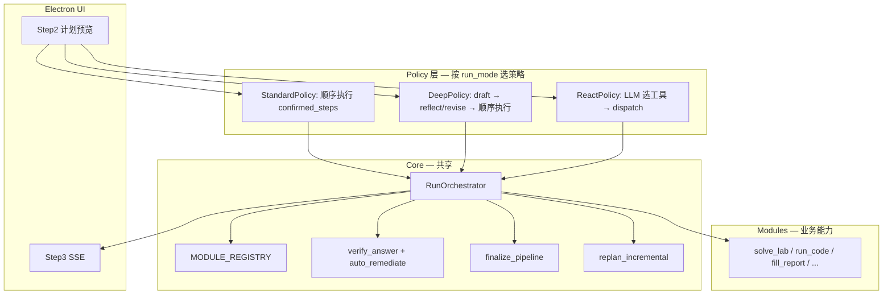

# Agent 架构加强计划（V3）

**版本**: 2026-06-05  
**状态**: 🚧 实施中（V3-1 ✅ · V3-2 ✅ · V3-3 ✅ · V3-4 ✅）  
**动机**: V1 Agent（standard / deep / react 三档）能力已齐，但三条执行路径各自维护循环、失败处理与收尾逻辑，维护成本高；verify / replan / skill 的反馈闭环未完全贯通。  
**关联**: [LAB_SOLVER_AGENT_PLAN.md](./LAB_SOLVER_AGENT_PLAN.md) · [AGENT_ERROR_HANDLING.md](./AGENT_ERROR_HANDLING.md) · [AI_INSIGHTS.md](./AI_INSIGHTS.md) · [V4_MULTI_PHASE_SOLVE.md](./V4_MULTI_PHASE_SOLVE.md) · [NEXT_VERSION_BACKLOG.md](./NEXT_VERSION_BACKLOG.md) §C2

> **V4 预告**：V3 解决编排重复与 ReAct 现代化；**代码成功率**将由 [V4_MULTI_PHASE_SOLVE.md](./V4_MULTI_PHASE_SOLVE.md) 通过分阶段 `solve_lab`（先代码试跑、再写报告）解决，届时 `deep_pipeline` 内重复的 preflight/fix 环将删除，`_regenerate_code` 并入 Phase 1。

---

## 1. 背景与目标

### 1.1 现状（As-Is）

V1 已落地：

| 能力 | 位置 | 状态 |
|------|------|------|
| 计划生成 | `agent/planner.py` | ✅ |
| 标准执行 | `agent/executor.py` → `execute_standard_run` → `RunOrchestrator` | ✅（V3-2） |
| 深度流水线 | `agent/deep_pipeline.py` | ✅（V3-2：tail 委托 `run_steps`） |
| ReAct 循环 | `agent/react_loop.py` + `react_tools.py` | ✅（V3-1：`llm_client.chat_messages` + `prompt_budget`） |
| 模块注册表 | `agent/registry.py` | ✅（V3-1：`MODULE_REGISTRY` 单源） |
| 收尾兜底 | `orchestrator.run_finalize`（`react_finalize.py` 薄封装） | ✅（V3-2） |
| 增量重规划 | `planner.replan_incremental` | ✅（规则为主，`max_replan_rounds=1`） |
| 规则校验 | `agent/quality.verify_answer` | ✅（run 结束 emit，**不自动修复**） |
| 技能注入 | `agent/skill_store.py` | ✅（3 内置技能，人工 promote） |
| 决策审计 | `agent/decision_log.py` | ✅ |

入口分发（三模式分叉）：

```992:1012:src/python/agent/executor.py
def start_run_async(..., run_mode: str = "standard"):
    if mode == "deep":
        execute_deep_run(...)
    elif mode == "react":
        run_react_loop(...)
    else:
        execute_standard_run(...)
```

### 1.2 核心问题

1. **编排重复**：`execute_standard_run`、`execute_deep_run`（tail）、`run_react_loop`（+ finalize）各自实现 progress / failure / verify / fallback。
2. ~~**注册表分散**~~（V3-1 已收敛）：`types` / `planner` / `react_tools` 仍导出同名符号，但定义来自 `agent/registry.py`。
3. **ReAct 与 Planner 弱绑定**：用户 Step2 勾选的步骤，ReAct 可能完全忽略；`react_finalize` 才部分对齐 plan。
4. **verify 闭环未贯通**：`verify_answer` 产出 `suggested_actions`，`executor_dirty.modules_to_rerun_from_verify` 已映射，但 run 结束仅 SSE 展示，无自动 remediate。
5. **ReAct 解析 fragile**：`THOUGHT/ACTION/PARAMS` 文本解析仍保留（V3-3 改 JSON）；读题硬截 `[:8000]` 已在 V3-1 改为 `fit_budget`。
6. **进化层未闭环**：`AI_INSIGHTS.md` → 人工 promote → `skill_store`；backlog C2 行为学习未做。

### 1.3 目标（To-Be）

| 目标 | 说明 |
|------|------|
| **G1 编排收敛** | 抽出 `RunOrchestrator`，三模式共享 module 执行 + verify + finalize |
| **G2 注册表单源** | `agent/registry.py` 驱动 Planner catalog、ReAct tools（✅ V3-1；Executor dispatch 待 V3-2） |
| **G3 质量闭环** | 可选 `auto_remediate`：verify → dirty → 局部重跑 → 再 verify（默认关） |
| **G4 ReAct 现代化** | 统一 `llm_client` + JSON/function calling；读题走 `prompt_budget`（✅ V3-1 读题+LLM；JSON/tools 待 V3-3） |
| **G5 计划对齐** | ReAct system prompt 注入 plan checklist；未完成项优先补跑 |
| **G6 行为 + 技能** | C2 轻量统计 + skill 候选队列（半自动 promote） |
| **G7 可观测** | 每次 run 结构化摘要 `{mode, llm_calls, replan_count, verify_pass, skills_fired[]}` |

**非目标（V3 不做）**：

- 不引入 Cursor SDK / 外部 Agent 框架
- 不改变用户自选 API Key、多厂商 Chat Completions 路线
- 不一次性大 bang refactor；按 Phase V3-1 → V3-4 渐进迁移，每步可回滚

---

## 2. 目标架构

### 2.1 分层图



### 2.2 原则

- **Policy 决定「下一步做什么」**；**Orchestrator 决定「怎么跑、怎么 emit、怎么记 decision_log」**。
- 所有 module 调用必须经过 `Orchestrator.run_module()`，禁止三路径各自直接调 `_MODULE_RUNNERS`（迁移期 executor 内联包装可保留）。
- ReAct 的 tool 名是 Registry 的 **alias**，不是第二套模块表。

---

## 3. RunOrchestrator 设计

### 3.1 职责边界

| 组件 | 职责 | 不负责 |
|------|------|--------|
| `RunOrchestrator` | 单步/多步 module 执行；progress SSE；`consecutive_failures`；触发 replan；verify；finalize；run 摘要 | LLM 选题（ReAct）、reflect prompt |
| `StandardPolicy` | 按 `confirmed_steps` 顺序 + skip unchecked + dirty 复用 | — |
| `DeepPolicy` | understand+plan 后 draft；reflect/revise 闸门；再委托 Orchestrator 跑 tail | — |
| `ReactPolicy` | 多轮 LLM → parse action → `orchestrator.run_module` | 填表/截图逻辑本身 |

### 3.2 接口草案

```python
# agent/orchestrator.py（新建）

class RunOrchestrator:
    def __init__(self, run_id: str, ctx: dict, *, emit: Callable, on_decision: Callable):
        ...

    def run_module(self, module: str, params: dict, *, step_meta: dict | None = None) -> ModuleResult:
        """统一入口：decision_log、module_results 写入、progress SSE、错误 meta。"""

    def run_steps(self, steps: list[PlanStep], *, stop_on_failure: bool = False) -> list[str]:
        """顺序执行；返回 completed_modules。内含 replan 触发。"""

    def should_reuse(self, module: str) -> bool:
        """委托 executor_dirty.should_rerun_module 取反。"""

    def maybe_replan(self, failed_module: str, error_summary: str, completed: list[str]) -> bool:
        """调用 replan_incremental；成功则 emit plan_updated，返回 True。"""

    def run_verify(self, *, auto_remediate: bool = False, max_rounds: int = 1) -> dict:
        """verify_answer → 可选 auto_remediate → 再 verify。"""

    def run_finalize(self, steps: list[PlanStep]) -> list[dict]:
        """原 react_finalize_pipeline 逻辑，三模式均可调用。"""

    def build_run_summary(self) -> dict:
        """{mode, llm_calls, replan_count, verify_pass, skills_fired, output_path}"""
```

### 3.3 与现有代码映射

| 现有 | V3 归宿 |
|------|---------|
| `execute_standard_run` while 循环 | `StandardPolicy.run` → `orchestrator.run_steps` |
| `deep_pipeline` tail while 循环 | `DeepPolicy.run_tail` → 同一 `run_steps` |
| `react_loop` tool dispatch | `ReactPolicy` → `orchestrator.run_module` |
| `react_finalize_pipeline` | `orchestrator.run_finalize` |
| standard/deep/react 末尾 verify | `orchestrator.run_verify` |

### 3.4 SSE / decision_log

Orchestrator **独占**以下事件的 emit 规则（避免双发）：

- `progress`（running / done / failed / skipped / reused）
- `plan_updated`
- `verification`
- `decision`（via `append_decision`）

ReAct 专有事件仍由 `ReactPolicy` emit：`react_thinking`、`react_cycle`。

---

## 4. MODULE_REGISTRY 单源注册

### 4.1 问题（V3-1 前）

原先三处列表易漂移；V3-1 后由 `registry.py` 统一定义，三处仅为薄封装：

```python
# types.py — wrapper
from agent.registry import known_module_ids
KNOWN_MODULE_IDS = known_module_ids()

# planner.py — wrapper
_THIN_PLANNER_MODULES = planner_module_catalog()

# react_tools.py — wrapper
REACT_TOOL_SCHEMAS = react_tool_schemas()
```

### 4.2 注册表结构（✅ 已落地）

```python
# agent/registry.py

@dataclass(frozen=True)
class ModuleSpec:
    id: str
    description: str
    planner_visible: bool      # Planner / understand_plan catalog
    react_alias: str | None    # ReAct ACTION 名，None = 不可被 ReAct 直接调用
    react_description: str | None
    react_params: tuple[str, ...]
    runner: str                # registry 内 lazy import 键，或 "executor:_run_solve_lab"

MODULE_REGISTRY: dict[str, ModuleSpec] = {...}
```

**导出函数**：

- `planner_module_catalog()` → `_THIN_PLANNER_MODULES` 替代
- `known_module_ids()` → `KNOWN_MODULE_IDS` 替代
- `react_tool_schemas()` → `REACT_TOOL_SCHEMAS` 替代
- `get_runner(module_id)` → 返回 callable

### 4.3 迁移策略

1. ~~Phase V3-1~~ ✅：已新建 `registry.py`；`types` / `planner` / `react_tools` 改为 thin wrapper；`tests/test_registry.py` 覆盖导出一致性与 executor runner 注册。
2. Phase V3-2：新增模块只改 registry 一处；executor 经 `get_runner()` / Orchestrator 分发。
3. 长期：`_run_*` 迁入 `modules/<id>.py` 的 `run(ctx, params) -> ModuleResult`，registry 只存 import path。

---

## 5. Verify 自动修复闭环

### 5.1 现状

`verify_answer` 返回：

```python
{
    "passed": bool,
    "checks": [...],
    "suggested_actions": ["revise_full", "fix_code", ...],  # 去重列表
}
```

`executor_dirty.modules_to_rerun_from_verify` 已映射 action → module id，但 **run 结束不消费**。

### 5.2 auto_remediate 设计

**触发条件**（全部满足才执行）：

- `ctx.get("auto_remediate") is True`（用户设置或 deep 模式默认，standard 默认 False）
- `verification.passed is False`
- `suggested_actions` 非空
- 未超过 `max_remediate_rounds`（默认 **1**）

**流程**：

```
verify_answer(ctx)
  → 若 passed: 结束
  → 读 suggested_actions
  → modules_to_rerun_from_verify(actions)
  → mark_dirty（对应 module / field）
  → orchestrator.run_steps(仅脏模块相关 step，或 synthetic single-step)
  → verify_answer(ctx)  # 第二轮
  → append_decision(agent=orchestrator, decision=auto_remediate, ...)
  → emit verification（含 remediated: true, rounds: 1）
```

**与 deep reflect 的关系**：

| 层 | 机制 | LLM |
|----|------|-----|
| reflect | 语义审稿（题意、结构） | 是 |
| verify | 规则校验（占位符、运行、约束） | 否 |
| auto_remediate | 按 verify 建议局部重跑 | 仅当 action 含 revise/fix |

二者正交：deep 可在 reflect 通过后仍 verify 失败 → auto_remediate 补一刀。

### 5.3 配置入口

| 入口 | 字段 | 默认 |
|------|------|------|
| `POST /api/agent/run` body | `auto_remediate?: boolean` | false |
| `run_mode=deep` | 可默认 true | 待 UI 确认 |
| 设置页 | 「校验未通过时自动修复一次（消耗 Token）」 | off |

---

## 6. ReAct 加强

### 6.1 统一 LLM 层（✅ V3-1）

已删除 `react_loop._react_chat` / `_react_chat_claude`，改用：

```python
from llm_client import chat_messages

chat_result = chat_messages(settings, history, phase="react")
```

`llm_client.chat_messages` 支持 OpenAI 兼容厂商与 Claude（system 合并入首条 user）。

### 6.2 读题预算（✅ V3-1）

ReAct 首条 user 已改用 `fit_budget`（`budget_tokens=2800`，`preserve_sections=["步骤","结果","要求"]`），与 `understand_plan` 对齐；不再使用 `report_text[:8000]`。

### 6.3 结构化输出（分两阶段）

**Phase V3-3a — JSON mode（优先）**

System prompt 要求仅输出 JSON：

```json
{
  "thought": "...",
  "action": "run_code",
  "params": {}
}
```

解析器：`parse_lab_json` 或 dedicated `parse_react_json`；保留旧 THOUGHT/ACTION 解析作 fallback 一个版本。

**Phase V3-3b — Function calling（可选）**

`REACT_TOOL_SCHEMAS` → OpenAI `tools` / Claude `tools` JSON schema；`action` 由 API 返回的 `tool_calls` 决定，去掉正则解析。

### 6.4 Plan checklist 对齐

ReAct system prompt 追加块（由 `ReactPolicy` 构建）：

```
【用户已确认的计划步骤】
- [ ] solve_lab (language=java)
- [x] run_code
- [ ] screenshot_ide
- [ ] fill_report

规则：填表前须完成 solve_lab；若 run_code 多次失败，优先 finalize_report 而非无限 fix_code。
```

每轮 tool 成功后更新 checklist 状态（确定性，非 LLM 自报）。

### 6.5 ReAct 失败 → replan（可选 V3-4）

当 `consecutive_failures >= MAX` 且非 solve 失败：

- 调用 `orchestrator.maybe_replan`（带 ReAct 上下文：`last_action`, `run_code_failures`）
- 若 replan 成功，注入 user message：「计划已调整，请按新步骤继续」
- 若 replan 跳过，保持现有 fallback_to_solve

---

## 7. 行为学习（C2）与技能 promote

### 7.1 C2 行为统计（零 LLM）

**采集事件**（本地 JSON，不上传）：

| 事件 | 来源 | 写入 |
|------|------|------|
| 用户取消勾选某 module | Step2 plan UI | `profile.behavior.module_cancel_count[id]++` |
| 用户 revise 标签 | Step3 feedback | `behavior.revise_tags[]` |
| replan 触发 | decision_log | `behavior.replan_reasons[]` |
| run 失败 module | progress SSE | `behavior.failure_modules[]` |

**Planner 消费**（弱提示，非硬规则）：

```python
if cancel_count.get("render_uml", 0) >= 3:
    step["default_checked"] = False
    step["reason"] += "（根据历史习惯默认不勾选 UML）"
```

**约束**（与主计划一致）：

- 样本 `< MIN_SAMPLES`（建议 3）不写入
- 不能单独新增报告无依据的步骤
- 设置页开关：`optimize_plan_from_usage`（默认 off）

**代码起点**：`agent/user_profile.py`（已有 deferred 注释）、`agent/plan_feedback.py`

### 7.2 Skill 候选队列

**触发**（`_save_agent_insights` 或 run 结束时）：

- 同一 `error_category`（来自 `run_code.classify_run_error`）≥ 2 次 / 7 天
- 同一 LLM `notes` 主题 hash ≥ 2 次
- 人工在 `AI_INSIGHTS.md` 标记 `<!-- skill-candidate -->`

**产出**：`data/skill_candidates.json`（或 `%APPDATA%/lab-solver/`）

```json
{
  "id": "java-no-python-v2",
  "source": "error_category:compile_error + notes_hash:abc",
  "occurrences": 3,
  "suggested_trigger": "language=java AND ...",
  "suggested_inject": "...",
  "status": "pending"
}
```

**Promote 路径**：开发者确认 → 写入 `skill_store._register(...)` → 更新 `AI_INSIGHTS.md` §技能路径。

---

## 8. 可观测性与测试

### 8.1 Run 摘要

run 结束 `done` 事件增加 `run_summary`：

```python
{
    "mode": "react",
    "llm_calls": 8,           # orchestrator 计数
    "replan_count": 0,
    "verify_pass": True,
    "auto_remediate_rounds": 0,
    "skills_fired": ["java-no-servlet"],
    "finalize_ran": True,
    "output_path": "..."
}
```

`history` 存精简版，供 UI 对比三模式性价比。

### 8.2 测试策略

| 类型 | 内容 | 文件示意 |
|------|------|----------|
| Registry 一致性 | registry keys == `_MODULE_RUNNERS` keys | `tests/test_registry.py` |
| Orchestrator 单元 | mock module runner；assert progress 顺序 | `tests/test_orchestrator.py` |
| Golden trace | 固定 mock LLM；三 mode 决策序列快照 | `tests/test_run_modes_golden.py` |
| auto_remediate | verify fail → dirty → rerun → pass | `tests/test_auto_remediate.py` |
| ReAct JSON parse | 新旧格式 fallback | `tests/test_react_parse.py` |

**不做**：CI 调真实 LLM（与 V1 金样本策略一致）。

---

## 9. 实施路线图

### 9.1 阶段总览

| 阶段 | 目标 | 风险 | 可回滚 | 状态 |
|------|------|------|--------|------|
| **V3-1** | Registry 单源 + ReAct 用 prompt_budget + llm_client | 低 | 是 | ✅ |
| **V3-2** | RunOrchestrator 抽出；standard/deep 迁入 | 中 | feature flag | ✅ |
| **V3-3** | verify auto_remediate + ReAct JSON + plan checklist | 中 | 设置默认 off | ✅ |
| **V3-4** | C2 行为统计 + skill 候选 + ReAct replan | 低 | 设置默认 off | ✅ |

### 9.2 V3-1 — Registry 与 ReAct 读题统一 ✅

| ID | 任务 | 产出 | 状态 |
|----|------|------|------|
| v3-1-registry | 新建 `agent/registry.py`；三处改为 import wrapper | `registry.py`, 改 `types/planner/react_tools` | ✅ |
| v3-1-registry-test | `test_registry.py` 键一致性 | 测试 | ✅ |
| v3-1-react-budget | ReAct 首条 user 改用 `fit_budget` | `react_loop.py` | ✅ |
| v3-1-react-llm | ReAct 改走 `llm_client` messages API | `llm_client.py`, `react_loop.py` | ✅ |

**验收**：`pytest` 全绿（含 `test_registry.py`、`test_react_loop.py`、`test_planner.py`）。

### 9.3 V3-2 — RunOrchestrator ✅

| ID | 任务 | 产出 | 状态 |
|----|------|------|------|
| v3-2-orchestrator | 新建 `agent/orchestrator.py` | 核心类 | ✅ |
| v3-2-standard | `execute_standard_run` 委托 orchestrator | `executor.py` 瘦身 | ✅ |
| v3-2-deep-tail | `deep_pipeline` tail 委托同一 `run_steps` | `deep_pipeline.py` | ✅ |
| v3-2-finalize | `react_finalize` 迁入 orchestrator | `react_finalize.py` 薄封装 | ✅ |
| v3-2-flag | `ctx.use_orchestrator` 或 `LAB_SOLVER_USE_ORCHESTRATOR` 开关 | 默认 true，legacy 回滚 | ✅ |
| v3-2-test | `tests/test_orchestrator.py` mock runner + progress 顺序 | 测试 | ✅ |

**验收**：`pytest` 全绿；`run_golden_regression.py` 通过；`test_orchestrator.py` 覆盖 progress 顺序与 deep tail 选项。

### 9.4 V3-3 — 质量闭环 + ReAct 结构化

| ID | 任务 | 产出 |
|----|------|------|
| v3-3-auto-remediate | `orchestrator.run_verify(auto_remediate=...)` | orchestrator + API | ✅ |
| v3-3-react-json | JSON 输出 + fallback 解析 | `react_loop.py`, `react_prompts.py` | ✅ |
| v3-3-plan-checklist | ReAct system 注入 plan checklist | `react_prompts.py` | ✅ |
| v3-3-ui | Step3 展示 auto_remediate 轮次；设置页开关 | `app.js` | ✅ |

**验收**：fixture 故意缺 summary → auto_remediate on → revise 后 verify pass；ReAct 空 action 率下降（人工抽测 10 题）。

### 9.5 V3-4 — 学习与进化

| ID | 任务 | 产出 |
|----|------|------|
| v3-4-behavior | `apply_plan_feedback_to_profile` 统计 | `user_profile.py`, `plan_feedback.py` | ✅ |
| v3-4-skill-candidates | run 结束写 skill_candidates | `skill_store.py` 或新模块 | ✅ |
| v3-4-react-replan | ReAct 失败触发 maybe_replan | `react_loop.py` | ✅ |
| v3-4-run-summary | done 事件带 run_summary | orchestrator | ✅ |

**验收**：mock 取消 UML 3 次 → 下次 plan UML 默认不勾选（开关 on）；skill 候选 JSON 生成。

---

## 10. API 变更摘要

| 变更 | 类型 | 说明 |
|------|------|------|
| `POST /api/agent/run` | 扩展 body | `auto_remediate?: boolean` |
| SSE `done` | 扩展 | `run_summary?: object` |
| SSE `verification` | 扩展 | `remediated?: boolean`, `remediate_rounds?: number` |
| `PUT /api/profile` | 扩展 | `optimize_plan_from_usage?: boolean` |
| 无 breaking | — | 新字段均可选，旧客户端忽略 |

---

## 11. 与现有文档关系

| 文档 | 关系 |
|------|------|
| `LAB_SOLVER_AGENT_PLAN.md` | V1 完整设计；**不修改**；V3 为其演进附录 |
| `AGENT_ERROR_HANDLING.md` | preflight/classify/fix 不变；Orchestrator 调用链不变 |
| `NEXT_VERSION_BACKLOG.md` §C2 | V3-4 落地 C2 |
| `AI_INSIGHTS.md` | V3-4 skill 候选与 promote 流程 |
| `IMPLEMENTATION_PHASES.md` | 新增 §五 Phase V3 跟踪（见该文档更新） |

---

## 12. 开放问题（实施前确认）

1. **deep 模式是否默认 `auto_remediate=true`？** 建议默认 true（已花 reflect Token），但需 UI 文案说明。
2. **ReAct function calling 是否 Phase 1 就做？** 建议 V3-3a 仅 JSON，3b 视厂商兼容性再加 tools API。
3. **`_run_*` 是否迁入 `modules/`？** V3-2 不强制；Registry lazy import 即可，模块物理迁移放 V3+。
4. **行为数据存储路径？** 建议与 `students.json` 同级用户数据目录，不入 git。

---

## 附录 A — 文件清单（实施后）

```
src/python/agent/
├── registry.py          # ✅ V3-1：MODULE_REGISTRY 单源
├── orchestrator.py      # ✅ V3-2：RunOrchestrator
├── policies/
│   ├── standard.py      # 新建：StandardPolicy
│   ├── deep.py          # 新建：DeepPolicy（或保留 deep_pipeline 薄封装）
│   └── react.py         # 新建：ReactPolicy（从 react_loop 抽）
├── executor.py          # 瘦身：start_run_async + _run_* 逐步迁出
├── react_loop.py        # 瘦身：或 deprecated → policies/react.py
└── ...                  # planner, quality, skill_store 等不变
```

---

## 附录 B — 评审检查清单

实施每个 V3 子阶段前，用 [PROMPT_CRITIQUE_CHECKLIST.md](./PROMPT_CRITIQUE_CHECKLIST.md) 过一遍；额外加：

- [x] 三 mode 是否共用 Orchestrator.run_module？（V3-2：standard/deep tail + finalize；ReAct 待 V3-3）
- [ ] 新 module 是否只注册 registry 一处？
- [ ] verify / replan / reflect 是否正交、不重复 LLM？
- [x] ReAct 读题是否与 Planner 同 budget？（V3-1：`fit_budget` 2800）
- [ ] 新能力是否有 mock 测试、无真实 LLM CI？

---

*文档版本：2026-06-05 · V3-4 已落地（C2 行为统计 + skill 候选 + run_summary SSE + ReAct replan）。*
