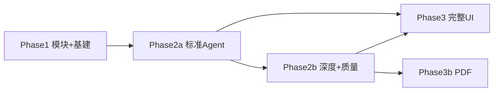

# Lab-Solver Agent — 分阶段实施拆分

**用途**：把 [LAB_SOLVER_AGENT_PLAN.md](./LAB_SOLVER_AGENT_PLAN.md) 拆成可单独交付的冲刺，避免一次实现全部 27 个 todo。  
**不修改** Cursor 源计划文件；实现时以本文档的「当前阶段」为准。

**推荐总顺序**：`Phase 1` → `Phase 2a` → `Phase 2b` → `Phase 3`（`3b` PDF 可与 3 并行）

---

## 一、阶段总览

| 阶段 | 目标（用户可感知） | 对应 plan todos | 是否改前端 |
|------|-------------------|-----------------|------------|
| **Phase 1** | 后端模块化；现版 `/api/solve` 行为不变；可打包 | 6 项 | 几乎不动 |
| **Phase 2a** | 标准模式：生成计划 → 确认 → 执行 + SSE；快速解题保留 | 10 项 | 最小 Agent UI |
| **Phase 2b** | 深度模式、校验/修订、模版/画像、多文档 | 12 项 | 部分增强 |
| **Phase 3** | 分节工作台、合规、引导、history | 3 项 | 主 UI |
| **Phase 3b** | PDF 读/导出说明 | 2 项（可拆） | Step1 文案 |

---

## Phase 1 — 后端模块化（UI 不动）

**交付标准**：Electron 仍用现有 `solveAll()` → `/api/solve`；`server.py` 变薄；`build-installer` 通过。

### 1.1 子冲刺 A：骨架 + LLM 层（先做）

| 顺序 | todo id | 内容 | 产出文件（示意） |
|------|---------|------|------------------|
| 1 | `phase1-modules` | 建 `src/python/modules/`、`llm_client.py`；从 `server.py` 抽 parse / run / screenshot / uml / fill / solve | `modules/*.py`, `llm_client.py` |
| 2 | （同上） | 修复 `include_uml` 未传入 `call_ai` 的 bug | `server.py` 或 `solve_lab` |
| 3 | `phase1-prompts` | `agent/prompts.py` 注册表 + `LAB_PROMPT` / planner 模板迁入 | `agent/prompts.py` |

**验收**：`python -c "from modules import parse_report, solve_lab"`；手动调 `/api/parse-report`、`/api/run-code` 与改前一致。

### 1.2 子冲刺 B：基建加固

| 顺序 | todo id | 内容 |
|------|---------|------|
| 4 | `phase1-hardening` | `schema_version`；日志脱敏；`.doc` 提示；`parse` 返回 `warnings[]` |
| 5 | `phase1-golden-regression` | `tests/fixtures/` 3 份 docx + 脚本记 LLM 次数 |
| 6 | `verify-packaging` | 跑 `build-installer.bat`，验证 import 与启动 |

### 1.3 子冲刺 C：薄 Planner（Phase 1 末尾，不接 UI）

| 顺序 | todo id | 内容 |
|------|---------|------|
| 7 | `phase1-planner-thin` | `agent/planner.py`：`plan_from_report(text)`；可选 `POST /api/agent/plan` 仅单文档 |
| 8 | （可选） | `AgentContext` / `ModuleResult` 核心字段定稿（为 2a 铺路） |

**Phase 1 明确不做**：分节工作台、DeepPipeline、多文档、PDF、Electron Step2/3 大改。

---

## Phase 2a — Agent 标准路径（MVP Agent）

**交付标准**：设置里 `run_mode=standard`；Step2 能「生成计划 → 勾选 → 执行」；`快速解题` 仍走 `/api/solve`。

### 2a.1 子冲刺：Agent 内核 + API

| 顺序 | todo id | 内容 |
|------|---------|------|
| 1 | `phase2-agent-api` | `executor.py`；`/api/agent/plan`、`/api/agent/run`；`document_ids` 缓存 |
| 2 | `phase2-prompt-budget` | `prompt_budget.fit_budget` 替代硬截断 |
| 3 | `phase2-plan-fingerprint` | plan 返回指纹；run 409 `stale_plan` |
| 4 | `phase2-decision-log` | `decision_log` + SSE `decision` |
| 5 | `phase2-run-control` | cancel、单任务锁、retry-step、API 错误映射 |
| 6 | `phase2-fallback-temp` | 失败降级 `/api/solve`；TEMP 清理策略（可先文档化） |
| 7 | `phase2-replan-incremental` | 连续失败 → `replan_incremental` + SSE `plan_updated` |

### 2a.2 子冲刺：分节 + 多文档（后端）

| 顺序 | todo id | 内容 |
|------|---------|------|
| 8 | `phase2-sections-config` | `sections_config`；`parse-section-brief` 仅点按 LLM |
| 9 | `phase2-clarifications` | `clarifications[]` + `/api/agent/plan/clarify` |
| 10 | `phase2-multi-doc` | `parse_documents`、合体拆分 + 手选 `split_idx` |

### 2a.3 子冲刺：最小前端（可标 `phase3-ui` 的子集）

| 顺序 | todo id | 内容 |
|------|---------|------|
| 11 | `phase2-agent-mode-ui` | 设置：`标准` / `深度`（深度可先灰掉）；保留快速解题按钮 |
| 12 | `phase3-ui`（**2a 子集**） | Step2 计划列表 + 执行；Step3 SSE 进度条；无分节大面板也可先简化 |

**Phase 2a 明确不做**：`deep_pipeline`、`preflight`、`reflect`、`verify/revise` 全量、模版分析、PDF。

---

## Phase 2b — 深度 + 质量 + 模版

**交付标准**：`run_mode=deep` 可走通；校验清单 + 不满意修订；可选模版上传。

| 子冲刺 | todo ids | 内容 |
|--------|----------|------|
| B1 深度链 | `phase2-deep-agent`, `phase2-deep-pipeline-guards`, `phase2-preflight` | understand+plan 合并 → draft → preflight → reflect → revise |
| B2 执行优化 | `phase2-executor-dirty` | `dirty_modules` + `sub_fingerprints` |
| B3 质量 | `phase2-quality`, `phase2b-plagiarism-check` | `verify_answer`、`revise_answer`、difflib warn |
| B4 画像模版 | `phase2-profile`, `phase2-template` | profile v1、`format_spec`、模版 API |
| B5 PDF 读 | `phase2-pdf-parse` | pymupdf、`parse_document`、上传确认对话框（后端+最小 UI） |

**Phase 2b 可与 B1/B3 并行开发**，但上线顺序建议：B3 质量 → B1 深度 → B4 模版。

---

## Phase 3 — 完整桌面体验 + 合规

| todo id | 内容 |
|---------|------|
| `phase3-ui`（**剩余**） | 分节工作台单面板、校验清单、不满意修订、思考过程侧栏 |
| `phase3-compliance-ux` | 免责声明、隐私、首次引导、填表前确认、history 摘要 |
| `phase3-key-storage` | safeStorage 调研或风险说明文档 |

### Phase 3b — PDF 导出（可选独立发版）

| todo id | 内容 |
|---------|------|
| `phase3-pdf-export` | 配对 docx 填表、导出已完成 docx 说明 |
| （与 `phase2-pdf-parse` 衔接） | 过滤器、扫描件提示 |

---

## 二、27 个 todo → 阶段对照表

| todo id | 阶段 | 状态（2026-06-03） |
|---------|------|-------------------|
| phase1-modules | Phase 1.1 | ✅ |
| phase1-prompts | Phase 1.1 | ✅ |
| phase1-hardening | Phase 1.2 | ✅ |
| phase1-golden-regression | Phase 1.2 | ✅ |
| verify-packaging | Phase 1.2 | ✅ |
| phase1-planner-thin | Phase 1.3 | ✅ |
| phase2-agent-api | Phase 2a.1 | ✅ |
| phase2-prompt-budget | Phase 2a.1 | ✅ |
| phase2-plan-fingerprint | Phase 2a.1 | ✅ |
| phase2-decision-log | Phase 2a.1 | ✅ |
| phase2-run-control | Phase 2a.1 | ✅ |
| phase2-fallback-temp | Phase 2a.1 | ✅ |
| phase2-replan-incremental | Phase 2a.1 | ✅ |
| phase2-sections-config | Phase 2a.2 | ✅ |
| phase2-clarifications | Phase 2a.2 | ✅ |
| phase2-multi-doc | Phase 2a.2 | ✅ |
| phase2-agent-mode-ui | Phase 2a.3 | ✅ |
| phase3-ui | Phase 2a.3（子集）+ Phase 3 | ✅ |
| phase2-deep-agent | Phase 2b B1 | ✅ |
| phase2-deep-pipeline-guards | Phase 2b B1 | ✅ |
| phase2-preflight | Phase 2b B1 | ✅ |
| phase2-executor-dirty | Phase 2b B2 | ✅ |
| phase2-quality | Phase 2b B3 | ✅ |
| phase2b-plagiarism-check | Phase 2b B3 | ✅ |
| phase2-profile | Phase 2b B4 | ✅ |
| phase2-template | Phase 2b B4 | ✅ |
| phase2-pdf-parse | Phase 2b B5 | ✅ |
| phase3-compliance-ux | Phase 3 | ✅ |
| phase3-key-storage | Phase 3 | ✅ |
| phase3-pdf-export | Phase 3b | ✅ |

---

## 三、给 Agent 的下一条指令（复制即用）

每完成一个子冲刺，用一句 scoped 指令，避免上下文撑爆：

```
在 lab-solver 仓库只完成 Phase 1.1：
- phase1-modules + phase1-prompts
- 不碰 Electron UI、不做 Agent plan/run、不做 DeepPipeline
- 验收：/api/solve 与 /api/parse-report 行为与改前一致
```

```
在 lab-solver 只完成 Phase 2a.1：
- phase2-agent-api、plan_fingerprint、prompt_budget、decision_log、run_control、fallback、replan_incremental
- run_mode 仅实现 standard；深度接口可 stub
```

```
在 lab-solver 只完成「打包验证」（见 IMPLEMENTATION_PHASES.md §四）：
- verify-packaging：build-installer.bat
- 不碰 plan/feedback、OCR、画像行为学习
```

---

## 四、当前进度（2026-06-04 代码对齐）

**全部 27/27 todo 已完成**。自动化测试（`python tests/*.py`、`run_golden_regression.py`）均可本地通过。

| 阶段 | 状态 | 说明 |
|------|------|------|
| Phase 1 | ✅ 完成 | 模块化、prompts、planner、hardening、金样本脚本 |
| Phase 2a | ✅ 完成 | 标准 Agent、SSE、分节后端、clarify、replan |
| Phase 2b | ✅ 完成 | 深度链、preflight、verify/revise、profile、PDF 读 |
| Phase 3 | ✅ 完成 | 分节工作台、校验修订 UI、compliance、safeStorage |
| Phase 3b | ✅ 完成 | PDF 导出 docx、配对填表 |
| 打包 | ✅ 完成 | `build-installer.bat` 通过，生成 `installer/解题能手 Setup 1.0.0.exe`（76MB，2026-06-04） |

### 部分完成（无 — 所有前端 UI 已交付）

| todo | 状态 |
|------|------|
| `phase2-multi-doc` | ✅ Step1 多文档清单、角色选择、拆分预览、手调 `split_idx`、**粘贴题目/要求**（`text_content`）已完成 |
| `phase2-template` | ✅ 范文上传 + 格式摘要确认 UI 已整合到多文档流程 |

### 明确推迟（不在 V1 → 见 [NEXT_VERSION_BACKLOG.md](./NEXT_VERSION_BACKLOG.md)）

- **v2 高优先级**：DA · IM · 盲区见 [NEXT_VERSION_BACKLOG.md](./NEXT_VERSION_BACKLOG.md) §二（含 O30 识题预览）
- **v2 核心**：C2 画像、C3 OCR、GitHub Actions、Electron 打包 + `.exe`
- **v2 可选**：精细/极速 run_mode、模版 LLM 摘要、PDF AcroForm、真实 LLM 金样本

### ReAct 模式（v2 新功能 · 2026-06-04）

| Phase | 内容 | 状态 |
|-------|------|------|
| R1 | react_tools.py + react_loop.py + react_prompts.py + tests | ✅ |
| R2 | executor.py 三路分发、server.py plan 路由 | ✅ |
| R3 | 前端：radio 按钮、react_cycle 卡片流、thought sidebar | ✅ |
| R4 | 错误恢复、params 容错、文档更新 | ✅ |
| R5 | **收尾流水线** `react_finalize.py` + `finalize_report` 工具；表格单元格插图；轮次 16 | ✅ |

### 填表 + 思考过程补丁（2026-06-05）

| 项 | 内容 | 状态 |
|----|------|------|
| DA2+ | 「实验任务」/「小结」语义；列表伪节过滤；节映射全链路透传 | ✅ |
| fill-unify | `/api/fill-report` 与 Agent 共用 `buildFillMetadata()`；training_table 自动检测 | ✅ |
| thought-export | 思考过程 `.txt` 自动保存 + 手动导出；`thought_trace` 完整版 | ✅ |
| paste-assignment | Step1「粘贴题目/要求」；`parse_inline_text` + `documents[].text_content` | ✅ |
| da3-lab-table | 表格模版「实验名/实验目的/实验内容」识别与分格填表 + UML/截图 | ✅ |
| objective-from-assignment | 「实验目的」从 `assignment_text` 解析，非 `steps_analysis` 首段 | ✅ |
| react-empty-out | ReAct `run_code` 空 stdout 判失败 | ✅ |
| react-finalize | ReAct 收尾流水线 + `finalize_report` 工具；表格单元格内嵌 UML/截图 | ✅ |

详见 `V1_BUGFIX_LOG.md` BF17–BF23。

### 下一步建议

1. **打包验证** (`verify-packaging`)：跑通 `build-installer.bat` 并验证新安装包启动 + import  
2. v2 功能开发继续：IM2-IM5（等 DeepSeek Vision 支持后恢复）或盲区优化

---

## 五、Phase V3 — Agent 架构加强（进行中）

**完整设计**：[AGENT_ARCHITECTURE_V3.md](./AGENT_ARCHITECTURE_V3.md)  
**动机**：V1 三模式（standard / deep / react）能力已齐，但编排重复、注册表分散、verify 闭环与 ReAct 现代化待加强。  
**原则**：渐进迁移、每步可回滚；不修改 `LAB_SOLVER_AGENT_PLAN.md` 主文档。

| 阶段 | 目标 | 关键产出 | 状态 |
|------|------|----------|------|
| **V3-1** | Registry 单源 + ReAct 读题/LLM 统一 | `agent/registry.py`；`react_loop` → `llm_client.chat_messages` + `prompt_budget.fit_budget`；`tests/test_registry.py` | ✅ |
| **V3-2** | RunOrchestrator 抽出 | `agent/orchestrator.py`；standard/deep tail 迁入；`tests/test_orchestrator.py` | ✅ |
| **V3-3** | verify auto_remediate + ReAct JSON + plan checklist | API `auto_remediate`；结构化 ReAct 输出 | ✅ |
| **V3-4** | C2 行为统计 + skill 候选 + run_summary | `user_profile.behavior`；`skill_candidates.json` | ✅ |

### V3-4 落地摘要（2026-06-05）

- C2 行为统计：`profile.behavior`（取消勾选 / revise 标签 / replan 原因 / 失败 module）；`optimize_plan_from_usage` 默认 off；Planner 弱提示默认不勾选高频取消步骤。
- run 结束写 `%APPDATA%/lab-solver/skill_candidates.json`（`error_category` / `notes_hash` 7 天内 ≥2 次）。
- ReAct `consecutive_failures` 达阈值且非 `solve_lab` 失败时调用 `orchestrator.maybe_replan`。
- SSE `done` 带 `run_summary`（mode, llm_calls, replan_count, verify_pass, auto_remediate_rounds, skills_fired, finalize_ran, output_path）。
- 设置页：`optimize_plan_from_usage`、`auto_remediate` 开关；Step3 展示 auto_remediate 轮次。
- 验收：`tests/test_behavior_learning.py`、`tests/test_skill_candidates.py`、`tests/test_react_replan.py`、`tests/test_run_summary.py`；pytest 全绿。

### V3-3 落地摘要（2026-06-05）

- `RunOrchestrator.run_verify(auto_remediate=...)`：verify → dirty → 局部重跑 → 再 verify（`max_rounds=1`）。
- `POST /api/agent/run` body 支持 `auto_remediate?: boolean`（默认 false）。
- ReAct JSON 输出 + THOUGHT/ACTION fallback（`parse_react_response`）；system prompt 注入 plan checklist。
- 验收：`tests/test_auto_remediate.py`、`tests/test_react_parse.py`；pytest 全绿。

### V3-2 落地摘要（2026-06-05）

- 新建 `RunOrchestrator`（`run_module` / `run_steps` / `should_reuse` / `maybe_replan` / `run_verify` / `run_finalize` / `build_run_summary`）。
- `execute_standard_run` 默认委托 orchestrator；`ctx.use_orchestrator=false` 或 `LAB_SOLVER_USE_ORCHESTRATOR=0` 回滚 legacy 循环。
- `deep_pipeline` tail 与 standard 共用 `run_steps`（`RunStepsOptions` 保留 deep 差异：无 reuse、无 fix_code、无 plan_updated）。
- `react_finalize_pipeline` 迁入 `orchestrator.run_finalize`；`react_finalize.py` 保留薄封装。
- 验收：`pytest` 全绿 + `tests/test_orchestrator.py`。

### V3-1 落地摘要（2026-06-05）

- `MODULE_REGISTRY` 单源：`types.KNOWN_MODULE_IDS`、`planner._THIN_PLANNER_MODULES`、`react_tools.REACT_TOOL_SCHEMAS` 改为 registry 薄封装（行为不变）。
- ReAct 首条 user 消息改用 `fit_budget(budget_tokens=2800)`，与 `understand_plan` 同参数。
- ReAct LLM 改走 `llm_client.chat_messages(..., phase="react")`，删除 `react_loop._react_chat`。
- 验收：`pytest` 全绿（含 `test_registry.py`、`test_react_loop.py`、`test_planner.py`）。

**与 V2 backlog 关系**：DA/IM（读题填表）与 V3（编排内核）可并行；C2 以 V3-4 为准实施。

---

## 六、依赖关系（简图）



---

*文档版本：2026-06-05（V3-4 完成），与 LAB_SOLVER_AGENT_PLAN 附录 B/D 及 AGENT_ARCHITECTURE_V3 对齐。*
