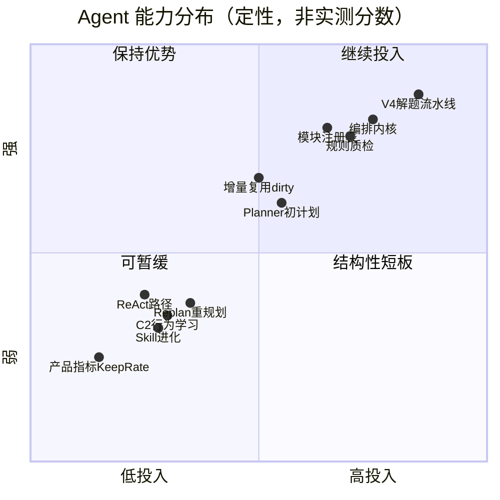
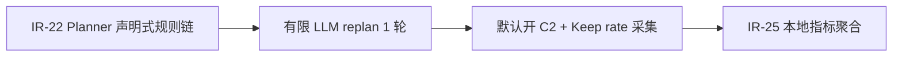

# Agent 能力短板评估

**版本**: 2026-06-12  
**状态**: 📋 评审稿（基于代码库与既有架构文档只读对齐）  
**定位**: 在 V3 编排收敛、AO-P0～P3、IR-1～IR-21 已落地之后，**客观列出 Agent 层相对薄弱的环节**，与强项对照，并给出可执行的补强顺序。  
**关联**: [AGENT_ARCHITECTURE_V3.md](AGENT_ARCHITECTURE_V3.md) · [AGENT_OPTIMIZATION_PLAN.md](AGENT_OPTIMIZATION_PLAN.md) · [AGENT_IMPROVEMENT_RECOMMENDATIONS.md](AGENT_IMPROVEMENT_RECOMMENDATIONS.md) · [NEXT_VERSION_BACKLOG.md](../product/NEXT_VERSION_BACKLOG.md) §C2 · [AI_INSIGHTS.md](../reference/AI_INSIGHTS.md)

---

## 1. 一句话结论

Agent 层**不是整体弱**，而是能力分布极不均匀：

| 象限 | 概括 |
|------|------|
| **强** | 「按步骤把题做完」— `RunOrchestrator` + V4 `solve_pipeline` + `verify/auto_remediate` |
| **弱** | 「会自己变聪明」— Planner 重规划、行为学习、技能进化、用户采纳反馈 |

产品主路径已是 **标准/深度 + V4 分阶段解题**；短板集中在 **规划自适应、进化闭环、实验 ReAct、质量度量** 四块。

---

## 2. 能力雷达（定性）



> 说明：纵轴为「当前工程成熟度」，横轴为「已投入精力」；右下象限（高投入仍偏弱）= ReAct；左下象限 = 进化层（有代码、默认未接通）。

---

## 3. 相对强项（对照基线）

以下环节**不必再大规模重构**，以小步增强即可。

| # | 环节 | 关键位置 | 状态 |
|---|------|----------|------|
| S1 | **编排内核** | `orchestrator.py`, `run_result.py`, `complete_agent_run` | V3 三模式共享；IR-1 消灭 standard 双轨 ✅ |
| S2 | **解题成功率** | `modules/solve_pipeline.py`, `solve_phases/` | V4 默认：代码沙箱 → 报告 → 图表；金样本 + 契约测 |
| S3 | **模块注册表** | `registry.py` | Planner catalog = ReAct tools = Executor runner 单源 |
| S4 | **规则质检** | `quality.verify_answer` | 零 LLM：schema、占位符、run_code、UML、教师约束 |
| S5 | **自动修复** | `orchestrator.run_verify` + `auto_remediate` | standard/deep 默认开；`autoRemediateMaxRounds` 可配 0～5 |
| S6 | **增量复用** | `executor_dirty.py` | revise / verify 后 `dirty_modules` 局部重跑 |
| S7 | **工程回归** | `test_run_modes_golden.py`, `test_solve_pipeline_golden.py` | mock LLM + 可选真 sandbox |
| S8 | **运行逻辑债** | RL1–RL12 | 文档标 ✅；plan→run 快照 IR-2 ✅ |

**结论**：用户感知的「能不能解出题」主要押在 **S2 + S1**，这两块是当前 Agent 的脊梁。

---

## 4. 相对短板（按影响排序）

### 4.1 P0 — 规划与自适应（Planner + Replan）

**严重程度**: 🔴 高（影响题型泛化与失败恢复）

#### 现状

| 阶段 | 机制 | 是否调 LLM |
|------|------|------------|
| 初计划 | `plan_from_report` → LLM JSON → `normalize_plan` | ✅ |
| 规则覆盖 | `adjust_v4_aware` / `adjust_code_cloze` / `adjust_mixed_assignment` / `apply_question_type_overrides` | ❌ |
| 行为弱提示 | `apply_behavior_to_steps`（`optimize_plan_from_usage` 默认 **关**） | ❌ |
| 失败重规划 | `replan_incremental` → `_replan_steps_for_failure` 规则表 | ❌ |
| 重规划上限 | `max_replan_rounds` 默认 **1** | — |

#### 规则 replan 示例（无 LLM）

```
run_code 失败     → 插入 fix_code
fix_code 失败     → 插入 run_code
render_uml 失败   → 插入 fix_diagrams → render_uml
solve_lab 失败    → 原样重试 solve_lab（confidence=low）
```

#### 典型风险

1. **题型组合新颖**时，规则链靠人肉补 `adjust_plan_*`，维护成本上升（`AI_INSIGHTS` 中 `code_cloze` 即先例）。
2. **多模块连锁失败**时不会「重新读题」，只会按固定模板插步。
3. Planner ~1100 行 + server 层历史覆盖 → 步骤来源分散（IR-6 已加 `PlanPipelineStage` 审计，但 **IR-22 声明式规则链仍 backlog**）。

#### 关键文件

- `src/python/agent/planner.py` — `plan_from_report`, `replan_incremental`, `_replan_steps_for_failure`
- `src/python/server.py` — plan/run 路由与 ctx 组装

#### 关联 backlog

| 条目 | 说明 |
|------|------|
| IR-18 | fixture plan→run 矩阵（theory / mixed / training_table） |
| IR-22 | `adjust_plan_*` → 有序 `PlanRule` 声明式链 |

---

### 4.2 P0 — 进化层（C2 行为学习 + Skill）

**严重程度**: 🔴 高（影响长期「越用越准」，但非阻塞首跑）

#### 现状

| 能力 | 代码 | 实际接通 |
|------|------|----------|
| 计划 diff 记录 | `plan_feedback.record_plan_feedback` | ✅ 每次 run 可记 |
| 行为统计写入 profile | `user_profile.behavior.*` | ⚠️ 需 `apply_to_profile=true` |
| Planner 消费行为 | `apply_behavior_to_steps` | ⚠️ 需 `optimize_plan_from_usage=true`（**默认关**） |
| 技能注入 | `skill_store.py`（3 内置 + promote 文件） | ✅ 匹配即注入 prompt |
| 技能晋升 | `AI_INSIGHTS.md` → 人工编辑 → `promoted_skills.json` | ❌ 半自动 |
| 结果反馈 | Keep rate（复制/导出/revise 满意度） | ❌ backlog |

#### 典型风险

- 系统**能记、能注入，但不会自己变强**；同类错题依赖改 prompt 或人工 promote skill。
- C2 与 AO-9 标 ✅，但**默认关闭** → 多数用户路径上等于未启用。

#### 关键文件

- `src/python/agent/user_profile.py`
- `src/python/agent/plan_feedback.py`
- `src/python/agent/skill_store.py`
- `docs/reference/AI_INSIGHTS.md`

#### 关联 backlog

| 条目 | 说明 |
|------|------|
| C2 | [NEXT_VERSION_BACKLOG.md](../product/NEXT_VERSION_BACKLOG.md) §1 |
| AO Keep rate | [AGENT_OPTIMIZATION_PLAN.md](AGENT_OPTIMIZATION_PLAN.md) §7 |

---

### 4.3 P1 — ReAct 路径

**严重程度**: 🟠 中（产品已降级为实验档，但代码仍在维护）

#### 现状

| 项 | 状态 |
|----|------|
| 产品定位 | AO-6：对外 **标准/深度**；ReAct **实验隐藏** |
| Bootstrap | AO-7：循环前硬跑 V4 `solve_lab`（或 `solve_code_cloze`） |
| LLM 解析 | JSON 优先 + `THOUGHT/ACTION/PARAMS` 正则 fallback（V3-3b function calling **未全面落地**） |
| 计划对齐 | system prompt checklist + `react_finalize`；**非硬约束** |
| 上下文 | IR-7：滑动窗口 + observation `fit_budget` ✅ |

#### 典型风险

- 自由选题模式与 V4 流水线**战略重复**；成功率不如 standard/deep。
- 历史上「思考写 A、工具调 B」（见 `AI_INSIGHTS` #N）— registry/bootstrap 漏接新模块时会复发。

#### 关键文件

- `src/python/agent/react_loop.py`
- `src/python/agent/react_prompts.py`
- `src/python/agent/react_finalize.py`

#### 建议

- **不扩 ReAct 投入**；新能力优先接 registry + standard/deep tail。
- 若保留：完成 V3-3b function calling，去掉 regex 主路径。

---

### 4.4 P1 — 质量闭环的「最后一公里」

**严重程度**: 🟠 中（用户体感：跑完了但校验没过）

#### 现状

| 机制 | 行为 |
|------|------|
| `verify_answer` | run 结束规则校验；产出 `suggested_actions` |
| `auto_remediate` | 按 action 标 dirty → 局部重跑 → 再 verify（轮次可配） |
| `compute_run_ok` | **只看 solve 类模块**；verify 失败 **不否决** `done.ok` |
| deep `reflect` | 语义审稿（LLM）；与 verify **正交** |
| Agent SSE | V4 `on_phase` 子阶段与 Agent progress **未完全对齐**（IR 文档 §13.1） |

#### 典型风险

- 用户看到绿色完成，但 Step3 校验清单仍有红项。
- 调试时「解题内核 phase 很细、Agent SSE 较粗」。

#### 关键文件

- `src/python/agent/quality.py`
- `src/python/agent/run_result.py` — `compute_run_ok`
- `src/python/agent/orchestrator.py` — `run_verify`

---

### 4.5 P2 — 评测与产品度量

**严重程度**: 🟡 中低（不阻塞功能，阻塞「数据驱动优化」）

#### 已有

- `run_summary`：`llm_calls`, `llm_calls_by_phase`, `replan_count`, `verify_pass`, `skills_fired`
- Golden：三模式模块序列 snapshot；V4 十题金样本
- `test_agent_fixture_e2e.py`：plan→run 单路径 E2E

#### 缺失

| 指标 | 说明 | 状态 |
|------|------|------|
| Keep rate | 用户复制章节 / 导出 / revise 标签 → 本地统计 | backlog |
| IR-25 | 从 `run_events/*.jsonl` 聚合 pass rate、token、phase 耗时 | backlog |
| IR-18 | theory / mixed / cloze / training_table plan→run 矩阵 | backlog |
| CI | GitHub Actions 跑 pytest（无真实 LLM） | backlog §3 |

#### 关键文件

- `src/python/llm_client.py` — phase 分桶
- `src/python/agent/orchestrator.py` — `build_run_summary`
- `tests/test_run_modes_golden.py`

---

### 4.6 P2 — 状态机分散（executor_dirty）

**严重程度**: 🟡 中低（维护成本，偶发复用边界 bug）

#### 现状

revise / auto_remediate / retry-step / replan 触发的 dirty 语义分散在：

- `executor_dirty.py`
- `orchestrator.run_verify`
- `quality.revise_answer`

#### 关联 backlog

- **IR-23**：`executor_dirty` 表驱动状态机 + golden

---

## 5. 短板 × 已有改进项对照

| 短板 | 已有文档/条目 | 完成度 |
|------|---------------|--------|
| Planner 规则链难维护 | IR-6 PlanPipeline 审计 ✅ · IR-22 声明式规则 | 一半 |
| Replan 无 LLM | V3 §5 replan 设计 · IR-12 分类规则 ✅ | 规则-only |
| C2 未默认开 | AO-9 ✅ · C2 backlog | 代码有、产品关 |
| ReAct 解析 fragile | V3-3a JSON ✅ · V3-3b function calling | 一半 |
| verify 不否决 ok | V5 刻意设计 · IR-8 多轮 remediate ✅ | 语义未改 |
| SSE 子阶段不对齐 | IR 文档 §13.1 · 可单独立 IR-22 | 未做 |
| 无 Keep rate | AO §7 · IR-25 | 未做 |

---

## 6. 建议补强顺序（单主线）

若只选一条线把「Agent 壳层偏静态」改掉，建议：



| 顺序 | 动作 | 预期收益 | 预估 |
|------|------|----------|------|
| **1** | IR-22：`adjust_plan_*` → `PlanRule[]` + 单测 | 新题型少改 server；计划可解释 | 2～3 天 |
| **2** | 失败 replan：带 `error_summary` + `assignment` 调 LLM **1 次**（保留规则 fallback） | 连锁失败能「重想」而非只插 fix_code | 2～3 天 |
| **3** | C2 设置默认 on（可关）+ Step3 复制/导出/revise 写 `behavior.outcomes` | 计划默认勾选更贴用户 | 1～2 天 |
| **4** | Keep rate 本地统计 + `run_summary` 扩展 | 优化有数据，不靠体感 | 2～3 天 |
| **5** | IR-18 fixture 矩阵 + IR-25 jsonl 聚合 | CI 守护题型组合 | 2～4 天 |

**明确不做**（与现有战略一致）：

- 扩 ReAct 为主模式
- 引入 LangChain / Cursor SDK 等外部 Agent 框架
- CI 调真实 LLM API

---

## 7. 给 AI 协作者的提问模板

```
请只改 Agent 规划层，范围：
- IR-22：planner.py 的 adjust_plan_* 收敛为 PlanRule 链
- replan_incremental：失败时可选 1 轮 LLM replan（规则 fallback 保留）
- 不碰 solve_pipeline、不恢复 fill 主路径、不扩 ReAct
- 验收：tests/test_planner.py + 新增 replan LLM mock 测；现有 golden 全绿
```

```
请接通 C2 产品闭环，范围：
- optimize_plan_from_usage 默认 true（schema 迁移 + 设置页说明）
- Step3 复制/导出/revise 写 behavior.outcomes
- Planner apply_behavior_to_steps 单测（取消 N 次后 default_checked=false）
- 不调真实 LLM
```

---

## 8. 修订记录

| 日期 | 说明 |
|------|------|
| 2026-06-12 | 初稿：基于 V3/AO/IR 文档与 `planner.py` / `react_loop.py` / `skill_store.py` 代码对齐 |

---

*本文档描述「哪里相对弱」，具体改法以 [AGENT_IMPROVEMENT_RECOMMENDATIONS.md](AGENT_IMPROVEMENT_RECOMMENDATIONS.md) 与 [AGENT_OPTIMIZATION_PLAN.md](AGENT_OPTIMIZATION_PLAN.md) 的实施条目为准。*
