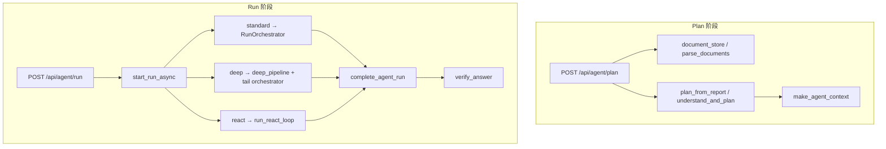
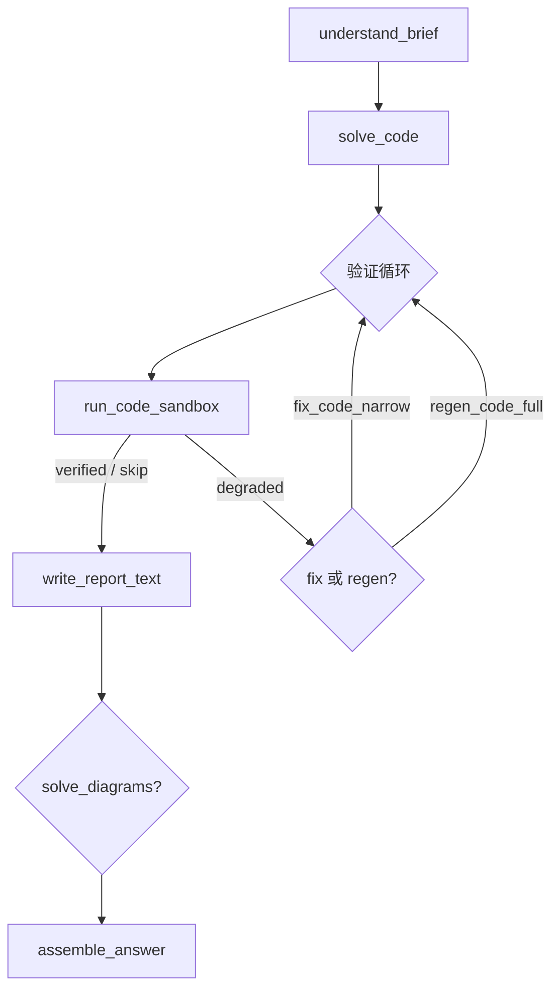

# Agent 建设性改进建议

**版本**: 2026-06-09  
**状态**: 📋 评审稿（基于代码库只读探索）  
**定位**: 在 V3 编排收敛、AO-P0～P2 已落地之后，汇总 **下一批高 ROI、可落地的 Agent 层改进**；侧重稳定性、可解释性与可观测性，不重复 [AGENT_OPTIMIZATION_PLAN.md](AGENT_OPTIMIZATION_PLAN.md) 中已标记 ✅ 的 AO 条目。  
**关联**: [AGENT_ARCHITECTURE_V3.md](AGENT_ARCHITECTURE_V3.md) · [AGENT_OPTIMIZATION_PLAN.md](AGENT_OPTIMIZATION_PLAN.md) · [RUNTIME_LOGIC_ISSUES.md](RUNTIME_LOGIC_ISSUES.md) · [LAB_SOLVER_AGENT_PLAN.md](LAB_SOLVER_AGENT_PLAN.md)

---

## 1. 架构快照（当前基线）

| # | 要点 | 关键位置 |
|---|------|----------|
| 1 | Plan / Run 两阶段分离；`plan_fingerprint` 防过期计划 | `server.py`, `planner.py` |
| 2 | 三模式（standard / deep / react）共享 `RunOrchestrator` + `complete_agent_run` | `orchestrator.py`, `run_result.py` |
| 3 | 模块注册表单源：`MODULE_REGISTRY` 对齐 Planner catalog、ReAct tools、executor runner | `registry.py`, `executor.py` |
| 4 | `ctx` 为中心的状态机：`module_results`、`dirty_modules`、`decision_log` | 全流程 |
| 5 | 解题内核外置：V4 `solve_pipeline` 承载主要 LLM 与代码验证 | `modules/solve_pipeline.py` |
| 6 | 规则校验零 LLM：`verify_answer` + 可选 `auto_remediate` | `quality.py`, `orchestrator.py` |
| 7 | 可观测基础：`decision_log`、多类 SSE、`run_summary` | `orchestrator.py`, `run_result.py` |
| 8 | 成功语义解耦：`compute_run_ok` 只看 solve 模块；verify 失败不否决 `done.ok` | `run_result.py` |

### 1.1 主流程（简图）



### 1.2 已具备的优点（保持）

1. **编排收敛** — `RunOrchestrator` + `complete_agent_run` 统一三模式收尾，RL7/RL12 类问题已针对性修复。
2. **注册表单源** — 减少 Planner / ReAct / Executor 三处模块列表漂移。
3. **规则质检** — `verify_answer` 覆盖 schema、占位符、run_code、UML、教师约束，成本为零。
4. **增量复用** — `executor_dirty` + `should_rerun_module` 支持 revise 后局部重跑。
5. **黄金路径测试** — `test_run_modes_golden.py` 对三模式模块序列做 snapshot。

---

## 2. 改进原则

1. **Policy 可简化，Core 不推翻** — 在 `registry` + `RunOrchestrator` + `complete_agent_run` 三角架构上演进，不引入外部 Agent 框架。
2. **消灭隐式双轨** — legacy 路径、静默 fallback、分散的计划覆盖逻辑，都应显式化或收敛。
3. **Harness 思维** — 每项改进配契约测试 + 可量化指标，不靠主观体感验收。
4. **与 V5 对齐** — 优化围绕 `LabDeliverable`、`code_status`、内化验证，不恢复 fill 为主路径。
5. **小步可回滚** — feature flag / 设置默认关 / 每步补 pytest。

---

## 3. 优先级总览

| 优先级 | 主题 | 条目 | 预估 |
|--------|------|------|------|
| **P0** | 正确性 / 一致性 / 用户可见失败 | IR-1～IR-4 | 3～5 天 |
| **P1** | 复杂度 / 可靠性 / 可观测性 | IR-5～IR-12 | 1～2 周 |
| **P2** | 性能 / 工程卫生 / 长期演进 | IR-13～IR-17 | ✅ 2026-06-09 |

**建议首批落地（最高 ROI）**: IR-1 → IR-2 → IR-4 + IR-10

---

## 4. P0 — 正确性 / 一致性

### IR-1：消灭 standard 执行双轨（✅ 2026-06-09）

| 项 | 内容 |
|----|------|
| **现状** | `executor.py` 曾同时维护 orchestrator 与 legacy 循环 |
| **风险** | segment 复用、`params` 写入 `module_results` 等行为存在细微差异；修 bug 易漏改一侧 |
| **建议** | 已收敛为 orchestrator 唯一路径；CI 增加序列快照守护 |
| **收益** | 减少重复，降低回归概率 |
| **验收** | standard 仅走 `RunOrchestrator`；保留 golden 序列回归测试 |
| **涉及文件** | `src/python/agent/executor.py`, `tests/test_orchestrator.py` |

**本次落地**：`execute_standard_run` 仅委托 `_execute_standard_via_orchestrator`；新增 `tests/test_orchestrator.py::test_ir1_execute_standard_run_delegates_to_orchestrator`；修复 `tests/test_run_modes_golden.py` fallback patch 路径。

### IR-2：加固 plan → run 文档上下文（✅ 2026-06-09）

| 项 | 内容 |
|----|------|
| **现状** | `document_store` 纯内存、TTL 1h、最多 32 条；Plan 与 Run 分两次 HTTP 请求 |
| **风险** | 间隔超时、进程重启、并发易导致 `stale_documents`，用户「已生成计划但执行失败」 |
| **建议** | Run 请求携带 plan 阶段返回的 `agent_context_snapshot`；缓存失效时服务端重建 doc_ctx |
| **收益** | 提高 plan→run 成功率，减少 400/409 误报 |
| **验收** | 文档缓存失效时，携带快照的 run 仍可成功启动 |
| **涉及文件** | `src/python/agent/document_store.py`, `src/python/server.py` |

**本次落地**：`/api/agent/plan` 返回 `agent_context_snapshot`；`/api/agent/run` 在 `resolve_agent_context` 失败时走 `_doc_ctx_from_snapshot`；前端 `postAgentRunWithDocRetry` 透传快照。测试：`TestRL4StaleDocumentRetry`、`TestIR2PlanRunSnapshot`。

### IR-3：统一失败 / 重试阈值（✅ 2026-06-09）

| 项 | 内容 |
|----|------|
| **现状** | 各模式独立常量 |
| **风险** | ReAct 与 Standard 对「何时 replan / 退出」语义不一致 |
| **建议** | 抽到 `agent/types.py` 单一配置，按 mode 覆盖并写入文档 |
| **收益** | 行为可预测，mode 切换无意外 |
| **验收** | 单测断言三模式使用同一配置源 |
| **涉及文件** | `src/python/agent/planner.py`, `src/python/agent/react_loop.py` |

**本次落地**：`types.py` 新增 `MAX_CONSECUTIVE_FAILURES_BY_MODE` 与 `max_consecutive_failures_for_mode()`；`orchestrator` / `react_loop` / `planner` 统一读取。测试：`TestIR3FailureThresholdConfig`。

### IR-4：Deep 计划阶段契约测试（✅ 2026-06-09）

| 项 | 内容 |
|----|------|
| **现状** | `understand_and_plan` 失败时 fallback 到 `plan_from_report` |
| **风险** | Deep「理解」质量不可回归，fallback 掩盖 LLM / 解析问题 |
| **建议** | mock LLM 的 understand JSON 契约测试 + fallback 路径断言（`understand.degraded`） |
| **收益** | Deep 计划阶段可 CI 守护 |
| **验收** | `pytest tests/test_understand_plan.py` 覆盖成功 / 解析失败 / fallback |
| **涉及文件** | `src/python/agent/understand_plan.py`, `tests/test_understand_plan.py` |

**本次落地**：`understand_plan.py` 新增 `_understand_plan_json_ok`，解析无效 JSON 时走与异常相同的 degraded fallback；测试覆盖成功 / LLM 异常 / 解析失败三条路径。

---

## 5. P1 — 复杂度 / 可靠性 / 可观测性

### IR-5：拆分 executor 大文件（✅ 2026-06-09）

| 项 | 内容 |
|----|------|
| **现状** | 已拆为 `executor_common.py`（结果/进度辅助）、`executor_solve.py`、`executor_code.py`、`executor_deliver.py`；`executor.py` ~200 行门面（`_MODULE_RUNNERS`、`run_module`、`execute_standard_run`、`start_run_async`） |
| **风险** | 修改 `run_code` 易影响 `solve_lab`；变更半径大 |
| **建议** | 按职责拆文件（如 `executor_solve.py`, `executor_code.py`），保留 `run_module` 门面 |
| **收益** | 降低 review 成本，新人上手更快 |
| **涉及文件** | `src/python/agent/executor*.py` |

### IR-6：计划生成可解释化（✅ 2026-06-09）

| 项 | 内容 |
|----|------|
| **现状** | `planner.py` ~900 行 + `server.py` 层 code_cloze / mixed 硬编码覆盖；步骤来源分散（LLM / fallback / server / replan） |
| **风险** | 难以解释「为何多了一步 run_code」 |
| **建议** | 引入 `PlanPipeline` 显式阶段列表，每步记录 `source` 到 `decision_log`；server 层覆盖下沉到 planner |
| **收益** | 计划可审计、可调试 |
| **涉及文件** | `src/python/agent/planner.py`, `src/python/server.py` |

**本次落地（最小版 PlanPipeline）**：

- `planner.py` 新增 `PlanPipelineStage` 与阶段记录工具（`_record_plan_stage` / `_pipeline_to_decision_log`），在 plan 主流程中记录：
  - `input.prepare_prompt`
  - `llm.parse_plan_json`、`llm.normalize_plan`
  - `fallback.fallback_plan`（空返回或异常）
  - `behavior.apply_behavior`
  - `rule.adjust_v4_aware` / `rule.adjust_mixed_assignment` / `rule.adjust_code_cloze`
- `DecisionLogEntry` 增加 `source` 字段，并在 `plan_generated` 事件写入 `source="planner"`。
- 新增 `apply_question_type_overrides(...)`，将 server 层的 `mixed_assignment` / `code_cloze` 计划覆盖逻辑下沉到 planner；server 路由改为统一调用该函数。
- `server.py` 抽出 `_normalize_user_constraints_input(...)`，减少 route 内散落规则。
- 新增/扩展测试：
  - `tests/test_planner.py::test_plan_from_report_decision_log_contains_source`
  - `tests/test_planner.py::test_apply_question_type_overrides_code_cloze`
  - `tests/test_planner.py::test_apply_question_type_overrides_mixed_assignment`

### IR-7：ReAct 上下文 token 预算（✅ 2026-06-09）

| 项 | 内容 |
|----|------|
| **现状** | `react_loop.py` 每轮追加 assistant + user 观察，16 轮内无 token 预算 |
| **风险** | 长报告 + 长 tool summary 导致 context 溢出或成本飙升 |
| **建议** | 对观察结果 `fit_budget`、滑动窗口保留最近 N 轮，或摘要化旧观察 |
| **收益** | 稳定 ReAct 成功率与延迟 |
| **涉及文件** | `src/python/agent/react_loop.py` |

**本次落地**：

- 新增 ReAct 历史压缩层 `_compact_history_for_llm`：固定保留 `system + bootstrap`，其余按 **最近优先** 滑动窗口裁剪（`REACT_TAIL_MAX_MESSAGES` + token 预算）。
- 对 `"[观察结果]"` 消息新增 `_compress_observation_content`，使用 `fit_budget` 对长 tool summary 做预算压缩，保留错误/输出等关键信息。
- `chat_messages` 改为消费压缩后的 `llm_history`，避免 16 轮循环内上下文无限增长。
- 新增测试：
  - `tests/test_react_loop.py::TestReactHistoryCompaction::test_keeps_system_and_bootstrap_then_recent_tail`
  - `tests/test_react_loop.py::TestReactHistoryCompaction::test_observation_is_budget_trimmed`

### IR-8：verify auto_remediate 可配置多轮（✅ 2026-06-09）

| 项 | 内容 |
|----|------|
| **现状** | `orchestrator.run_verify` 的 `auto_remediate` 固定 `max_rounds=1` |
| **风险** | 多问题 verify（schema + UML + teacher rules）一轮修不完 |
| **建议** | 按 `suggested_actions` 优先级分批 remediate；暴露 `max_remediate_rounds` 配置 |
| **收益** | 减少「verify 失败但 done.ok=true」的质量缺口 |
| **涉及文件** | `src/python/agent/orchestrator.py`, `src/python/settings_schema.py` |

**本次落地**：

- `settings_schema.py`：新增 `autoRemediateMaxRounds`（默认 1），schema 升级到 v8。
- `orchestrator.py`：
  - 新增 `auto_remediate_max_rounds()`（从 `ctx.auto_remediate_max_rounds` / `settings.autoRemediateMaxRounds` 读取，范围 0~5）。
  - `run_verify` 支持 `max_rounds=None` 时读取上述配置；保持显式传参优先。
- `server.py`：
  - 新增 `_auto_remediate_max_rounds_from_request(...)` 统一解析请求字段（snake/camel）。
  - 在 `/api/agent/plan` 与 `/api/agent/run` 将该值写入 `settings`。
  - 在 run ctx 写入 `auto_remediate_max_rounds`，供执行期生效。
- 前端设置（`app.js` / `index.html`）：
  - 新增「自动修复最大轮次（0-5）」设置项，持久化并在 run 请求透传 `auto_remediate_max_rounds`。
  - Step2 模式条显示自动修复轮次。
- 测试：
  - 新增 `tests/test_auto_remediate.py::test_auto_remediate_max_rounds_from_ctx`
  - 新增 `tests/test_runtime_logic.py::test_agent_run_sets_auto_remediate_max_rounds`
  - 更新 `tests/test_image_input.py::test_settings_schema_ocr_defaults`（schema v8 + 新默认项）

### IR-9：code_cloze 质检补全（✅ 2026-06-09）

| 项 | 内容 |
|----|------|
| **现状** | `quality.verify_answer` 对 `code_cloze` 早退，只查 blanks |
| **风险** | 占位符、教师约束等通用检查被跳过 |
| **建议** | cloze 分支合并通用检查，或单独 `verify_code_cloze` |
| **收益** | 完形填空答案质量门禁更完整 |
| **涉及文件** | `src/python/agent/quality.py`, `tests/test_code_cloze_scoring.py` |

**本次落地**：

- `verify_answer` 不再对 `code_cloze` 提前 `return`；保留 `code_cloze_schema` 后继续执行通用检查（占位符、教师约束、抄袭等）。
- 新增 `_code_cloze_blob`，将 blanks 的 `answer/brief` 聚合为文本参与 `no_placeholder` 与教师规则校验。
- 新增测试 `tests/test_phase2b.py::test_verify_code_cloze_runs_common_checks` 覆盖 `code_cloze_schema + no_placeholder + constraint_present`。

**2026-06-09 修补（BF55，IR-9 回归）**：

- 合并通用检查后误保留 `schema_complete`（实验报告四字段）与 `deliverable_ready`（三节正文），导致完形填空恒报失败并误触发 `auto_remediate` → 重跑 `solve_lab`。
- 已改为：`code_cloze` 仅用 `code_cloze_schema` 作结构门禁；`deliverable_ready` 查 `blanks`；`revise_full` 重跑 `solve_code_cloze`；Step3 在 `present_deliverable` 完成即展示工作区，执行中不渲染校验失败态。
- 测试：`tests/test_phase2b.py::test_verify_code_cloze_passes_without_lab_fields`。

### IR-10：分阶段 LLM 调用指标（✅ 2026-06-09）

| 项 | 内容 |
|----|------|
| **现状** | `get_llm_call_count` 全局计数；V4 pipeline / planner / reflect / ReAct 混在一起 |
| **风险** | 无法定位哪一阶段耗 token / 超时 |
| **建议** | 按 `phase` 分桶统计，写入 `run_summary.llm_calls_by_phase` |
| **收益** | 性能调优与成本分析有据可依 |
| **涉及文件** | `src/python/llm_client.py`, `src/python/agent/run_result.py` |

**本次落地**：

- `llm_client.py` 新增 `_llm_calls_by_phase` 与接口：`get_llm_calls_by_phase()`；`reset_llm_call_count()` 同步清空分桶。
- `chat` / `chat_messages` / `chat_vision` / `call_ai` 统一走 `_record_llm_call(phase)`，空 phase 归入 `unknown`；`call_ai` 默认分桶为 `solve_<q_type>`。
- `RunOrchestrator.build_run_summary()` 新增字段 `llm_calls_by_phase`。
- 新增测试 `tests/test_llm_phase_metrics.py`；扩展 `tests/test_run_summary.py` 断言新字段存在。

### IR-11：ReAct 结构化输出（✅ 2026-06-09）

| 项 | 内容 |
|----|------|
| **现状** | `parse_react_response` 支持 JSON 与 legacy 正则双格式 |
| **风险** | 半结构化输出时 `action` 为空，依赖 empty_retries 补救 |
| **建议** | 结构化输出用 JSON schema；失败时单次 repair prompt |
| **收益** | 降低 ReAct 空 action 与误解析率 |
| **涉及文件** | `src/python/agent/react_loop.py`, `tests/test_react_parse.py` |

**本次落地**：

- `react_prompts.py`：新增 `REACT_RESPONSE_JSON_SCHEMA`、`react_response_schema_hint()`、`react_parse_needs_repair()` / `react_parse_error()`、`build_react_repair_prompt()`；system prompt 注入显式 schema 与合法 action 列表。
- `react_loop.py`：
  - JSON 解析失败时复用 `lab_parse._repair_truncated_json` 修复截断 JSON。
  - 半结构化 JSON（空/未知 action）触发单次 `_attempt_react_repair`（`phase="react_repair"`），成功则继续主循环；失败仍走原有 `empty_retries` 提示链。
  - repair 事件写入 `decision_log`（`react_parse_repair`）。
- 新增/扩展测试：
  - `tests/test_react_parse.py`：截断 JSON、repair 检测、repair prompt
  - `tests/test_react_loop.py`：repair 成功/失败路径、`_attempt_react_repair` 单元测试

### IR-12：replan 策略扩展（✅ 2026-06-09）

| 项 | 内容 |
|----|------|
| **现状** | `replan_incremental` 仅 `MAX_REPLAN_ROUNDS=1`，规则化插入 fix_code / solve_lab，无 LLM |
| **风险** | 复杂失败（如 Java 多文件）一轮 replan 不够 |
| **建议** | 可选 LLM replan 或按 `error_category` 扩展策略表 |
| **收益** | 减少连续失败后直接 fallback |
| **涉及文件** | `src/python/agent/planner.py` |

**本次落地（最小版）**：

- `types.py`：`max_replan_rounds_for_ctx()`；`settings_schema.py` v9 新增 `maxReplanRounds`（默认 1，0~5）。
- `planner.py`：`_replan_steps_for_failure` 策略表（`run_code`→`fix_code`、`fix_code`→`run_code`、`render_uml`→`fix_diagrams`+`render_uml`、`fix_diagrams`→`render_uml`、`solve_lab` 重试）；`replan_incremental` 读取 ctx 轮次上限。
- `orchestrator.py`：`maybe_replan` 透传 `module_results` 中的 `error_category`。
- `server.py` / 前端：run 请求透传 `max_replan_rounds`；设置页可配置。
- 测试：`tests/test_replan.py`（策略、轮次上限、server 透传、orchestrator category）。

---

## 6. P2 — 性能 / 工程卫生 / 长期演进

### IR-13：模式选择与并行化（✅ 2026-06-09）

| 项 | 内容 |
|----|------|
| **现状** | Deep = understand + solve_lab(V4 多轮) + reflect + tail orchestrator；ReAct bootstrap + 最多 16 轮 |
| **风险** | thorough tier 下单次 run 延迟与费用高 |
| **建议** | 模式选择指南 + fast tier 默认；无依赖步骤并行（如 UML 与 deliverable 准备） |
| **收益** | 可预期 SLA |
| **涉及文件** | `solve_pipeline.py`, `parallel_groups.py`, `orchestrator.py`, `settings_schema.py`, `server.py`, `app.js`, `docs/design/MODE_SELECTION_GUIDE.md` |

**本次落地（IR-13a + IR-13b）**：

- **模式指南**：`docs/design/MODE_SELECTION_GUIDE.md`；Step2 `#step2ModeBanner` 补充三模式代价提示；设置页轻量题型 / 并行开关说明。
- **fast 默认（可配置）**：`resolve_solve_quality_tier(settings, ctx)` + `is_light_question`；`autoFastTierForLightQuestions`（默认开）+ `solveQualityTierExplicit`（用户改档位后锁定）；`deep`/`react` 不自动降档。schema v10。
- **并行（最小版）**：`parallel_groups.py` 声明 `run_code‖render_uml`、`solve_theory‖solve_code_cloze`；`RunOrchestrator._run_parallel_batch` + `enableParallelModuleSteps`（默认开）；SSE `parallel: true`；cancel / replan 兼容。
- 测试：`tests/test_ir13_quality_parallel.py`；扩展 `test_solve_pipeline.py`、`test_image_input.py`。

### IR-14：skill_store 可审计（✅ 2026-06-09）

| 项 | 内容 |
|----|------|
| **现状** | 技能命中逻辑分散在 `match_skills` 与 run 结束 `record_skill_candidates_from_run` |
| **风险** | 技能生效路径不透明 |
| **建议** | 技能命中写入 `decision_log` + 单测覆盖 trigger |
| **收益** | 可审计的提示词增强 |
| **涉及文件** | `src/python/agent/skill_store.py`, `src/python/agent/executor_solve.py`, `tests/test_skill_store.py` |

**本次落地**：

- `match_skills` 新增可选 `agent_ctx` + `audit_source`；命中写 `skill_matched`（含 skill id/description/evidence），未命中写 `skill_no_match`。
- `record_skill_candidates_from_run` 写 `skill_candidate_recorded`（含 candidate id、trigger）或 `skill_candidate_skipped`。
- `executor_solve._run_solve_lab` 以 `audit_source="solve_lab"` 审计技能命中。
- 测试：`tests/test_skill_store.py` 覆盖 match 命中/未命中与 candidate 记录/跳过四条路径。

### IR-15：prompt 版本全链路追踪（✅ 2026-06-09）

| 项 | 内容 |
|----|------|
| **现状** | `prompts.py` / `react_prompts.py` 版本与 `ctx.prompt_versions` 部分同步 |
| **风险** | 回归时不知用户跑的是哪版 prompt |
| **建议** | 所有 LLM 调用携带 `prompt_version` 到 SSE `run_summary` |
| **收益** | 问题复现与回滚更简单 |
| **涉及文件** | `src/python/agent/prompts.py`, `react_prompts.py`, `orchestrator.py`, `solve_pipeline.py`, `executor_solve.py`, `react_loop.py`, `tests/test_prompt_versions.py` |

**本次落地**：

- `prompts.py` 新增 `record_prompt_version` / `merge_prompt_versions` / `record_plan_prompt_version`；`react_prompts.py` 新增 `REACT_PROMPT_VERSION` / `REACT_REPAIR_PROMPT_VERSION`。
- Plan 阶段：`make_agent_context` 写入 planner / understand_plan 版本；run 请求可选透传 `prompt_versions` 合并。
- Run 阶段：solve pipeline（`code_only` / `write_report_text` / `solve_diagrams` / `fix_code`）、`executor_solve`（theory / code_cloze）、`react_loop`、`reflect`、`executor_code.fix_code` 写入 `ctx.prompt_versions`。
- `RunOrchestrator.build_run_summary()` 新增 `prompt_versions` 字段（SSE `done` 可查看）。
- 测试：`tests/test_prompt_versions.py` 覆盖 planner、solve、react 三条路径 + `test_run_summary.py` 断言新字段。

### IR-16：运行控制升级（✅ 2026-06-09）

| 项 | 内容 |
|----|------|
| **现状** | `run_control` 单活跃 run；daemon 线程无结构化 tracing id |
| **风险** | 无法排队第二任务；崩溃后仅依赖内存 `event_log` |
| **建议** | 可选队列模式；关键事件落盘（`run_id.jsonl`） |
| **收益** | 多任务与崩溃恢复能力 |
| **验收** | `pytest tests/test_runtime_logic.py::TestIR16RunEventPersist tests/test_runtime_logic.py::TestIR16RunQueue tests/test_phase2a.py::test_run_fifo_queue_mode` |
| **涉及文件** | `run_control.py`、`run_event_store.py`、`config.py`、`server.py`、`executor.py`、`settings_schema.py` |

**本次落地（IR-16a 落盘 + tracing）**：

- `APP_DATA/run_events/{run_id}.jsonl`：`emit_event` 全量 append；`get_run_events` / `iter_events` 内存缺失时读盘回放；无终端事件标 `orphaned`。
- daemon 线程 `name=agent-run-{run_id[:8]}`；落盘行含 `ts`、`_trace.thread`；`logi` 带 `run_id/seq/type`。
- 配置：`persistRunEvents`（默认 true）、`runEventsMaxFiles`（30）、`runEventsMaxAgeDays`（7）；`release_run` 后惰性 prune。

**本次落地（IR-16b 可选队列）**：

- 默认 `runQueueMode=reject` → 409 `run_busy`（不变）；`fifo` + `runQueueMaxDepth=1` 时第二任务 200 `status=queued` + `queue_position`。
- `release_run` 活跃任务结束后自动 `queue_started` 并调 `register_run_starter` → `start_run_async`。
- 队列满 → 409 `queue_full`；取消 queued 任务不触发 drain。

### IR-17：真实 fixture 端到端测试（✅ 2026-06-09）

| 项 | 内容 |
|----|------|
| **现状** | 集成测试大量 mock `verify_answer` 与 runner |
| **风险** | parse → plan → execute 集成断裂难捕获 |
| **建议** | `tests/fixtures/*.docx` + mock LLM 的 `/api/agent/plan` → `/run` 链路测试 |
| **收益** | 捕获全链路回归 |
| **验收** | `pytest tests/test_agent_fixture_e2e.py` 覆盖 docx 解析、计划步骤、run 启动与模块序列 / `run_summary` |
| **涉及文件** | `tests/test_agent_fixture_e2e.py` |

**本次落地**：

- 新增 `tests/test_agent_fixture_e2e.py`：`programming_lab.docx`（lab_report）与 `code_cloze_singleton.docx`（题型覆盖纠正）经真实 `documents[]` 解析 → `POST /api/agent/plan` → `POST /api/agent/run`（standard）。
- mock `llm_client.chat`（计划阶段）与 `_MODULE_RUNNERS`（执行阶段），不调用真实 API Key；断言 `plan_fingerprint`、`agent_context_snapshot`、run `status=running`、`done.run_summary.mode` / `llm_calls_by_phase` 与模块执行序列。

---

## 7. 复杂度热点（维护时优先关注）

| 区域 | 文件（约行数） | 说明 |
|------|----------------|------|
| 解题内核 | `modules/solve_pipeline.py`（~755） | V4 多 phase + sandbox/fix 循环；`run_solve_pipeline` 与 `retry_pipeline_validation` 重复编排 → **IR-19～21** |
| 计划规则丛林 | `planner.py`（~1075）、`server.py` plan 路由 | 多层 `adjust_plan_*` + 题型硬编码（IR-6 仅最小 PlanPipeline） |
| 文档链路 | `parse_documents.py`（~1064）、`document_store.py` | 组合卷、OCR、mixed assignment |
| 状态缓存 | `executor_dirty.py`（~345） | dirty/reuse 与 verify remediate 交叉 |
| 执行门面 | `executor.py`（~220，IR-5 已拆） | `run_module` / `start_run_async`；runner 在 `executor_*.py` |
| 提示词/工具 | `react_loop.py`, `react_tools.py` | 双解析格式 + bootstrap 特殊路径 |

### 测试薄弱点

- ~~`understand_and_plan` 无专属测~~（→ IR-4 ✅）
- ~~`quality.verify_answer` 仅浅覆盖~~（→ IR-9 ✅）
- ~~真实 LLM E2E 无~~（→ IR-17 ✅ fixture + mock LLM plan→run）
- ~~**`solve_pipeline` 按 phase 契约测不足**~~（→ IR-19 ✅ `test_solve_phase_contracts.py`）
- `executor._run_run_code` 长链单测分散（随 solve 内核拆分一并收敛）

---

## 8. 成功指标（改进前后对比）

| 指标 | 定义 | 目标方向 |
|------|------|----------|
| Plan→Run 启动成功率 | plan 成功后 run 能正常启动的比例 | ↑ |
| 连续失败 / replan 次数 | 单次 run 内 `replan_count`、连续 module 失败 | ↓ |
| LLM 分阶段耗时 | `run_summary.llm_calls_by_phase` + 各 phase 平均耗时 | 可定位、可优化 |
| Verify 首次通过率 | `verification.passed` 在首轮 complete 时为 true 的比例 | ↑ |
| Stale document 错误率 | plan 后 run 因文档缓存失败的比例 | ↓ |

---

## 9. 两周改造排期（建议）

### 第 1 周 — 稳定性

| 天 | 任务 | 条目 |
|----|------|------|
| D1–D2 | 收敛 standard 执行路径 | IR-1 ✅ 2026-06-09 |
| D3 | plan→run 上下文快照 | IR-2 ✅ 2026-06-09 |
| D4 | 统一失败阈值配置 | IR-3 ✅ 2026-06-09 |
| D5 | `understand_and_plan` 契约测试 | IR-4 ✅ 2026-06-09 |

### 第 2 周 — 可观测 + 质量

| 天 | 任务 | 条目 |
|----|------|------|
| D6–D7 | `llm_calls_by_phase` 分桶统计 | IR-10 ✅ 2026-06-09 |
| D8 | code_cloze verify 补全 | IR-9 ✅ 2026-06-09 |
| D9 | ReAct token 预算（滑动窗口） | IR-7 ✅ 2026-06-09 |
| D10 | 计划 source 写入 decision_log（最小版 PlanPipeline） | IR-6 ✅ 2026-06-09 |
| D11 | verify auto_remediate 多轮可配置 | IR-8 ✅ 2026-06-09 |
| D12 | ReAct 结构化输出 + repair prompt | IR-11 ✅ 2026-06-09 |
| D13 | replan 策略 + max_replan_rounds | IR-12 ✅ 2026-06-09 |

> 第 2 周可与 AO-P1（质量档位 + Planner 增强）合并推进，见 [AGENT_OPTIMIZATION_PLAN.md](AGENT_OPTIMIZATION_PLAN.md) §5。

---

## 10. 本地验证清单

```bash
# 核心 agent 单测（无 API Key）
cd C:\Users\21136\lab-solver
pytest tests/test_registry.py tests/test_planner.py tests/test_orchestrator.py ^
  tests/test_react_parse.py tests/test_run_modes_golden.py tests/test_runtime_logic.py ^
  tests/test_deep_pipeline_v4.py -q

# 三模式模块序列未漂移
pytest tests/test_run_modes_golden.py::test_golden_sequences_snapshot -q

# plan fingerprint 防 stale plan
pytest tests/test_planner.py -k fingerprint -q

# verify 不否决 done.ok
pytest tests/test_runtime_logic.py -k "solve_ok or compute_run_ok" -q

# code_cloze / mixed assignment 路由
pytest tests/test_mixed_assignment.py tests/test_code_cloze_scoring.py -q

# IR-17 fixture plan→run E2E（无真实 API Key）
pytest tests/test_agent_fixture_e2e.py -q
```

**手动冒烟**:

1. 对比 standard 模式 SSE progress 序列（IR-1 收敛后仅保留 orchestrator 路径）
2. Plan 后重启 Python 进程再 Run，验证 IR-2 快照方案
3. 有 API Key 时：plan → run → 订阅 `/api/agent/events`，检查 `run_summary`、`verification`

---

## 11. 与现有路线图的关系

| 本文档 | AGENT_OPTIMIZATION_PLAN | 关系 |
|--------|----------------------|------|
| IR-1～IR-4 | AO-P1 部分重叠 | 本文档偏「稳定性债务」；AO-P1 偏「质量档位」 |
| IR-6, IR-12 | AO-P1 Planner 增强 | 可合并为一个 sprint |
| IR-10 | AO-8 eval harness 延伸 | 指标分桶是 harness 的下一层 |
| IR-14 | AO-P3 C2 + skill | 同属长期进化 |
| IR-17 | AO-2 金样本延伸 | 从 solve 金样本扩展到 plan→run 全链路 |

**一句话方向**: 在保持 `registry` + `RunOrchestrator` + `complete_agent_run` 三角架构的前提下，优先消灭双轨与上下文脆弱点，再把复杂度从 `executor.py` / `planner.py` 下沉到显式 pipeline 阶段与可观测指标。

---

## 12. 变更记录

| 日期 | 说明 |
|------|------|
| 2026-06-09 | 初稿：基于代码库探索产出 IR-1～IR-17 + 两周排期 |
| 2026-06-09 | P1 第二阶段落地：IR-10 `llm_calls_by_phase` + IR-9 code_cloze verify 补全（含测试） |
| 2026-06-09 | P1 续：IR-7 ReAct 历史 token 预算（观察结果压缩 + 滑动窗口，含测试） |
| 2026-06-09 | P1 续：IR-6 最小版 PlanPipeline（decision_log.source + server 覆盖逻辑下沉 planner，含测试） |
| 2026-06-09 | P1 续：IR-8 auto_remediate 轮次配置化（settings v8 + 前后端透传 + 测试） |
| 2026-06-09 | P0 收尾：IR-1～IR-4 验收测试补齐 + understand 解析失败 degraded 标记 |
| 2026-06-09 | P1 续：IR-11 ReAct JSON schema + 单次 repair prompt（截断 JSON 修复 + 测试） |
| 2026-06-09 | P1 续：IR-12 replan 策略表 + maxReplanRounds 配置（settings v9 + 测试） |
| 2026-06-09 | P2：IR-17 真实 fixture plan→run E2E（`test_agent_fixture_e2e.py`） |
| 2026-06-09 | P2：IR-14 skill_store 可审计（`decision_log` 技能命中/候选记录 + 测试） |
| 2026-06-09 | P2：IR-15 prompt 版本全链路追踪（`ctx.prompt_versions` → `run_summary.prompt_versions` + 测试） |
| 2026-06-09 | P2：IR-13 模式指南 + 轻量题型 auto-fast + orchestrator 并行组（`test_ir13_quality_parallel.py`） |
| 2026-06-09 | P2 收尾：IR-16 运行控制升级（`run_event_store` 落盘 + 可选 FIFO 队列 + `TestIR16*` 测试） |
| 2026-06-09 | §13 草案：IR-18+ 第二轮改进；首批 **IR-19～21** `solve_pipeline` 拆分排期 |
| 2026-06-09 | IR-19：`solve_phases` 契约层 + `test_solve_phase_contracts.py`（13 用例） |

---

## 13. IR-18+ 第二轮改进（草案）

**背景**：P0～P2（IR-1～IR-17）✅ 后，Agent 稳定性债务主线已收工；下一轮以 §7 **维护热点** + §8 **可量化指标** 为输入，小步可回滚迭代。

**本轮首批范围**：`modules/solve_pipeline.py` 拆分（**IR-19 ✅ → IR-20 ✅ → IR-21 ✅** 已收工）。其余条目（fixture 矩阵、planner 规则链、dirty 状态机等）见 §13.5  backlog。

### 13.1 现状快照（`solve_pipeline.py`）

**入口（须保持 import 路径不变）**：

| 符号 | 调用方 |
|------|--------|
| `run_solve_pipeline` | `modules/solve_lab.py`（Agent `solve_lab` 模块） |
| `retry_pipeline_validation` | `server.py` `/api/tool/retry-validation`、JAR 同意后重试 |
| `should_use_pipeline` / `pipeline_version` / `resolve_solve_quality_tier` | `planner.py`、`orchestrator.py`、`deep_pipeline.py` |
| `SolveSession` / `session_from_dict` | 测试、retry、deliverable 组装 |

**已实现的 phase id**（`on_phase` / `session.phases` 共用）：

| phase id | 职责 | LLM | 备注 |
|----------|------|-----|------|
| `understand_brief` | 读题对齐、`needs_code` / `needs_uml` | 否（规则 + `assignment_needs_code`） | 理论题可直跳报告 |
| `solve_code` | 首轮代码生成 | 是 | `render_code_only_prompt` |
| `run_code_sandbox` | 内化验证（preflight + `execute_code`） | 否 | JAR 同意回调 |
| `fix_code_narrow` | 窄域修码 | 是 | `fix_code_from_error` |
| `regen_code_full` | 同错类别达阈值后整段重生 | 是 | `REGEN_THRESHOLD=2` |
| `write_report_text` | 报告正文（stdout 驱动） | 是 | 验证后撰写 |
| `solve_diagrams` | UML/DFD 等 | 是 | `thorough` tier / `include_uml` |
| `assemble_answer` | `to_solve_lab_data` | 否 | 记入 `pipeline_meta` |

**主流程（编程题）**：



**拆分后结构（IR-19～21 ✅）**：

- `solve_pipeline.py`（~55 行）：公开 API 门面 + 测试 patch 桩 re-export。
- `solve_phases/`：`tier.py`、`orchestrate.py`、`loop.py`、各 phase 文件 + `session.py`。
- fix/regen 循环仅 `loop.py`；契约测 `test_solve_phase_contracts.py`（13 例）。

**剩余维护点**：

- **SSE 子阶段**：V4-1 backlog「progress 子阶段」未完全对齐 Agent SSE（与 pipeline `on_phase` 并行存在）。

**约束（与 IR 原则一致）**：

- 不改变 `run_solve_pipeline` / `retry_pipeline_validation` **函数签名与返回 dict 形状**。
- 不切换默认 `solvePipelineVersion`（仍 v4）。
- 不调用真实 API Key；pytest mock `llm_client.chat` / `execute_code`。
- 每步保持 `tests/test_solve_pipeline.py` 全绿后再进入下一步。

---

### IR-19：`solve_pipeline` phase 契约层（✅ 2026-06-09）

| 项 | 内容 |
|----|------|
| **目标** | 为每个 phase 定义 **输入/输出契约** + 隔离单测，拆分前的「护栏」 |
| **风险若不做** | IR-21 物理拆文件时无法定位回归 phase |
| **收益** | 改 sandbox/fix 只跑相关契约测；为 §8 `llm_calls_by_phase` 对齐 pipeline phase |

**设计要点**：

1. 新增 `modules/solve_phases/types.py`（或 `solve_phase_types.py`）：
   - `SolvePhaseContext`：`settings`, `question`, `session`, `limits`, `constraints`, callbacks。
   - `SolvePhaseResult`：对 `SolveSession` 的原地变更 + `phase_record`（status / llm_calls / ms）。
   - 可选 `Protocol SolvePhase: run(ctx) -> SolvePhaseResult`。
2. 为下列 phase 各写 **1～2 个契约测**（`tests/test_solve_phase_contracts.py`）：
   - `brief`：`needs_code=false` 理论题 / `needs_code=true` 编程题
   - `code`：mock LLM 返回合法 `code_files`
   - `sandbox`：verified / degraded / skip_validation / missing_jar
   - `fix_narrow`：mock `fix_code_from_error` 成功与失败
   - `report`：mock LLM，`run_result.stdout` 写入 `expected_output`
   - `diagrams`：`thorough` tier 触发、`fast` 跳过
3. **本步不移动文件**：仍在 `solve_pipeline.py` 内实现，仅抽出可测试的 phase 函数签名（去掉过度耦合的闭包）。

**验收**：

```bash
pytest tests/test_solve_phase_contracts.py tests/test_solve_pipeline.py -q
```

- 契约测 ≥8 个；每个断言 `session` 字段 delta（如 `code_status`、`phases[-1].id`）。
- 现有 `test_solve_pipeline.py` 零行为变更。

**涉及文件**：`modules/solve_phases/`、`tests/test_solve_phase_contracts.py`

**本次落地**：

- 新增 `modules/solve_phases/{types,brief,code,sandbox,fix,report,diagrams}.py`：`SolvePhaseContext` + `run_*_phase` 入口，委托既有 `solve_pipeline` 实现（行为不变）。
- 新增 `tests/test_solve_phase_contracts.py`：13 个契约测（brief×2、code、sandbox×4、fix×2、report、diagrams×2）。
- `run_solve_pipeline` / `retry_pipeline_validation` **未改**；IR-20 再接入编排与循环去重。

---

### IR-20：验证循环编排去重 + 逻辑分模块（✅ 2026-06-09）

| 项 | 内容 |
|----|------|
| **目标** | 抽出单一 `run_validation_loop(...)`，供 `run_solve_pipeline` 与 `retry_pipeline_validation` 共用 |
| **风险若不做** | JAR 重试路径与主路径 fix/regen 语义再次漂移 |
| **收益** | 循环逻辑一处维护；为 IR-21 文件边界划清「编排 vs phase」 |

**设计要点**：

1. 新模块 `modules/solve_phases/loop.py`：
   ```text
   _run_validation_loop(
       settings, session, question, *,
       limits, skip_run, on_phase, on_jar_consent, approved_jar_ids,
       allow_regen: bool = True,   # retry 路径可与主路径共用
   ) -> None   # 原地更新 session；verified / degraded / skipped 由 session.code_status 表达
   ```
2. `run_solve_pipeline` 收敛为：**brief →（theory 早退 | code → loop → report → diagrams → assemble）**。
3. `retry_pipeline_validation` 收敛为：**session_from_dict → loop → report → diagrams → assemble**（无 `solve_code` 首轮）。
4. 将 IR-19 的 phase 实现迁至 `solve_phases/{brief,code,sandbox,fix,report,diagrams}.py`；`solve_pipeline.py` 保留 **tier / session / 公共 API**。

**验收**：

```bash
pytest tests/test_solve_phase_contracts.py tests/test_solve_pipeline.py -q
# 重点：test_retry_validation_after_jar_download、test_allow_curated_jars_missing_pauses_validation
```

- `run_solve_pipeline` 与 `retry_pipeline_validation` 内 **不再重复** fix/regen while 块（grep 仅 `loop.py` 一处）。
- JAR 同意 / `skip_validation` / tier `max_fix` / `max_regen` 行为与 IR-19 基线一致。

**涉及文件**：`modules/solve_phases/*.py`、`modules/solve_pipeline.py`

**本次落地**：

- 新增 `modules/solve_phases/loop.py`：`run_validation_loop` 统一 fix/regen while 循环；`sandbox_detail` 区分主路径与 JAR 重试文案。
- 新增 `modules/solve_phases/{session,_common,_llm,deps}.py`：`SolveSession` 自 `solve_pipeline` 迁入 `session.py`；`deps` 惰性委托 `solve_pipeline` re-export 以保持测试 patch 路径不变。
- phase 实现自 `solve_pipeline.py` 迁入 `brief/code/sandbox/fix/report/diagrams.py`；`solve_pipeline.py` 收敛为 tier + 公开 API + `_finish_pipeline` 编排。
- `run_solve_pipeline`：**brief →（theory 早退 | code → loop → report → diagrams → assemble）**；`retry_pipeline_validation`：**session → loop → finish**（无首轮 `solve_code`）。
- 验收：`pytest tests/test_solve_phase_contracts.py tests/test_solve_pipeline.py tests/test_deep_pipeline_v4.py -q` 全绿；fix/regen while 仅 `loop.py` 一处。

---

### IR-21：物理拆包 + 薄门面（✅ 2026-06-09）

| 项 | 内容 |
|----|------|
| **目标** | `solve_pipeline.py` 降为 **&lt;200 行公开 API 门面**；phase 实现全部在 `solve_phases/` |
| **收益** | 新人按 phase 文件改码；review 半径与 §7 热点下降 |

**目标目录**：

```text
src/python/modules/
  solve_pipeline.py          # 公开 API：run_solve_pipeline, retry_*, tier helpers, re-export SolveSession
  solve_phases/
    __init__.py              # 可选：phase 注册表 SOLVE_PHASES
    types.py                 # SolveSession, callbacks, tier_limits, PhaseContext
    brief.py
    code.py
    sandbox.py
    fix.py
    report.py
    diagrams.py
    loop.py                  # _run_validation_loop
```

**向后兼容（硬要求）**：

```python
# 以下 import 必须继续有效（re-export）
from modules.solve_pipeline import (
    run_solve_pipeline,
    retry_pipeline_validation,
    should_use_pipeline,
    pipeline_version,
    resolve_solve_quality_tier,
    SolveSession,
    session_from_dict,
    tier_limits,
    is_light_question,
)
```

**验收**：

```bash
pytest tests/test_solve_phase_contracts.py tests/test_solve_pipeline.py tests/test_deep_pipeline_v4.py -q
rg "from modules.solve_pipeline import" src/python tests  # 调用方无需改 import
```

- `solve_pipeline.py` ≤200 行（不含空行注释可酌情）。
- `solve_phases/` 单文件建议 ≤250 行；超长则再拆子函数而非回并 god file。
- Agent 全链：`pytest tests/test_run_modes_golden.py tests/test_agent_fixture_e2e.py -q` 仍绿。

**本次落地**：

- `solve_pipeline.py` 瘦身为 **55 行**公开门面：re-export 公开 API + `_patch_surface` 测试桩符号。
- 新增 `solve_phases/{tier,orchestrate,_patch_surface}.py`：tier 解析、`run_solve_pipeline` / `retry_pipeline_validation` 编排迁入 `orchestrate.py`。
- `solve_phases/__init__.py` 同步导出 tier / session / 编排入口；调用方 `from modules.solve_pipeline import …` **零变更**。
- 验收：上述 pytest 43 例全绿；`solve_phases/` 单文件最长 `sandbox.py` 156 行。

---

### 13.2 建议排期（solve_pipeline 链）

| 顺序 | 条目 | 预估 | 依赖 |
|------|------|------|------|
| 1 | IR-19 phase 契约 + 测试 | 2～3 天 | — |
| 2 | IR-20 循环去重 + 逻辑分文件 | 2～3 天 | IR-19 |
| 3 | IR-21 门面瘦身 + re-export | 1～2 天 | IR-20 |

**合计**：约 **5～8 人天**；建议 **三个独立 PR**（19 / 20 / 21），每 PR 可独立回滚。

---

### 13.3 成功指标（本链专属）

| 指标 | 定义 | 目标 |
|------|------|------|
| 契约测覆盖 | `test_solve_phase_contracts` 用例数 | ≥8 |
| 循环重复度 | fix/regen while 实现处数 | 1（仅 `loop.py`） |
| 门面行数 | `solve_pipeline.py` | ≤200 |
| 回归 | `test_solve_pipeline.py` + golden + fixture e2e | 全绿 |
| 首次验证通过率 | 金样本 / mock 链 `code_status=verified` 比例 | 不低于 IR-19 基线 |

---

### 13.4 非目标（本链明确不做）

- 不改 V4 phase 语义（仍 code-first → sandbox → report）。
- 不合并 `solve_lab` v1 单轮路径（已 deprecated）。
- 不在此链改 `executor_solve` / `orchestrator` 调用方式。
- 不实现 SSE 子阶段与 `on_phase` 的统一（单独立项，可 IR-22）。

---

### 13.5 后续 backlog（IR-18+ 其余，待 solve 链后）

> **实施顺序**：见 [AGENT_ROADMAP_PHASES.md](AGENT_ROADMAP_PHASES.md)（四阶段：质量体感 → IR-24/CI → Keep rate 驱动 → 工程债）。

| 条目 | 主题 | 说明 |
|------|------|------|
| IR-18 | fixture plan→run 矩阵 | ✅ 2026-06-12：`test_agent_fixture_e2e.py` 5 行矩阵 |
| IR-22 | Planner 声明式规则链 | IR-6 深化；`adjust_plan_*` → 有序 `PlanRule` |
| IR-23 | `executor_dirty` 状态机 | ✅ 2026-06-12：`dirty_state.py` 表驱动 verify 路径 + `test_executor_dirty_golden.py` |
| IR-24 | 前端 run 恢复 | 消费 IR-16 jsonl / `orphaned` |
| IR-25 | §8 指标聚合 | 从 `run_summary` + `run_events/*.jsonl` 本地统计 |
| IR-26 | `parse_documents` 阶段化 | 与 IR-18 mixed fixture 联动 |
