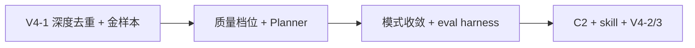

# Agent 优化路线图

**版本**: 2026-06-06  
**状态**: 📋 设计稿（待评审 → 分阶段实施）  
**定位**: 在 V3 编排收敛、V5 产品 pivot、RL1–RL12 运行逻辑修复之后，汇总 **Agent 层下一批高 ROI 优化**；不重复 [AGENT_ARCHITECTURE_V3.md](AGENT_ARCHITECTURE_V3.md) 已落地内容，不替代 [V4_MULTI_PHASE_SOLVE.md](../product/V4_MULTI_PHASE_SOLVE.md) 技术细则。  
**关联**: [RUNTIME_LOGIC_ISSUES.md](RUNTIME_LOGIC_ISSUES.md) · [V5_PRODUCT_PIVOT.md](../product/V5_PRODUCT_PIVOT.md) · [NEXT_VERSION_BACKLOG.md](../product/NEXT_VERSION_BACKLOG.md) · [IM_OCR_FIRST.md](../v2/IM_OCR_FIRST.md)（读题侧，与 Agent 正交）

---

## 1. 现状快照（2026-06-06）

### 1.1 已具备的能力

| 层 | 能力 | 位置 | 状态 |
|----|------|------|------|
| **编排 Core** | 三模式共享 `RunOrchestrator`、`compute_run_ok`、`complete_agent_run` | `orchestrator.py`, `run_result.py` | ✅ |
| **解题流水线** | V4 分阶段：先代码沙箱验证 → 再写报告 | `modules/solve_pipeline.py` | ✅ 默认 v4 |
| **注册表** | Planner catalog = ReAct tools 单源 | `registry.py` | ✅ |
| **质量** | `verify_answer`、`auto_remediate`（standard/deep 默认开） | `quality.py`, `orchestrator.py` | ✅ |
| **可观测** | `decision_log`、`run_summary`（done 事件） | `orchestrator.py` | ✅ |
| **运行逻辑** | SSE 假错误、done.ok、文档缓存、pipeline 子阶段等 | RL1–RL12 | ✅ |
| **产品边界** | Deliverable 主输出、内化验证、fill 降级 | V5 | ✅ |
| **读题 / 识图** | IM1–IM5：OCR、扫描 PDF、题图上传、Vision opt-in、O30 预览 | `image_read.py` 等 | ✅ 2026-06-06 |

### 1.2 主要剩余问题

| # | 问题 | 影响 |
|---|------|------|
| ~~G1~~ | ~~`deep_pipeline` 在 V4 已 verified 后仍跑 preflight/fix 环~~ | ✅ AO-1（2026-06-06）：V4 跳过 preflight/fix；reflect 仅改文字 |
| ~~G2~~ | ~~V4 金样本 10 题未落地~~ | ✅ AO-2：`tests/fixtures/solve_v4/` + `test_solve_pipeline_golden.py` |
| ~~G3~~ | ~~三种 `run_mode` 维护成本高~~ | ✅ AO-6（2026-06-06）：对外标准/深度；ReAct 实验隐藏 |
| ~~G4~~ | ~~`run_summary` 未持久化进 history~~ | ✅ AO-8（2026-06-06）：history 存 run_summary + pipeline_meta |
| ~~G5~~ | ~~Golden trace 测试未实现~~ | ✅ AO-8：`tests/test_run_modes_golden.py` |
| ~~G6~~ | ~~C2 行为学习代码在 `user_profile.py`，默认关、Planner 弱接入~~ | ✅ AO-9（2026-06-06） |
| ~~G7~~ | ~~读题短板~~ | ✅ IM 已落地；残余 UI-C 一图多题、DA 表格内图 |

### 1.3 非目标（本期不做）

- 引入 Cursor SDK / LangChain 等外部 Agent 框架  
- 恢复 `fill_report` 为主路径（与 V5 冲突）  
- CI 调真实 LLM（与现有金样本策略一致）  
- 无限自动重试直到成功  

---

## 2. 优化原则

1. **Policy 可简化，Core 已收敛** — 少维护第三条 ReAct 路径，多强化 standard + deep + V4 pipeline。  
2. **成功率优先于模式炫技** — 「聊天一次对」靠分阶段解题 + 金样本度量，不靠 ReAct 自由选题。  
3. **Harness 思维** — 离线 mock 回归 + `run_summary` 指标 +（远期）用户采纳率，而非凭感觉改 prompt。  
4. **与 V5 对齐** — 优化围绕 `LabDeliverable`、`code_status`、内化验证，不围绕代跑/代填 Word。  
5. **小步可回滚** — feature flag / 设置默认关 / 每步补 pytest。  

---

## 3. 优先级总览

| 优先级 | 主题 | 预期收益 | 预估 |
|--------|------|----------|------|
| ~~P0~~ | ~~V4-1 收尾：深度去重 + 金样本~~ | ✅ AO-P0 已落地（2026-06-06） | — |
| **P1** | 质量档位 + Planner 增强 + auto_remediate 策略化 | 降 token、计划更准 | 2～4 天 |
| ~~P2~~ | ~~run_mode 收敛 + eval harness~~ | ✅ AO-P2 已落地（2026-06-06） | — |
| **P3** | C2 行为学习 + skill promote + V4-2/3 | 长期进化 | 分批 |



**读题（IM1–IM5）** ✅ 已落地（2026-06-06）。**AO-P0～P3** ✅（2026-06-06）。后续：Keep rate 统计、UI-C 一图多题等 backlog。

---

## 4. P0 — 解题成功率（最优先）

### 4.1 AO-1：`deep_pipeline` 去掉与 V4 重复的修代码环 ✅

**状态**：2026-06-06 已落地 — `deep_pipeline.py`（`_run_preflight_fix_loop`、`_apply_revise_to_solve_data`）；`tests/test_deep_pipeline_v4.py`。

**动机**：[V4_MULTI_PHASE_SOLVE.md](../product/V4_MULTI_PHASE_SOLVE.md) §8 V4-1；`solve_pipeline` 已在 Phase 1 完成 sandbox + fix，但 `deep_pipeline.py` draft 后仍有 `preflight → fix_code` 循环（最多 `MAX_FIX_CODE_ROUNDS`）。

**目标行为**：

| 条件 | deep 模式 draft 后 |
|------|-------------------|
| V4 且 `solve_session.code_status == verified` | **跳过** preflight/fix，进入 reflect/revise（仅文字） |
| V4 且 `degraded` / `skipped` | reflect 可提示「代码未验证」，不强行 fix_code |
| v1 fallback | 保留现有 preflight/fix（兼容） |

**涉及文件**：

- `src/python/agent/deep_pipeline.py`  
- `tests/test_runtime_logic.py` 或新建 `tests/test_deep_pipeline_v4.py`  

**验收**：

- mock V4 verified → deep run 无 `fix_code_from_error` 调用  
- reflect/revise 仍对 `steps_analysis` / `summary` 生效  
- v1 flag 回归不变  

---

### 4.2 AO-2：金样本 10 题 + `code_status` 回归 ✅

**状态**：2026-06-06 已落地 — `tests/fixtures/solve_v4/`（`manifest.json` + 10 docx，`gen_fixtures.py` 生成）；`tests/test_solve_pipeline_golden.py`。

**动机**：V4 目标 G1 — 简单题首次 run 通过率 ≥80%；目前 `tests/fixtures/solve_v4/` 不存在，`run_golden_regression.py` 不测 solve。

**交付物**：

| 项 | 说明 |
|----|------|
| `tests/fixtures/solve_v4/` | 10 份 docx（见 V4 §9.1 题型表） |
| `tests/test_solve_pipeline_golden.py` | mock LLM 固定 JSON + **真跑** `run_code` / sandbox |
| 脚本或 pytest marker | 本地可选跑；CI 只跑 mock 部分 |

**断言示例**：

```python
assert session.code_status in ("verified", "skipped")  # 按 fixture 期望
assert "emoji" not in session.result_description.lower()  # fixture #10
```

**指标基线**（首次建立后写入本文档 §9）：

| 指标 | v1 估 | 目标 |
|------|-------|------|
| 首次 sandbox 通过率 | ~40% | ≥80% |
| 平均 LLM 次（简单 Java） | 1+2.5 fix | 3～4 |

---

## 5. P1 — 成本、计划与质量闭环

### 5.1 AO-3：解题质量档位（极速 / 标准 / 稳妥）

**动机**：V4-3；用户不必理解 `run_mode`，用档位控制 pipeline 深度。

| 档位 | `settings.solveQualityTier` | pipeline 行为 |
|------|----------------------------|---------------|
| 极速 | `fast` | 少 fix 轮、跳过 Phase 3 图表、可 skip_validation |
| 标准 | `standard` | 当前默认 |
| 稳妥 | `thorough` | 多 fix + regen_code、开图表阶段 |

**涉及**：`solve_pipeline.py`、`settings_schema.py`、设置页、`run_summary` 记录 `tier`。

---

### 5.2 AO-4：Planner「V4 感知」增强

**动机**：RL6 已去重 `run_code`；Planner 仍可更准。

| 规则 | 行为 |
|------|------|
| 纯理论（无代码关键词） | 计划仅 `solve_lab`，无 `run_code` / `render_uml` |
| V4 开启 | prompt 声明「solve_lab 已含内化验证」 |
| `skip_validation` 约束 | 不插入 `run_code` |
| `confidence: low` 步骤 | Step2 附一句 reason，不只靠未勾选 checkbox |

**涉及**：`planner.py`、`prompts.py`（plan prompt）、`tests/test_planner.py`。

---

### 5.3 AO-5：`auto_remediate` 策略化

**动机**：V3-3 已实现但一刀切；与 V5 deliverable 需对齐。

| 模式 | 建议默认 |
|------|----------|
| standard | `auto_remediate: true`（**2026-06-08 落地**；设置可关） |
| deep | `true`，但仅 remediate **文字字段**（verify scope → revise，不触发整题 solve_lab） |
| 已 `code_status=verified` | 禁止 auto_remediate 触发 `_run_solve_lab` |

**涉及**：`orchestrator.run_verify`、`executor_dirty.modules_to_rerun_from_verify`。

---

## 6. P2 — 架构简化与 eval harness

### 6.1 AO-6：对外收敛为 2 种 run_mode ✅

**状态**：2026-06-06 已落地 — 设置页仅展示标准/深度；`experimentalReactMode` 启用实验 ReAct；`app.js` / `compliance-ux.js`；API 保留 `run_mode=react`。

**动机**：[deepseek的建议.md](../reference/deepseek的建议.md) §4；三路径修一处漏一处。

| 用户可见 | 后端 | 行为 |
|----------|------|------|
| **标准**（默认） | `run_mode=standard` | Planner → Orchestrator → V4 |
| **深度** | `run_mode=deep` | understand + reflect/revise + 同上 tail |
| ReAct | 高级 / 实验 / 默认隐藏 | 或 AO-7 降级 |

**迁移**：设置页文案、文档、`app.js` 映射；保留 `react` API 兼容一个版本。

---

### 6.2 AO-7：ReAct →「Pipeline + finalize」 ✅

**状态**：2026-06-06 已落地 — `react_loop._bootstrap_solve_lab_pipeline` 首轮 V4 `solve_lab`；`react_finalize` 收尾；`tests/test_react_loop.py`。

**动机**：V4 §2.3 非目标中 ReAct 第一版可降级；16 轮 + 双解析成本高。

**目标**：

1. ReAct 首轮优先 `solve_lab`（V4 pipeline），而非自由跳模块  
2. `react_finalize` 补齐 UML / deliverable  
3. 保留 JSON 解析，逐步弃用 legacy THOUGHT/ACTION  

**涉及**：`react_loop.py`、`react_prompts.py`、`tests/test_react_loop.py`。

---

### 6.3 AO-8：轻量 eval harness

**动机**：Cursor harness 博客 — 离线评测 + 结构化指标驱动迭代。

| 能力 | 产出 | 状态 |
|------|------|------|
| Golden trace | `tests/test_run_modes_golden.py` — mock LLM，断言三模式模块序列快照 | ✅ 2026-06-06 |
| Run 指标持久化 | history 存 `run_summary` + `pipeline_meta` + `code_status` | ✅ 2026-06-06 |
| Keep rate（远期） | 用户复制/导出/revise 事件 → 本地统计 | backlog |

**`run_summary` 建议扩展字段**：

```json
{
  "mode": "standard",
  "solve_quality_tier": "standard",
  "pipeline_version": "v4",
  "code_status": "verified",
  "llm_calls": 4,
  "verify_pass": true,
  "auto_remediate_rounds": 0,
  "skills_fired": ["java-no-servlet"]
}
```

---

## 7. P3 — 进化与 V4 后续

### 7.1 AO-9：C2 行为学习接通 Planner

**代码起点**：`user_profile.py`（`optimize_plan_from_usage`、`BEHAVIOR_MIN_SAMPLES=3`）。

| 信号 | 动作 |
|------|------|
| 多次取消某 module | 下次 plan 该步 `default_checked: false` |
| `failure_modules` 累计 | Planner prompt 弱提示「上次 run_code 常失败」 |
| 约束 | 不自动**新增**步骤；设置页可关 |

**验收**：`tests/test_plan_feedback.py` mock 计数，不调 LLM。

---

### 7.2 AO-10：Skill 候选半自动 promote

**现状**：V3-4 已写 `skill_candidates.json`。

**下一步**：开发者/高级设置页浏览候选 → 一键写入 `skill_store` → 更新 [AI_INSIGHTS.md](../reference/AI_INSIGHTS.md)。

---

### 7.3 AO-11：V4-2 / V4-3 剩余项

| ID | 内容 | 文档 |
|----|------|------|
| V4-2 | Phase 3 `solve_diagrams`；ReAct 与 pipeline 收敛 | V4 §8 |
| V4-3 | 废弃 v1 `LAB_REPORT_USER` 主路径；`pipeline_meta` 进 history | V4 §8 |
| V4-3 | GitHub Actions CI 跑 pytest（无真实 LLM） | backlog §3 |

---

## 8. 输入侧（与 Agent 上限）

| 项 | 状态 | 文档 |
|----|------|------|
| IM 识图（OCR / 扫描 PDF / 题图 / Vision opt-in） | ✅ | [V2_IMAGE_INPUT.md](../v2/V2_IMAGE_INPUT.md) |
| O30 识题预览 | ✅ | Step2 UI-B |
| DA 表格模版 | ⏳ | [V2_DOC_TEMPLATE_ADAPTATION.md](../v2/V2_DOC_TEMPLATE_ADAPTATION.md) |
| UI-C 一图多题自动拆分 | 📝 backlog | `multi_question_in_image` warn |

---

## 9. 实施分期（建议顺序）

### Phase AO-P0（3～5 天）

- [x] AO-1 deep_pipeline V4 去重  
- [x] AO-2 金样本 fixtures + `test_solve_pipeline_golden.py`  
- [x] 记录首版通过率基线到本文档 §9.1  

### Phase AO-P1（2～4 天）

- [x] AO-3 质量档位  
- [x] AO-4 Planner V4 感知  
- [x] AO-5 auto_remediate 策略  

### Phase AO-P2（3～5 天）✅ 2026-06-06

- [x] AO-6 run_mode UI 收敛  
- [x] AO-7 ReAct 降级策略  
- [x] AO-8 golden trace + history `run_summary`  

### Phase AO-P3（分批）✅ 2026-06-06

- [x] AO-9 C2  
- [x] AO-10 skill promote UI  
- [x] AO-11 V4-2/3 + CI  

---

### 9.1 指标基线（AO-2 首跑 2026-06-06）

| 指标 | 基线日期 | 值 | 目标 |
|------|----------|-----|------|
| 金样本 sandbox 通过率 | 2026-06-06 | **9/9 = 100%**（verified 题型；mock LLM + 真 sandbox） | ≥80% |
| 金样本平均 llm_calls | 2026-06-06 | **2**（有代码题：solve_code + write_report_text） | ≤5 |
| ReAct 平均 llm_calls | — | — | 降 30%（AO-7 bootstrap 后待实测） |
| 模式金样本 module 序列 | 2026-06-06 | standard/deep/react 均为 `solve_lab→present_deliverable`（mock） | 回归锁定 |

本地复现：`pytest tests/test_solve_pipeline_golden.py -m golden_sandbox -s`（需 Java/Python/C/C++ 运行时）。
CI 默认：`pytest tests/test_solve_pipeline_golden.py`（mock LLM；无运行时则 verified 题降级断言 skipped）。

---

## 10. 测试策略

| 类型 | 文件 | 内容 |
|------|------|------|
| 运行逻辑 | `tests/test_runtime_logic.py` | 已有 RL 系列，继续扩展 |
| Pipeline | `tests/test_solve_pipeline.py` | mock LLM + sandbox |
| 金样本 | `tests/test_solve_pipeline_golden.py` | ✅ AO-2；`-m golden_sandbox` 可选真跑基线 |
| deep V4 去重 | `tests/test_deep_pipeline_v4.py` | ✅ AO-1 |
| 模式快照 | `tests/test_run_modes_golden.py` | ✅ AO-8 |
| Orchestrator | `tests/test_orchestrator.py` | progress 顺序 |
| auto_remediate | `tests/test_auto_remediate.py` | 已有 |
| 回归 | `tests/run_golden_regression.py` | parse 无 LLM |

**不做**：pytest 默认调用户 API Key。

---

## 11. 风险与对策

| 风险 | 对策 |
|------|------|
| deep 去重后 reflect 改坏已 verified 代码 | reflect scope 限制文字字段；不改 `code_files` |
| 金样本维护成本 | 10 题固定小集；大改 pipeline 才全跑 |
| 隐藏 ReAct 惹高级用户不满 | 设置页「实验：自主选题模式」 |
| 档位过多 | 仅三档，默认标准 |
| 与 IM OCR 分支冲突 | 不同模块，可并行开发 |

---

## 12. 给 Agent 的复制指令

### 做 P1（推荐新窗口首选）

```
在 lab-solver 按 docs/architecture/AGENT_OPTIMIZATION_PLAN.md 实施 AO-P1：
- AO-3：解题质量档位（fast/standard/thorough）— solve_pipeline、settings_schema、设置页、run_summary
- AO-4：Planner V4 感知 — planner.py、prompts.py、tests/test_planner.py
- AO-5：auto_remediate 策略化 — orchestrator.run_verify、executor_dirty
- AO-P0 已完成，勿重复 deep_pipeline / solve_v4 金样本
- 不改 ReAct / 不做 IM 识图
- 完成后更新本文档 §9 勾选与状态表
```

### ~~做 P0~~ ✅ 2026-06-06（deep 去重 + 金样本 10 题）

### 识图维护（主路径已完成）

```
IM1–IM5 已落地。仅 UI-C / O27 / DA 联动时改 image_read，回归 test_image_input.py。
```

---

## 13. 状态跟踪

| ID | 项 | 优先级 | 状态 |
|----|-----|--------|------|
| DOC | 本文档 | — | ✅ 2026-06-06 |
| AO-1 | deep_pipeline V4 去重 | P0 | ✅ 2026-06-06 |
| AO-2 | 金样本 10 题 | P0 | ✅ 2026-06-06 |
| AO-3 | 质量档位 | P1 | ✅ 2026-06-06 |
| AO-4 | Planner V4 感知 | P1 | ✅ 2026-06-06 |
| AO-5 | auto_remediate 策略 | P1 | ✅ 2026-06-06 |
| AO-6 | run_mode 收敛 | P2 | ✅ 2026-06-06 |
| AO-7 | ReAct 降级 | P2 | ✅ 2026-06-06 |
| AO-8 | eval harness | P2 | ✅ 2026-06-06 |
| AO-9 | C2 行为学习 | P3 | ✅ 2026-06-06 |
| AO-10 | skill promote | P3 | ✅ 2026-06-06 |
| AO-11 | V4-2/3 + CI | P3 | ✅ 2026-06-06 |

---

*文档版本：2026-06-06 · V3/RL 已落地后的 Agent 层优化路线图*
