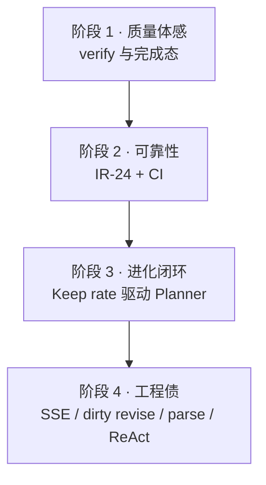
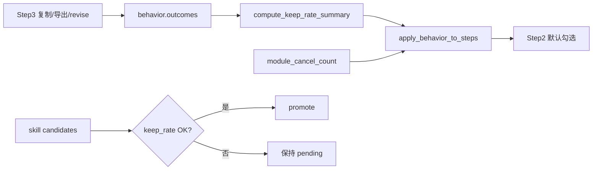

# Agent 后续补强路线图（分阶段）

**版本**: 2026-06-12  
**状态**: 📝 规划（待实施）  
**定位**: 在 IR-22 / LLM replan / C2 / Keep rate 采集 / IR-18 / IR-23 等 **§6 主线已落地** 之后，按 **用户体感 → 可靠性 → 数据闭环 → 工程债** 排列的下一阶段实施顺序。  
**关联**: [AGENT_CAPABILITY_GAPS.md](AGENT_CAPABILITY_GAPS.md) · [AGENT_IMPROVEMENT_RECOMMENDATIONS.md](AGENT_IMPROVEMENT_RECOMMENDATIONS.md) · [AGENT_OPTIMIZATION_PLAN.md](AGENT_OPTIMIZATION_PLAN.md) · [RUNTIME_LOGIC_ISSUES.md](RUNTIME_LOGIC_ISSUES.md)

---

## 1. 背景：已完成的基线

以下能力已在 2026-06-12 前后落地，**不必重复立项**：

| 能力 | 位置 | 状态 |
|------|------|------|
| Planner 声明式规则链 | `plan_rules.py` + `planner.py` | ✅ IR-22 |
| 失败 LLM replan（1 轮 + 规则 fallback） | `planner.replan_steps_with_llm` | ✅ |
| C2 行为学习默认开 | `settings_schema` v11、`user_profile.py` | ✅ |
| Keep rate 采集 | `behavior.outcomes`、`run_summary.keep_rate` | ✅ 采集 |
| 本地 run 指标聚合 | `run_metrics.py`、`GET /api/agent/run-metrics` | ✅ IR-25 初版 |
| fixture plan→run 矩阵 | `tests/test_agent_fixture_e2e.py` | ✅ IR-18 |
| verify dirty 表驱动 | `dirty_state.py` + golden | ✅ IR-23 |
| Skill 自动晋升 | `skill_store.auto_promote_ready_candidates` | ✅ |

**当前 Agent 脊梁**（保持优势、小步增强即可）：`RunOrchestrator` + V4 `solve_pipeline` + `verify/auto_remediate` + 模块注册表。

**剩余短板主题**：质量体感、崩溃恢复、Keep rate **驱动**优化、可观测对齐、工程债。

---

## 2. 总览



| 阶段 | 主题 | 用户可感知 | 侵入性 | 优先级 |
|------|------|------------|--------|--------|
| **1** | 质量体感 | ⭐⭐⭐ | 低 | **P0** |
| **2** | 可靠性 | ⭐⭐⭐ | 中 | **P0** |
| **3** | 进化闭环 | ⭐⭐（需积累） | 中 | **P1** |
| **4** | 工程债 | ⭐（开发/调试） | 低～高 | **P2** |

**若只能选一条线**：阶段 1 + 阶段 2.1（IR-24）。

---

## 3. 阶段 1 — 质量体感

**目标**：跑完后，用户一眼能判断「能不能交」，不再出现「绿完成 + 红校验」的困惑。

### 3.1 任务清单

| ID | 任务 | 说明 | 关键文件 |
|----|------|------|----------|
| **P1-1** | 完成态与 `verify_pass` 对齐或明示 | `done.ok` 与 `verify_pass` 解耦是 V5 刻意设计；产品层需在 Step3 **显式区分**「解题完成」与「校验通过」 | `run_result.py`、`orchestrator.py`、`app.js`、Step3 UI |
| **P1-2** | 校验未过时展示 remediation 摘要 | `auto_remediate` 用尽后：列出仍失败的 `checks`、建议操作（复制答案 / 手动 revise / 重跑单步） | `orchestrator.run_verify`、`app.js`、Step3 校验面板 |
| **P1-3** | `run_summary` 扩展质量字段 | 增加 `verify_pass`、`remediate_rounds`、`unresolved_checks[]` 供 UI 与导出 | `orchestrator.build_run_summary` |

### 3.2 设计原则

- **默认不修改** `compute_run_ok` 的 solve-only 语义（避免 fill_report 等实验模块误杀完成态），除非产品明确要「校验不过 = 未完成」。
- 推荐路径：**双状态展示** — `status: done` + `quality: passed | needs_review`。
- 与 [STANDARD_MODE_QUALITY.md](../design/STANDARD_MODE_QUALITY.md) 文案一致。

### 3.3 验收标准

- [ ] `verify_pass=false` 且 remediate 用尽时，Step3 **不出现**「全部完成」类误导文案
- [ ] 用户能看到未通过项列表与建议下一步
- [ ] `tests/test_runtime_logic.py` RL7 相关用例更新或补充 UI 契约测（可无 Electron，测 summary 字段）
- [ ] 现有 golden / phase2b 全绿

### 3.4 预估

约 **1～2 天**（以前端 + summary 为主，不动 solve 内核）。

---

## 4. 阶段 2 — 可靠性

**目标**：崩溃、杀进程、后端重启后，用户能恢复或理解上次运行状态。

### 4.1 任务清单

| ID | 任务 | 说明 | 关键文件 |
|----|------|------|----------|
| **P2-1** | **IR-24** 前端 run 恢复 | 消费 `run_events/{run_id}.jsonl`；检测 `orphaned`；提供「继续查看 / 丢弃」 | `run_event_store.py`、`server.py` API、`app.js` |
| **P2-2** | 历史 run 列表（轻量） | 侧栏或 Step4 展示近 N 次 run（模式、时间、verify、orphaned） | `run_metrics.py`、`app.js` |
| **P2-3** | GitHub Actions CI | `pytest` 全量（**无真实 LLM**）；可选 `verify_imports` | `.github/workflows/`、`pytest.ini` |

### 4.2 IR-24 行为规格（草案）

| 场景 | 期望行为 |
|------|----------|
| 正常结束 | jsonl 有 terminal 事件；可回放思考过程（已有 thought export 可复用） |
| 进程被杀 | 无 terminal → `orphaned`；启动时提示恢复 |
| 用户点恢复 | 读 jsonl 重建 progress / 校验结果 / deliverable（不要求续跑 LLM） |
| 用户点丢弃 | 标记已读或归档，不再提示 |

后端参考：`run_event_store.infer_run_status` → `"orphaned"`（见 `tests/test_runtime_logic.py`）。

### 4.3 验收标准

- [ ] 模拟 orphaned run 后，重启应用出现恢复入口
- [ ] 恢复后可看到最后一次 SSE 等价状态（至少 module 进度 + verify）
- [ ] CI 在 PR 上跑 pytest 通过（排除需真 LLM / sandbox 的 marker）
- [ ] 文档更新 IR-24 为 ✅

### 4.4 预估

- P2-1 + P2-2：**2～3 天**
- P2-3：**0.5～1 天**

---

## 5. 阶段 3 — 进化闭环

**目标**：从「能记、能统计」到「越用越贴手」；Keep rate 与 C2 行为 **驱动** Planner，而非仅写入 profile。

**前置**：阶段 1～2 稳定，避免把「跑不通」噪声当成用户偏好。

### 5.1 任务清单

| ID | 任务 | 说明 | 关键文件 |
|----|------|------|----------|
| **P3-1** | Keep rate 驱动 `apply_behavior_to_steps` | 高采纳章节 → 相关模块保持勾选；低采纳 / 频繁取消 → 降权 `default_checked` | `user_profile.py`、`planner.py` |
| **P3-2** | 降低或分桶 `BEHAVIOR_MIN_SAMPLES` | 全局 3 次门槛对新用户太慢；可按模块或 `module_cancel_count` 单独阈值（如 2 次取消即生效） | `user_profile.py` |
| **P3-3** | Skill promote 加 Keep rate 门槛 | `auto_promote_ready_candidates` 要求相关 error_category 修复后用户有复制/导出行为，避免错误模式固化 | `skill_store.py` |
| **P3-4** | 设置页说明 C2 / Keep rate | 告知用户本地学习范围与关闭方式（合规） | `index.html`、`app.js`、`compliance-ux.js` |

### 5.2 数据流（目标态）



### 5.3 验收标准

- [ ] 单测：`apply_behavior_to_steps` 在 mock outcomes 下改变 `default_checked`
- [ ] 单测：keep rate 不足时不 auto-promote skill
- [ ] `run_summary` 含 `behavior_applied: true/false` 便于调试
- [ ] 不调真实 LLM 的 pytest 全绿

### 5.4 预估

约 **2～4 天**。

---

## 6. 阶段 4 — 工程债（有余力再做）

**目标**：降低维护成本与调试摩擦；不抢主路径资源。

### 6.1 任务清单

| ID | 任务 | 说明 | 优先级 | 关键文件 |
|----|------|------|--------|----------|
| **P4-1** | SSE 与 V4 `on_phase` 对齐 | Agent progress 与 `solve_pipeline` 子阶段一致；见 IR 文档 §13.1 | 中 | `orchestrator.py`、`app.js`、`solve_pipeline.py` |
| **P4-2** | IR-23 深化：revise 路径迁入 `dirty_state` | verify 已表驱动；`mark_dirty_from_revise` / replan dirty 收敛 | 低 | `dirty_state.py`、`executor_dirty.py` |
| **P4-3** | **IR-26** `parse_documents` 阶段化 | 多文档 / mixed / training_table 解析拆阶段，与 IR-18 fixture 联动 | 低 | `parse_documents.py` |
| **P4-4** | ReAct 收工或冻结 | **二选一**：V3-3b function calling 全面替代 regex；或文档标「冻结维护、不扩 feature」 | 低 | `react_loop.py`、`AGENT_ARCHITECTURE_V3.md` |
| **P4-5** | IR-25 仪表盘（可选） | 设置页或调试面板展示 `aggregate_run_events` 汇总 | 低 | `app.js`、`run_metrics.py` |

### 6.2 验收标准

- 按子任务分别验收；阶段 4 **不阻塞** 阶段 1～3 发布。

---

## 7. 明确不做（与 V5 / V3 战略一致）

| 项 | 原因 |
|----|------|
| 扩 ReAct 为主模式 | 投入产出比差；标准/深度 + V4 已是主路径 |
| 多轮 LLM replan（>2 轮） | 先完成阶段 1～3，再评估成本与收益 |
| 大规模重构 `solve_pipeline` | 当前强项；除非金样本回归红灯 |
| 引入 LangChain / Cursor SDK 等外部 Agent 框架 | V3 非目标 |
| CI 调真实 LLM API | 成本与稳定性不可控 |

---

## 8. 与 backlog 条目对照

| 本路线图 | AGENT_IMPROVEMENT / CAPABILITY_GAPS | 阶段 |
|----------|-------------------------------------|------|
| P1-1～P1-3 | verify 不否决 ok · 质量最后一公里 | 1 |
| P2-1 | IR-24 前端 run 恢复 | 2 |
| P2-3 | CI pytest | 2 |
| P3-1～P3-3 | C2 / Keep rate 闭环 · AO §7 | 3 |
| P4-1 | SSE 子阶段不对齐 | 4 |
| P4-2 | IR-23 revise 路径 | 4 |
| P4-3 | IR-26 parse 阶段化 | 4 |
| P4-4 | ReAct V3-3b | 4 |

---

## 9. 给 AI 协作者的提问模板

### 阶段 1 — 质量体感

```
请只做 Agent 质量体感（阶段 1），范围：
- Step3：区分「解题完成」与「校验通过」；verify 未过时明确展示未通过项与建议
- 扩展 run_summary：verify_pass、remediate_rounds、unresolved_checks
- 默认不改 compute_run_ok 的 solve-only 语义
- 不碰 solve_pipeline、不扩 ReAct
- 验收：tests/test_runtime_logic.py 相关 + 现有 pytest 全绿
```

### 阶段 2 — IR-24

```
请实现 IR-24 前端 run 恢复，范围：
- 读取 run_events/{run_id}.jsonl，识别 orphaned
- 启动或 Step3 提供恢复/丢弃入口；恢复展示进度与 verify（不需续跑 LLM）
- 复用 run_event_store / get_run_events API
- 验收：tests/test_runtime_logic.py orphaned 相关 + 前端逻辑单测（如有）
```

### 阶段 3 — Keep rate 驱动

```
请接通 Keep rate → Planner 闭环（阶段 3），范围：
- apply_behavior_to_steps 消费 outcomes / keep_rate
- 可选降低 BEHAVIOR_MIN_SAMPLES 或按模块分桶
- skill auto-promote 增加 keep rate 门槛
- 不调真实 LLM；单测覆盖 behavior 权重变化
```

---

## 10. 修订记录

| 日期 | 说明 |
|------|------|
| 2026-06-12 | 初稿：§6 主线完成后，四阶段路线图（体感 → 可靠 → 进化 → 工程债） |

---

*实施时以本文档阶段顺序为准；单项技术细节仍见 [AGENT_IMPROVEMENT_RECOMMENDATIONS.md](AGENT_IMPROVEMENT_RECOMMENDATIONS.md) §13.5 与 [AGENT_CAPABILITY_GAPS.md](AGENT_CAPABILITY_GAPS.md)。*
