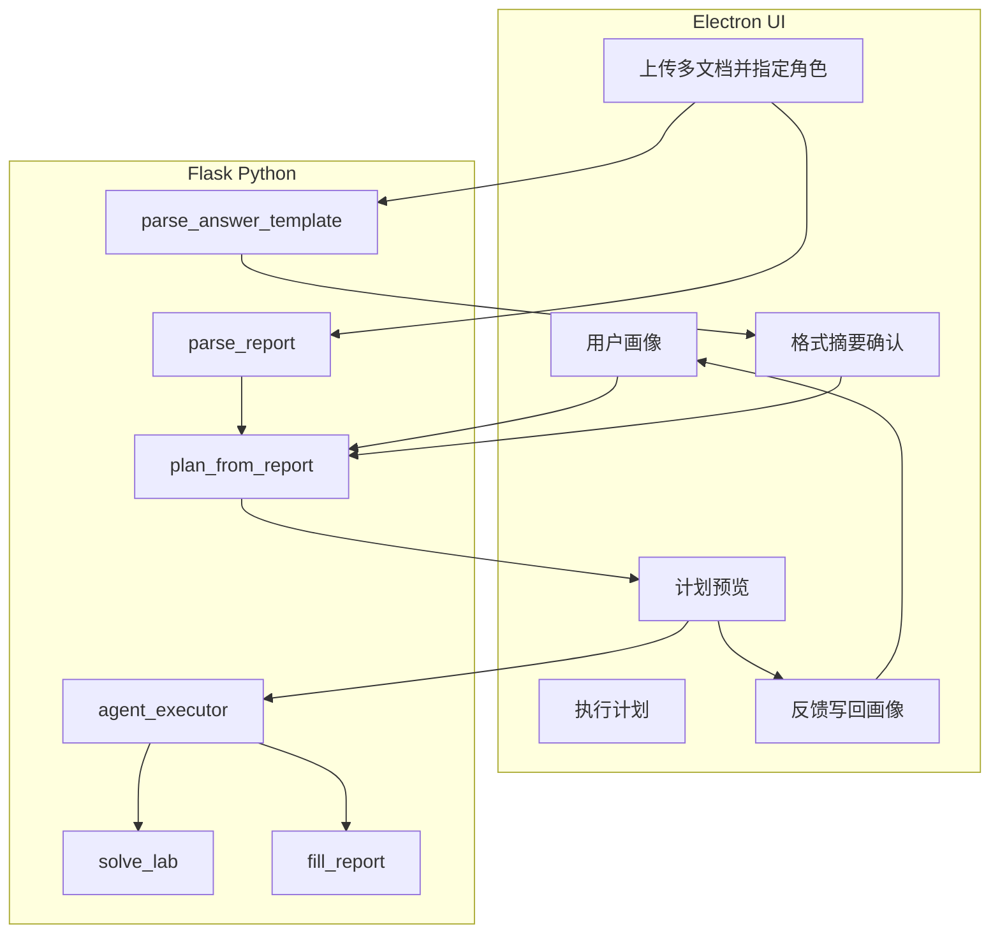
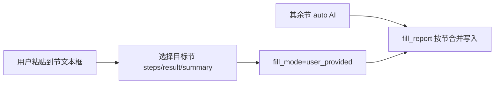
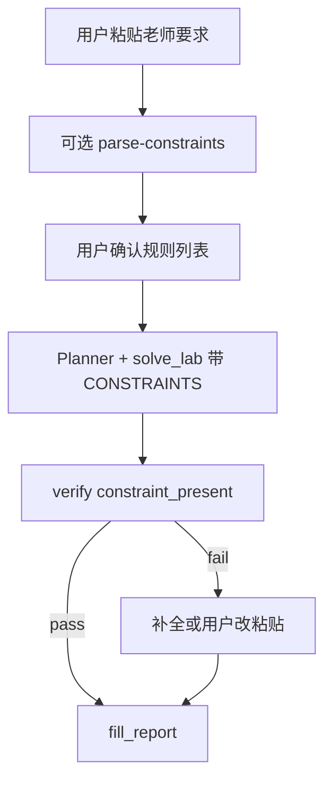
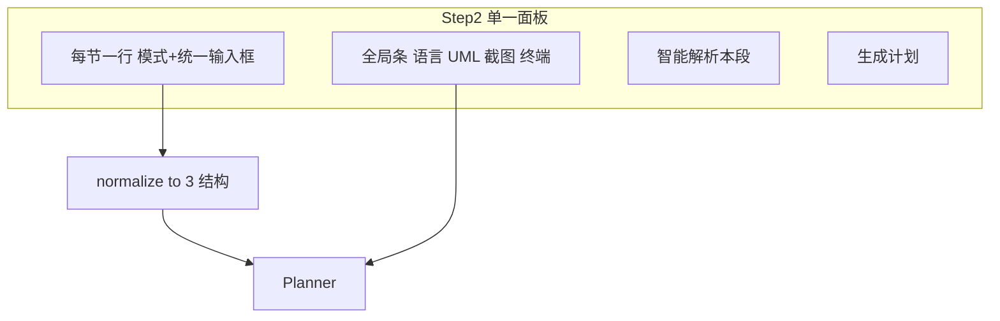
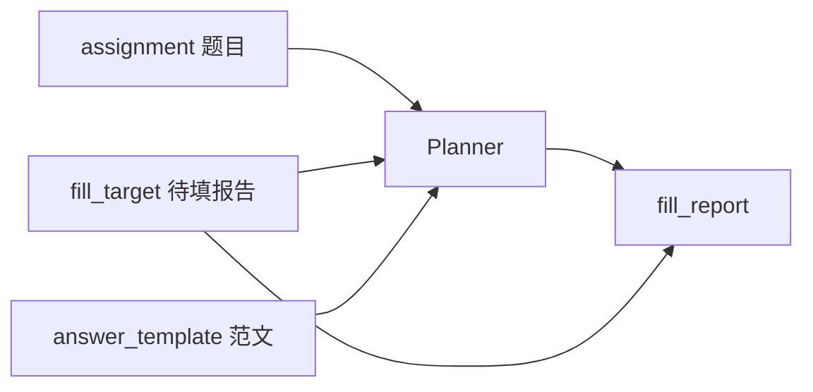
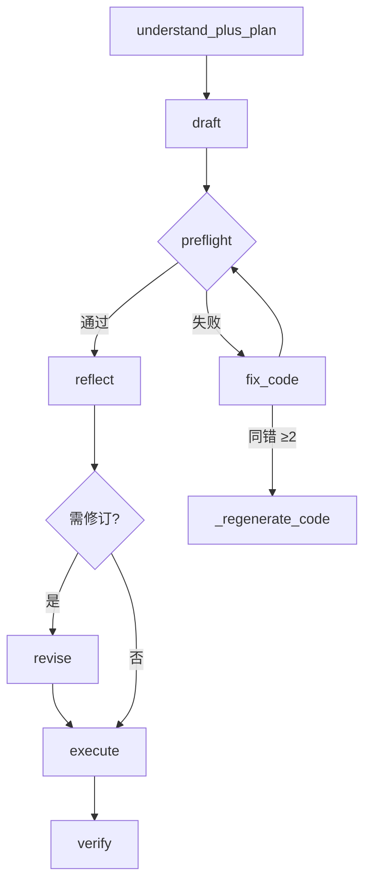
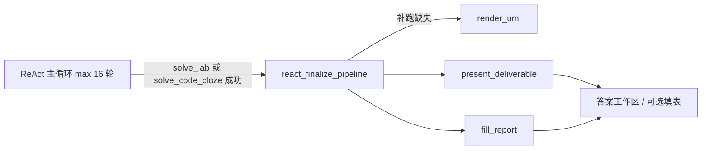
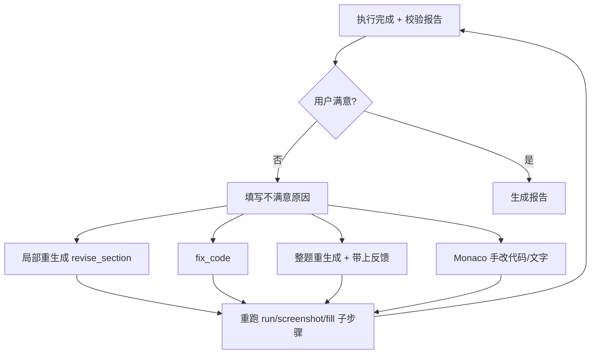

# Lab-Solver 模块化 Agent 改造计划

## 目标与约束

- **保留**：[main.js](C:/Users/21136/lab-solver/main.js) Electron 壳、[app.js](C:/Users/21136/lab-solver/src/renderer/app.js) 设置页中的 `provider` / `model` / `apiKey` / `customUrl`（`localStorage.settings`）。
- **不引入** Cursor SDK 或 Cursor API；所有 LLM 调用继续走现有多厂商 Chat Completions（含 Claude 专用路径）。
- **核心原则**：不把「上传 → 解题 → 验证 → 交付」写死；先把能力拆成**子模块**，由 AI 根据**报告全文**生成**步骤计划**，用户在桌面端**确认/勾选**后再执行。
- **画像原则**：用户画像用于**补全不确定项**与**默认参数**（语言、是否常要 UML），**不能**在报告无依据时单独新增步骤；报告原文仍是步骤是否存在的最高优先级。

> **文档变更（2026-06-06 · V5-5）**：**运行截图已移除**（`screenshot_ide` / `screenshot_terminal`、`ide_render.py`、`/api/tool/screenshot` 等）。下文若仍出现「截图 / IDE 截图」，除特别注明外均指**用户手动上传的结果图**或历史设计描述。运行结果由 `result_description` 文字 + 可选内化验证 `sample_stdout` 覆盖。
- **模版原则**：用户上传的**答题模版/范文**用于推断**答题格式、篇幅、代码/截图摆放习惯**；当作业报告表述模糊时，模版可提供 `format_evidence` 辅助 Planner 与 `solve_lab`，但**不能把模版里的章节要求当成本次作业硬性要求**（需与当前报告章节对齐校验）。
- **填表范围原则**：用户可指定**哪些节不由系统填写**；跳过节在 docx 中**原样保留**，且不为其生成内容、不插图、不参与 `fill_report` 覆盖。
- **用户注入原则**：用户可将**已有内容粘贴**给系统，并**指定写入哪一节**；该节走 `user_provided` 模式，**不调用 AI 生成该节正文**，`fill_report` 时按映射写入 docx。
- **教师约束原则**：老师提出的**特殊要求**（防伪字样、固定声明、页眉页脚、指定措辞等）由用户录入为 `**teacher_constraints`**，与正文内容分离；AI 生成与填表时必须遵守，并由 `verify_answer` 做字符串/位置校验。




---

## 现状要点（改造基础）


| 能力           | 现状位置                                    | 问题                                                                                                                 |
| ------------ | --------------------------------------- | ------------------------------------------------------------------------------------------------------------------ |
| 解析 Word      | `extract_docx` + `/api/parse-report`    | 仅 `.docx`；[main.js](C:/Users/21136/lab-solver/main.js) 文件过滤器无 pdf                                                  |
| PDF 实验报告     | 无                                       | 需单独方案（见 §3g）；**填回原 PDF 难度高**，首期以「能读、能出题」为主                                                                         |
| 单次解题         | `call_ai` + `/api/solve` + `LAB_PROMPT` | 一次 prompt，易截断；`call_ai` 内引用未传入的 `include_uml`（[server.py L235](C:/Users/21136/lab-solver/src/python/server.py)）需修复 |
| 运行/截图/UML/填充 | `/api/run-code` 等                       | 逻辑在 [server.py](C:/Users/21136/lab-solver/src/python/server.py) 约 1100+ 行，宜下沉为模块                                   |
| 前端流程         | `solveAll()` 固定调 `/api/solve`           | 无「计划预览」步骤                                                                                                          |


---

## 架构设计

### 1. 子模块注册表（`src/python/modules/`）

每个模块实现统一接口，例如：

```python
class ModuleResult(TypedDict):
    ok: bool
    data: dict
    logs: list[str]
    fingerprint: str
    sub_fingerprints: dict[str, str]  # 字段级，如 solve_lab 的 steps/result_description/code
    cacheable: bool

def run(ctx: AgentContext, params: dict) -> ModuleResult: ...
```

**AgentContext 审计**（DeepSeek 第二轮 #6）：`decision_log[]` — 每次 Planner/Executor/reflect/verify/preflight 做决定时追加（不调 LLM）：`{ timestamp, agent, decision, target, reason, evidence, fingerprint, overridden? }`；SSE `decision`；`history.decision_summary` 存精简版。

**Executor 复用（`dirty_modules` + 子指纹）**：

- `AgentContext` 维护 `module_results` 与 `dirty_modules: set[str]`（模块级）及可选 `dirty_fields: dict[module_id, set[str]]`。
- `revise_answer` scope 仅 `summary` 时：只脏 `solve_lab.summary` 子指纹；`steps`/`code` 子指纹未变 → 复用，`fill_report` 可只重写 summary 节。
- `should_rerun` 先比 `sub_fingerprints`，再比模块级 `dirty_modules`。
- §5c UI 快捷「仅重填/仅截图」保留；默认由 Executor 推导。

**首期模块**（从现有代码抽取，不新增业务能力）：


| module_id               | 职责                                   | 来源函数/路由                                                 |
| ----------------------- | ------------------------------------ | ------------------------------------------------------- |
| `parse_report`          | 解析报告元数据与全文（**docx + pdf**）           | `extract_docx` + 新建 `extract_pdf`；统一入口 `parse_document` |
| `solve_lab`             | 按 `LAB_PROMPT` 生成结构化 JSON（步骤/代码/总结等） | `call_ai` + `parse_lab_json`                            |
| `solve_theory`          | 非实验报告类段落解答                           | `call_ai` 非 `lab_report` 分支                             |
| `run_code`              | 编译运行并返回 stdout/stderr（高级 / 内化验证） | `execute_code`, `/api/run-code`                         |
| `fix_code`              | 将运行错误喂回 LLM 修代码（独立 prompt）           | 新建，复用 `llm_client`                                      |
| `render_uml`            | PlantUML 渲染                          | `render_diagrams`                                       |
| `present_deliverable`   | 汇编答案交付物（V5 默认终点）                  | `modules/deliverable.build_deliverable`                 |
| `fill_report`           | 写回 docx（高级/实验性）                       | `do_fill`                                               |
| `parse_answer_template` | 解析答题模版/范文，输出 `format_spec`           | 新建，复用 `extract_docx` + 规则 + 可选 LLM 摘要                   |
| `verify_answer`         | 规则校验 + difflib 范文相似度 warn                | 新建                                                      |
| `preflight`             | 代码/UML/JSON schema 预检（零 LLM）             | 新建；深度流 draft 后                                      |
| `revise_answer`         | 根据用户反馈局部或整题重生成                       | 新建，复用 `llm_client`                                      |


模块**只声明**自己需要什么输入（如 `ctx.code`, `ctx.parsed`, `ctx.format_spec`），**不假设**上游一定执行过哪些步骤。

**已舍弃（不实现）**：第三方软件 GUI 操控 / `automate_app` recipe 方案（见计划文末说明）。

### 2. LLM 客户端层（`src/python/llm_client.py`）

从 [server.py](C:/Users/21136/lab-solver/src/python/server.py) 抽出：

- `chat(...) -> ChatResult` — 统一 OpenAI 兼容与 Claude 分支；**所有模块只调此层**（DeepSeek 定稿项 #3）。
- `ChatResult`：`{ content, reasoning_content, phase, finish_reason, usage }`（`usage` 含 prompt/completion tokens，供 UI 预估与日志）。
- 修复 `include_uml`：作为 `chat` / `solve_lab` 的显式参数传入。
- **请求合并**（deep 标准路径）：`agent_understand_plan` 单次 prompt 输出 `{ understand, plan }` JSON（见 §5d）；`fine` 模式可拆成两次以利用户改理解后再 replan。

Planner 与 `solve_lab` / `fix_code` 均通过此层调用，**保证用户选的厂商与 Key 不变**。

**Prompt 集中管理**（`src/python/agent/prompts.py`，DeepSeek 第二轮 #9）：`PromptTemplate`（name、version、system、user_template、output_schema、changelog）；模块经 `PROMPTS["planner"].render(...)` 取词；`AgentContext.prompt_versions` 写入 `decision_log`；改 prompt 须更新 changelog + 跑金样本。

**输入预算**（`src/python/agent/prompt_budget.py`，DeepSeek 第二轮 #7）：`fit_budget(text, budget_tokens, preserve_sections, section_map)` — 按节标题优先级分配配额（步骤/结果 > 原理 > 封面），截断节标注 `[已截断]`；`estimate_tokens` 字符/3；**禁止**对全文硬 `[:2500]`。Phase 3+ 可按 `provider` 调系数与 15% 余量（#11 延后）。

### 3. 用户画像（`src/python/agent/user_profile.py` + 前端 `profile`）

**是否有利**：有利，且与「不能乱想步骤」不冲突——画像解决的是**报告没写清时怎么设默认**，以及**同一用户跨多次实验的稳定偏好**，而不是替报告编造要求。


| 画像来源                      | 内容示例                                                    | 对 Planner 的作用                                           |
| ------------------------- | ------------------------------------------------------- | ------------------------------------------------------- |
| **显式**（设置页/首次向导）          | 默认语言、专业方向、常做实验类型（编程/设计/理论）、偏好截图（IDE/终端）、是否默认 UML        | 报告未指明语言时默认 `solve_lab.params.language`；报告提到截图但未指明风格时用偏好 |
| **报告内**（已有 `metadata`）    | 课程名、实验名、专业、学号姓名                                         | 与显式画像合并；同名课程可关联「课程级」偏好                                  |
| **行为**（**Phase 3+**，首期不做） | `module_skip_count`、`revision_tags`、`course_hints` 自动学习 | 样本过少易误判；首期不写入 Planner prompt                            |
| **单次会话**（Step2 勾选）        | `includeCode`、`includeUml`、终端 profile                   | 写入当次 `plan` 的 `params`；首期**不**回写行为画像                    |


**存储**（本地 only，不上云）：

- `localStorage.userProfile` — 显式 + 聚合行为统计
- 继续复用 `localStorage.settings`（API、终端、截图 chrome）
- 文件路径：`%APPDATA%/lab-solver/profile.json`（可选镜像，便于 Python 侧读取与备份）

**画像 JSON 结构（v1，首期）** — 仅显式字段，覆盖约 90% Planner 差异化（DeepSeek #7）：

```json
{
  "default_language": "java",
  "screenshot_style": "ide",
  "prefer_uml": false
}
```

- 可选扩展（仍属 v1，非行为学习）：`major`、`experiment_bias` 来自设置页；`metadata` 课程名**当次**合并进 prompt，**不**自动写入 `course_hints`。
- **Phase 3+**：`course_hints`、`behavior.`*、`/api/agent/plan/feedback` 统计 → 弱提示可选模块。

**Planner 约束（写入 prompt）**：

1. 先列出**仅从报告原文**能证明必须的模块及 `evidence` 引文片段。
2. v1 画像只影响 **params 默认值**（语言、截图风格、`prefer_uml`），**不**因画像单独新增步骤。
3. Phase 3+ 再恢复 `source: profile` + `confidence` 可选步（low 默认不勾选）。

**计划确认后的反馈**：首期仅记录到 `history` 摘要；**不**更新 `behavior` 计数（推迟 Phase 3+）。

实现文件：[user_profile.py](C:/Users/21136/lab-solver/src/python/agent/user_profile.py)（merge、to_prompt_block；`apply_feedback` 为 Phase 3+）。

### 3b. 答题模版 → 格式画像（`src/python/agent/template_analyzer.py`）

**解决的问题**：用户作业报告表述差、要求含糊时，单靠 `full_text` Planner 难以推断「要写多细、代码放哪、结果节要不要图」。上传**模版**（老师空白模版、自己往期满分报告、同学范文）可反推**该用户/该课的答题习惯与格式期望**。

**支持的模版类型**（UI 文案区分，解析逻辑统一）：


| 类型              | 典型文件                     | 推断侧重                               |
| --------------- | ------------------------ | ---------------------------------- |
| `teacher_blank` | 带「三、实验步骤」「请在此填写」的空白 docx | 章节结构、占位符、必填节                       |
| `user_sample`   | 用户自己以前写过的完整报告            | 篇幅、语气、代码是否写入步骤节、截图数量               |
| `reference`     | 优秀作业/学长范文                | 同上，标注 `source: reference`，默认仅作格式参考 |


**分析流水线**（`parse_answer_template` 模块）：

1. **结构规则**（无 LLM）：节标题正则（`^三[、．]`）、表格行数、每节段落数、嵌入图片数量与所在节、代码块出现位置（步骤节 vs 附录）。
2. **对齐当前作业**（有作业报告时）：将模版节名与作业报告节名做映射（`section_map`），只把**两边都存在的节**的格式约束应用到本次任务。
3. **LLM 摘要**（一次短调用，用户 API Key）：输入模版节选 + 作业节选，输出 `format_spec` JSON（见下）；强调「只描述格式与习惯，不编造实验内容」。

`**format_spec` 结构（写入 `AgentContext`）**：

```json
{
  "template_type": "user_sample",
  "section_map": {
    "steps": { "title_pattern": "三、实验步骤", "style": "numbered_list_then_code", "avg_chars": 800, "code_in_section": true },
    "result": { "title_pattern": "四、实验结果", "requires_images": true, "image_count": 2, "avg_chars": 400 },
    "summary": { "title_pattern": "五、实验总结", "tone": "first_person_reflective", "avg_chars": 200 }
  },
  "writing_habits": {
    "verbosity": "medium",
    "uses_bullet_in_steps": false,
    "terminology_level": "undergraduate"
  },
  "fill_hints": {
    "preserve_tables": true,
    "image_after_result_text": true
  }
}
```

**与 Planner / 解题的分工**：


| 维度               | 作业报告 `full_text`                      | 模版 `format_spec`                                               |
| ---------------- | ------------------------------------- | -------------------------------------------------------------- |
| 要不要写代码/跑程序/截图    | **主证据**（`evidence`, `source: report`） | 仅当报告含糊且模版**一致体现**该习惯时，作 `format_evidence`，`confidence: medium` |
| 每节写多长、是否列表、语气    | 报告未说明时用模版                             | **主参考**（`source: template`）                                    |
| `solve_lab` 生成内容 | 实验要求来自报告                              | `LAB_PROMPT` 追加 `FORMAT_CONSTRAINTS` 块（来自 `format_spec`）       |
| `fill_report` 落位 | 现有 `_replace_section`                 | 按 `section_map` + `fill_hints` 控制插图顺序与段落密度                     |


**表达差用户的交互**（Step 1 增强）：

- 主上传：**本次作业报告**（必填）
- 次上传：**答题模版/范文**（可选，强烈建议文案引导）
- 解析后展示 **格式摘要卡片**（章节、习惯、与本次报告对齐情况）；用户可勾选「按模版格式作答」再生成计划
- 若仅上传模版、未上传作业：只保存到 `course_hints` 画像，不进入解题（避免搞错题目）

**持久化**：

- 当次会话：`AgentContext.format_spec`
- 跨次：将 `format_spec` 精简为 `userProfile.course_hints[course].format_spec`（同课程下次自动带上，可覆盖）

实现文件：[template_analyzer.py](C:/Users/21136/lab-solver/src/python/agent/template_analyzer.py)（`analyze_template`, `align_sections`, `to_format_constraints`）。

### 3c. 填表范围 / 跳过章节（`fill_scope`）

**场景**：封面个人信息、某节老师已写好、或用户打算手写「实验目的」「思考题」等——**不需要系统写入**。

**节 ID（与现有 [fill_lab](C:/Users/21136/lab-solver/src/python/server.py) 对齐）**：


| section_id      | 对应 Word 节       | 典型用户选择                   |
| --------------- | --------------- | ------------------------ |
| `cover`         | 封面表格（姓名/学号/日期等） | 默认 **不填**（`skip`）        |
| `steps`         | 三、实验步骤          | 常由系统填                    |
| `result`        | 四、实验结果（含插图位）    | 常由系统填                    |
| `summary`       | 五、实验总结          | 常由系统填                    |
| `images`        | 结果节内图片插入        | 可单独关闭（只填文字不插图）           |
| `code_in_steps` | 步骤节内是否嵌入源码      | 已有 `includeCode` 勾选，映射到此 |


**每节策略 `fill_mode`**：


| 模式              | 行为                                                   |
| --------------- | ---------------------------------------------------- |
| `auto`          | 生成内容并 `fill_report` 写入（默认）                           |
| `skip`          | **不读不写**：保留 docx 该节现有文字与排版，不调用 `_replace_section`    |
| `preserve`      | 若该节已有实质内容（解析时 ≥N 字），则不覆盖；空则按 `auto` 填                |
| `generate_only` | 仅生成到预览/Monaco，**不写入** docx（适合「我先看看再决定」）              |
| `user_provided` | 使用用户粘贴/上传的 `**user_content`** 写入指定节，**不**让 AI 生成该节文字 |


`**fill_scope` 结构（写入 `AgentContext`，随 `/api/agent/plan` 与 `/api/agent/run` 传递）**：

```json
{
  "sections": {
    "cover": "skip",
    "steps": "auto",
    "result": "user_provided",
    "summary": "auto",
    "images": "auto"
  },
  "code_in_steps": true,
  "user_content": {
    "result": {
      "text": "（用户从微信/文档复制的实验结果全文）",
      "images_b64": [],
      "code": ""
    }
  }
}
```

- `user_content` 仅在对应节为 `user_provided` 时必填；可只填 `text`，或同时带 `code`（写入步骤节时）/ `images_b64`（贴图进结果节）。

**自动推断（`parse_report` 扩展）** — 减少用户配置负担：

- 封面表格已有姓名/学号且非占位 → `cover: skip`
- 某节正文含「请自行填写」「学生独立完成」「（略）」→ 该节建议 `skip`
- 某节已有 >200 字实质内容 → 建议 `preserve`（UI 黄标「检测到已有内容」）

**与 Planner / 模块联动**：

- `solve_lab`：prompt 只要求生成 `fill_scope` 中为 `auto` / `preserve`（空时）/ `generate_only` 的字段；`skip` / `user_provided` 节不出现在 JSON 要求里（省 Token）。
- `run_code` / `screenshot_`*：若 `result` 为 `skip` 且 `images` 为 `skip`，计划里可不包含对应步；若 `result` 为 `user_provided` 且用户粘贴了 `code`，可选计划步「对用户代码运行+截图」供用户勾选（不强制）。
- `fill_report`：`fill_lab` 读 `ctx.fill_scope` + `ctx.user_content`；`skip` → `continue`；`user_provided` → 用 `user_content[section].text`（及图）走与 AI 相同的 `_replace_section` / 插图逻辑，**不读** `parsed` 里同节字段；`images` 为 `skip` 时不插入 AI 截图，但仍可插 `user_content` 里的图。合体单文件时 **仅在 `split_idx` 之后** 匹配节标题（§3h）。
- `verify_answer`：对 `skip` 节不校验；对 `user_provided` 仅校验「有内容、非空、无占位符」。

### 3d. 用户粘贴并指定落位（`user_content` + `user_provided`）

**场景**：用户已在别处写好「实验结果」或「总结」，复制到解题能手，指定填到 Word 的 **四、实验结果**（或其它节），其余节仍由 AI 填写。




**UI（逻辑见 §3f 统一输入框；以下为后端行为说明）**：


| 列    | 说明                                                   |
| ---- | ---------------------------------------------------- |
| 填写方式 | 下拉增加 **「使用我提供的内容」** → `user_provided`                |
| 内容   | 该行展开多行文本框（支持粘贴）；可选「从文件导入 .txt」                       |
| 附带代码 | 若目标为 `steps` 或需单独代码块，次要框粘贴代码（填入 `user_content.code`） |
| 附带图片 | 「选择图片」→ base64 进 `user_content.images_b64`（进结果节）     |


- **落位规则**：一节一行，**内容框绑定当前行 `section_id`**，避免填错节；标题显示「将填入：四、实验结果」。
- **混合模式**：例如 `steps=auto`、`result=user_provided`、`summary=auto` — 计划只生成步骤与总结，结果节用粘贴文。
- **与 preserve 区别**：`preserve` 用 **docx 里已有** 的字；`user_provided` 用 **粘贴板新内容** 覆盖该节（执行 `fill_report` 时写入）。
- **预览**：粘贴后可点「预览该节填入效果」（纯文本预览，不改 docx）。

**可选模块 `inject_user_section`**（执行计划中的一步，或在 `fill_report` 前合并）：

- 输入：`section_id`, `user_content[section_id]`
- 输出：写入 `ctx.answers[0].parsed` 对应字段（如 `result_description`）的 **副本** 仅用于预览与校验，并标记 `source: user`，供 UI 与 `fill_lab` 优先取用。

**API**：


| 路由                             | 作用                                            |
| ------------------------------ | --------------------------------------------- |
| `POST /api/agent/user-content` | 校验粘贴内容长度、节 ID 合法；返回预估填入位置说明（基于 `section_map`） |


**Planner**：见到某节 `user_provided` 时不安排 `solve_lab` 覆盖该字段；若用户粘贴含代码且勾选「为我的代码截图」，才加 `run_code` + `screenshot_`*（params 注明 `content_source: user`）。

**不满意修订**：`user_provided` 节允许用户**直接改粘贴框**后点「仅重新填充」→ 只跑 `fill_report`，不调 LLM。

**不满意修订**：`skip` 节禁用；`user_provided` 节在 §3f 同一输入框改完后「仅重新填充」。

实现：见 §3f `sections_config.normalize()` + `fill_scope.py` / `teacher_constraints.py`；模块 `inject_user_section`；扩展 `fill_lab`。

### 3e. 老师特殊要求 / 防伪与合规（`teacher_constraints`）

**与 `user_content` 的区别**：


|     | `user_content`    | `teacher_constraints`      |
| --- | ----------------- | -------------------------- |
| 性质  | **完整段落正文**（用户已写好） | **规则/必须出现的字句**（老师规定）       |
| 谁写  | 用户粘贴定稿            | 通常由 AI **嵌入**到生成或填充结果中     |
| 示例  | 一整段实验结果描述         | 「第五节末尾加：防伪标识 CS2024-学号后四位」 |


**用户交互**：已并入 §3f 每节「统一输入框」+ 可选顶部「老师总体要求」；`parse-section-brief` 拆出 rules；结构化细项在解析预览里可编辑。课程记忆、模版采纳不变。

`**teacher_constraints` JSON（进入 `AgentContext`，随 plan/run 传递）**：

```json
{
  "raw_note": "老师原话粘贴备份",
  "rules": [
    {
      "id": "anti_fake_1",
      "text": "防伪标识：CS2024",
      "section": "summary",
      "position": "end",
      "exact": true,
      "source": "user"
    },
    {
      "id": "declare_1",
      "text": "本实验由本人独立完成",
      "section": "summary",
      "position": "end",
      "exact": true,
      "source": "user"
    }
  ]
}
```

**告诉 AI 的方式（统一约束块 `TEACHER_CONSTRAINTS`）**：

- `**planner` prompt**：约束**不新增**无报告依据的模块；但若规则要求某节出现固定句，须保证计划含 `solve_lab` 或 `fill_report` 覆盖该节（`user_provided` 节则由用户在粘贴框自行包含，系统校验即可）。
- `**solve_lab` prompt**：在 `LAB_PROMPT` 后追加：
  - 必须遵守的逐条规则；
  - 指定节必须在首/末包含的原文字符串（`exact: true` 时禁止改写、同音替换）。
- `**fill_report` / `fill_lab`**：生成后若校验缺字，**兜底追加**到对应节末（仅 `exact` 规则，避免破坏用户 `user_provided` 语义时可配置为只 warn 不自动追加）。

**校验（并入 `verify_answer`）**：


| 检查                    | 说明                                                           |
| --------------------- | ------------------------------------------------------------ |
| `constraint_present`  | 每条 `rules[].text` 在对应节生成稿或 `user_content` 中出现（`exact` 用包含匹配） |
| `constraint_position` | 首期：`end` 判断为「该节文本末尾 200 字内」；不满足 → **fail**，UI 显示缺哪条          |


**UI 反馈**：计划预览只读要求摘要；改回 §3f 分节框。校验失败 → 「按老师要求补全」。




**API**：


| 路由                                    | 作用                                      |
| ------------------------------------- | --------------------------------------- |
| `POST /api/agent/parse-section-brief` | 统一框文本 → `{ body_text?, rules[] }` 草案供确认 |
| （复用）`POST /api/agent/plan` / `run`    | body 优先 `sections_config`               |


**与 `fill_scope` 组合示例**：

- `summary=user_provided`（用户自己写总结）+ 规则「末行必须有防伪码」→ 只校验用户粘贴是否含该句，不含则提示用户补上，**不**用 AI 覆盖全文。
- `summary=auto` + 同上规则 → AI 写总结且 **末行原样嵌入** 防伪句。

实现：`src/python/agent/teacher_constraints.py`（`parse_natural_language`, `to_prompt_block`, `verify_rules`, `append_missing_to_section`）。

### 3f. UX 整合：「分节工作台」`sections_config`（推荐首期 UI）

**问题**：`填写范围`、`老师特殊要求`、`粘贴落位`、解题前语言/截图勾选分散在 Step 2 多块区域，用户重复选节、重复粘贴。

**方案**：Step 2 只保留 **一个主面板「分节设置」** + 顶部 **全局条**；后端仍拆为 `fill_scope` / `user_content` / `teacher_constraints`（便于模块实现），由 `sections_config.normalize()` 统一转换。




#### 全局条（原 `solve-config-bar` 合并到此面板顶部，不再散落）


| 项                                      | 说明                           |
| -------------------------------------- | ---------------------------- |
| 编程语言                                   | 原 `solveLang`，默认 AI 节        |
| 截图窗口 / 终端                              | 原 Step2 截图、终端采集              |
| 生成 UML / 源码写入步骤                        | 原 `includeUml`、`includeCode` |
| 适用：`images`、`code_in_steps` 全局默认，节级可覆盖 |                              |


#### 每节一行（核心整合）


| 列         | 控件                                                                  |
| --------- | ------------------------------------------------------------------- |
| 节名        | 三、四、五、封面 + 文档现状（空/已有 N 字）                                           |
| **怎么处理**  | 单下拉：`AI 填写` / `用我的内容` / `不填` / `有内容不覆盖` / `只生成不写入` → 映射 `fill_mode` |
| **统一输入框** | 一节 **一个** 多行文本框（见下）                                                 |
| 附件        | 折叠：代码、图片（仅 `用我的内容` 或 `AI 填写` 且需截图时显示）                               |


**统一输入框 — 同时承载「粘贴正文」与「老师要求」**（用户不必选两个框）：

- **占位提示**：「可粘贴本节全文；也可写老师要求（如：末尾必须有防伪标识 CS2024）；可混写，点『智能解析』自动拆分。」
- **智能解析**（**仅用户点击**，`POST /api/agent/parse-section-brief`；DeepSeek 第二轮 #2 方案 A）：
  - **不做**纯规则 normalize（中文混写误判率高，如「老师说要加防伪码」被当正文）。
  - 一次**轻量 LLM 分类**（`max_tokens≈200`，约 Planner 成本的 1/20）：输出 `{ types, user_content?, constraints[], note? }` — **只分类，不生成正文**。
  - 结果 **行内可编辑**（删改每条 constraint / 切换 fill_mode），确认后才写入 `sections_config`。
  - 未点解析时：用户输入原样存为 `raw_note`，Planner 仍可读；不自动调 LLM。
- **模式与框联动**：
  - `不填` → 输入框禁用（可只读展示老师要求备查）
  - `AI 填写` → 框内仅填**要求/备注**（无长正文时）；长正文若存在则提示「是否改为用我的内容」
  - `用我的内容` → 框内正文必填；要求可在同框或解析出的 rules 中

**全局老师通知**（可选）：面板最上方 **一条** 总输入框「老师总体要求（跨多节）」→ 解析后按节拆分进各节 rules 或 `raw_note`，**不再**单独「老师特殊要求」卡片。

#### 其它可合并项


| 原分散功能                                   | 整合方式                                                  |
| --------------------------------------- | ----------------------------------------------------- |
| 答题模版格式摘要                                | 各节行尾 **标签**「模版建议：结果节约 400 字、需配图」（来自 `format_spec`，只读） |
| 计划预览里的要求摘要                              | 由 `sections_config` **自动生成**，只读；改要求回到分节输入框            |
| `parse-constraints` + `user-content` 校验 | 合并为 `**parse-section-brief`**（一节或全局）                  |
| Step 3 不满意修订                            | 复用 **同一分节输入框** 编辑后「仅重填/局部重写」                          |
| 设置页「我的画像」                               | 保留；仅 **默认值**（默认语言、默认 `fill_mode`），与分节面板「恢复默认」联动       |


#### `sections_config`（前端提交，后端 normalize）

```json
{
  "global": { "language": "java", "include_uml": false, "include_code": true, "screenshot_style": "ide" },
  "sections": [
    {
      "id": "result",
      "mode": "user_provided",
      "input": "（用户在同一框内粘贴的实验结果全文）\n\n必须包含：防伪标识 CS2024",
      "attachments": { "images_b64": [] }
    },
    {
      "id": "summary",
      "mode": "auto",
      "input": "末尾必须有：本实验由本人独立完成",
      "attachments": {}
    }
  ]
}
```

`normalize(sections_config)` → `{ fill_scope, user_content, teacher_constraints }` 供现有 Agent 模块消费（§3c–3e 逻辑不变）。

#### API 调整（合并）


| 原路由                                  | 整合后                                                               |
| ------------------------------------ | ----------------------------------------------------------------- |
| `parse-constraints` + `user-content` | `**POST /api/agent/parse-section-brief**`（`section_id?`, `input`） |
| plan/run body 三套字段                   | 优先收 `**sections_config**`；兼容旧字段过渡期可保留                             |


**§3c–3e UI 描述**：以本节为准；实现时 **不单独做**「填写范围」「老师特殊要求」两张卡片。

### 3g. PDF 实验报告支持（分阶段）

**现状**：全流程依赖 [python-docx](C:/Users/21136/lab-solver/requirements.txt) 与 `fill_lab`；PDF 无法直接按节替换段落。

**原则**：**读 PDF** 与 **写回 PDF** 分开交付；Agent / 分节工作台 / 校验逻辑与格式无关，共用 `full_text` + `metadata`。

#### 阶段 P1 — 能上传、能解析、能解题（建议跟在 Phase 2 后）


| 项    | 方案                                                                                                    |
| ---- | ----------------------------------------------------------------------------------------------------- |
| 依赖   | `pymupdf`（`fitz`）或 `pdfplumber` 抽文本；写入 [requirements.txt](C:/Users/21136/lab-solver/requirements.txt) |
| 模块   | `src/python/document/extract_pdf.py`：`extract_pdf(path) -> (full_text, metadata, hints)`              |
| 统一入口 | `parse_document(path)` 按扩展名分支；`/api/parse-report` 接受 `file_name` 为 `.pdf`                             |
| 元数据  | 首页文本正则抽课程/实验名（与 docx 封面逻辑类似）；`metadata.source_format = "pdf"`                                         |
| 节标题  | 用正则识别 `三、` `四、` 等（与 docx 一致），供 `section_map` / 分节工作台                                                  |
| UI   | Step 1 文案改为「支持 .docx / .pdf」；[main.js](C:/Users/21136/lab-solver/main.js) 过滤器增加 `pdf`                 |
| 限制提示 | 扫描版 PDF（无文字层）抽不到字 → 检测 `len(text)<阈值` 时提示「疑似扫描件，请换 Word 或 OCR（后续）」                                    |


**Planner / solve / 截图 / 校验**：与 docx 完全相同，不区分格式。

#### 阶段 P2 — 能导出作业（填表策略，用户需知情）

PDF **难以**像 Word 一样按节精确回填（版式、字体、分页不可控）。首期产品策略 **三选一**（UI 在检测到 PDF 时展示）：


| 策略                    | 说明                                                                      | 推荐           |
| --------------------- | ----------------------------------------------------------------------- | ------------ |
| **A. 导出 Word**（默认）    | 用 `fill_report` 生成 **新 `.docx`**（结构按解析出的节标题重建，或用户提供空白 docx 模版）          | 默认           |
| **B. 配对 Word 填表**     | 用户上传 **PDF 作业说明** + **同实验的 .docx 空白模版**；解析用 PDF 或 docx 均可，**填充只写 docx** | 有 docx 模版时最佳 |
| **C. 可填写 PDF 表单**（后续） | 检测 AcroForm 字段后按名写入；仅少数学校模版适用                                           | Phase 3+     |


`**AgentContext` 扩展**：

```json
{
  "source_format": "pdf",
  "fill_target": { "format": "docx", "path": "...", "from": "generated|user_template" }
}
```

- `fill_report` 模块：若 `source_format=pdf` 且未提供 `fill_target.docx`，执行计划末尾 **自动** 走「生成已完成 docx」步，而非尝试写 PDF。
- 保存对话框：PDF 源文件时默认建议 `实验报告_已完成.docx`，并说明「原版式 PDF 填回开发中」。

#### 阶段 P3 — 扫描件 OCR（可选，不阻塞 P1）

- 无文字层时调用 OCR（`pytesseract` + 本地引擎或用户配置 API）；成本高、误差大，放 **设置开关**。
- OCR 结果同样进 `full_text`，UI 标「OCR 识别，请核对」。

#### 与模版 / 分节工作台

- **答题模版**若为 pdf：同样 `extract_pdf` → `format_spec`（规则抽取，精度低于 docx）。
- 分节工作台、老师要求、粘贴：**与格式无关**，不变。

#### 风险


| 风险           | 对策                                                                                      |
| ------------ | --------------------------------------------------------------------------------------- |
| 双栏 PDF 抽文顺序乱 | pymupdf 按块排序 + 简单栏检测；warn                                                               |
| 用户以为会交回 PDF  | **上传时确认对话框**（DeepSeek #10）：「无法直接编辑 PDF，将生成 .docx，是否继续？」；`fill_target` 旁显示 `导出格式: .docx` |
| 打包体积增大       | PyMuPDF wheel 纳入 `python-dist` 构建验证                                                     |


**不在首期**：原位覆盖 PDF 正文、PDF 内嵌图精确替换、LaTeX PDF 公式还原。

### 3h. 多文档上传（题目 + 答题 / 任意多文件）

**典型场景**：


| 用户手里的文件                 | 建议角色 `doc_role`   | 系统用途                                    |
| ----------------------- | ----------------- | --------------------------------------- |
| 老师发的实验**题目/要求**（无空白三四五） | `assignment`      | Planner **主证据**：做什么、要不要代码/截图/UML        |
| **超星 / 慕课等平台作业页复制文字**（无独立题目文件） | `assignment`      | 同上；Step 1 默认 **「粘贴题目」** 内联文本框加入清单（`text_content`），**无需上传任何文件** |
| 空白或半空白**实验报告**（要交的那份）   | `fill_target`     | **填表对象**；`section_map`、preserve/skip 检测 |
| **答题模版 / 范文**（格式参考）     | `answer_template` | → `format_spec`、模版约束建议                  |
| 参考资料、数据说明等（可选）          | `reference`       | 补充上下文，进 prompt 附录，**不**直接覆盖 fill_target |


**硬规则**：

- **默认主路径（`output_mode=deliverable`）**：可 **仅** 上传/粘贴 `assignment`（`layout=assignment_only`），**不必** 有 `fill_target`；答案在 Step 3 工作区复制。
- **填表路径（`fill_original` / `new_document`）**：必须有 **且仅有 1 个** `fill_target`（否则无法 `fill_report`）；可另挂 0~N 个其它角色。
- 若用户只传 1 个文件：自动猜角色（见下）；猜错可在列表里改下拉。
- **冲突**：`assignment` 与 `fill_target` 对同一要求说法不一 → **以 `assignment` 为准** 定「做不做」；**以 `fill_target`** 定「填哪一节、版式」。

**自动猜角色（`guess_doc_role`，可覆盖）**：

- 含「三、实验步骤」等节标题 + 大量占位/空白 → `fill_target`
- 篇幅短、题号/「实验目的」「要求」为主、少见三四五 → `assignment`
- 三四五齐全且各节有完整正文、像满分作业 → `answer_template`（UI 提示「似范文，确认是否当作模版」）
- 无法判断 → 默认 `fill_target`，其它槽位提示用户补传题目

`**documents[]`（前端 → `/api/parse-report` 或 `/api/agent/plan`）**：

文件上传（`file_data` base64）与 **粘贴文字**（`text_content` 明文，二选一）：

```json
{
  "documents": [
    { "id": "d1", "role": "assignment", "file_name": "实验一-题目.pdf", "file_data": "..." },
    { "id": "d2", "role": "fill_target", "file_name": "实验报告空白.docx", "file_data": "..." },
    { "id": "d3", "role": "answer_template", "file_name": "学长范文.docx", "file_data": "..." },
    { "id": "d4", "role": "assignment", "file_name": "粘贴的题目.txt", "text_content": "实验项目二：创建型设计模式实验…" }
  ]
}
```

- `text_content` 由 `parse_inline_text()` 解析，`metadata.source_format = "text"`，`file_path` 为空。
- 粘贴项默认角色 `assignment`；也可选 `reference`。不支持作为 `fill_target`（待填报告须为可填写的 docx/pdf 文件）。

**解析后合并进 `AgentContext`**（模块 `parse_documents`）：

```json
{
  "documents": [ { "id", "role", "format", "metadata", "full_text", "section_hints" } ],
  "assignment_text": "题目全文拼接",
  "fill_target": { "id": "d2", "path_ref", "metadata", "full_text", "source_format": "docx" },
  "format_spec": "来自 answer_template",
  "planner_input_text": "【实验要求】…【待填报告结构】…"
}
```

- `planner_input_text` 结构化拼接，Prompt 写明：**步骤是否存在**看【实验要求】；**填哪一节**看【待填报告】结构。
- `solve_lab`：实验内容以 `assignment_text` 为主；`format_spec` / `sections_config` 管格式。
- `fill_report`：只写 `fill_target` 对应文件；PDF 源见 §3g。




#### Step 1 UI —「文档清单」（取代「一个必填 + 一个可选」）

- **左栏双模式**（2026-06-08，默认「粘贴题目」）：
  - **粘贴题目**：`#uploadPasteText` 内联文本框 →「添加到清单」（`Ctrl+Enter`）；默认角色 `assignment`；**仅文字即可点「解析并继续」**，无需 docx。
  - **上传文件**：拖拽/多选 docx/pdf；role chip 提示四种角色。
- **文档清单**（右栏）：每行 文件名 | **角色下拉** | 删除；粘贴项显示「粘贴：…」与字数；解析后显示角色 badge。
- **校验**：`fill_target` >1 时红字提示只能一份；无 `fill_target` 时 **禁用「填回原文档」** 输出方式，**不** 阻塞 deliverable 主路径的计划与执行。
- **快捷**：「我有题目 + 空白报告」→ 粘贴作业说明 + 上传空白 docx（可切「上传文件」）；第三行可选模版。
- 与 §3g：题目可为 pdf、粘贴文字、待填可为 docx，角色与扩展名无关。

#### API


| 路由                       | 变化                                                       |
| ------------------------ | -------------------------------------------------------- |
| `POST /api/parse-report` | body 为 `documents[]`（每项 `file_data` 或 `text_content` 二选一）；兼容旧版单 `file_data` 视为 `fill_target`；**`assignment_only` 时响应 `fill_target: null`**，`split_at_heading` 为空（BF44：不可对 `fill_target` 直接 `.get`） |
| `POST /api/agent/plan`   | 携带解析后的 `documents` 摘要；有 `fill_target` 时带 `fill_target.id`                 |


#### 单文件合体：题目 + 待填在同一份 docx（常见校内模版）

很多学校模版 **前半是实验目的/要求/原理，后半才是「三、实验步骤」起待填区**。只传 1 个文件时走 `**combined` 模式**，虚拟拆成题目区 + 填表区，**仍只产生 1 个 `fill_target` 文件引用**（物理上不拆文件）。

**检测 `doc_layout: combined | fill_only | assignment_only`**（`parse_documents` 内 `detect_combined_layout`）：


| 信号                                                             | 判定                                           |
| -------------------------------------------------------------- | -------------------------------------------- |
| 全文出现 `三、` / `三.` / `3.` +「实验步骤」等 **且** 该标题之前有 ≥200 字（目的、原理、要求） | `combined`                                   |
| 仅有三四五结构、前面很短                                                   | `fill_only`                                  |
| 无三四五、整篇像题面/说明书                                                 | `assignment_only`（UI 提示需另传待填报告或选「导出为新 docx」） |


**拆分规则（`split_combined_docx(full_text, paragraphs[])`）**：

1. 找 **第一个** 匹配 `SECTION_HEADER_PATTERNS.steps`（与 [fill_lab](C:/Users/21136/lab-solver/src/python/server.py) 一致）的段落索引 `split_idx`。
2. `assignment_text` = 拼接 `[0, split_idx)` 段落（含封面表格元数据，元数据仍进 `metadata`）。
3. `fill_target_body` = 拼接 `[split_idx, end)` — 作为 `fill_target.full_text` 用于节检测、preserve、填表定位。
4. 若找不到 `split_idx`：降级 `fill_only`，`assignment_text` = 全文（与旧版等价）。

`**documents[]` 表示（合体单文件）**：

```json
{
  "documents": [
    {
      "id": "d0",
      "role": "fill_target",
      "layout": "combined",
      "file_name": "实验一完整模版.docx",
      "split_at_heading": "三、实验步骤",
      "assignment_excerpt_len": 1200,
      "fill_body_len": 800
    }
  ]
}
```

- `fill_report` 仍对 **同一 docx 文件** 按节替换；`_replace_section` 只在 `fill_target_body` 对应段落范围内匹配节标题（避免改到「实验目的」里的「三、」误匹配——用段落索引边界约束）。
- `planner_input_text` = `【实验要求】` + assignment_text + `\n【待填报告（从「三、实验步骤」起）】` + fill_target_body。

**UI（只传 1 个文件时）**：

- 解析后若 `layout=combined`，展示 **拆分预览条**：
  - 「检测到题目 + 报告合体」
  - 可折叠预览：题目区前 200 字 / 待填区前 200 字
  - **拆分点**下拉：自动识别的标题，允许用户改选（如老师用「三、实验内容」）→ 重算 `split_idx`
- 用户可强制改为「整份都是待填报告」（忽略前半当题目）— 覆盖 `layout=fill_only`。

**与多文件并存**：

- 已传 `assignment` + `fill_target` 两个文件 → **不**再做合体拆分。
- 只传 1 个文件且 `combined` → 不要求再传题目。
- 只传 1 个 `answer_template` 范文 + 1 个 `combined` 合体模版 → 三者角色齐全。

**不在首期**：按页码拆分、OCR 合体 pdf 自动分栏、一份文件拆成两个物理 docx 下载。

#### 其它单文件兼容

- `fill_only` 单文件：`assignment_text` 可为空或取封面+前言短段；Planner 主要从待填区 + 用户分节工作台理解要求。
- 旧 API 单 `file_data` → `documents:[{ role: fill_target, layout: auto_detect }]`。

**不在首期**：3 个以上文档的智能去重合并、版本diff、多 fill_target 批量批改。

### 4. 计划器（`src/python/agent/planner.py`）

**输入**：`**planner_input_text`**（或 `assignment_text` + `fill_target.full_text`）+ `**fill_target.metadata**` + `**user_profile**` + `**format_spec**` + `**sections_config**` + 模块目录；多文档时 `reference` 节选附录

**输出**（严格 JSON，仅计划，不执行）：

```json
{
  "steps": [
    {
      "module": "solve_lab",
      "params": { "include_uml": true, "language": "java" },
      "reason": "报告第三节要求实现 FIFO/LRU 算法",
      "evidence": "三、实验步骤 … 用程序模拟",
      "source": "report",
      "confidence": "high",
      "default_checked": true
    },
    {
      "module": "screenshot_ide",
      "params": { "style": "ide" },
      "reason": "报告要求附运行界面截图；未指定风格，采用用户画像默认 IDE",
      "evidence": "四、实验结果 … 截图",
      "source": "report+profile",
      "confidence": "medium",
      "default_checked": true
    }
  ],
  "plan_fingerprint": "sha256:…",
  "clarifications": [
    {
      "id": "q1",
      "question": "报告要求附上运行结果，你需要哪种截图？",
      "options": [
        { "label": "IDE+终端", "affects": ["screenshot_ide"] },
        { "label": "仅终端", "affects": ["screenshot_terminal"] }
      ],
      "default": "IDE+终端",
      "default_reason": "画像默认 IDE"
    }
  ]
}
```

- **`clarifications[]`**（DeepSeek 第二轮 #5）：仅 `confidence` 为 medium/low 的步骤生成；Step 2 以**问答卡片**展示（替代「看不懂的未勾选 checkbox」）。用户作答 → `POST /api/agent/plan/clarify` → `planner.replan_with_answers`（轻量，只改受影响 steps/params，不重读全文）。
- **`plan_fingerprint`**（DeepSeek #3）：`sha256(canonical_json(sections_config) + document_ids + split_idx + layout)`。`/api/agent/run` 指纹不一致 → **409 + `stale_plan: true`**，强制 replan。
- 用户改分节工作台或文档后，Step 2 计划区显示 **「设置已变更，请重新生成计划」** 横幅。
- Prompt 强调：**步骤存在性**优先由报告 `evidence` 支撑；画像/模版只能影响 **params**、**confidence** 或 `**format_evidence`**（模版推断的格式需求，须标注 `source: template`）。
- **报告表述模糊时**：若模版在对应节有 `requires_images` / `code_in_section` 且与报告节名对齐，可将 `screenshot_*` / `run_code` 标为 `confidence: medium`、`default_checked: true`，并在 UI 显示「依据答题模版推断」。
- 模版与报告冲突时：**以作业报告为准**（例如报告明确「不需截图」则取消截图步）。
- 允许 `steps` 为空或仅 `solve_theory` 等，适配纯理论实验。
- 对无法确定的步骤：优先进 `clarifications`；否则 `default_checked: false` 或用户手动追加。

**执行失败 → 增量重规划**（DeepSeek 第二轮 #1，与 `stale_plan` 不同）：

- 同一模块**连续失败** ≥ `MAX_CONSECUTIVE_FAILURES`（默认 2）→ 调用 `planner.replan_incremental(ctx, { failed_module, error_summary, completed_steps })`，**仅替换未执行步骤**，SSE `plan_updated`，UI「计划已调整」。
- 受 `max_replan_rounds` 约束（默认 **1**，与 `max_reflect_rounds` 对齐）；仍失败则停止并展示错误。
- 首次失败仍走 `fix_code`（若计划含/用户勾选）；**不**用 fix_code 解决计划层错误（如漏依赖、错模块）。
- `_fix_and_retry` 跟踪 `same_error_count`：同一错误分类连续 ≥2 次 → `_regenerate_code` 推倒重来（重调 `solve_lab`，累积错误注入 prompt 为硬约束），避免增量修补越修越坏。

### 5. 执行器（`src/python/agent/executor.py`）

- 接收用户确认后的 `steps[]`（可删减、调序；首期不做拖拽，用 checkbox + 上移下移即可）。
- 维护 `AgentContext`：`documents[]`, `fill_target`, `assignment_text`, `decision_log`, `module_results`, `consecutive_failures`, …
- `solve_lab` / `fill_report` 从 `ctx.format_spec` 读取约束。
- 顺序执行；某步 `ok: false` 时按上节 replan/fix 策略处理。
- `fix_code` 与 `revise_answer` **正交**；失败不自动链式 revise。
- 执行结束默认 `verify_answer`；修订/重跑遵循 `dirty_modules` + `sub_fingerprints`（§1）。

### 5d. Agent 深度（参考 Claude：先想透，再动手）

**现状问题**：单次 `solve` = 一条大 prompt → 一次 JSON，缺少「读懂题目 → 自我审稿 → 再交卷」；用户感觉 **没深度**。

**目标（产品体感对齐 Claude，但不绑 Claude 账号）**：

- 有 **可折叠「思考过程」**（推理模型的 `reasoning_content` 或显式分析阶段输出）。
- 解题前先有 **结构化理解**（实验目标、评分点、风险），再生成计划与正文。
- 正文产出后有一次 **反思/审稿**（对照题目与老师约束），有问题再 **小范围修订** 一次，而不是直接填 Word。

**不采用**：Cursor SDK、Claude Computer Use；仍用用户自填 API Key 的 Chat Completions / Messages API。

#### 运行模式：V2 三档（2026-06-05 更新：移除快速解题按钮，合并到 run_mode）

**设置页 / Step 2 下拉仅两项**；后端合并为 `run_mode`（**去掉** `agent_depth` 枚举）：


| UI 标签 | `run_mode` | 行为 | 约 LLM 次数 |
|--------|------------|------|-------------|
| **标准**（默认） | `standard` | Planner → Execute → Verify | 1～2 |
| **深度** | `deep` | DeepPipeline（understand+plan 合并 → draft → preflight → reflect → …） | 3～4 |
| **ReAct** | `react` | ReAct Loop（含 `present_deliverable`）+ **自动收尾**（UML/交付）；`finalize_report` 一键工具 | 5～12（含补跑） |

- **快速解题**：~~独立按钮，始终走 `POST /api/solve`~~ **2026-06-05 已移除**。三个 run_mode 已覆盖从快到慢，不再需要第四入口。
- **精细**（6+ 次、拆开 understand/plan）：**Phase 3+**，待深度模式使用数据再定。
- 深度模式建议使用推理模型（如 `deepseek-reasoner`）。
- `localStorage.settings` 存 `run_mode`（或 UI 标签映射）。

#### DeepPipeline（`src/python/agent/deep_pipeline.py`）




| 阶段             | 模块                 | 输出                                                    | 是否展示给用户                           |
| -------------- | ------------------ | ----------------------------------------------------- | --------------------------------- |
| **understand+plan** | `agent_understand_plan` | `{ understand, plan }` | 理解摘要 + 计划预览 |
| **draft**      | `solve_lab`        | `parsed` JSON                                         | 解题结果                              |
| **preflight**  | `preflight`        | `{ checks[] }` 语法/UML/schema                        | Step 3「预检」行；失败直 fix_code（零 LLM） |
| **reflect**    | `agent_reflect`    | `{ pass, issues[], fix_hints }`                       | 「审稿意见」列表                          |
| **revise**     | `revise_answer`    | 更新 `parsed`                                           | 仅 `issues` 非空且 `depth=deep` 时 1 次 |
| **execute**    | 现有 executor        | 代码/图/docx                                             | Step 3 进度                         |
| **verify**     | `verify_answer`    | 校验报告                                                  | 校验清单                              |


**Prompt 设计要点（Claude 式，中文）** — **先定 prompt/schema，再设计 thought_trace UI**（DeepSeek 原则）：

- `understand`（或与 `plan` 合并）：只分析不写作；`grading_points[].evidence` **必须**为 `assignment_text` 原文子串，禁止纯归纳无引证。
- `**reflect` 必须锚定原文**（DeepSeek #1 🔴）：输入同时包含：
  - `assignment_raw`: `ctx.assignment_text[:3000]`（原文节选，**非** understand 摘要）
  - `understand_output`、`draft_output`（`parsed` 摘要）、`teacher_constraints`、`fill_scope`
  - Prompt 明确：**与原文冲突时以原文为准**；若 understand 偏离原文，输出 `misunderstood: true` 并在 `issues` 中说明。
- `reflect`：**禁止**重写全文，只列 `issues` + `fix_hints`。
- `revise`：仅根据 `issues` 改对应字段（与 §5c 局部修订相同）；**不**自动再跑完整 DeepPipeline。

**思考过程 `thought_trace`（SSE + UI）**：

- `llm_client.chat` 统一返回 `{ content, reasoning_content, phase }`。
- 已有 [server.py](C:/Users/21136/lab-solver/src/python/server.py) 对 `deepseek-reasoner` 的 `reasoning_content` 处理 → 迁入 `llm_client`。
- SSE 事件：`{ type: "thought", phase, text }` / `{ type: "progress", ... }`。
- Step 3 侧栏 **「思考过程」**（默认折叠，类似 Claude）：按 phase 分段显示；无推理字段时显示 `understand`/`reflect` 的简版结构化输出。

**推理模型路由（`llm_client.select_model(settings)`）**：


| 用户 provider     | depth=deep 时优先                                     |
| --------------- | -------------------------------------------------- |
| deepseek        | `deepseek-reasoner`（若用户 model 为空或 auto）            |
| openai / custom | 用户在设置填「推理模型名」或退回常规模型 + 显式 understand/reflect 补足    |
| claude          | Messages API；若返回 thinking block 则进 `thought_trace` |


- 「自动深度」：检测 model 名含 `reasoner` / `o1` / `thinking` 时减少重复 reflect 调用（避免双倍思考）。

**与 Planner 关系**：

- `run_mode=standard`：现有 `planner.py` + executor，**无** reflect/preflight。
- `run_mode=deep`：`agent_understand_plan` 一次 LLM → `draft` → **`preflight`**（`py_compile` / PlantUML 校验 / answer schema）→ 失败则 `fix_code` 循环，**不进** reflect → `reflect` → 可选 `revise` → `execute`。

**DeepPipeline 终止与轮次**（DeepSeek #2 🔴，`deep_pipeline.py`）：

```python
max_rounds: int = 2  # reflect→revise 循环上限（含首轮）
early_exit_conditions = [
    "reflect.issues 为空",
    "revise 未修改任何字段",
    "连续两轮 reflect 的 issues 指纹相同",
]
```

- `revise` 之后**可选**第二轮 `reflect`（仅当 `issues` 非空且 `round < max_rounds`）；**禁止**无限循环。
- `fix_code` 失败 → 仅建议 `fix_code`，**不**自动 `revise_answer`。同错连犯时 `_regenerate_code` 从零重新生成。
- `max_reflect_rounds` 设置默认 **1**（与 `max_rounds` 对齐）；UI 显示当前轮次。

**Token 控制（深度不失控）**：

- 深度（合并后）：**understand+plan 1 + draft 1 + reflect 1 + revise 0～1** ≈ **3～4 次**；reflect/revise 输入用 `parsed` 摘要 + issues，不带全文。
- `reflect` 失败或 API 不支持时降级：跳过 reflect，UI 提示「本次未审稿」。
- 设置：`run_mode`（默认 standard）、`show_thought_trace`（默认 false；深度建议 true）。

实现：`deep_pipeline.py`、`agent_understand_plan.py`（合并）、`agent_reflect.py`；扩展 executor 与 SSE。

#### ReAct Loop（`run_mode=react`，2026-06-05 增强收尾）

**模块**：`react_loop.py` · `react_tools.py` · `react_prompts.py` · **`react_finalize.py`**（收尾流水线）

**原子工具**（LLM 每次选一个；注册于 `agent/registry.py` → `react_tool_schemas()`）：

| 工具 | 映射模块 | 说明 |
|------|----------|------|
| `solve_lab` | `solve_lab` | 生成实验报告答案（含代码、UML PlantUML 源码） |
| **`solve_code_cloze`** | `solve_code_cloze` | **代码完形填空**：按空号输出 `blanks` JSON（2026-06-08；BF49） |
| `run_code` | `run_code` | 编译运行（**可选**；`code_cloze` 题型勿用） |
| `fix_code` | `fix_code` | 根据 run_code 错误修代码（建议 ≤3 轮） |
| `render_uml` | `render_uml` | 渲染 diagrams → PNG（**不依赖** run_code 成功） |
| `fix_diagrams` | `fix_diagrams` | render_uml 验错失败时 LLM 修订 diagrams |
| **`present_deliverable`** | `present_deliverable` | **默认终点**：汇编答案交付物（零 LLM；答案工作区） |
| `fill_report` | `fill_report` | 【实验性】写入 Word |
| **`finalize_report`** | 组合 | **一键** render_uml → present_deliverable / fill_report |
| `done` | — | 结束循环 |

**推荐流程**（见 `react_prompts.py`）：

- **实验报告**（默认）：`solve_lab` → `render_uml` → 可选 `run_code`/`fix_code` → `present_deliverable` → `done`
- **`code_cloze`**（检测/计划命中）：bootstrap `solve_code_cloze` → `present_deliverable` → `done`（**禁止** `solve_lab` / `run_code`）

标准实验报告步骤：

1. `solve_lab`（`include_uml: true` 若需类图）
2. **尽早** `render_uml`（有 diagrams 时）
3. `run_code` / `fix_code`（可选，勿耗尽全部轮次）
4. `present_deliverable` 或 **`finalize_report`**（高级填表时含 `fill_report`）
5. `done`

**收尾保障**（解决「12 轮全耗在 fix_code、无图无交付」）：



- 主循环结束后，若 `solve_lab` 已成功且计划勾选，**自动补跑**缺失的 `render_uml` / `present_deliverable` 或 `fill_report`（写入 `thought_trace`，标记 `finalize: true`）。**不再补跑运行截图**（V5-5）。
- `run_code`/`fix_code` 累计失败 **4 次** → 注入系统提示：停止修代码，调用 `finalize_report`。
- 表格模版（实验内容格）：UML/截图经 `_insert_images_in_cell` 写入**单元格内**（非表格外 `addnext`）。见 BF21/BF22 · `../v2/V2_DOC_TEMPLATE_ADAPTATION.md`。

**常量**：`MAX_REACT_ROUNDS=16` · `MAX_RUN_CODE_FIX_CYCLES=4` · `MAX_CONSECUTIVE_FAILURES=4`

**测试**：`tests/test_react_loop.py` · `tests/test_react_finalize.py`

### 5b. 正确率保障（`src/python/agent/quality.py` + 模块 `verify_answer`）

**产品定位**：实验报告场景无法对「论述是否优美」给出 100% 保证；目标是 **可验证项尽量过关** + **用户不满意时有明确、省 Token 的修订路径**。

**自动校验（执行后、交付前）** — 不额外调 LLM，成本低：


| 检查项                  | 条件                                                                                                                                                | 失败处理                        |
| -------------------- | ------------------------------------------------------------------------------------------------------------------------------------------------- | --------------------------- |
| `schema_complete`    | `parsed` 含 steps/result/summary/code（或理论题等价字段）                                                                                                    | 标记 fail，建议「整题重生成」           |
| `code_runs`          | 计划含 `run_code` 时 `is_error=false`                                                                                                                 | 自动建议触发 `fix_code`（未超 retry） |
| `output_consistency` | 从 `expected_output`（AI 描述）与 `run_output` **提取数值**（`extract_numbers`），关键数值在 **±5%** 内为 pass；缺失数值 warn；差异 **>20%** fail（DeepSeek #8；不用 LLM、不用行集合匹配） |                             |
| `no_placeholder`     | 无「待填写」「TODO」「...」等占位                                                                                                                              | fail                        |
| `fill_ready`         | 若将 `fill_report`，三节非空                                                                                                                             | warn                        |
| ~~`images_ready`~~   | （V5-5 已移除）原「计划含截图步时 images_b64 非空」                                                                                                        | —                           |
| `plagiarism_check`   | 有 `answer_template` 时 `difflib` 连续匹配 ≥30 字占比 **< 0.3**（DeepSeek 第二轮 #10）                                                                      | warn，UI「与范文高度相似」；不阻塞导出   |


**`plagiarism_check`**：`check_plagiarism(generated, template_full_text)` 零 LLM；与 prompt「禁止复述范文事实」互补。

输出 `verification_report`：

```json
{
  "passed": false,
  "checks": [
    { "id": "code_runs", "ok": false, "message": "编译错误: ...", "auto_fix": "fix_code" }
  ],
  "suggested_actions": ["fix_code", "revise_section:result"]
}
```

**可选 LLM 审稿（设置开关，默认关）**：`verify_answer_llm` 用短 prompt 对照报告要求打 `coverage_score` 1–5；仅作参考，不阻塞导出。

**正确率策略分层**：

1. **硬正确**（编程）：运行通过 + 输出非空 → 高置信。
2. **软正确**（文字）：模版/报告格式约束 + 用户确认计划 → 中置信。
3. **不可自动保证**：开放性分析、与标准答案比对 → 依赖用户修订。

### 5c. 用户不满意时的处理（`revise_answer` + UI）




**UI（Step 3 / 结果区）**：

- **完成后导航**：答案工作区展示后，页头 `#step3HomeBtn` 与底栏 `#exportActionHomeBtn` 显示「回到主页」（`startNew()` → Step 1）；填表成功路径在 `#exportSuccessPanel` 保留「处理新报告」（同等重置）。见 `DESIGN.md` §7、`V1_BUGFIX_LOG.md` BF42。
- 展示 **校验清单**（绿/黄/红），与 `suggested_actions` 联动一键修复。
- **「不满意」** 展开面板：
  - 勾选有问题部分：实验步骤 / 结果说明 / 总结 / 代码 / 截图 / 格式
  - 快捷标签：太短、太长、跑不通、和题目无关、语气不对、要像模版
  - 自由文本补充（必填其一）
- 操作按钮：
  - **只重写选中节** → `revise_answer` `scope: sections[]`，保留其余字段与已跑输出
  - **只修代码并重跑** → `fix_code` + `run_code` + 可选截图
  - **全部重来** → 带 `user_feedback` 重新 `solve_lab`（计入 `revision_count`，默认上限 3 次/题，设置可调）
  - **我自己改** → 打开现有 Monaco，改完后「仅重新截图/仅重新填充」

`**revise_answer` prompt 要点**：

- 输入：原 `parsed`、报告节选、`format_spec`、`user_feedback`、可选 `verification_report`
- 输出：与 `solve_lab` 相同 JSON schema，但 **只覆盖请求 scope 的字段**
- Phase 3+：反馈摘要可写入 `behavior.revision_tags`；首期仅记入 `history` / 当次 revise prompt

**版本与历史**：

- `solvedAnswers[i].versions[]`：`{ v, parsed, feedback, at }`，UI 可「恢复到上一版」
- 现有 `localStorage.history` 增加 `verification` 与 `revision_count` 字段

**API 补充**：


| 路由                       | 作用                                                                |
| ------------------------ | ----------------------------------------------------------------- |
| `POST /api/agent/verify` | 对当前 `AgentContext` 产出跑校验，返回 `verification_report`                 |
| `POST /api/agent/revise` | body: `scope`, `feedback`, `settings`；返回新 `parsed` 并 bump version |


### 6. HTTP API（薄路由留在 `server.py`）


| 路由                              | 作用                                                                                               |
| ------------------------------- | ------------------------------------------------------------------------------------------------ |
| `GET/PUT /api/profile`          | 读写用户画像（Electron 也可只走 localStorage，此 API 供 Python planner 与备份一致）                                  |
| `POST /api/template/analyze`    | 上传模版 docx（base64），返回 `format_spec` + 与已解析作业的 `section_map` 对齐结果                                  |
| `POST /api/agent/plan`          | 返回 `steps[]`、`plan_fingerprint`、`clarifications[]` |
| `POST /api/agent/plan/clarify`  | body: `clarification_answers` → 轻量 replan，更新 plan |
| `POST /api/agent/plan/feedback` | Phase 3+：计划 diff（首期 no-op 或写 history） |
| `POST /api/agent/run`           | 执行已确认计划；body 含 `plan`, `**plan_fingerprint**`, `document_ids`, `settings`；指纹不匹配拒绝执行              |
| `GET /api/agent/events?run_id=` | SSE：`progress` / `thought` / `preflight` / `decision` / `plan_updated` / `cancelled` / `error` |
| `POST /api/agent/cancel`        | 取消进行中的 run（Phase 2a）                                                                             |
| `POST /api/agent/retry-step`    | 仅重跑计划中某一 module（Phase 2a）                                                                        |


保留 `**POST /api/solve**` 作为向后兼容路径（旧版客户端调用），新功能不再依赖此接口。

---

## Token 与成本控制（会不会太费？）

**产品默认一览**（首次安装 / 重置设置）：


| 项                    | 默认值                                              |
| -------------------- | ------------------------------------------------ |
| `run_mode`（UI：标准/深度） | `standard`（默认） |
| `show_thought_trace` | `false`                                          |
| 智能解析（brief）          | 关                                                |
| LLM 审稿               | 关                                                |
| 典型 LLM 次数            | **2**（Planner + solve）                           |


**结论**：默认 **不比现版贵太多**（多 1 次 Planner）；深度模式、修订、智能解析为 **显式可选**，避免默认 4～8 次调用。

### 现版基线（lab-solver 今天）

- 一次 `/api/solve`：`full_text[:4000]` 入 prompt，`max_tokens` 最高 **8000**（输出是大头）。
- 无 Planner、无修订、无 parse-brief。

### 新架构可能多在哪


| 环节                           | 是否必调 LLM    | 典型增量                        |
| ---------------------------- | ----------- | --------------------------- |
| Planner 生成计划                 | 是（Agent 模式） | +1 次中小请求（输入可压到 2～3k tokens） |
| `solve_lab`                  | 是           | 与现版同量级（仍可按节裁剪输入）            |
| `parse-section-brief`        | **否（默认）**   | 仅用户点「智能解析」时 +1 次/全局或每节      |
| 模版 `format_spec` LLM 摘要      | **否（默认）**   | 规则为主；LLM 模版摘要改可选            |
| `verify_answer` 规则校验         | 否           | 0                           |
| `verify_answer_llm`          | 否（**默认关**）  | 可选 +1                       |
| `fix_code` / `revise_answer` | 仅失败/不满意     | 每次 +1，已有 **次数上限**           |


**最坏情况**（全开）：Planner + solve + brief + 模版 LLM + 2×fix + 1×revise + verify_llm ≈ **6～8 次** — 需靠产品与设置避免默认如此。

### 省流策略（写入实现要求）

1. **运行模式**（设置页三档，见 §5d）：
   - **标准**（默认）：Planner + solve ≈ **1～2 次**。
   - **深度**：DeepPipeline（含 preflight）≈ **3～4 次**。
   - **ReAct**：LLM 自主决策 ≈ **5～12 次**（含 `react_finalize` 补跑；`finalize_report` 可合并多步）。
2. **输入裁剪**：经 `prompt_budget.fit_budget`（§2），Planner 优先保留步骤/结果节；`solve_lab` 仅 `auto` 字段 + 约束节选；合体 docx 禁止重复拼全文。
3. **`parse-section-brief`**：无规则路径；**仅用户点击**轻量 LLM 分类（≈200 tokens）。
4. **模版分析**：`format_spec` 以段落统计 + 节标题规则为主；LLM 模版摘要改为「高级选项」。
5. **文档只传一次**：`documents[]` 解析结果缓存在服务端 `run_id` / 会话；`/api/agent/plan` 与 `/api/agent/run` **不再重复传 base64**（仅传 `document_ids`）。
6. **修订与 fix**：维持 `revision_count` 默认 3、`fix_code` 默认 2；局部 `revise_section` 只发单节字段 + 约束，不发全文。
7. **执行前预估**（UI）：根据模式与计划步数显示「约 N 次 API 调用 / 预估输入规模」，用户可改快速模式。

### 与「功能多 ≠ 必然费」的对应


| 功能                   | 不费 Token 的实现                 |
| -------------------- | ---------------------------- |
| 多文档 / 合体拆分           | 本地 `parse_documents`，0 次 LLM |
| 分节工作台 / fill_scope   | 本地 normalize                 |
| 规则校验 / 防伪检查          | `verify_answer` 字符串匹配        |
| 用户粘贴 `user_provided` | 不触发 `solve_lab` 该节           |
| 画像 / 课程记忆            | 本地 JSON，prompt 只带摘要          |


### 计划调整

- Phase 2 实现 `run_mode`（standard/deep）与 `prompt_budget.fit_budget`。
- 设置页 **出厂默认**：`run_mode=standard`，`show_thought_trace=false`，智能解析关，LLM 审稿关。
- 成功标准（默认配置）：同一报告 **LLM ≤2 次**；深度模式走通 DeepPipeline（reflect 可标 `misunderstood`）；`plan_fingerprint` 变更后无法静默执行旧 plan。

---

## 前端改动（[index.html](C:/Users/21136/lab-solver/src/renderer/index.html) + [app.js](C:/Users/21136/lab-solver/src/renderer/app.js)）

### Step 1 增强：多文档清单（见 §3h）

- **文档清单**：可添加多份 .docx / .pdf，每份指定角色（**题目** / **待填报告** / **答题模版** / **参考资料**）。
- **粘贴题目**：无需文件即可添加 `assignment` / `reference`（`text_content` API）；典型场景为「仅超星作业页复制文字」或「空模板 docx + 粘贴题目」。
- **必填（填表）**：恰好 1 份「待填报告」；**deliverable 主路径** 可仅题目（文件或粘贴）。
- 快捷入口：「题目 + 空白报告」两槽；PDF 导出说明（§3g）；模版格式在 Step 2 以行内标签展示。

### Step 2 增强：分节工作台 + 计划预览

- **单一面板「分节设置」**（见 §3f）：每节一行（模式 + 统一输入框 + 智能解析）；顶部全局条；模版建议以行内标签展示。
- 「开始 AI 解题」改为两步：
  1. **生成计划** → 调用 `/api/agent/plan`，展示步骤列表（模块名 + `reason` + checkbox）。
  2. **执行计划** → 调用 `/api/agent/run`，Step 3 列表按**计划步骤**渲染进度（不再写死「一道题一次 solve」）。

### Step 3 进度与验收

- 订阅 SSE，更新每条 `solving-item` 状态；**深度模式**下侧栏 **「思考过程」**（`thought` / understand / reflect 分段，默认折叠）。
- 审稿完成后展示 **审稿意见**（`reflect.issues`）；再进入模块执行列表。
- 执行结束后展示 **校验清单**；未通过项提供一键「自动修代码」等。
- **不满意** 面板 + 局部/整题重写/手改；修订后可选只重跑截图或填充。
- 仍复用代码面板、`fill-report`；`solvedAnswers` 增加 `versions`、`verification_report`。

### 设置页 — 新增「我的画像」区块

- 无需改 Key/厂商 UI。
- 新增字段：专业、实验类型倾向、默认语言、默认截图风格、是否倾向 UML（与现有 `codeLanguage` / 终端设置合并进 `userProfile`）。
- 可选：「从本报告封面自动填充画像」按钮（读取 `metadata.student_name` 等，**仅本地存储**）。
- 可选新增「失败自动修代码次数」（写入 `settings`）。
- **运行模式**：**标准（默认）** / 深度；**快速解题** 独立按钮（见 §5d）。
- **智能解析**：默认关，点按才调 LLM；**显示思考过程**：默认关（深度时 UI 可提示打开）。
- **推理模型**：可选填「深度模式使用的模型名」（如 `deepseek-reasoner`，仅 `deep` 时生效）。

### Step 2 计划列表 UI

- 每步展示 `reason` + 可折叠 `evidence`；老师要求已在分节工作台录入，计划页仅只读摘要。
- `source=profile` 且 `confidence=low` 的步骤默认不勾选。
- 执行前调用 `/api/agent/plan/feedback` 记录用户改动。

---

## 实施阶段（分里程碑，避免一次全上）

推荐顺序：**Phase 1 → Phase 2a → Phase 2b → Phase 3**（PDF / 深度可与 2b、3 并行）。

### Phase 1 — 模块抽取 + LLM 层 + 基建（后端为主，UI 不动）

- 新建 `modules/`、`llm_client.py`，从 `server.py` 搬迁逻辑；路由改为调用模块。
- 修复 `include_uml` bug。
- 冒烟：`parse_report`、`run_code`。
- **【升格】设置迁移**：`settings` / `userProfile` 增加 `schema_version` 与默认值合并（`loadSettings` 兼容旧版）。
- **【升格】日志脱敏**：`log()` / `app.log` 不写 API Key、不写 `full_text` 长段（仅长度与 hash）；`_log_buf` 同样截断。
- **【升格】`.doc` 边界**：[main.js](C:/Users/21136/lab-solver/main.js) 移除 `.doc` 或选文件后检测并提示「请另存为 docx」；避免 silent 失败。
- **【升格】解析告警**：`parse_document` 若封面来自表格但正文空、或抽文本过短，返回 `warnings[]`（含「可能漏读表格/图片题」）。
- **【升格】金样本回归**：`tests/fixtures/` 放 3 份样例（编程 / 理论 / 合体 docx）+ 脚本记录 LLM 调用次数（手动跑即可）。
- **【DeepSeek 第二轮 #12】薄封装 `planner.py`**：`plan_from_report(report_text)`，无 sections/多文档，验证 plan API 与 `prompts.py`。
- **【DeepSeek 第二轮 #9】`prompts.py`**：集中模板与版本号。
- **【升格·阻塞发布】** [build-installer.bat](C:/Users/21136/lab-solver/build-installer.bat) 打包后验证新包 `import` 与启动。

### Phase 2a — Agent 核心（plan / run / 分节）

- `sections_config` + `parse-section-brief`（仅点按 LLM 分类，无规则路径）。
- `clarifications` + `/api/agent/plan/clarify`；`replan_incremental` + SSE `plan_updated`；`decision_log`。
- `planner.py`、`executor.py`（**不含** deep_pipeline 时可先交付 fast 路径）。
- API：`/api/agent/plan`、`/api/agent/run`、SSE；body 用 `document_ids` **不重复传 base64**。
- `parse_documents` + 合体 `combined` 拆分（规则 + **拆分预览 + 用户改选标题**）；`fill_lab` 尊重 `split_idx` 与 `fill_scope`。
- **【DeepSeek】`plan_fingerprint`**：plan/run 指纹校验；sections 变更横幅。
- **【DeepSeek】合体回归**：金样本含「三、实验内容及步骤」「实验原理内三、」等 edge case；`split_idx` 手选覆盖自动检测。
- **【升格】单任务锁**：后端 `active_run_id`；新 run 拒绝或提示等待。
- **【升格】取消 run**：`POST /api/agent/cancel` + SSE `cancelled`；executor 协作 `threading.Event`；窗口关闭联动现有 `pythonProcess.kill`。
- **【升格】按步重试**：失败步骤记录 `last_error`；`POST /api/agent/retry-step` 只重跑指定 `module_id`（如 `solve_lab`）。
- **【升格】API 错误统一**：`llm_client` 映射超时 / HTTP 4xx / 余额类文案；前端 toast 一致。
- **【升格】降级**：`/api/agent/run` 连续失败或 Planner 解析 JSON 失败时，UI 提供错误提示与重试选项。

### Phase 2b — 画像 / 模版 / 质量 / 多文档 / 深度（可并行）

- `user_profile`、`template_analyzer`、`teacher_constraints`、`verify_answer`、`revise_answer`。
- `deep_pipeline`（`run_mode=deep`：V4 跳过 preflight/fix；v1 保留 preflight；reflect/revise 锚定题目 + `max_rounds`）。见 AO-P0 / `test_deep_pipeline_v4.py`。
- `dirty_modules` + `sub_fingerprints` + `output_consistency` 数值容差 + `plagiarism_check`（difflib）。
- **【DeepSeek】PDF 上传确认**（Step 1 选 pdf 为 fill_target 时拦截确认）。
- API：`/api/profile`、`/api/agent/verify`、`/api/agent/revise`、`/api/agent/plan/feedback`。
- **【升格】TEMP 清理**：run 成功/取消/失败后删除当次 `TEMP_DIR` 下用户 docx 副本（保留用户原路径不动）；策略写入日志。
- 模版文案：prompt 禁止复述范文事实（与合规一致）。

### Phase 3 — 桌面 UI + 合规体验

- Step 1 文档清单；Step 2 分节工作台 + 计划预览；Step 3 SSE + 校验 + 不满意修订；快速模式保留。
- **【升格】免责声明**：设置页或关于页固定文案（学习参考、用户自负、勿原样抄范文）。
- **【升格】隐私说明**：API Key 与文档内容发往所选厂商；深度模式含推理内容；链接本地日志位置。
- **【升格】首次引导**：首次启动或首次 Agent 一键图示（文档角色 → 分节工作台 → 默认 **标准** 模式）。
- **【升格】填表前确认**：「生成完整报告」前弹窗列出将覆盖的节（`auto` / `user_provided`），`skip`/`preserve` 高亮。
- **【升格】历史记录**：`history` 增加 `run_mode`、`sections_summary`、`document_roles`、`decision_summary`。
- **【升格】API Key 存储**：优先调研 Electron `safeStorage`；首期至少禁止 Key 进 log、设置页提示「 Key 存于本机」。

### Phase 3b — PDF 导出（可与 Phase 3 并行）

- P1：`extract_pdf` + 上传过滤器；P2：PDF 配对 docx 填表 + 导出说明。
- [styles.css](C:/Users/21136/lab-solver/src/renderer/styles.css) 计划列表与分节工作台样式。

---

## 不在首期范围（可后续迭代）

- OpenAI **原生 function calling**（对 Claude/部分自定义端点格式不一；首期用 JSON 计划更稳）。
- 用户自定义新模块插件系统。
- 计划步骤拖拽编排（checkbox 已够用）。
**已明确舍弃**：第三方软件 GUI 操控 / `automate_app` recipe（用户决定不做）。第三方实验软件相关需求仅保留：用户**手动**操作 + 现有 `screenshot-screen` 或自写脚本 + `run_code`。

---

## 风险与对策


| 风险                          | 对策                                                                             |
| --------------------------- | ------------------------------------------------------------------------------ |
| Planner 仍「乱想」步骤             | 报告 `evidence` 门禁 + 画像仅调参/低置信可选步；UI 按 `default_checked` 勾选                      |
| 画像过时导致默认错误                  | 以报告为准覆盖；行为统计仅弱提示；设置页可一键重置画像                                                    |
| 隐私（学号姓名）                    | 画像可选存储；默认只存专业/偏好，敏感字段仅当次 `metadata` 送 LLM 不落盘                                  |
| 模版与作业课程不一致                  | `section_map` 对齐失败时仅展示模版摘要，不自动应用；提示用户换模版                                       |
| 范文内容被抄袭                     | prompt 禁止复述 + `plagiarism_check`（difflib warn）                          |
| 模版推断多余步骤                    | 模版仅能抬高 `confidence`，不能越过报告 `evidence` 门禁；冲突以报告为准                               |
| 用户反复不满意烧 Token              | `revision_count` 上限；默认局部 `revise_section`；整题重做需确认                              |
| 校验误报                        | 校验分 hard fail / warn；warn 不阻塞导出；LLM 审稿默认关                                      |
| 误覆盖用户已写内容                   | 默认 `preserve` 建议 + `skip` 模式；`fill_report` 前 UI 确认范围                           |
| 老师要求被 AI 改写                 | `exact: true` + 校验 fail + 填表兜底追加；`user_provided` 仅校验不自动改粘贴                     |
| 自然语言解析错约束                   | `parse-constraints` 后必须用户确认才写入 Context                                         |
| 多轮 LLM 费用增加                 | V1 两档 `run_mode` + 快速解题；`fit_budget`；brief 点按；见「Token 与成本控制」 |
| 计划层失败却反复 fix_code          | `replan_incremental`（§4、§5） |
| 分节混写解析错                    | 无规则 brief，仅点按 LLM 分类（§3f） |
| reflect 基于错误 understand 级联偏 | `assignment_raw` + `misunderstood` 闸门（§5d）                                     |
| sections 改后仍跑旧 plan         | `plan_fingerprint` 校验（§4）                                                      |
| revise 后重复跑代码/截图            | `dirty_modules`（§1、§5）                                                         |
| `server.py` 过大难维护           | Phase 1 抽取后路由 <200 行编排                                                         |
| 打包后 import 路径               | Phase 1 `verify-packaging` 阻塞发布                                                |
| run 无法取消 / 双开写坏 TEMP        | Phase 2a 单任务锁 + cancel + retry-step                                            |
| 升级后设置崩溃                     | Phase 1 `schema_version`                                                       |
| Key/正文进日志                   | Phase 1 日志脱敏 + Phase 3 Key 说明/safeStorage                                      |


---

## 成功标准

- 用户仍可在设置中选择 DeepSeek/OpenAI/智谱/Claude/自定义 API 并填写 Key。
- 上传同一份 docx：Planner 对「只要文字分析」与「要代码+截图」两类报告给出**不同**模块列表。
- 同一报告、不同画像（如 `experiment_bias=theory` vs `programming`）：**步骤集合仍以报告为准**，但 params/可选步勾选策略可不同。
- Phase 3+：用户多次取消 `render_uml` 后，行为画像可影响默认勾选（首期 v1 画像不含此项）。
- 改 `sections_config` 后执行 plan → 返回 `stale_plan`，须 replan。
- 深度模式 `reflect` 发现 understand 与原文不符 → `misunderstood: true` 且 issues 可追踪。
- 用户取消某步骤（如 `screenshot_ide`）后，执行器不会调用该模块。
- 快速模式与现版 `/api/solve` 行为一致。
- 上传同一作业报告：无模版时计划偏保守；附带用户范文后，`solve_lab` 输出在篇幅/语气/代码位置上更接近范文风格，且 `fill_report` 插图位置与范文一致。
- 作业报告仅写「完成实验并截图」，范文结果节含 2 张图 → Planner 建议 `screenshot_ide` 且标注 `source: template`。
- 代码跑通但用户反馈「结果写太短」→ 局部 `revise_answer` 只扩写 `result_description`，不重跑代码。
- 校验 `output_consistency` 为 warn 时，用户仍可导出，但 UI 有明确提示。
- 用户将「实验总结」设为 `skip` 后，导出 docx 中该节与上传时完全一致；`solve_lab` 不生成 `summary` 字段。
- 用户将「实验结果」设为 `user_provided` 并粘贴一段话后，仅「三、五」由 AI 生成，导出 docx 第四节为用户原文（含用户上传的图）。
- 用户添加约束「总结末行：防伪标识 CS2024」且 `summary=auto` 时，导出 docx 总结段末行包含该字符串；校验失败时出现「按老师要求补全」。
- 上传同内容 pdf：解析出与 docx 相近的 `full_text`，Planner 计划一致；导出为 docx 且三四五节内容正确写入。
- 题目 pdf + 空白报告 docx：Planner 依据题目要求包含 `run_code`；`fill_report` 只改 docx 空白报告。
- 单 docx 合体模版：自动在「三、实验步骤」处拆分；Planner 用前半当题目、后半当待填；`fill_report` 只替换后半对应节。

---

## 附录：易遗漏项（已升格对照表）


| 原遗漏项                           | 升格至                                   |
| ------------------------------ | ------------------------------------- |
| 免责声明、范文提示、隐私（含深度推理）            | **Phase 3** 合规体验                      |
| API Key safeStorage / 不落盘 Key  | **Phase 3** Key 存储 + **Phase 1** 日志脱敏 |
| TEMP 清理                        | **Phase 2b**                          |
| 取消 run、单任务锁、按步重试、API 错误、降级快速解题 | **Phase 2a**                          |
| `.doc`、表格/图题 warn              | **Phase 1**                           |
| 金样本回归、打包阻塞、schema_version、实施分期 | **Phase 1** + 本节里程碑标题                 |
| 首次引导、填表前确认、history 摘要          | **Phase 3**                           |
| 一 doc 多实验、公式/OCR 差             | **不在首期**（见 §3g P3、§3h）                |
| 云端同步、查重、自动更新、Sentry、i18n       | **不在首期**（确需再议）                        |


### 附录 B：DeepSeek 评审采纳记录（2026-06-03）

来源：[deepseek的建议.md](../reference/deepseek的建议.md)


| 优先级 | 建议                                                       | 采纳  | 计划落点                                           |
| --- | -------------------------------------------------------- | --- | ---------------------------------------------- |
| 🔴  | reflect 锚定 `assignment_raw` + `misunderstood`            | 是   | §5d                                            |
| 🔴  | DeepPipeline `max_rounds` / early_exit；fix_code ⊥ revise | 是   | §5d、§5                                         |
| 🔴  | `plan_fingerprint` 防 sections 竞态                         | 是   | §4、§6、Phase 2a                                 |
| 🟡  | UI 单维 `agent_mode`                                       | 是   | §5d、Token、设置页                                  |
| 🟡  | understand+plan 合并（深度标准）                                 | 是   | §2 llm_client、§5d                              |
| 🟡  | 画像 v1 精简，行为学习 Phase 3+                                   | 是   | §3                                             |
| 🟡  | `dirty_modules` / ModuleResult fingerprint               | 是   | §1、§5                                          |
| 🟡  | `output_consistency` 数值容差                                | 是   | §5b                                            |
| 🟡  | PDF 上传确认对话框                                              | 是   | §3g、Phase 2b                                   |
| 🟢  | 合体 split edge case + 手选 + 测试                             | 强化  | §3h、Phase 2a 金样本                               |
| 原则  | prompt/schema 先于 thought_trace UI                        | 是   | §5d、Phase 1 定稿 AgentContext + step JSON schema |
| 原则  | JSON Schema 分阶段落地，非一次性大块                                 | 是   | Phase 1 核心字段 → 2a plan/run → 2b deep/quality   |


**未采纳 / 保留原设计**：`course_hints` 手动维护仍可在 Phase 3+ 恢复；模版与报告冲突仍以报告为准（与原计划一致）。

### 附录 C：JSON Schema 分阶段（避免 upfront 大块）


| 阶段       | 定稿对象                                             |
| -------- | ------------------------------------------------ |
| Phase 1  | `AgentContext`（含 `decision_log`）；`ModuleResult`+`sub_fingerprints`；`ChatResult`；`PromptTemplate` |
| Phase 2a | `PlanStep`、`clarifications`、`sections_config`、`plan_fingerprint`、`DecisionLog` |
| Phase 2b | `understand` / `reflect` / `verification_report` |
| Phase 3+ | `userProfile.behavior`、完整 `format_spec` LLM 扩展   |


