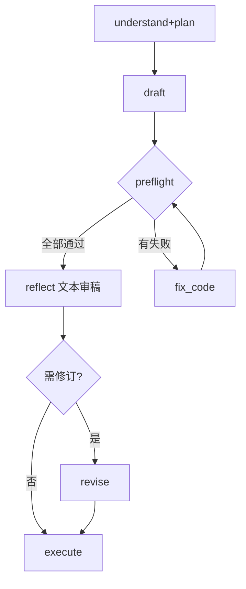

# DeepSeek 对 Lab-Solver Agent 计划的优化建议

> **状态**：第二轮（2026-06-03）已合并主计划 **附录 D**；用户确认 brief=方案 A、V1 模式=标准+深度。

**评审日期**：2026-06-03
**评审范围**：[LAB_SOLVER_AGENT_PLAN.md](./LAB_SOLVER_AGENT_PLAN.md) 全文 + 当前代码库现状（`server.py` ~1100 行单体，零 `modules/`，零 `agent/`）
**评审方法**：计划 ↔ 现状交叉对照，重点审视 Agent 架构的完整性、反馈回路、过度抽象与可调试性

---

## 总体评价

计划文档质量很高：原则清晰（evidence-based、画像只调参不编步骤）、DeepPipeline 的 reflect 锚定 `assignment_raw` 是正确的防御设计、Token 成本控制务实。但存在三方面可优化的空间：

1. **缺少执行层面的反馈回路** — Agent 失败后只能重试（fix_code），无法元层面修正计划
2. **部分设计过度抽象** — sections_config 智能解析、4 种 Agent 模式在 V1 过于复杂
3. **可调试性与 prompt 工程化不足** — 决策审计、prompt 版本管理、多厂商适配未涉及

以下按优先级排列具体建议。每项标注了影响范围和建议落点。

---

## 🔴 必须改（阻塞级）

### 1. Agent 缺少「执行→重规划」反馈回路

**原计划**：Plan → Execute（含 fix_code）→ Verify。执行失败只会触发 `fix_code`，Verify 失败触发 `revise_answer`。

**问题**：如果 `run_code` 失败揭示的是**计划层面**的问题（如 Planner 误判不需要安装依赖、遗漏了编译步骤），`fix_code` 改代码是无用的——需要的是回到 Planner 做**增量重规划**。当前设计中，`fix_code` 与 `revise_answer` 正交（DeepSeek #2 认可），但 `replan` 作为第三种修正路径未被引入。

**建议**：

```python
# executor.py — 新增 replan 触发逻辑

class Executor:
    MAX_CONSECUTIVE_FAILURES = 2  # 同一模块连续失败阈值

    def _handle_step_failure(self, step: PlanStep, error: ModuleError,
                             ctx: AgentContext) -> StepResult:
        consecutive = ctx.consecutive_failures.get(step.module, 0) + 1
        ctx.consecutive_failures[step.module] = consecutive

        if consecutive >= self.MAX_CONSECUTIVE_FAILURES:
            # 不继续 fix_code，回传失败上下文给 Planner 做增量重规划
            replan_context = {
                "failed_module": step.module,
                "error_summary": str(error)[:500],
                "attempts": consecutive,
                "current_plan": ctx.plan.steps,
                "completed_steps": ctx.completed_steps,
            }
            new_steps = self.planner.replan_incremental(ctx, replan_context)
            # 替换当前 plan 的未执行步骤
            ctx.plan.replace_remaining(new_steps)
            return StepResult(status="replanned", new_steps=new_steps)
        else:
            # 首次失败 → fix_code
            return self._run_fix_code(step, error, ctx)
```

- `replan_incremental` 不是从头 plan，而是仅针对失败步骤及其下游，追加/替换步骤
- 重规划结果以 SSE `plan_updated` 事件推送到前端，UI 展示「计划已调整」
- 重规划也要受 `max_replan_rounds` 约束（默认 1 次，与 `max_reflect_rounds` 对齐）

**影响范围**：`executor.py`、`planner.py`（新增 `replan_incremental`）、SSE 事件类型

---

### 2. `sections_config.normalize()` 纯规则解析不可靠

**原计划**：用户在「分节工作台」的单一文本框中混合输入正文 + 老师要求 + 备注 → `parse-section-brief` 用规则拆分（长句→正文，含"必须/不得/防伪"→约束）→ 拆不准时用户点「智能解析」调 LLM。

**问题**：中文实验报告场景中，规则的准确率会很差：

| 用户实际输入 | 规则判定 | 实际意图 |
|-------------|---------|---------|
| "老师说要加防伪码" | 正文（191 字，不含"必须"） | 约束 |
| "我写好了实验结果" | 约束（短句） | 待切换为 user_provided |
| "四、实验结果：如下文..." | 正文 | 混合正文+备注 |

规则误判 → 用户频繁手动纠正 → 分节工作台每行的内联预览 UI 信息密度已经很高 → 体验差于直接调一次 LLM。

**建议**：二选一：

**方案 A（推荐）**：去掉纯规则路径，始终走一次**轻量 LLM 分类**：

```python
# parse-section-brief 的 LLM 调用
CLASSIFY_PROMPT = """分析以下用户输入，判断其属于哪种类型（可多选）：
1. user_content: 大段正文，用户已写好的实验内容
2. constraint: 老师的要求/规则（如防伪标识、固定声明）
3. note: 给系统的备注/提示

输入内容：
{user_input}

返回 JSON（不要生成正文，只分类）：
{{"types": ["constraint"], "constraints": [{{"text": "...", "section": "summary"}}], "user_content": null, "note": null}}
"""
```

- `max_tokens=200`，成本极低（≈ 一次 Planner 的 1/20）
- 仅在用户点击「智能解析」时调用（不是自动、不是每节），保留用户的控制权
- 分类结果**可编辑**（内联预览中逐条修改/删除），不是黑盒

**方案 B**：Phase 2a **不做智能解析**，`sections_config` 的输入框拆为三个独立字段（正文 / 老师要求 / 备注），用户显式填写。智能解析推迟到 Phase 3+。

**影响范围**：`sections_config.normalize()`、`parse-section-brief` API、Step 2 UI

---

### 3. DeepPipeline 缺少代码/产物的「预检」阶段（preflight）

**原计划**：draft → reflect（文本审稿）→ revise → execute（含 run_code）。代码错误要到 execute 阶段才发现，然后触发 fix_code，多一次 LLM 往返。

**问题**：Agent 最常见的失败模式是**生成的代码有语法错误**或 **UML 语法不合法**。这些问题不需要 LLM 就能检测，但当前流程中它们要等到 execute → fail → fix_code 才处理。

**建议**：在 `draft` 和 `execute` 之间增加 `preflight` 模块（**零 LLM 调用**）：

```python
# src/python/modules/preflight.py

def run(ctx: AgentContext, params: dict) -> ModuleResult:
    checks = []

    # 1. 代码语法检查
    if ctx.answers and ctx.answers[0].parsed.get("code"):
        code = ctx.answers[0].parsed["code"]
        syntax_ok, syntax_msg = check_syntax(code, ctx.answers[0].parsed.get("language", "python"))
        checks.append({"id": "code_syntax", "ok": syntax_ok, "message": syntax_msg})

    # 2. UML 语法检查
    if ctx.answers and ctx.answers[0].parsed.get("uml"):
        uml_ok, uml_msg = validate_plantuml(ctx.answers[0].parsed["uml"])
        checks.append({"id": "uml_syntax", "ok": uml_ok, "message": uml_msg})

    # 3. JSON schema 校验
    if ctx.answers:
        schema_ok, schema_msg = validate_answer_schema(ctx.answers[0].parsed)
        checks.append({"id": "json_schema", "ok": schema_ok, "message": schema_msg})

    failed = [c for c in checks if not c["ok"]]
    return ModuleResult(
        ok=len(failed) == 0,
        data={"checks": checks, "failed": failed},
        logs=[c["message"] for c in failed],
        fingerprint=hash_checks(checks),
        cacheable=False,
    )
```

- 预检失败 → **直接触发 `fix_code`**（不经过 reflect），因为问题是语法/格式而非内容
- `check_syntax` 用 `py_compile` / `javac --dry-run` 等标准工具，不调 LLM
- 在 SSE 中以 `preflight` 事件推送结果，UI 展示「预检：代码语法 ✓ / UML 语法 ✗」

**DeepPipeline 调整后的流程**：



**影响范围**：新建 `modules/preflight.py`、`deep_pipeline.py` 调整流程顺序

---

## 🟡 建议改（重要不阻塞）

### 4. Agent 模式从 4 种缩减为 2 种（V1）

**原计划**：

| UI agent_mode | 后端映射 | LLM 次数 |
|---------------|----------|----------|
| 极速 | quick + fast | 1 |
| 标准（默认） | standard + fast | 2 |
| 深度 | standard + deep | 3~4 |
| 精细 | fine + deep | 6+ |

**问题**：
- 精细模式（6+ 次 LLM）的 V1 使用场景极少——愿意等 6 轮的少量用户会选择深度模式然后手动 iterate
- `quick+deep`、`fine+fast` 等死格子虽不暴露给用户，但仍需在后端维护映射逻辑
- 4 种模式增加了设置页、文档、测试的多维复杂度

**建议**：V1 只做两种：

| UI agent_mode | 后端 | 行为 | LLM 次数 |
|---------------|------|------|----------|
| **标准**（默认） | `run_mode=standard` | Planner + 执行模块（= 当前计划的标准模式） | 1~2 |
| **深度** | `run_mode=deep` | DeepPipeline（含 preflight + reflect + revise） | 3~4 |

- 极速模式：`标准` 模式在 V1 约 1~2 次 LLM，与极速的 1 次差异不大，合并
- 精细模式：推迟到数据积累后（Phase 3+），根据「深度模式用户手动触发 revise 的频率」数据决定是否需要
- 设置页下拉仅两项，后端去掉 `agent_depth` 枚举，合并到 `run_mode`

```python
# 简化后的 run_mode
RUN_MODE_STANDARD = "standard"  # Planner → Execute → Verify
RUN_MODE_DEEP = "deep"          # DeepPipeline: understand+plan → draft → preflight → reflect → revise → execute → verify
```

**影响范围**：`deep_pipeline.py`、设置页 UI、`app.js` 中 `agent_mode` → `run_mode` 映射

---

### 5. Planner 缺少「不确定时主动询问用户」机制

**原计划**：Planner 对不确定的步骤标 `confidence: low` + `default_checked: false`，由用户在计划预览中自行判断。

**问题**：用户面对一个未勾选的 checkbox（如 `screenshot_ide`，reason="报告提到截图但未指明风格"），不理解：
- 为什么它出现在计划里？（是必须的吗？）
- 勾或不勾的后果是什么？（不截图会怎样？）
- 这和设置页的"默认截图风格"有什么关系？

用户要么全勾（失去 Planner 的省流意义），要么全不勾（可能漏掉关键步骤）。

**建议**：Planner 输出中增加 `clarifications[]`，在 Step 2 计划预览中以**问答卡片**形式展示（而非未勾选的 checkbox）：

```json
{
  "steps": [...],
  "clarifications": [
    {
      "id": "q1",
      "question": "报告要求'附上运行结果'，你需要哪种截图？",
      "options": [
        {"label": "IDE 代码+终端", "affects": ["screenshot_ide"]},
        {"label": "仅终端输出", "affects": ["screenshot_terminal"]},
        {"label": "两种都要", "affects": ["screenshot_ide", "screenshot_terminal"]}
      ],
      "default": "IDE 代码+终端",
      "default_reason": "你的画像默认偏好 IDE 风格"
    },
    {
      "id": "q2",
      "question": "报告提到'画出流程图'，你需要自动生成 UML 吗？",
      "options": [
        {"label": "自动生成 UML 类图/流程图", "affects": ["render_uml"]},
        {"label": "我自己画，不用生成", "affects": []}
      ],
      "default": null
    }
  ]
}
```

- 用户回答后，前端调用 `POST /api/agent/plan/clarify`（传入 `clarification_answers`），Planner 做**轻量 replan**（只更新受影响步骤的 params / 增删步骤，不重新分析全文）
- `clarifications` 仅在 Planner 的 confidence 为 medium 或 low 时生成
- 与用户画像互补：画像解决"已知偏好"，clarifications 解决"本次报告确实没写清楚"

**影响范围**：`planner.py`（新增 `clarifications` 输出 + `replan_with_answers`）、Step 2 UI（问答卡片组件）、`POST /api/agent/plan/clarify` API

---

### 6. 缺少跨会话的 Agent 决策审计（decision_log）

**原计划**：`history` 存 run 配置摘要（`run_mode`、`sections_summary`、`document_roles`），`plan_fingerprint` 防 sections 竞态。

**问题**：当用户反馈"为什么这次和上次解题结果差很多？"，目前的日志无法回答：
- Agent **为什么**选择了某个步骤？（Planner 的 evidence 只在当次 plan JSON 中，history 不存）
- Agent **为什么**跳过了某步？（fill_scope=skip 在 contexts 中，但不在结构化日志里）
- Executor 复用/重跑了哪些模块？（dirty_modules 的标记不持久化）

调试只能靠 `app.log` 的文本 grep，效率低。

**建议**：在 `AgentContext` 中维护 `decision_log[]`，写入 history：

```python
@dataclass
class DecisionLog:
    timestamp: str
    agent: str          # "planner" | "executor" | "reflect" | "verify" | "preflight"
    decision: str       # "skip_module" | "run_module" | "mark_dirty" | "reuse_cache" | "replan"
    target: str         # 模块名或步骤 ID
    reason: str         # 人类可读的原因
    evidence: dict      # 引用 ctx 中的具体字段值，如 {"fill_scope.result": "skip"}
    fingerprint: str    # 当时的 plan_fingerprint
```

- `decision_log` 在每次 Agent 做决定时追加（不调 LLM）
- SSE 推送 `decision` 事件，UI 在 Step 3 的步骤状态旁展示 tooltip「为什么执行/跳过」
- history 增加 `decision_summary` 字段（精简版 decision_log），供用户回溯
- 用户手动修订后对应 decision 标记 `overridden: true`

**影响范围**：`AgentContext`、`executor.py`、`planner.py`、`history` schema、SSE 事件类型

---

### 7. Token 预算控制（`prompt_budget.py`）需要具体化

**原计划**：`prompt_budget.py` 只被提到一次（Phase 2 实现项），没有设计细节。截断策略为 `assignment_text[:2500]` + `fill_target_body[:2500]`。

**问题**：按字符数硬截断对实验报告场景很危险：

| 报告结构 | `[:2500]` 截断效果 |
|----------|-------------------|
| 封面 200 字 + 原理 800 字 + 步骤 1000 字 + 要求在步骤第 1200 字 | ✅ 截到步骤中段，要求保留 |
| 封面 200 字 + 原理 2500 字 + 步骤第 2700 字 | ❌ 截断在原理中，**步骤要求全部丢失** |
| 老师要求写在报告末尾"备注"节 | ❌ 永远传不到 Planner |

**建议**：

```python
# src/python/agent/prompt_budget.py

def fit_budget(text: str, budget_tokens: int,
               preserve_sections: list[str],
               section_map: dict) -> str:
    """
    按节裁剪，优先保留指定节的内容。
    不按字符数硬截，而是按节标题定位后按优先级分配配额。
    """
    sections = split_by_headings(text, section_map)

    # 优先级：preserve_sections > 步骤节 > 结果节 > 原理 > 封面
    priority_order = (
        [s for s in sections if s["heading"] in preserve_sections] +
        [s for s in sections if "步骤" in s.get("heading", "")] +
        [s for s in sections if "结果" in s.get("heading", "")] +
        [s for s in sections if s not in preserve_sections]
    )

    result = []
    remaining = budget_tokens
    for section in priority_order:
        tokens = estimate_tokens(section["text"])
        if tokens <= remaining:
            result.append(section)
            remaining -= tokens
        else:
            # 最后一节能放多少放多少，标注截断
            truncated = section["text"][:int(len(section["text"]) * remaining / tokens)]
            result.append({**section, "text": truncated, "truncated": True})
            break

    return format_for_prompt(result)
```

- 利用已有的 `section_map`（来自 `parse_report`）做节标题定位
- `preserve_sections` 由调用方指定（Planner 传 `["steps", "result"]`，solve_lab 传 `["steps"]`）
- 截断节标注 `[已截断，原文 N 字]`，让 LLM 知道自己看到的不是全文
- `estimate_tokens` 用字符数/3 做简单估算（不依赖具体 tokenizer，误差在可接受范围）

**影响范围**：新建 `src/python/agent/prompt_budget.py`、`llm_client.py` 调用前统一过 `fit_budget`

---

### 8. `dirty_modules` 粒度应支持字段级复用

**原计划**：`ModuleResult.fingerprint` = `hash(module_id + params + ctx_fields)`，`dirty_modules` 按 module_id 标记。`revise_answer` 的 scope 若仅涉及 `result_description`，则 `solve_lab` 被标记为脏。

**问题**：`solve_lab` 输出包含多个字段（`steps`、`result_description`、`summary`、`code`…）。若用户只修改了 `summary`，标记整个 `solve_lab` 为脏意味着要重跑整个模块——但实际上 `steps`、`code` 等字段没变，可以复用。

**建议**：Phase 1 设计 `ModuleResult` 时预留**子指纹**：

```python
@dataclass
class ModuleResult:
    ok: bool
    data: dict
    logs: list[str]
    fingerprint: str                    # 整体指纹
    sub_fingerprints: dict[str, str]    # 字段级指纹，如 {"steps": "sha256:...", "result_description": "sha256:..."}
    cacheable: bool
```

- `executor._should_rerun(step, scope)` 先检查 scope 是否只影响部分字段 → 若对应 sub_fingerprint 未变则复用
- `revise_answer` 的 scope `["summary"]` 只改 `solve_lab` 输出的 `summary` 字段 → 其他字段的 sub_fingerprint 不变 → 下游 `fill_report` 只重写 summary 节（而非全量重填）

**影响范围**：`ModuleResult` schema、`executor.py` 的 `should_rerun`、`fill_lab` 局部填充逻辑

---

### 9. Prompt 工程化：集中管理 + 版本化

**原计划**：Prompts 分散在各模块中（`LAB_PROMPT`、Planner prompt、reflect prompt、revise prompt、verify prompt…），没有集中管理或版本控制。

**问题**：
- 改了 Planner prompt 的行为 → 不知道是否影响 solve_lab 的 prompt（二者都有 `TEACHER_CONSTRAINTS` 块）
- 不同模块的 prompt 可能对同一概念用了不同措辞（如 `fill_scope` 在 Planner 叫"填写范围"、在 solve_lab 叫"节策略"）→ LLM 困惑
- 用户反馈"输出格式变了" → 无法快速定位是哪个 prompt 的哪次修改导致的

**建议**：

```python
# src/python/agent/prompts.py — 集中管理所有 prompt 模板

from dataclasses import dataclass
from typing import ClassVar

@dataclass
class PromptTemplate:
    name: str           # "planner.v1"
    version: str        # "2026-06-03"
    system: str         # system prompt
    user_template: str  # 带 {placeholders} 的模板
    output_schema: str  # JSON schema 描述（给 LLM，非 Pydantic）
    changelog: str      # 本次修改说明

# 注册表
PROMPTS = {
    "planner": PromptTemplate(
        name="planner.v1",
        version="2026-06-03",
        system="你是实验报告解题计划器。只分析不写作。...",
        user_template="""## 实验要求（节选）
{assignment_text}

## 待填报告结构
{fill_target_body}

## 用户设置
{profile_summary}
{format_spec}
{sections_config_summary}
{teacher_constraints_summary}

## 任务
生成模块执行计划。...""",
        output_schema="PlanStep[] schema...",
        changelog="v1 初始版本：evidence 门禁 + 画像只调参",
    ),
    "solve_lab": PromptTemplate(...),
    "reflect": PromptTemplate(...),
    "revise": PromptTemplate(...),
    # ...
}
```

- 所有模块通过 `PROMPTS["planner"].render(assignment_text=..., ...)` 获取拼好的 prompt
- `version` 写入 `AgentContext` → 每次 run 的 decision_log 带 prompt 版本号
- 修改 prompt → 改 `changelog` + 跑金样本回归（已有 3 份金样本，验证输出 schema 不变）
- Phase 3+ 可扩展为文件加载（`prompts/planner_v1.md`）+ 热更新

**影响范围**：新建 `src/python/agent/prompts.py`、各模块改为通过注册表获取 prompt

---

### 10. 范文合规检测应可自动化验证

**原计划**：依赖 prompt 软约束（`solve_lab` prompt 中"禁止复述模版事实数据"）+ 模版正文截断送 LLM 来防止抄袭。

**问题**：prompt 约束是软性的——LLM 可能遵守也可能不遵守。用户（尤其是学生用户）依赖系统确保产出的原创性，纯靠 prompt 约束不够。

**建议**（Phase 2b 加入 `verify_answer`）：

```python
# verify_answer 中增加 plagiarism_check

def check_plagiarism(generated_text: str, template_full_text: str,
                     threshold: float = 0.3) -> dict:
    """
    检测生成文本是否大段复述模版原文。
    使用 difflib 做字符串匹配（不调 LLM，零成本）。
    """
    import difflib
    matcher = difflib.SequenceMatcher(None, generated_text, template_full_text)
    blocks = matcher.get_matching_blocks()

    long_blocks = [b for b in blocks if b.size >= 30]  # ≥30 字符的连续匹配
    total_match = sum(b.size for b in long_blocks)
    ratio = total_match / len(generated_text) if generated_text else 0

    return {
        "ok": ratio < threshold,
        "match_ratio": round(ratio, 2),
        "longest_match": max(b.size for b in long_blocks) if long_blocks else 0,
        "matches": [{"pos": b.a, "len": b.size} for b in long_blocks[:5]],
        "message": f"与模版相似度 {ratio:.0%}" + (" ≥ 阈值" if ratio >= threshold else ""),
    }
```

- 这不是真正的学术查重，但能捕捉最明显的直接复述（连续 30+ 字符匹配）
- 检测到匹配 > 阈值 → 标记 warn（不阻塞导出，UI 展示「检测到与范文高度相似段落」）
- 与模版防抄袭 prompt 互补：prompt 做预防，difflib 做兜底验证

**影响范围**：`verify_answer` 模块、`verification_report` schema

---

## 🟢 可延后

### 11. 多厂商 tokenizer 差异适配

**原计划未涉及**：`llm_client` 要同时支持 DeepSeek/OpenAI/智谱/Claude，但未考虑不同厂商的 tokenizer 差异。

**风险**：`prompt_budget` 用字符数估算 token 时，同样 2500 字符：
- 英文为主（Python 代码）→ 约 700 tokens
- 中文为主（实验报告）→ 约 1500 tokens（中文字符 token 效率低）

且不同厂商的 tokenizer 也有差异（DeepSeek vs Claude 对同一段中文的 token 数可差 10-15%）。

**建议**（Phase 3+）：
- `prompt_budget.estimate_tokens` 根据 `settings.provider` 选择粗略系数（中文 1.5x vs 英文 0.4x）
- 预算留 15% 安全余量（`effective_budget = budget * 0.85`）
- 若 API 返回 `finish_reason=length`，在 decision_log 中记录并提示用户"输出可能被截断"

### 12. Phase 1 与 Phase 2a 的交付顺序微调

**当前顺序**：Phase 1（模块抽取 + 基建）→ Phase 2a（Agent 核心）

**建议**：将 `planner.py` + `executor.py` 的**薄封装版**提前到 Phase 1 末尾交付：

```python
# Phase 1 的 planner.py（薄封装版）
# 不引入 DeepPipeline，不引入 sections_config，不引入多文档
# 仅：读 report full_text → 调 LLM 生成 step 列表 → 返回

def plan_from_report(report_text: str, settings: dict, profile: dict = None) -> dict:
    prompt = render_plan_prompt(report_text, profile)
    result = llm_client.chat(prompt, settings)
    return parse_plan_json(result.content)
```

好处：
1. 在模块抽取完成的同时就能验证 Planner API 的设计是否合理
2. 提前暴露 prompt 设计问题（不需要等到 Phase 2a 全套就位）
3. 前端可以在 Phase 1 就看到计划预览的原型，反馈周期更短

### 13. 评审清单补充维度

`PROMPT_CRITIQUE_CHECKLIST.md` 当前缺少以下评审维度，建议补充：

| 维度 | 检查项 |
|------|--------|
| **Agent 可调试性** | `decision_log` 是否足够定位"Agent 为什么这样做"？ |
| **Prompt 版本管理** | 修改 prompt 后如何回归测试？如何确保不同模块 prompt 间的一致性？ |
| **多厂商适配** | `llm_client` 对不同厂商的 tokenizer/rate limit/错误格式处理是否统一？ |
| **Agent 间协作** | Planner ↔ Executor ↔ Reflect ↔ Revise 的数据传递是否有 schema 约束？是否存在字段漂移（一个模块叫 `steps`、另一个叫 `plan_steps`）？ |

---

## 对原计划中已确认设计的再确认

以下原计划的设计判断我**同意并建议保持**：

| 原计划设计 | 判断 |
|-----------|------|
| `plan_fingerprint` 防 sections 竞态 | ✅ 正确，是低成本的防御措施 |
| reflect 锚定 `assignment_raw` + `misunderstood` | ✅ 正确，防止级联偏差的关键 |
| `fix_code` 与 `revise_answer` 正交 | ✅ 正确，避免自动链式调用造成雪崩 |
| DeepPipeline `max_rounds` / early_exit | ✅ 正确，防止无限循环 |
| 画像 v1 精简（仅 3 字段），行为学习推迟 Phase 3+ | ✅ 正确，V1 应保持简单 |
| 不引入 Cursor SDK / Claude Computer Use | ✅ 正确，保持厂商中立 |
| 文档只传一次（document_ids 替代 base64 重传） | ✅ 正确，重要的省流措施 |
| 模版与报告冲突时以报告为准 | ✅ 正确，符合"evidence 门禁"原则 |

---

## 建议采纳优先级汇总

| 优先级 | 编号 | 建议 | 建议落点 |
|--------|------|------|----------|
| 🔴 阻塞 | 1 | 执行→重规划反馈回路 | Phase 2a executor + planner |
| 🔴 阻塞 | 2 | sections_config 智能解析简化 | Phase 2a（方案 A 或 B） |
| 🔴 阻塞 | 3 | preflight 代码/UML 预检 | Phase 2b deep_pipeline |
| 🟡 重要 | 4 | Agent 模式 4→2 | Phase 2a 设置页 + 后端 |
| 🟡 重要 | 5 | Planner clarifications 问答 | Phase 2a planner + Step 2 UI |
| 🟡 重要 | 6 | decision_log 决策审计 | Phase 2a AgentContext + executor |
| 🟡 重要 | 7 | prompt_budget 按节裁剪 | Phase 2b prompt_budget.py |
| 🟡 重要 | 8 | ModuleResult 子指纹 | Phase 1 ModuleResult schema |
| 🟡 重要 | 9 | prompt 集中管理 + 版本化 | Phase 1 agent/prompts.py |
| 🟡 重要 | 10 | 范文 difflib 抄袭检测 | Phase 2b verify_answer |
| 🟢 延后 | 11 | 多厂商 tokenizer 适配 | Phase 3+ |
| 🟢 延后 | 12 | planner 薄封装提前到 Phase 1 | Phase 1 末尾 |
| 🟢 延后 | 13 | 评审清单补充维度 | 随时更新 PROMPT_CRITIQUE_CHECKLIST.md |

---

## 修订历史

| 日期 | 修订内容 |
|------|----------|
| 2026-06-03 | 初版：基于 LAB_SOLVER_AGENT_PLAN.md 全文 + 当前代码库现状的交叉评审 |
