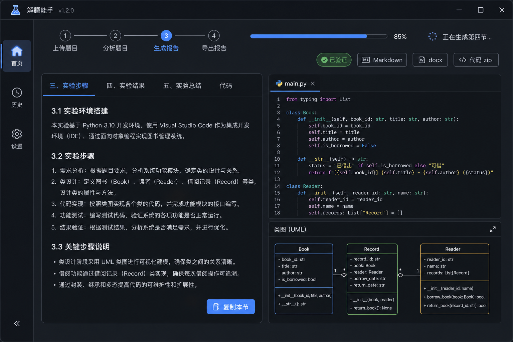
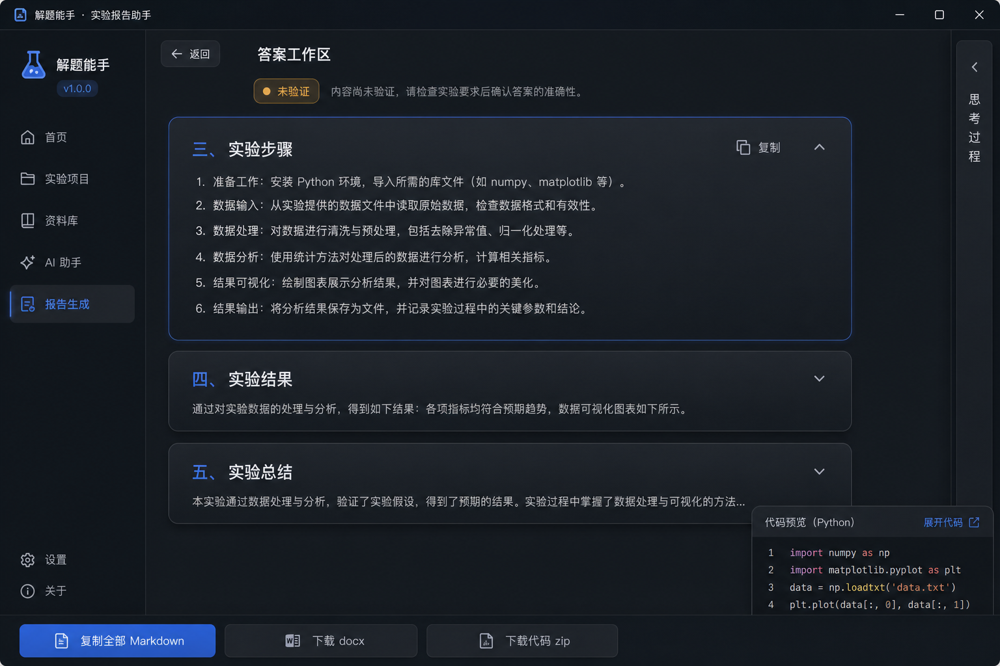
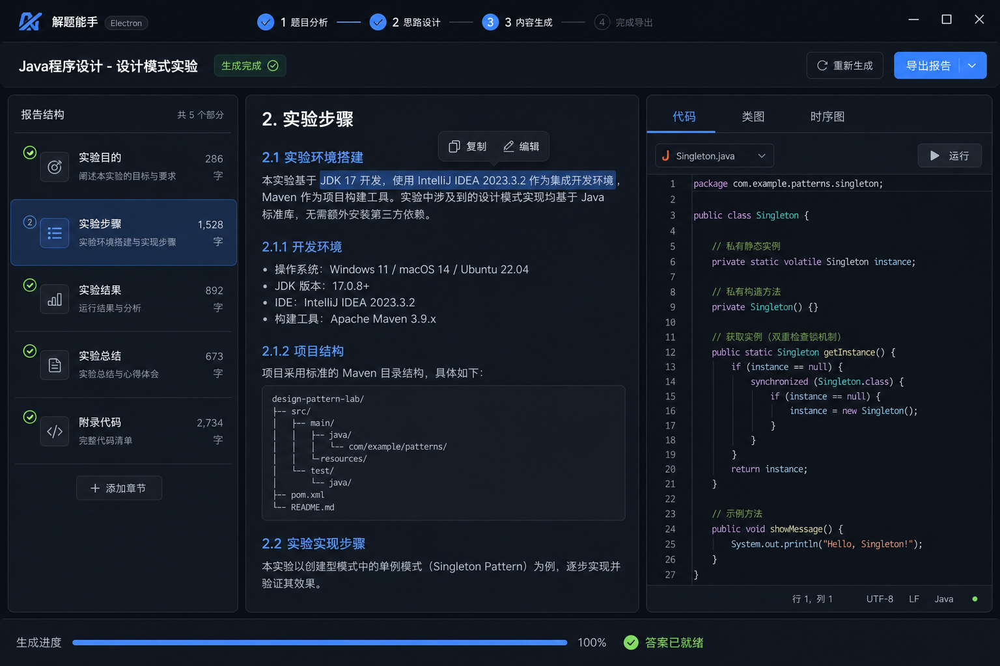

# Step 3 答案工作区 — 视觉 Mockup

**日期**: 2026-06-06  
**动效档位**: 适中（MOTION_INTENSITY = 3）  
**设计规范**: [DESIGN.md](../../DESIGN.md)

---

## 三个方向

### Variant A — 左右分栏（Split）

- 左：分节 tab + 报告正文 +「复制本节」
- 右：代码预览 + UML 缩略图 +「复制代码/图表」
- **优点**: 最贴近 V5 文档「左内容右预览」
- **适合**: 宽屏桌面（≥ 1200px）

---

### Variant B — 卡片堆叠（Cards）

- 垂直 expandable 卡片，每节一张
- 底部 sticky 导出栏；代码为 floating peek
- **优点**: 层次清晰、实现简单、窄屏友好
- **适合**: 若不想做三栏布局

---

### Variant C — Dashboard 三栏

- 左：节列表 + 完成状态 + 字数
- 中：阅读 pane + 选中复制
- 右：代码/类图/时序图 tab
- **优点**: 导航最强，适合多节长报告
- **适合**: 信息密度可接受时

---

## 已确认方案（2026-06-06）

**方案 4 — A + C 混合** ✅

| 区域 | 来源 |
|------|------|
| 左侧节导航 | Variant C |
| 中间正文 | Variant A |
| 右侧预览 | Variant A |
| 底部校验/修订 | 保持现有折叠，视觉收轻 |

---

## 实施进度

| 阶段 | 状态 | 说明 |
|------|------|------|
| Mockup 选型 | ✅ | 方案 4（A+C 混合） |
| **UI-1** | ✅ | 2026-06-06：`styles.css` token、`icons.js`、全局 SVG 图标、按钮/输入状态 |
| **UI-2** | ✅ | 2026-06-06：三栏（左节导航 + 中正文 + 右预览）；窄屏右栏可折叠 |
| **UI-3** | ✅ | 2026-06-06：Step1 拖拽区 + role chip + 文档表格；Step2 高级选项折叠 |
| **UI-4** | ✅ | 2026-06-06：三步条、导出并入 Step3、空状态统一、动效收尾 |
| **Step3 完成导航** | ✅ | 2026-06-06：deliverable 主路径完成后页头 + `#exportActionBar` 显示「回到主页」（`startNew()`） |
| **Step1 粘贴优先** | ✅ | 2026-06-08：默认内联粘贴题目，仅文字可解析（BF43）；`parse-report` 空 `fill_target` 修复（BF44） |
| **Step3 预览复制** | ✅ | 2026-06-08：预览栏「复制代码/图表」+ 逐文件/逐图复制（BF43） |

## Phase 2 — 非 Step 3 改造（当前重点）

**用户反馈**: Step 3 已满意；Phase 2 非 Step 3 改造（Step 1/2/设置/历史/壳层）已于 P2-A～D 完成。

**规划文档**: **[UI_PHASE2_NON_STEP3.md](./UI_PHASE2_NON_STEP3.md)**（线框、Pack 划分、验收、文件清单）

| Pack | 内容 | 状态 |
|------|------|------|
| P2-A | Step 1 左右分栏（`.step1-grid` 双栏 + 范文折叠） | ✅ [实施清单](./UI_PHASE2_PACK_A.md) |
| P2-B | Step 2 摘要 + 分节卡 + sticky 底栏 | ✅ [实施记录](./UI_PHASE2_PACK_B.md) |
| P2-C | 设置左 nav + 模式卡片 | ✅ [实施记录](./UI_PHASE2_PACK_C.md) |
| P2-D | 历史 + 壳层统一 | ✅ [实施记录](./UI_PHASE2_PACK_D.md) |

Step 3 mockup 仍作结构参考；Phase 2 可选补充 Step1/Step2  mockup（见 Phase 2 文档 §12）。

Mockup 为 AI 生成参考图，实现时以 DESIGN.md token 为准，不必像素级复刻。

---

## Phase 3 — 精致化抛光（✅ 已完成）

Phase 1～2 完成后 UI 复审结论：**架构正确，辨识度与细节仍不足** → Phase 3 已落地抛光。

**规划文档**: **[UI_PHASE3_POLISH.md](./UI_PHASE3_POLISH.md)**（审计摘要、Pack A～F、Step 3 边界、验收清单）

| Pack | 内容 | 优先级 | 状态 |
|------|------|--------|------|
| P3-A | 全局 `user-select` + 步骤条对齐 | P0 | ✅ |
| P3-B | Step 3 三栏层次 + 导出收纳 | P0 | ✅ |
| P3-C | 侧栏状态 + 修订区 CTA 纪律 | P1 | ✅ |
| P3-D | 节切换 / 侧栏动效（纯 CSS） | P1 | ✅ |
| P3-E | Accent 偏靛 + 历史摘要（E1+E3；字体/纹理不做） | P1 | ✅ |
| P3-F | 内联 style 清理、loading、工具箱对齐 | P2 | ✅ |

---

## 逐屏优化（2026-06-08 起）

按界面逐个改造，一屏一文档、一 PR，避免全站大改回归。

| 界面 | 文档 | 状态 |
|------|------|------|
| 首页 Step 1 | [UI_SCREEN_HOME.md](./UI_SCREEN_HOME.md) | ✅ 首版 |
| Step 2 计划确认 | [STANDARD_MODE_QUALITY.md](./STANDARD_MODE_QUALITY.md) §Q3（`#step2ModeBanner`） | ✅ 质量说明条 |
| Step 3 答案工作区 | — | 已定稿，仅 bugfix |
| 设置 | [STANDARD_MODE_QUALITY.md](./STANDARD_MODE_QUALITY.md) §Q4（模式/自动修复文案） | ✅ 文案 |
| 历史 | — | 待做 |

**跨屏（Agent 质量）**：[STANDARD_MODE_QUALITY.md](./STANDARD_MODE_QUALITY.md) — 标准模式默认 `auto_remediate`、校验 Toast（2026-06-08）
