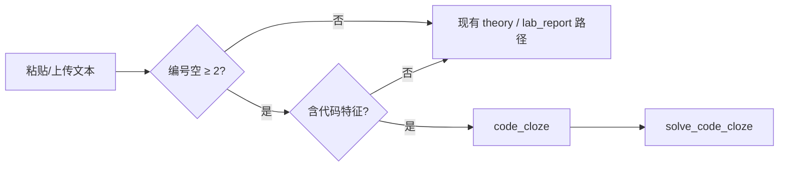

# 代码完形填空题型 — 功能规格

**日期**: 2026-06-08（末次修订 2026-06-08）  
**状态**: ✅ Phase A/B/C 已实施；✅ ReAct/交付链路修补（BF45–BF49）  
**Phase E（判分/normalize）**: ✅ 2026-06-08（R6 · HTML 核对）  
**Phase E+（Step3 只读对照）**: ✅ 2026-06-08（R7）  
**Phase F（混排拆题 O10）**: ✅ 2026-06-08（R8）  
**Phase G（混排 ReAct/深度联调 + UI）**: ✅ 2026-06-08（R9）  
**Phase D（Word 导入）**: ✅ 2026-06-08（R5）  
**关联**: [CODE_CLOZE_ROUTING.md](CODE_CLOZE_ROUTING.md)（**模式路由 / 改动边界，改代码前必读**）· [NEXT_VERSION_BACKLOG.md](../product/NEXT_VERSION_BACKLOG.md) O10/O33 · [V1_BUGFIX_LOG.md](../logs/V1_BUGFIX_LOG.md) BF47–BF49 · [exam-bank-with-checkboxes.html](../../exam-bank-with-checkboxes.html)

---

## 一、背景与问题

### 1.1 典型题目形态

软件工程 / 设计模式考试中常见 **「代码 + 编号空」** 填空，例如外观模式（Facade）：

```java
(            1           )  AbstractFacade {
    public abstract void execute(String fileName);
}

class XMLFacade extends AbstractFacade {
    public void execute(String fileName){
        String str = (             2            ); // 读取文件
        String strResult = (              3             ); // 分析数据
        (             4              ); // 显示报表
    }
}
```

特征：

- 题干主体是 **等宽代码块**，不是自然语言段落
- 空位用 **括号 + 序号** 标注：`( 1 )`、`(2)`、`（3）` 等
- 每空答案多为 **短代码片段**（类名、方法调用、关键字），不是长段论述
- 常与 UML、设计模式名称、类图题 **混排** 在同一份试卷中

### 1.2 产品能力对照（2026-06-08）

| 能力 | 状态 | 说明 |
|------|------|------|
| 题型标识 `code_cloze` | ✅ | `detect_code_cloze` + `question.type` / `metadata.code_cloze` |
| 粘贴 / 上传解析 | ✅ | `assignment_only`、`fill_target` 拆分、`/api/agent/plan|run` 二次判定（BF47） |
| 计划生成 | ✅ | `adjust_plan_for_code_cloze` → `solve_code_cloze` + `present_deliverable` |
| 标准模式执行 | ✅ | Executor 按步骤跑 `solve_code_cloze` |
| ReAct 模式执行 | ✅ | bootstrap + ReAct 工具 `solve_code_cloze`（BF49）；勿再走 `solve_lab` |
| 深度模式执行 | ✅ | `is_code_cloze_run` 跳过 `solve_lab` draft（BF50 / R1） |
| 工具箱 AI 解题 | ✅ | `tool_solve` 识别 `code_cloze`，返回 `blanks`（R2 / BF51） |
| 遗留 `/api/solve` | ✅ | 与工具箱共用 `_solve_text_cloze_or_lab`（R3 / BF52） |
| Step 3 答案工作区 | ✅ | `isCodeClozeDeliverable` 双栏：空号列表 + 代码预览 |
| 执行后校验 | ✅ BF55 | `verify_answer` 仅查 `code_cloze_schema` + 通用项；`present_deliverable` 完成即 SSE 推送工作区 |
| Step 1 粘贴预览徽章 | ✅ | 解析完成显示「代码填空 · 检测到 N 个空」（R4 / §4.3） |
| HTML 题库 Phase A | ✅ | `exam-bank-with-checkboxes.html` Facade 样板 + `.code-cloze` |
| Word 导入代码空 | ✅ Phase D / R5 | `extract_docx_code_cloze_text` 按 body 顺序抽取段落/表格代码段 + `detect_code_cloze_for_docx` |
| 练习判分 / `answer_alt` | ✅ Phase E / R6 | HTML「核对答案」+ `normalize_cloze_answer` |
| Step3 只读对照 | ✅ Phase E+ / R7 | 题干/metadata 含 `reference_blanks` 时逐空比对 AI 答案 |

**剩余缺口**：图片/文本框空位（Q2）仍建议粘贴纯文本；粘贴/docx **默认不带**参考答案（须题库 JSON 或手动 metadata）。

---

## 二、题型定义

### 2.1 新题型标识

| 字段 | 值 |
|------|-----|
| `type` | `code_cloze` |
| 中文名 | 代码完形填空 |
| 与 `code` 区别 | `code` = 写完整程序/补全大段逻辑；`code_cloze` = 固定骨架内填 **编号空** |
| 与 `theory` 区别 | `theory` = 自然语言简答；`code_cloze` = 答案必须是 **可粘贴进代码的片段** |

### 2.2 子类（可选，影响 UI 提示）

| 子类型 | 说明 | 示例 |
|--------|------|------|
| `pattern_fill` | 设计模式 / 架构类 | Facade、Singleton 骨架填空 |
| `syntax_fill` | 语法关键字填空 | `abstract class`、`implements` |
| `api_fill` | API / 方法调用链填空 | `fo.read(fileName)` |
| `mixed` | 以上混合 | 期末卷常见 |

---

## 三、数据模型

### 3.1 题目结构（解析 / 题库 JSON）

```json
{
  "id": "facade-xml-001",
  "type": "code_cloze",
  "subtype": "pattern_fill",
  "title": "外观模式 — XMLFacade 填空",
  "language": "java",
  "stem": "阅读下列 Java 代码，完成 1–9 空。",
  "code_template": "class XMLFacade extends AbstractFacade {\n  public void execute(String fileName){\n    String str = {{2}};\n    ...\n  }\n}",
  "blanks": [
    {
      "n": 1,
      "context": "class declaration",
      "line_hint": 1,
      "answer": "abstract class",
      "answer_alt": [],
      "explanation": "抽象外观类，声明抽象方法 execute"
    },
    {
      "n": 2,
      "context": "read file",
      "answer": "fo.read(fileName)",
      "answer_alt": ["fo.read( fileName )"]
    }
  ],
  "metadata": {
    "pattern": "Facade",
    "source": "软件工程期末",
    "reference_blanks": {
      "1": { "answer": "abstract class", "answer_alt": [] },
      "2": { "answer": "fo.read(fileName)", "answer_alt": ["fo.read( fileName )"] }
    }
  }
}
```

> **E+ 对照字段**：`reference_blanks` 可与 `blanks[]` 同形（dict 或 list）；解析/题库写入后由 `build_deliverable` 透传至 `deliverable.code_cloze.reference_blanks`，Step3 只读展示（不做法题输入判分）。

### 3.2 解答输出（Agent / LLM 结构化）

与 `solve_theory` 的 `steps_analysis` 不同，`solve_code_cloze` 应 **强制** 输出：

```json
{
  "type": "code_cloze",
  "blanks": {
    "1": { "answer": "abstract class", "brief": "抽象类修饰符" },
    "2": { "answer": "fo.read(fileName)", "brief": "FileOperation 读文件" }
  },
  "completed_code": "… 可选：填入答案后的完整代码 …",
  "pattern_note": "本题考查外观模式：XMLFacade 封装子系统调用链"
}
```

### 3.3 空位占位符约定（解析层）

从原始文本识别空位时，按优先级匹配：

| 优先级 | 正则（示意） | 示例 |
|--------|--------------|------|
| P1 | `\(\s*(\d+)\s*\)` | `( 2 )` |
| P2 | `（\s*(\d+)\s*）` | `（2）` |
| P3 | `_+` 紧邻行内注释 `//读取` | 无编号时用行号推断（弱） |

识别到 ≥2 个编号空 **且** 同段含 `class` / `public` / `def` / `function` 等 → 倾向 `code_cloze`。

---

## 四、展示层规格

分 **两条产品线**：静态复习题库（快）与主应用集成（慢）。

### 4.1 HTML 题库扩展（Phase A — 推荐先做）

**文件**: `exam-bank-with-checkboxes.html`（或独立 `exam-bank-code-cloze.html`）

#### 组件：`.code-cloze-block`

```html
<div class="q-block code-cloze-block" data-qid="facade-001">
  <input type="checkbox" class="q-check" … />
  <p class="q-text"><strong>设计模式</strong> · 外观模式（Facade）— 完成 1–9 空</p>
  <pre class="code-cloze" aria-label="Java 代码填空"><code>
<span class="cloze-line"><span class="ln">1</span> <input class="cloze-input" data-n="1" size="14" aria-label="空 1" /> AbstractFacade {</span>
<span class="cloze-line"><span class="ln">2</span>     public abstract void execute(String fileName);</span>
…
  </code></pre>
  <div class="answer-toggle-wrapper">…</div>
</div>
```

#### 样式要点（对齐 [DESIGN.md](../../DESIGN.md)）

| 元素 | 规范 |
|------|------|
| `.code-cloze` | `font-family: var(--mono)`；`background: var(--code-bg)`；横向滚动 |
| `.ln` | 行号，右对齐，`color: var(--text-muted)`，`user-select: none` |
| `.cloze-input` | 无边框底划线式；`min-width` 按 `size`；focus 时 `border-color: var(--accent)` |
| 答案区 | 表格：`空号 | 参考答案 | 简要说明`；与现有 `.answer-content` 复用 |

#### 交互

- 勾选题目 → 与现有 sidebar 统计一致
- 「显示答案」→ 展开对照表 + 可选「填入参考值」（只读高亮，不覆盖用户输入）
- 不强制判分（Phase A）；Phase B 可加「核对」按钮（字符串 normalize 后比较）

### 4.2 主应用 Step 3 扩展（Phase C）

当 `deliverable.type === 'code_cloze'` 时，**新增渲染分支**（不改动现有报告三栏默认逻辑）：

```
┌─────────────────────────────────────────────────────────────┐
│  代码完形填空 · Facade                           [复制全部]  │
├──────────────────┬──────────────────────────────────────────┤
│  空号列表         │  代码预览（高亮已填空的行）                │
│  ① abstract class │  <pre> … </pre>                          │
│  ② fo.read(…)     │                                          │
│  …               │  模式说明（折叠）                         │
└──────────────────┴──────────────────────────────────────────┘
```

- 左栏：空号 + 答案 + 一键复制该空
- 右栏：完整代码（答案代入后的只读预览）
- 主 CTA：**复制全部空号答案**（制表符分隔，方便贴 Word）

> **约束**: 遵循 lab-solver-ui skill — Phase C 若改 Step 3，需单独 PR，与 P2 冻结范围协调。

### 4.3 Step 1 粘贴预览（Phase B — R4 ✅）

粘贴区识别为 `code_cloze` 时，解析完成后显示 **缩略预览**：

- 徽章：`代码填空 · 检测到 N 个空`
- 不要求用户手动标空

**实现（2026-06-08）**：`/api/parse-report` 返回 `question.type` + `metadata.code_cloze.blank_count`；`app.js` 在 `applyParseResponse` 中渲染 `#codeClozeParseBadge`（Step2 解析区）、同步 `step2QuestionsSummaryText` 与 Step1 `docSummaryBar` 芯片；普通 `lab_report` 不显示。

---

## 五、解题与解析管线

> **跨模式路由**（标准 / ReAct / 深度 / 工具箱 谁支持、改哪些文件、PR 自检）见 **[CODE_CLOZE_ROUTING.md](CODE_CLOZE_ROUTING.md)**，勿只改本章后端模块而漏执行层。

### 5.1 检测流程



代码特征启发式：`class `、`public `、`extends`、`implements`、`def `、`function`、`import `、行尾 `//` 注释等。

### 5.2 新模块（后端）

| 模块 | 说明 |
|------|------|
| `detect_code_cloze` | 纯规则，无 LLM |
| `solve_code_cloze` | 专用 prompt，输出 §3.2 JSON |
| `render_code_cloze` | 可选：生成 completed_code 高亮 HTML |

**Planner 规则**：`detect_code_cloze=true` → `adjust_plan_for_code_cloze` 保留 `solve_code_cloze` + `present_deliverable`，剔除 `solve_lab` / `run_code` 等无关步骤；`server.py` 在 plan 阶段对缓存题型做二次探测兜底。

### 5.3 ReAct 执行路径（2026-06-08 补齐）

| 环节 | 行为 |
|------|------|
| Bootstrap | `react_loop._bootstrap_solve_pipeline`：填空计划先跑 `solve_code_cloze`，**不**跑 AO-7 `solve_lab` |
| 工具注册 | `registry.py`：`solve_code_cloze` 具 `react_alias`，列入 `react_tool_schemas()` |
| 计划清单 | `react_prompts.build_plan_checklist` 注入「禁止 solve_lab / run_code」规则 |
| 交付物 | `deliverable.build_deliverable` 输出 `type: code_cloze` + `code_cloze.blanks` |
| 前端收尾 | `applyAgentRunDone` 优先读 `module_results.solve_code_cloze` |

**曾出问题**（已修）：计划识别填空但 ReAct bootstrap 仍 `solve_lab` → 整段报告代码 + 「已验证」徽章（BF49）；`/api/agent/run` 二次探测误用未初始化 `ctx`（BF48）。

### 5.4 Prompt 要点

- 输入：完整题面 + 提取的空号列表
- 要求：**逐空编号**输出，禁止合并成一段分析
- 每空 `answer` 必须是 **最小可编译片段**（不含分号除非原题有）
- 设计模式题附加 `pattern_note` 一句

---

## 六、实施分期

| 阶段 | 范围 | 产出 | 优先级 |
|------|------|------|--------|
| **A** | HTML 题库 | 1 道样板题（Facade）+ `.code-cloze` CSS/JS + 答案表 | **P0** |
| **B** | 粘贴检测 + prompt | `detect_code_cloze` + `solve_code_cloze` + 段落式 fallback | P1 |
| **C** | Step 3 分支 UI | `code_cloze` 双栏工作区 | ✅ 2026-06-08 |
| **C′** | ReAct + 交付链路 | bootstrap / registry / deliverable / Step3 收尾 | ✅ BF49 |
| **D** | Word 导入 | docx 代码段 + 空位识别（O10 子项） | ✅ R5 2026-06-08 |
| **E** | 判分 / 练习模式 | 输入 normalize、多答案 alt | ✅ R6 2026-06-08 |
| **E+** | Step3 只读对照 | `reference_blanks` 逐空比对 AI 答案 | ✅ R7 2026-06-08 |
| **F** | 混排拆题 O10/R8 | docx/粘贴：简答 + 填空拆 `questions[]`；Agent 按文档顺序串联 `solve_theory` + `solve_code_cloze`；全卷题面作关联上下文 | ✅ 2026-06-08 |
| **G** | 混排 ReAct/深度 + UI R9 | ReAct checklist / bootstrap 联调；深度 golden；Step3 混排段导航修复；分段 `reference_blanks` | ✅ 2026-06-08 |

**建议路径**: A → B → C；A 可独立交付复习价值，不依赖 Agent 改动。Phase E **先做 HTML 题库**，Step3 判分延后（见 §六.1）。

### 6.3 Phase F 实施方案（O10 / R8 · ✅ 已实施）

**范围**：同一 assignment 内 **实质简答（≥80 字）+ 代码填空** 共存时自动拆段；**不做** fill_target 合体实验报告拆题。

| 决策 | 说明 |
|------|------|
| Agent | **按文档顺序串联**各段（非只解一道）；每步 LLM 输入 = `【关联题面】` 全卷 + `【本段作答】` 当前段 |
| 默认主题目 | `question` = `questions[0]`（文档顺序第一题） |
| 简答类型 | `theory`（走 `solve_theory`） |
| 计划 | `build_mixed_assignment_plan` → `solve_theory`… + `solve_code_cloze`… + `present_deliverable` |
| 交付 | `type: mixed_assignment` + `mixed_parts[]`；Step3 分段导航（简答 / 填空） |
| 不改 | `/api/agent/run` 接口形态、`solve_lab` 核心；Step3 用户输入判分 |

**验收**：`mixed_theory_cloze.docx` → `questions` 含 theory + code_cloze；`code_cloze_singleton.docx` / 纯粘贴填空回归不变；`pytest tests/test_mixed_assignment.py` 通过。

### 6.4 Phase G 实施方案（R9 · ✅ 已实施）

**范围**：Phase F 混排卷在 **ReAct / 深度** 模式与 **Step3 UI** 的联调与打磨；不改 `/api/agent/run`、Step3 用户输入判分。

| 决策 | 说明 |
|------|------|
| ReAct checklist | `build_plan_checklist` 识别混排：逐段 `solve_theory` / `solve_code_cloze` + 禁止 `solve_lab` |
| Bootstrap 修复 | `solve_theory` 无 `react_alias` → `react_action_to_module` 回退 module id；混排 bootstrap 按序跑两段 |
| 深度 | 混排计划跳过 `solve_lab` draft（与纯填空一致） |
| 交付 | 混排 `code_cloze` 段透传 `assignment_questions` 内 `reference_blanks` |
| Step3 UI | 段级导航不被填空内嵌 UI 覆盖；段内空号子导航；Step1 混排徽章 |

**R9 改动清单**

| 文件 | 改动 |
|------|------|
| `agent/react_prompts.py` | 混排 checklist + 分段完成态 |
| `agent/react_loop.py` | 混排 bootstrap 提示 / 空 action 兜底 |
| `agent/registry.py` | `react_action_to_module` module id 回退 |
| `modules/deliverable.py` | 分段 `reference_blanks` |
| `src/renderer/app.js` | 混排 Step3 / 徽章 / `applyAgentRunDone` |
| `src/renderer/styles.css` | `.mixed-segment-badge` / `.mixed-cloze-inner-nav` |
| `tests/test_mixed_assignment.py` | 交付 + checklist + ReAct bootstrap |
| `tests/test_run_modes_golden.py` | 深度混排 golden |

**验收标准（Phase G）**

- [x] ReAct 混排 bootstrap：`solve_theory` → `solve_code_cloze`，无 `solve_lab`
- [x] 深度混排：无 `solve_lab` draft；模块序正确
- [x] Step3：段 tab 稳定；填空段内空号子导航
- [x] `pytest tests/test_mixed_assignment.py tests/test_run_modes_golden.py` 通过

### 6.1 Phase E 实施方案（2026-06-08 · ✅ R6 已实施）

#### 范围决策（请确认）

| 选项 | 说明 | 建议 |
|------|------|------|
| **A · HTML 题库「核对」** | `exam-bank-with-checkboxes.html` Facade 题：用户填 `.cloze-input` → 点「核对答案」→ normalize 后与参考答案 / `answer_alt` 比对，输入框绿/红高亮 + 得分摘要 | **✅ 本期实施（R6）** |
| **B · Step3 只读对照** | `renderCodeClozeWorkspace` 展示 AI 答案；与标准答案 diff | **✅ 已迁至 Phase E+ / R7（见 §6.2）** |
| **C · 两者都做** | A + B | A=R6 已实施；B=R7 已实施 |

**不做 Step3 判分的理由**（本期）：

1. Step3 当前 **无用户输入空**，仅展示 `solve_code_cloze` 产出，不存在「练习填答」场景。
2. 粘贴 / docx 解析路径 **不带** 题库 `blanks[].answer` / `answer_alt`（§3.1），无法在 Step3 做有依据的对照。
3. 符合 [CODE_CLOZE_ROUTING.md §5.2](CODE_CLOZE_ROUTING.md)：**不改** `/api/agent/run`、执行层、`solve_lab`。

#### 6.2 Phase E+ 实施方案（2026-06-08 · ✅ R7 已实施）

**范围**：Step3 `renderCodeClozeWorkspace` 在存在 `reference_blanks` 时展示折叠区「与参考答案对照」——逐空表格（AI 答案 vs 参考答案 + `answer_alt`），状态一致/不一致；**无用户输入、无判分 API**。

| 决策 | 说明 |
|------|------|
| 数据来源 | `metadata.reference_blanks` 或 `question.metadata.reference_blanks`（§3.1 同形） |
| 透传 | `build_deliverable` → `deliverable.code_cloze.reference_blanks`（交付层 only） |
| 前端回退 | `parsedQuestions[0].metadata` / `parsedMetadata`（本地 `buildDeliverableFromSolveData`） |
| 比对算法 | 与 R6 相同：`normalize_cloze_answer` + `match_cloze_answer`（`app.js` 镜像实现） |
| 无参考答案 | 不渲染对照区（粘贴/docx 默认路径） |

**R7 改动清单**

| 文件 | 改动 |
|------|------|
| `src/python/modules/code_cloze.py` | `normalize_reference_blanks` |
| `src/python/modules/deliverable.py` | `_reference_blanks_from_ctx` 透传 |
| `src/renderer/app.js` | `buildCodeClozeReferenceCompareHtml`；`renderCodeClozeWorkspace` 折叠区 |
| `src/renderer/styles.css` | `.code-cloze-ref-*` 对照表样式 |
| `tests/test_code_cloze_scoring.py` | reference 归一化 + deliverable 透传 |

**明确不改**：`/api/agent/run`、`executor`、`solve_lab`、HTML 题库 R6 行为。

**验收标准（Phase E+）**

- [x] `metadata.reference_blanks` 经 `build_deliverable` 进入 `code_cloze.reference_blanks`
- [x] Step3 有参考答案时显示对照表；无则保持原双栏 UI
- [x] `answer_alt` 匹配计为「一致」（与 R6 一致）
- [x] `pytest tests/test_code_cloze_scoring.py` 通过

#### 核心算法（Python + HTML 各一份，逻辑一致）

```text
normalize_cloze_answer(s) = trim(s) 后把连续空白折叠为单个空格
match_cloze_answer(user, primary, answer_alt=[]) =
  normalize(user) 等于 normalize(primary) 或任一 normalize(alt)
```

- 与 §九 Q4 一致：**忽略首尾与中间多余空白**，不做法大小写、不剥分号（代码片段语义敏感）。
- `normalize_code_cloze_parsed`（LLM 输出结构归一）**保留原名**；新增 `normalize_cloze_answer` / `match_cloze_answer` 专用于判分。

#### R6 改动清单（确认后编码）

| 文件 | 改动 |
|------|------|
| `src/python/modules/code_cloze.py` | `normalize_cloze_answer`、`match_cloze_answer` |
| `tests/test_code_cloze_scoring.py` | 单元测试：空格折叠、`answer_alt`、空串 |
| `exam-bank-with-checkboxes.html` | 「核对答案」按钮；`checkClozeAnswers()`；`answer_alt` 数据；`.cloze-correct` / `.cloze-wrong` / `.cloze-empty` 样式；Facade 空 2、9 各 1 条 alt |
| `docs/features/CODE_CLOZE_ROUTING.md` | R6 条目 + 自检项 |
| `docs/product/NEXT_VERSION_BACKLOG.md` | O33 Phase E 状态 |

**明确不改**：`server.py` run 路径、`executor.py`、`solve_lab`、`app.js` Step3 工作区（本期）。

#### HTML 交互规格

1. 按钮文案：**「核对答案」**，置于「填入参考值」旁，不替代「显示答案」。
2. 点击后：遍历本题 `.cloze-input`；未填 → `cloze-empty`；匹配 → `cloze-correct`；否则 `cloze-wrong`。
3. 摘要：`正确 X / 共 Y 空`（`alert` 或页面内 `#cloze-check-summary` 一行提示）。
4. 「填入参考值」行为不变；核对 **不覆盖** 用户输入。
5. Facade 样板 `answer_alt`（与 §七一致）：
   - 空 2：`fo.read( fileName )`
   - 空 9：`new ExtendedFacade()`（题干亦可能要求 XMLFacade，两可）

#### 验收标准（Phase E）

- [x] `normalize_cloze_answer("  fo.read(  fileName )  ") == "fo.read( fileName )"`
- [x] `match_cloze_answer` 对 `answer_alt` 任一项返回 True
- [x] HTML：全对 / 全错 / 部分对 / 含 alt 可接受答案（手测 Facade 题）
- [x] 普通文字题、勾选 sidebar 行为无回归（仅 `.code-cloze-block` 改动）
- [x] Agent 执行层零改动；`pytest tests/test_code_cloze_scoring.py` 通过

---

## 七、样板题参考答案

> 对应用户提供的 Facade 例题，供 Phase A 答案区与 prompt 金样本使用。

| 空 | 参考答案 | 说明 |
|----|----------|------|
| 1 | `abstract class` | 抽象外观 |
| 2 | `fo.read(fileName)` | 读文件 |
| 3 | `da.handle(str)` | XML 直接分析 |
| 4 | `rd.display(strResult)` | 显示报表 |
| 5 | `fo.read(fileName)` | ExtendedFacade 读文件 |
| 6 | `dc.convert(str)` | 格式转换为 XML |
| 7 | `da.handle(strXml)` | 分析转换后的 XML |
| 8 | `rd.display(strResult)` | 显示报表 |
| 9 | `new XMLFacade()` | 多态调用（亦可能要求 `ExtendedFacade`，以题干为准） |

`Test` 中 `facada` 为印刷笔误，应为 `facade`。

---

## 八、非目标（本规格不做）

- 自动编译验证填空后的 Java 代码（除非用户走工具箱 `run_code` 手动粘贴）
- OCR 手写填空识别
- 与在线考试系统的防作弊 / 计时交卷
- 替换现有 `exam-bank` 全部文字题为代码题

---

## 九、开放问题

| # | 问题 | 倾向 |
|---|------|------|
| Q1 | 代码块放主应用内嵌，还是仅外链 HTML 题库？ | Phase A 外链；Phase C 再内嵌 |
| Q2 | 空位在 Word 中是图片 / 文本框时怎么办？ | Phase D 再议；短期鼓励粘贴纯文本 |
| Q3 | 是否与工具箱「AI 解题」共用 JSON 输出？ | 是，工具箱增加 `solve_code_cloze` 卡片 |
| Q4 | 答案判分时是否忽略空白？ | 是：`normalize(s) = trim + collapse spaces` |

---

## 十、验收标准

### Phase A（HTML 题库）

- [x] Facade 样板题可在浏览器中 **等宽显示** 且每空可输入
- [x] 「显示答案」展开 9 行对照表
- [x] 勾选 / 筛选与现有题库行为一致
- [x] 深色模式、`prefers-reduced-motion` 不回归
- [x] 提供可选「填入参考值」能力（仅填充空白输入项，不覆盖用户输入）

### Phase B（解析 + 解题）

- [x] 粘贴例题全文 → 检测为 `code_cloze`，空数 = 9
- [x] LLM 返回 JSON 含 `blanks["1"]`…`blanks["9"]`
- [x] 检测失败时降级 `solve_theory`，不崩溃

### Phase C（Step 3）

- [x] `code_cloze` 答案可「复制全部空号」
- [x] 不影响现有 `lab_report` 工作区布局

---

## 十一、相关文件（实施时改动清单）

| 文件 | 阶段 | 改动 |
|------|------|------|
| `exam-bank-with-checkboxes.html` | A/E | 样板题 + 「核对答案」判分（R6） |
| `tests/test_code_cloze_scoring.py` | E | 判分单元测试（R6） |
| `src/python/agent/prompts.py` | B | `code_cloze` prompt 模板 |
| `src/python/modules/code_cloze.py` | B/E/E+ | `detect_code_cloze`；R6 判分；R7 `normalize_reference_blanks` |
| `src/python/modules/deliverable.py` | E+ | R7 `reference_blanks` 透传 |
| `src/renderer/app.js` | E+ | R7 Step3 只读对照区 |
| `src/renderer/styles.css` | E+ | R7 `.code-cloze-ref-*` |
| `src/python/llm_client.py` | B | `code_cloze` 调用分支与结构化解析 |
| `src/python/agent/parse_documents.py` | B/D | assignment_only 自动识别；docx 上传 `assignment_text` 空时回退 `full_text` / metadata（R5） |
| `src/python/modules/parse_report.py` | D | `extract_docx_code_cloze_text` + `detect_code_cloze_for_docx`（R5） |
| `src/python/agent/executor.py` / `agent/registry.py` | B/C′ | `solve_code_cloze` 执行；ReAct `react_alias`（BF49） |
| `src/python/agent/cloze_run.py` | C′/R1 | 共用 `is_code_cloze_run`（ReAct + deep） |
| `src/python/agent/react_loop.py` | C′ | 填空 bootstrap；`cloze_run.is_code_cloze_run` |
| `src/python/agent/deep_pipeline.py` | R1 | 填空跳过 `solve_lab` draft/reflect（BF50） |
| `src/python/agent/react_prompts.py` / `react_tools.py` | C′ | 计划清单 + 工具结果摘要 |
| `src/python/server.py` | B/R2/R3 | plan/run 二次探测（BF47/48）；`_solve_text_cloze_or_lab`（BF51/52） |
| `src/renderer/app.js` | R2 | `formatSolveToolOutput` 工具箱空号列表 |
| `src/python/modules/deliverable.py` / `agent/run_result.py` | B/C′ | `type`/`code_cloze` 字段；`_get_solve_data` 优先 cloze |
| `src/renderer/app.js` | B/C | Step 3 分支；`applyAgentRunDone` 优先 cloze 结果 |
| `main.js` / `preload.js` | — | 启动 `get-server-status`（BF45） |
| `docs/logs/V1_BUGFIX_LOG.md` | — | BF45–BF49 运行期修补记录 |

---

## 十二、运行期修补索引（2026-06-08）

| BF | 简述 |
|----|------|
| BF45 | 启动页「连接后端」：渲染层 `copyBtn` 重复声明 + ready 竞态 |
| BF46 | 编辑题干后执行报「计划已过期」：`assignment_text` 参与 run 指纹 |
| BF47 | 合体文档/缓存题型漏判 `code_cloze` |
| BF48 | `/api/agent/run` 二次探测误用未初始化 `ctx` |
| BF49 | ReAct 仍 bootstrap `solve_lab`；交付物缺 `code_cloze` 结构 |
| BF50 | 深度模式计划已是填空仍跑 `solve_lab` draft；R1 跳过 draft |
| BF51 | 工具箱 `tool_solve` 恒 `solve_lab`；R2 接入 `detect_code_cloze` 分支 |
| BF52 | 遗留 `/api/solve` 恒 `solve_lab`；R3 共用 helper 分支 |
| BF53 | docx `fill_only` 布局二次探测用空 `assignment_text`；R5 回退 `full_text` + 代码段抽取 |
| BF55 | Step3 误显校验失败、约 30s 后才见答案：`schema_complete` 误用于 cloze + `auto_remediate` 重跑 `solve_lab` |

详见 [RUNTIME_LOGIC_ISSUES.md](../architecture/RUNTIME_LOGIC_ISSUES.md) §2026-06-08 补充。

---

*文档版本 1.5 · Phase A/B/C + ReAct/交付链路（BF45–BF49）+ 校验/UI（BF55）*
