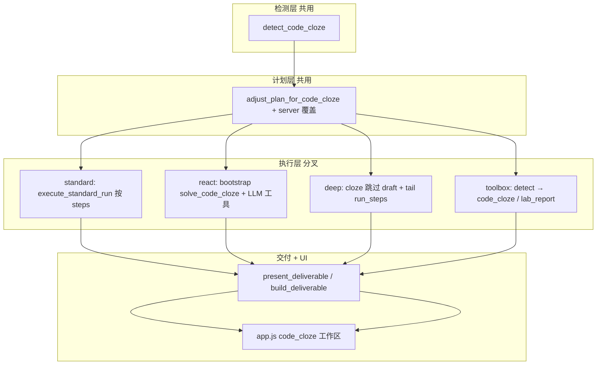

# 代码完形填空 — 模式路由与改动边界

**日期**: 2026-06-08  
**状态**: 📋 开发指导（实施前必读）  
**读者**: 改 Agent / 工具箱 / Step3 的开发者  
**关联**: [CODE_CLOZE_QUESTIONS.md](CODE_CLOZE_QUESTIONS.md)（题型规格）· [RUNTIME_LOGIC_ISSUES.md](../architecture/RUNTIME_LOGIC_ISSUES.md) · [V1_BUGFIX_LOG.md](../logs/V1_BUGFIX_LOG.md) BF45–BF49

---

## 一、为什么需要本文档

`code_cloze` 不是「多一个 LLM prompt」那么简单，而是 **题型 → 计划 → 执行 → 交付物 → UI** 五层都要对齐。

BF47–BF49 的教训：**计划层已识别填空，执行层仍走 `solve_lab`**，用户看到整段实验报告代码。根因是各运行模式有独立入口，只改 Planner 不够。

> **改动前**：先查本文 §二 能力矩阵 + §五 文件边界，确认你要改的是哪一层、哪种 `run_mode`。

---

## 二、能力矩阵（当前真相）

| 入口 | `run_mode` / 模式 | 计划含 `solve_code_cloze` | 执行走填空 | Step3 空号 UI | 备注 |
|------|-------------------|---------------------------|------------|---------------|------|
| 引导模式 · 生成计划 → 执行 | **standard** | ✅ | ✅ | ✅ | **推荐路径** |
| 引导模式 · ReAct | **react** | ✅ | ✅（BF49） | ✅ | bootstrap 须 cloze 而非 `solve_lab` |
| 引导模式 · 深度 | **deep** | ✅（server 强制覆盖） | ✅（BF50 / R1） | ✅ | 跳过 `solve_lab` draft，直接 tail |
| 工具箱 · #2 AI 解题 | —（`/api/tool/solve`） | — | ✅（R2 / BF51） | 部分 | 工具箱输出区空号列表；Step3 工作区仍走引导模式 |
| 遗留 `/api/solve` | — | — | ✅（R3 / BF52） | — | backward compat；与 tool_solve 共用 `_solve_text_cloze_or_lab` |

**用户话术对照**：

- 「普通模式」= 设置里 **标准**（`standard`），不是工具箱。
- 「工具箱」= Step2 顶部 Tab 切换，走 `/api/tool/*`，与 Agent 计划无关。

---

## 三、五层数据流（单一事实来源）

### 3.1 题型检测（无 LLM）

| 步骤 | 位置 | 输出 |
|------|------|------|
| 规则检测 | `modules/code_cloze.py` → `detect_code_cloze` | `{ is_code_cloze, blank_count, blanks, language_hint }` |
| 解析写入 | `agent/parse_documents.py` | `question.type = code_cloze`，`metadata.code_cloze` |
| 计划前兜底 | `server.py` `/api/agent/plan` | 对缓存/合体文档二次探测 |
| 执行前兜底 | `server.py` `/api/agent/run` | 读 **`doc_ctx`**（勿用未初始化的 `ctx`，BF48） |

**判定条件**（勿随意改阈值）：≥2 个编号空 + 代码特征启发式。见 [CODE_CLOZE_QUESTIONS.md §3.3](CODE_CLOZE_QUESTIONS.md)。

### 3.2 计划塑形

| 步骤 | 位置 | 行为 |
|------|------|------|
| Planner 规则 | `planner.adjust_plan_for_code_cloze` | 仅保留 `solve_code_cloze` + `present_deliverable` |
| API 强制覆盖 | `server.py` plan 末尾 | `question.type == code_cloze` 时重写 `plan.steps` |
| 深度计划 | `understand_plan.py` | LLM 产出步骤后仍被 server 覆盖（若已判 cloze） |

**填空计划标准形态**（两步，勿加 `run_code` / `solve_lab`）：

```json
[
  { "module": "solve_code_cloze", "params": { "language": "java" } },
  { "module": "present_deliverable", "params": {} }
]
```

### 3.3 执行（因模式而异 — 最易改坏）



| 模式 | 执行入口 | 填空关键逻辑 |
|------|----------|--------------|
| standard | `executor.execute_standard_run` | 顺序跑 `steps[]` 中的 module；**无** bootstrap |
| react | `react_loop.run_react_loop` | `_is_code_cloze_run` → `_bootstrap_solve_code_cloze`；registry 须有 `react_alias` |
| deep | `deep_pipeline.execute_deep_run` | `is_code_cloze_run` 为真时跳过 draft/reflect，直接 `run_steps`（R1 / BF50） |
| toolbox | `server.tool_solve` | `detect_code_cloze` → `call_ai(code_cloze)` 或 `solve_lab()`（R2） |

### 3.4 解题 LLM

| 模块 | 调用链 |
|------|--------|
| `solve_code_cloze` | `executor._run_solve_code_cloze` → `llm_client.call_ai`（`q_type=code_cloze`）→ `normalize_code_cloze_parsed` |
| ~~错误路径~~ | `solve_lab` / V4 pipeline → 整段报告 JSON，**不是**填空 |

### 3.5 交付物与前端

| 步骤 | 位置 | 要求 |
|------|------|------|
| 汇编 | `modules/deliverable.build_deliverable` | `type: code_cloze`，`code_cloze.blanks` |
| 取解题结果 | `deliverable._get_solve_data` | 顺序：**solve_code_cloze → solve_lab → solve_theory** |
| Run 收尾 | `app.js` `applyAgentRunDone` | 优先 `mr.solve_code_cloze.data` |
| 提前展示 | SSE `progress`（`present_deliverable` done） | `executor_common.py` 附带 `deliverable`；`app.js` 立即 `renderDeliverableWorkspace`（BF55） |
| 校验 | `agent/quality.verify_answer` | `code_cloze` 仅 `code_cloze_schema` + 占位符/教师约束；**不**查 `steps_analysis` 等报告字段（BF55） |
| 渲染 | `isCodeClozeDeliverable` / `renderCodeClozeWorkspace` | 勿与 `lab_report` 三栏混用 |

---

## 四、分模式详解

### 4.1 标准模式（推荐）

**路径**：Step1 解析 → Step2 生成计划 → 执行计划（`run_mode=standard`）

1. `/api/agent/plan` 检测 + 塑形计划  
2. `/api/agent/run` → `start_run_async` → `execute_standard_run`  
3. 循环 `steps`：`solve_code_cloze` → `present_deliverable`  
4. SSE `progress`（`present_deliverable` done）→ Step3 空号 UI（可早于 `done`）  
5. `run_verify` → SSE `verification`（执行中前端不展示失败态）；SSE `done` 收尾  

**改动注意**：改 `execute_standard_run` 时勿破坏 `solve_lab` 的 dirty 复用 / replan 逻辑；cloze 步骤应走同一 `run_module` 分发。

### 4.2 ReAct 模式

除标准计划外，还须对齐 **三处**（缺任一即 BF49 复发）：

| # | 文件 | 必须行为 |
|---|------|----------|
| 1 | `registry.py` | `solve_code_cloze.react_alias` 非空 |
| 2 | `react_loop.py` | `_is_code_cloze_run` 为真时 **不** bootstrap `solve_lab` |
| 3 | `react_prompts.py` | checklist 标明禁止 `solve_lab` / `run_code` |

**勿**在 ReAct 全局 prompt 里写死「须先 solve_lab」而不判断题型。

### 4.3 深度模式（R1 已修 · BF50）

`execute_deep_run` 通过共用 `agent/cloze_run.is_code_cloze_run`（与 ReAct 同源）判断填空计划：

- **code_cloze**：跳过 `solve_lab` draft / preflight / reflect，记录 `skip_solve_lab_draft` 决策后直接 `orch.run_steps(steps)`  
- **lab_report**：行为不变——无计划中 `solve_lab` 时仍合成默认 draft 步骤  

验收：深度 + 填空题日志中 **无** `solve_lab phase=draft`，仅 `solve_code_cloze` → `present_deliverable`。

### 4.4 工具箱模式（R2 已接入 · BF51）

`POST /api/tool/solve` 逻辑（2026-06-08）：

1. 对 `text` 跑 `detect_code_cloze`（与 Agent 共用规则，勿改阈值）  
2. **`is_code_cloze`**：`call_ai(..., type=code_cloze)`，返回 `type: code_cloze` + `parsed.blanks` + `code_cloze_detected`  
3. **否则**：原 `solve_lab()` 路径，`type: lab_report`，行为不变  
4. `app.js`：`formatSolveToolOutput` 在工具箱 #2 输出区展示空号列表；提示可切引导模式用 Step3 工作区  

**勿**改 `solve_lab` 内部；**勿**污染 `/api/agent/run`。

`/api/solve` 遗留接口（R3 / BF52，2026-06-08）：与 `tool_solve` 共用 `_solve_text_cloze_or_lab`；`question.full_text` 或顶层 `text` 探测填空。

---

## 五、文件改动边界

### 5.1 按层分类

| 层级 | 可改（cloze 相关） | 改动时连带检查 |
|------|-------------------|----------------|
| 检测 | `code_cloze.py`, `parse_documents.py`, `parse_report.py` | 标准 `lab_report` / `theory` 回归 |
| 计划 | `planner.py`, `server.py` plan | `adjust_plan_for_code_cloze` 不删 `present_deliverable` |
| 执行 | `executor.py`, `react_loop.py`, `registry.py`, `react_tools.py`, `react_prompts.py` | **每个 run_mode 各测一遍** |
| 深度 | `deep_pipeline.py` | 仅 cloze 分支；勿动 reflect 对 lab 的语义 |
| 交付 | `deliverable.py`, `run_result.py`, `quality.py` | `_get_solve_data` 优先级 |
| 前端 | `app.js`（`applyAgentRunDone`, `buildDeliverableFromSolveData`, cloze UI） | `lab_report` 工作区不回归 |
| 工具箱 | `server.py` tool_* , `app.js` toolbox | **独立 PR** |

### 5.2 禁止 / 高风险操作

| ❌ 不要 | 原因 |
|---------|------|
| 只在 `planner` 加 `solve_code_cloze`，不查 ReAct bootstrap | BF49 |
| 在 `make_agent_context` 之前读 `ctx` 做探测 | BF48 |
| 全局把 `solve_lab` bootstrap 关掉 | 实验报告 ReAct 会断 |
| 在 `solve_lab` / V4 pipeline 内塞填空逻辑 | 应走 `solve_code_cloze` 模块 |
| `present_deliverable` 只认 `solve_lab` | cloze 交付失败 |
| 工具箱改法污染 `/api/agent/run` | 职责混淆 |

### 5.3 改动自检清单（PR 前）

- [x] 粘贴 Singleton / Facade 例题 → 计划含 `solve_code_cloze`，**不含** `solve_lab`（`test_planner` + `/api/agent/plan` mock）
- [x] 粘贴 Singleton / Facade 例题 → Step1/Step2 解析完成显示「代码填空 · 检测到 N 个空」（R4）
- [x] 上传 Singleton 填空 `.docx` → `/api/parse-report` 返回 `question.type=code_cloze` + `metadata.code_cloze.blank_count`（R5）
- [x] 普通 `programming_lab.docx` → 仍 `lab_report`（R5 回归）
- [x] **standard** 执行 → 模块序仅 `solve_code_cloze` + `present_deliverable`（`test_run_modes_golden` mock）；Step3 空号列表需 E2E/手测
- [x] **react** 执行 → 第 0 轮 bootstrap 为 `solve_code_cloze`，非 `solve_lab`（`test_run_modes_golden` mock）；Step3 需 E2E/手测
- [x] **deep** 执行 → 无 `solve_lab` draft，仅 `solve_code_cloze` + `present_deliverable`（R1 / BF50）
- [x] **toolbox** 粘贴 Singleton / Facade 例题 → `/api/tool/solve` 返回 `type: code_cloze` + `blanks`（R2 / BF51 · `test_toolbox`）
- [ ] 普通 Java 实验报告 → 仍走 `solve_lab`，Step3 三栏正常（需 E2E/手测）
- [x] `python -m pytest tests/test_react_loop.py tests/test_planner.py -q` 通过
- [x] `build_deliverable` 对 cloze 输出 `type` + `code_cloze.blanks`（`test_code_cloze_scoring`）
- [x] **R6** HTML Facade 题「核对答案」：空格容错 + `answer_alt` 计为正确
- [x] **R6** `pytest tests/test_code_cloze_scoring.py` 通过
- [x] **R7** Step3：`metadata.reference_blanks` 存在时显示「与参考答案对照」；无则 UI 不变
- [x] **R7** `pytest tests/test_code_cloze_scoring.py`（含 deliverable 透传）通过
- [x] **R8** 上传 `mixed_theory_cloze.docx` → `metadata.mixed_assignment` + `questions[]` 含 theory + code_cloze
- [x] **R8** 混排卷计划含 `solve_theory` + `solve_code_cloze`（文档顺序），无 `solve_lab`
- [x] **R8** `code_cloze_singleton` / 纯粘贴 Singleton 仍单题 `code_cloze`
- [x] **R8** `pytest tests/test_mixed_assignment.py` 通过
- [x] **R9** ReAct 混排 bootstrap 含 `solve_theory` + `solve_code_cloze`，checklist 标混排规则
- [x] **R9** 深度混排无 `solve_lab` draft；Step3 段导航不被填空 UI 覆盖
- [x] **R9** `pytest tests/test_mixed_assignment.py`（含 R9 用例）+ 深度 golden 通过

---

## 六、验收用例（金样本）

### 6.1 应判 `code_cloze`

- Singleton `MainControllerCenter` 四空（`static` / `private` / `new ...` / 懒汉式）
- Facade `XMLFacade` 九空（见 [CODE_CLOZE_QUESTIONS.md §七](CODE_CLOZE_QUESTIONS.md)）

### 6.2 不应判 `code_cloze`

- 纯文字简答题  
- 要求「编写完整程序并运行」的实验报告  
- 仅 1 个编号空  

### 6.3 各模式预期

| 模式 | 预期首条解题进度 |
|------|------------------|
| standard | `solve_code_cloze` running → done |
| react | bootstrap `solve_code_cloze` OK |
| deep | `solve_code_cloze` running → done（无 draft） |
| toolbox（R2） | `call_ai(code_cloze)` → 工具箱空号列表；Step3 仍须引导模式 |

---

## 七、待办与优先级

| ID | 项 | 优先级 | 说明 |
|----|-----|--------|------|
| R1 | 深度模式跳过 cloze 的 `solve_lab` draft | ✅ | `deep_pipeline.py` + `cloze_run.py`（BF50） |
| R2 | 工具箱 `tool_solve` 分支 | ✅ | `server.tool_solve` + `formatSolveToolOutput`（BF51） |
| R3 | `/api/solve` 分支 | ✅ | `_solve_text_cloze_or_lab` + `test_api_solve.py`（BF52） |
| R4 | Step1 粘贴预览徽章 | ✅ | `app.js` 解析完成 UI（`codeClozeParseBadge` + 题目摘要） |
| R5 | Phase D Word 导入 | ✅ | `parse_report.extract_docx_code_cloze_text` + `detect_code_cloze_for_docx`；`parse_single_file` 空 `assignment_text` 回退 `full_text` |
| R6 | Phase E 判分 / normalize | ✅ | `code_cloze.normalize_cloze_answer` + `match_cloze_answer`；HTML「核对答案」；**不改** run/Step3 |
| R7 | Phase E+ Step3 只读对照 | ✅ | `reference_blanks` 透传 + `renderCodeClozeWorkspace` 折叠对照表；**不改** run/执行层 |
| R8 | Phase F 混排拆题 O10 | ✅ | `parse_report` 切段 + `build_mixed_assignment_plan`；executor `segment_text` + 全卷上下文；`mixed_assignment` 交付；ReAct/deep bootstrap 混排 |
| R9 | Phase G 混排联调/UI | ✅ | ReAct checklist + `solve_theory` alias 回退；深度 golden；Step3 混排 UI；分段 `reference_blanks` |

**实施顺序建议**：R1 → R2 → R6（HTML）→ R7（Step3 对照）→ R8（混排拆题）→ R9（混排联调/UI）。

### 7.1 Phase E / E+ 改动边界（R6 / R7）

| 层级 | R6 可改 | R7 可改 | 禁止 |
|------|---------|---------|------|
| 判分核心 | `code_cloze.py` normalize/match | `normalize_reference_blanks` | `normalize_code_cloze_parsed` 语义变更 |
| 练习 UI | `exam-bank-with-checkboxes.html` | — | — |
| Step3 UI | — | `app.js` `renderCodeClozeWorkspace` + CSS | `lab_report` 三栏 |
| 交付 | — | `deliverable.py` 透传 `reference_blanks` | — |
| API / 执行 | — | — | 新增判分 API；`executor` / run 路径 |

---

## 八、相关 BF 索引

| BF | 教训 |
|----|------|
| BF47 | 检测不能只在 `assignment_only`；`fill_target` / server 二次探测 |
| BF48 | run 阶段变量生命周期：`doc_ctx` vs `ctx` |
| BF49 | 计划 ≠ 执行；ReAct 须独立 cloze 路径 |
| BF50 | 深度模式仍默认 `solve_lab` draft；共用 `is_code_cloze_run` 跳过 |
| BF51 | 工具箱 `tool_solve` 恒 `solve_lab`；`detect_code_cloze` 分支 + 空号输出 |
| BF52 | 遗留 `/api/solve` 恒 `solve_lab`；R3 共用 helper 分支 |
| BF53 | docx `fill_only` 二次探测用空 `assignment_text`；R5 代码段抽取 + 回退 `full_text` |
| BF55 | Step3 误显校验失败：`schema_complete` 误用于 cloze + `auto_remediate` 重跑 `solve_lab`；见 `quality.py` / `app.js` |
| BF45–BF46 | 启动 / 计划指纹与 cloze 正交，但联调时要一起测 |

---

*文档版本 1.1 · 实施 code_cloze 跨模式改动前必读（+ BF55 校验/UI）*
