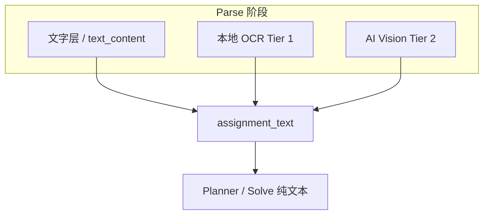

# 识图能力探测与保守启用策略

**版本**: 2026-06-18  
**状态**: 📝 设计稿（待实施）  
**策略**: **保守** — 默认仅本地 OCR；AI 识图需用户明确开启；不支持时静默回退，不阻断解题。  
**关联**: [IM_OCR_FIRST.md](../v2/IM_OCR_FIRST.md) · [V2_IMAGE_INPUT.md](../v2/V2_IMAGE_INPUT.md) · [MODEL_REGISTRY.md](MODEL_REGISTRY.md) · [HOSTED_LLM_PROVIDERS.md](HOSTED_LLM_PROVIDERS.md) · `llm_client.supports_vision` · `model_registry.py`

---

## 1. 背景与问题

### 1.1 现状（2026-06-06 已落地）

| 能力 | 模块 | 默认 |
|------|------|------|
| 本地 OCR | `image_read.ocr_batch` | `imageReadingMode=ocr_only` |
| AI 识图（Vision） | `image_read.vision_batch` + `llm_client.chat_vision` | **opt-in**（`hybrid` / `vision`） |
| 能力判断 | `supports_vision(settings)` | 按 model 名字符串启发式匹配 |

IM 主路径设计见 [IM_OCR_FIRST.md](../v2/IM_OCR_FIRST.md)：**识图不绑定多模态 API**，Agent 全程只吃 `assignment_text` 纯文本。

### 1.2 新现实（2026-06 起）

- 部分厂商（如 **DeepSeek V4**）在**灰度**开放 API 识图，能力随账号/时间变化，静态文档易过期。
- 用户 **BYOK**，模型组合多样；多数人**不清楚**自己的 Key 是否支持识图。
- 托管 **Agnes** 明确**不支持** Vision，与 DeepSeek 等 BYOK 路径并存。

### 1.3 要解决什么

| 问题 | 目标 |
|------|------|
| 用户不知道模型能否识图 | 系统代为判断 + 诚实展示，不要求用户懂「多模态」 |
| 静态 catalog 会过期 | catalog 声明 + 运行时探测 + 失败记忆 |
| 不能每个 LLM 都能识图 | **解题**与**识图**能力分离；识图失败不阻断解题 |
| 灰度能力不稳定 | 标 `beta`，保守默认，失败回退 OCR |

### 1.4 产品决策（已定）

> **保守策略**：保持 `ocr_only` 为默认；用户须**主动**选择混合/AI 识图；Vision 不可用或失败时**静默回退 OCR** 并给出可操作建议，不弹阻断性错误。

---

## 2. 设计原则

1. **OCR 仍是主路径** — 无 Tesseract、无 Vision、无 Key 时，用户仍可粘贴文字解题。
2. **不问用户不懂的事** — UI 用场景语言（扫描件、识别不准），不用「多模态 API」「content parts」。
3. **解题 ≠ 识图** — Plan / Solve 用任意文本模型；Vision 仅在 parse 阶段把图变成字。
4. **失败可恢复** — Vision 报错 → 回退 OCR → O30 预览标明来源 → 用户可手改或粘贴。
5. **能力信息可组合** — catalog 静态标 + 首次探测 + 本地失败缓存，三者互补。
6. **托管与 BYOK 分轨** — Agnes 永不走 Vision；BYOK 按 catalog + 探测处理。

---

## 3. 三层识图能力（Tier）

与 [IM_OCR_FIRST.md](../v2/IM_OCR_FIRST.md) §3 对齐，产品层命名如下：

| Tier | 名称 | 依赖 | 默认 |
|------|------|------|------|
| **0** | 文字层 / 粘贴 | 无 | 始终可用 |
| **1** | 本地 OCR | Tesseract（可选） | **默认识图路径** |
| **2** | AI 辅助识图 | Vision API + Key + 模型支持 | **用户 opt-in** |



**保守规则**：未在设置中开启 Tier 2 相关模式时，**绝不**调用 `chat_vision`，即使用户模型已支持识图。

---

## 4. 模型能力：catalog 字段

在 [MODEL_REGISTRY.md](MODEL_REGISTRY.md) 的 `_PROVIDER_MODELS` 每条 preset 上扩展：

| 字段 | 类型 | 说明 |
|------|------|------|
| `supports_vision` | `bool` | catalog 是否声明支持 AI 识图 |
| `vision_status` | enum | `stable` \| `beta` \| `unsupported` |

### 4.1 `vision_status` 语义

| 值 | 含义 | UI 标签 | 保守默认行为 |
|----|------|---------|----------------|
| `stable` | 官方已开放识图 API | 「AI 识图 ✅」 | 用户开 hybrid/vision 时可用 |
| `beta` | 灰度 / 新能力（如 DeepSeek 识图灰度） | 「AI 识图（测试中）⚠️」 | 同 stable，但文案提示可能不稳定 |
| `unsupported` | 明确不支持 | 无标签 / 灰色说明 | 隐藏「仅 AI 识图」；hybrid 不调用 Vision |
| （缺省） | `custom` 等未知模型 | 「将尝试，失败回退 OCR」 | 仅用户选 hybrid/vision 时**探测** |

### 4.2 初始 catalog 建议（实施时写入 `model_registry.py`）

| Provider | Model | `supports_vision` | `vision_status` | 备注 |
|----------|-------|-------------------|-----------------|------|
| deepseek | `deepseek-v4-flash` | `true` | `beta` | 灰度识图；以探测为准 |
| deepseek | `deepseek-v4-pro` | `true` | `beta` | 同上 |
| openai | `gpt-4o` 等 | `true` | `stable` | 已有 IM5 覆盖 |
| openai | `gpt-4o-mini` | `true` | `stable` | |
| claude | claude-3.x 系列 | `true` | `stable` | |
| zhipu | `glm-4-flash` / `glm-4` | `false` | `unsupported` | 文本模型 |
| agnes | `agnes-2.0-flash` | `false` | `unsupported` | 见 [HOSTED_LLM_PROVIDERS.md](HOSTED_LLM_PROVIDERS.md) |
| custom | `custom-model` | — | （未知） | 运行时探测 |

> **维护**：厂商正式公告识图 GA 后，将对应 model 的 `vision_status` 改为 `stable`；仅改 `model_registry.py` + bump `MODEL_CATALOG_VERSION`。

### 4.3 API 下发

`GET /api/llm-models` 在现有 `providers[].models[]` 中附带 `supports_vision`、`vision_status`，供设置页与 Step1 提示使用。前端 `FALLBACK_MODEL_CATALOG` 保持同步。

---

## 5. 运行时探测与失败记忆

静态 catalog **不能**单独决定一切；保守策略下探测**不主动打扰**默认 OCR 用户。

### 5.1 何时探测

| 时机 | 是否探测 | 说明 |
|------|----------|------|
| 应用启动 | ❌ | 不增加延迟与费用 |
| 测试连接 | ⚪ 可选 | 设置页勾选「同时检测 AI 识图能力」；默认**关闭** |
| 用户选 `hybrid` / `vision` 后**首次** parse | ✅ | 仅第一张待 Vision 图试调；成功则缓存 |
| 用户仍为 `ocr_only` | ❌ | **绝不**因探测调用 Vision |

### 5.2 探测方式

1. 使用极小 fixture 图（如 `tests/fixtures/image_input/ocr_simple_zh.png` 缩略版）调用 `chat_vision` 一次。  
2. 成功 → 写入本地缓存 `vision_probe: { provider, model, key_fingerprint } → ok`。  
3. 失败且错误可归因为「不支持 image / multimodal」→ 缓存 `unsupported` + 原因摘要。  
4. 网络/限流等临时错误 → **不**写 `unsupported`，本次回退 OCR，下次可再试。

`key_fingerprint` = `sha256(api_key)[:16]`，避免明文存 Key。

### 5.3 失败记忆（用户侧）

存储位置：settings 或 `APP_DATA/vision_probe_cache.json`（与 Key 存储分离，不含 Key 明文）。

```json
{
  "deepseek:deepseek-v4-flash:abc123": {
    "status": "unsupported",
    "reason": "model does not support image input",
    "probed_at": "2026-06-18T12:00:00Z"
  }
}
```

UI 行为：

- hybrid/vision 模式下探测为 `unsupported` → 跳过 Vision，走 OCR，warn：`vision_unavailable`（已有 code）。  
- 设置页在模型旁显示：「此账号暂不支持 AI 识图（已检测）」+ 链接「重新检测」。

### 5.4 与 `supports_vision()` 的关系

```
effective_vision_capable(settings) =
  if provider == agnes → false
  else if cached_probe == unsupported → false
  else if cached_probe == ok → true
  else if catalog.supports_vision → true  // 仍可能 beta，首次 parse 再验证
  else if provider == custom → unknown    // 用户开 hybrid/vision 时才探测
  else → false
```

`supports_vision()` 逐步收敛为读 catalog + 缓存；**启发式 model 名字符串**保留为 custom/未知时的 fallback。

---

## 6. 用户可见：识图模式（保守文案）

内部枚举**不变**（`ocr_only` | `hybrid` | `vision`），设置页展示改为场景导向：

| 设置 UI 文案 | 内部值 | 默认 | 说明 |
|--------------|--------|------|------|
| **仅本地识别（推荐）** | `ocr_only` | ✅ **默认** | 不消耗 LLM API 识图额度 |
| **混合：本地优先，不够再用 AI** | `hybrid` | | 仅当 `effective_vision_capable` 时启用 Tier 2；否则等同 OCR + 说明 |
| **优先 AI 识图** | `vision` | | 跳过 OCR；无 Vision 时 warn 并建议改模式 |

**不提供的选项**（保守）：

- ❌ 「自动（检测到图就用 AI）」— 避免默认多耗 API。  
- ❌ 「让系统每次自动探测」— 仅用户切换到 hybrid/vision 时探测。

### 6.1 设置页附加说明（模板）

**仅本地识别**  
> 使用本机 Tesseract 识别图中文字，不调用 AI 识图。需自行安装 Tesseract；识别不准可在识题预览中修改或粘贴文字。

**混合**（当前模型支持 AI 识图时可选）  
> 先本地 OCR；某页识别失败或置信度过低时，再用当前 AI 模型补充（会消耗少量 API）。若账号未开通识图，将自动仅用本地 OCR。

**优先 AI 识图**（同上，可选）  
> 直接使用 AI 读取题目图，适合复杂排版；消耗 API 较多。无识图能力时将提示并建议改用「仅本地识别」。

---

## 7. 分场景 UI 提示

### 7.1 设置 · 模型下拉

| catalog | 模型行展示 |
|---------|------------|
| `vision_status=stable` | 模型名 + 小标签 `识图` |
| `vision_status=beta` | 模型名 + `识图·测试` |
| `unsupported` | 无标签 |
| 探测失败缓存 | 模型名 + 灰色 `识图不可用` |

### 7.2 Step1 · 题目图组

| 条件 | 提示（示例） |
|------|----------------|
| `ocr_only` + 有图 | 「将使用本地 OCR；识别不准请粘贴文字，或在设置中开启混合识图」 |
| `hybrid` + Vision 可用 | 「将先本地识别，不清楚的页再用 AI 补充」 |
| `hybrid` + Vision 不可用 | 「当前模型不支持 AI 识图，将仅使用本地 OCR」 |
| 无 Tesseract + `ocr_only` | 「未检测到 Tesseract，请粘贴题目或安装 OCR 引擎」 |
| Agnes + 任意识图模式 | 「Agnes 不支持 AI 识图；请使用本地 OCR 或切换 DeepSeek 等提供商」 |

### 7.3 Step2 · 识题预览（O30）

保留现有 `source: ocr | vision` 分节标识；摘要行示例：

> 题干来源：本地 OCR 3 张 · AI 识图 1 张

若本次 Vision 被跳过：

> AI 识图未使用（当前模型不支持）；以下为本地 OCR 结果，请核对。

### 7.4 已有 warn code（沿用）

| code | 含义 |
|------|------|
| `vision_unavailable` | 模型/账号不支持，已跳过 Vision |
| `vision_no_api_key` | hybrid/vision 但未带 Key |
| `vision_limit_exceeded` | 超过 `imageVisionMaxPages` |
| `ocr_unavailable` | 无 Tesseract |
| `ocr_suggested` | 正文短且有图，建议开 OCR |

---

## 8. 提供商特例

### 8.1 Agnes（托管）

- catalog：`supports_vision=false`，`vision_status=unsupported`。  
- 设置页：隐藏或禁用 hybrid/vision（或选了也强制 `ocr_only`）。  
- 与 [HOSTED_LLM_PROVIDERS.md](HOSTED_LLM_PROVIDERS.md) §2.1 一致。

### 8.2 DeepSeek（灰度识图）

- catalog：`supports_vision=true`，`vision_status=beta`。  
- **默认仍为 `ocr_only`**；用户主动开 hybrid 后首次 parse 探测。  
- 探测失败：不质疑用户 Key 解题能力，仅说明「识图未开通，已用 OCR」。  
- 官方 GA 后：改为 `stable`，更新 [MODEL_REGISTRY.md](MODEL_REGISTRY.md) 变更记录。

### 8.3 自定义 API

- catalog 无断言 → `unknown`。  
- 仅用户选择 hybrid/vision 时探测；失败回退 OCR。  
- 不在 catalog 中穷举第三方 model 名。

---

## 9. 设置项（变更摘要）

现有项保留，默认值与语义**不变**（保守）：

| Key | 默认 | 说明 |
|-----|------|------|
| `enableImageOcr` | `false` | 是否对嵌入图/题图跑 OCR（见 IM §6 触发条件） |
| `imageReadingMode` | **`ocr_only`** | 不变 |
| `imageVisionMaxPages` | `5` | 不变 |
| `imageOcrMaxPages` | `20` | 不变 |

**新增（可选）**：

| Key | 默认 | 说明 |
|-----|------|------|
| `visionProbeOnTestConnection` | `false` | 测试连接时是否顺带测识图 |
| （内部）`visionProbeCache` | — | 不暴露给用户；可「重新检测」清除 |

---

## 10. 实施分期（建议）

| 阶段 | 内容 | 触碰模块 |
|------|------|----------|
| **V1** | catalog 增加 `supports_vision` / `vision_status`；`GET /api/llm-models` 下发；设置页模型标签 | `model_registry.py` · `app.js` |
| **V2** | `effective_vision_capable()`；DeepSeek beta 标记；Agnes 强制禁用 Vision UI | `llm_client.py` · `app.js` |
| **V3** | 首次 parse 探测 + `vision_probe_cache`；测试连接可选探测 | `image_read.py` · `settings_schema.py` |
| **V4** | 设置页识图模式文案改版；Step1/Step2 动态提示 | `index.html` · `app.js` |
| **V5** | 单测 + 更新 [IM_OCR_FIRST.md](../v2/IM_OCR_FIRST.md) §5.4 状态 | `tests/test_image_input.py` · `tests/test_model_registry.py` |

**明确不做（本期）**：

- 默认改为 hybrid / 自动 AI 识图。  
- Solve / Plan 阶段直接传图给 LLM。  
- 为识图单独换模型（如 OCR 用 DeepSeek、解题用 Agnes）— 留 backlog。

---

## 11. 验收标准

| ID | 场景 | 通过标准 |
|----|------|----------|
| VC1 | 新装默认 | `imageReadingMode=ocr_only`；有题图也不调 `chat_vision` |
| VC2 | DeepSeek + 用户开 hybrid + 账号支持识图 | 空页/低置信 OCR 走 Vision；O30 标 `vision` |
| VC3 | DeepSeek + 用户开 hybrid + 账号**不**支持 | 全程 OCR；`vision_unavailable`；解题正常 |
| VC4 | Agnes + 用户尝试 hybrid | UI 禁用或回退 OCR；不调 Vision |
| VC5 | custom unknown + hybrid | 首次探测；失败则 OCR |
| VC6 | 用户改回 `ocr_only` | 清除「将用 AI」类提示；parse 无 Vision 调用 |
| VC7 | catalog `beta` 改 `stable` | 仅 registry 变更后 UI 标签更新，默认仍为 OCR |

```bash
python -m pytest tests/test_image_input.py tests/test_model_registry.py -q
```

---

## 12. 风险与对策

| 风险 | 对策 |
|------|------|
| 用户不知道要开 hybrid | Step1 有图 + `ocr_only` 时轻提示「可去设置开启混合识图」；不自动开启 |
| 探测误伤（网络抖动） | 临时错误不写 `unsupported` 缓存 |
| catalog 与灰度不一致 | beta + 探测为准；文档注明维护节奏 |
| 用户以为「能解题就能识图」 | 模型下拉区分「解题」与「识图」标签；O30 展示来源 |
| API 费用 | 保守默认 OCR；`imageVisionMaxPages` 上限保留 |

---

## 13. 状态跟踪

| ID | 项 | 状态 |
|----|-----|------|
| DOC | 本文档 | 📝 设计稿 2026-06-18 |
| V1 | catalog 字段 + API 下发 | ⬜ |
| V2 | effective_vision_capable + Agnes/DeepSeek | ⬜ |
| V3 | 探测与缓存 | ⬜ |
| V4 | UI 文案与动态提示 | ⬜ |
| V5 | 测试与 IM 文档回写 | ⬜ |

---

## 14. 给实施 Agent 的指令

```
实施识图能力保守策略（本文档）：
- 默认保持 imageReadingMode=ocr_only，禁止改为自动 hybrid
- model_registry 增加 supports_vision / vision_status；DeepSeek V4 标 beta
- Agnes 永不 Vision；custom 仅用户 opt-in 时探测
- Vision 失败静默回退 OCR，沿用 vision_unavailable 等 warn
- 完成后更新本文档 §13 状态表，并回写 IM_OCR_FIRST.md §5.4 引用本文档
```

---

*文档版本：2026-06-18 · 保守策略：OCR 默认，AI 识图 opt-in，catalog + 探测 + 回退*
