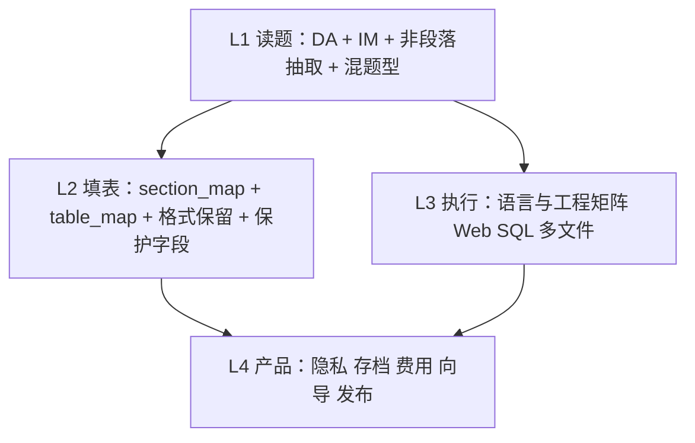
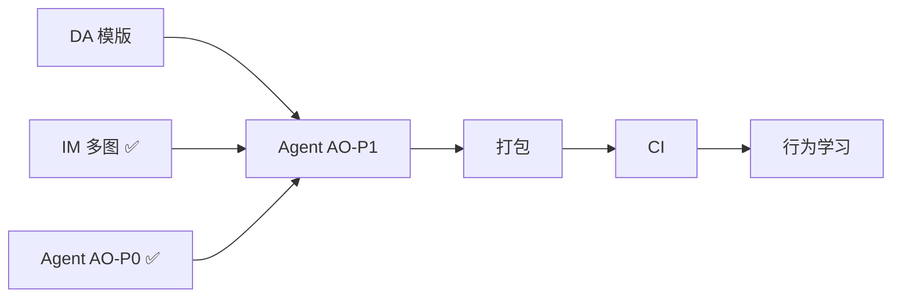

# Lab-Solver — 下一版本 Backlog（v2）

**用途**：记录 V1 刻意不做、留到下一版的功能与发布基建。  
**V1 状态（2026-06-03）**：Agent 标准/深度、分节工作台、多文档、范文、PDF 读/导出、verify/revise、compliance、safeStorage、plan/feedback（C1）、本地 pytest（C4）均已落地。  
**关联**：[IMPLEMENTATION_PHASES.md](../architecture/IMPLEMENTATION_PHASES.md) §四 · [LAB_SOLVER_AGENT_PLAN.md](../architecture/LAB_SOLVER_AGENT_PLAN.md) · [AGENT_ARCHITECTURE_V3.md](../architecture/AGENT_ARCHITECTURE_V3.md) · [V4_MULTI_PHASE_SOLVE.md](V4_MULTI_PHASE_SOLVE.md) · [V2_DOC_TEMPLATE_ADAPTATION.md](../v2/V2_DOC_TEMPLATE_ADAPTATION.md) · [V2_IMAGE_INPUT.md](../v2/V2_IMAGE_INPUT.md)

---

## 〇、V5 产品大改（最高优先级 · 2026-06-06 立项）

**战略转向**：不做「代跑 + 代填 Word」；改为 **生成实验答案内容（Deliverable）由用户自行落笔**；代码运行降级为**可选内化验证**；jar 仅验证沙箱且需用户同意。

**主文档**：**[V5_PRODUCT_PIVOT.md](V5_PRODUCT_PIVOT.md)**

**技术子方案**：[V4_MULTI_PHASE_SOLVE.md](V4_MULTI_PHASE_SOLVE.md)（分阶段 LLM + 验证沙箱，产品边界以 V5 为准）· **Agent 优化排期**：[AGENT_OPTIMIZATION_PLAN.md](../architecture/AGENT_OPTIMIZATION_PLAN.md)

| 阶段 | 内容 | 预估 |
|------|------|------|
| V5-0 | 默认 `deliverable`、答案工作区、去填表主路径 | ✅ 已落地 |
| V5-1 | V4 Pipeline 内化验证 + 用户约束 | ✅ 已落地 |
| V5-2 | 导出 Markdown/docx + 诚信标注 | 3 天 |
| V5-3 | JAR 沙箱（可选） | 3～4 天 |
| V5-4 | fill_report 降级高级区 | ✅ 已落地 |

---

## 〇-a、V4 分阶段解题（技术子项 · 并入 V5-1）

**问题**：一次 `solve_lab` 同时生成报告+代码+图表，代码成功率低；`fix_code` 事后补丁越修越坏。

**完整方案**：见 **[V4_MULTI_PHASE_SOLVE.md](V4_MULTI_PHASE_SOLVE.md)**（Phase 0 读题 → Phase 1 只写代码+**内化验证** → Phase 2 写报告 → Phase 3 图表）

| 阶段 | 内容 | 预估 |
|------|------|------|
| V4-0 | `SolvePipeline` 骨架 + 工具箱 `#2` + feature flag | 3～5 天 |
| V4-1 | Agent 标准/深度统一 + SSE 子阶段 | ✅ 核心（AO-P0 2026-06-06）；Planner 增强 → AO-P1 |
| V4-2 | 图表阶段 + ReAct 收敛 | 3 天 |
| V4-3 | 极速/稳妥档位 + 废弃 v1 单轮 `lab_report` | 2 天 |

**验收**：金样本 10 题首次 `run` 通过率 ≥80%（首跑基线 9/9=100%，见 AO 计划 §9.1）；`expected_output` 来自真实 stdout ✅。

---

## 〇-b、文档模版适配（v2 高优先级 · 已单独立项）

**问题**：V1 只适配「段落 + 三/四/五节」；真实模版包括 **表格型实训报告**（题目在表格里）与 **节号不统一**（如「四、实验总结」无第五节）。

**完整方案**：见 **[V2_DOC_TEMPLATE_ADAPTATION.md](../v2/V2_DOC_TEMPLATE_ADAPTATION.md)**（DA1–DA4）· **[V2_IMAGE_INPUT.md](../v2/V2_IMAGE_INPUT.md)**（图片/多图识题 IM1–IM5）

| 阶段 | 内容 |
|------|------|
| DA1–DA4 | 表格实训、节号映射、填表、UI |
| IM1–IM5 | 多图枚举、OCR、扫描 PDF、题图上传、Vision | ✅ 2026-06-06 |

---

## 〇-c、托管 LLM（Agnes 零配置 · 2026-06-06 ✅）

**动机**：降低新用户门槛；免费 Agnes API 由开发者在本机后端托管 Key。

**文档**：[HOSTED_LLM_PROVIDERS.md](../features/HOSTED_LLM_PROVIDERS.md)

| 项 | 状态 |
|----|------|
| `hosted_providers.py` + seed/status API | ✅ |
| 设置页 Agnes 预设、隐藏 Key 输入 | ✅ |
| `.env.example` + `tests/test_hosted_providers.py` | ✅ |

---

## 一、下一版优先项（你刻意未做 · 建议 v2.0 核心）

### 1. C2 — 画像行为学习（`apply_feedback`）

> **详细设计**：见 **[AGENT_ARCHITECTURE_V3.md](../architecture/AGENT_ARCHITECTURE_V3.md) §7**（与 Orchestrator / skill 候选队列一并规划，阶段 **V3-4 ✅**）。

| 项目 | 说明 |
|------|------|
| **背景** | V1 仅 `user_profile` v1：`default_language` / `prefer_uml` + 当次 metadata（`screenshot_style` 已于 V5-5 移除） |
| **目标** | 从 plan/feedback、revise 标签、用户取消步骤等**弱统计**，写入 `behavior.*` / `course_hints`，Planner 仅作**可选弱提示** |
| **约束** | 不能单独新增报告无依据的步骤；样本过少不写入 |
| **代码起点** | `src/python/agent/user_profile.py`（注释已标 deferred） |
| **API** | 扩展 `PUT /api/profile` 或 `POST /api/agent/plan/feedback` 可选 `apply_to_profile=true` |
| **UI** | 设置页开关：「根据使用习惯优化计划建议（本地）」 |
| **验收** | 多次取消某 module 后，下次 plan 该步默认不勾选（需可关闭）；单元测试 mock 计数，不调 LLM |

**参考**：`../architecture/LAB_SOLVER_AGENT_PLAN.md` §3 画像、`apply_feedback` 描述。

---

### 2. C3 — 扫描版 PDF OCR ✅（并入 IM3，2026-06-06 落地）

| 项目 | 说明 |
|------|------|
| **状态** | ✅ 已完成 — 见 [V2_IMAGE_INPUT.md](../v2/V2_IMAGE_INPUT.md) IM3 · [IM_OCR_FIRST.md](../v2/IM_OCR_FIRST.md) |
| **实现** | `extract_pdf.render_pdf_pages` · `pdf_page_render` · 无文字层自动 OCR · fixture `scanned_5page.pdf` |
| **约束** | Tesseract 可选；未安装时 warn + 设置页引导 / 粘贴兜底 |
| **残余** | O27 打包内置 Tesseract；非功能阻塞 |

**参考**：`../v2/V2_IMAGE_INPUT.md` §11 · `tests/test_image_input.py::TestIm3*`

---

### 3. GitHub Actions CI

| 项目 | 说明 |
|------|------|
| **背景** | V1 有 `requirements-dev.txt`、`tests/conftest.py`、`scripts/run-tests.bat`，**无**远程 CI |
| **目标** | push/PR 自动跑 Python 测试 +（可选）Node settings-store 测试 |
| **建议 workflow** | `.github/workflows/test.yml`：`pip install -r requirements-dev.txt` → `python -m pytest tests/` → `node tests/test_settings_store.js` |
| **不做** | 首版 CI 不必调真实 LLM；金样本 solve 继续 mock |
| **验收** | PR 上绿勾；失败时能看 pytest 日志 |

**本地对照**：`scripts/run-tests.bat`

---

### 4. Electron 打包脚本改动 + 完整发布验证

| 项目 | 说明 |
|------|------|
| **背景** | V1 跑过 `build-installer.bat` / `scripts/build-win.ps1`，有 `installer/win-unpacked/` 与 `LAST_BUILD.txt`；**未**改打包配置，仓库内**无** NSIS `.exe`，打包内 Python 可能落后于源码 |
| **目标** | 可重复产出 **安装包 `.exe`**，且 resources 与当前 `src/python`、`src/renderer` 一致 |
| **可能改动** | `package.json` `build` 段、`scripts/build-win.ps1`（输出路径、复制策略、python-dist）、`build-installer.bat` 增加「启动冒烟」步骤 |
| **验收清单** | ① `build-installer.bat` 零错误 ② `installer/*.exe` 存在 ③ 安装后：上传 docx → 标准 plan → run ④ 多文档 + 范文 + plan/feedback ⑤ Python `import agent.plan_feedback` 在打包环境 OK |
| **阻塞发布** | 原计划 `verify-packaging` todo；V1 标为部分完成 |

**参考**：`../features/KEY_STORAGE.md` §5（打包勿破坏 safeStorage IPC）

---

## 二、盲区与可选增强（按需排期）

> **说明**：§〇 的 DA / IM 解决「表格模版、节号错位、多图识题」等**主因**；本节收录评审中发现的**其它盲区**，按产品线归类，便于 v2+ 排「做 / 延后 / 永远不做」。

### 2.0 四条产品线（规划视角）



| 线 | v2 建议重心 |
|----|-------------|
| **L1 读题** | DA + IM + §2.1 非段落/混题型 |
| **L2 填表** | DA3 + §2.4 保护字段与格式 |
| **L3 执行** | §2.2 Web/SQL/多文件（或明确「只生成不跑」） |
| **L4 产品** | §2.5–2.8 识题预览、PII、存档、打包 |

---

### 2.1 文档读题（L1 延伸 · 未单列立项）

| ID | 项 | 现状 / 风险 | 优先级 |
|----|-----|-------------|--------|
| O7 | **Word 文本框 / 内容控件（SDT）** | 只读 `paragraphs`，题在文本框 → 漏读 | 中 |
| O8 | **页眉页脚** | 不抽取；要求常写在页脚 | 低 |
| O9 | **公式 OMML / 图表 Chart** | 不读；理综/数据类实验 | 低 |
| O10 | **同一 docx 混题型** | 解析几乎总是 `lab_report`；简答/选择 + 报告混排不会拆 | 中 |
| O11 | **附件型作业** | 题目 pdf + 报告 docx + 代码 zip 工程；无「工程型」pipeline | 中 |

*与 DA1 联动：嵌套表、单元格内图 → DA1 + IM1。*

---

### 2.2 执行与验证（L3）

| ID | 项 | 现状 / 风险 | 优先级 |
|----|-----|-------------|--------|
| O12 | **Web 实训（JSP/Servlet/Tomcat、浏览器截图）** | 仅单文件 Java/Python；实训周类无法跑通 | 高（Web 校） |
| O13 | **多文件 Java / Maven·Gradle 依赖** | 临时单文件编译；FileUpload 等 jar 无法还原作业环境 | 中 |
| O14 | **SQL / 数据库实验** | 无 SQL 执行与结果截图 | 中 |
| O15 | **输出与样例 diff** | verify 偏文案/占位符；不做运行输出对比 | 低 |
| O16 | **实验数据合理性** | AI 可编造测得数据；无数值/格式校验 | 低 |

*V1 已有：`run_code`（py/js/c/cpp/java 单文件）、UML 渲染。运行截图（IDE/终端）已于 **V5-5（2026-06-06）** 移除。*

---

### 2.3 填表与版式（L2 延伸）

| ID | 项 | 现状 / 风险 | 优先级 |
|----|-----|-------------|--------|
| O17 | **保护字段黑名单** | 成绩、教师签名、日期等应默认不填；现靠用户选手动「不填」 | 中 |
| O18 | **填表丢 Word 格式** | `_replace_section` 写纯文本段落，字体/行距/缩进易丢 | 中 |
| O19 | **批注 / 修订痕迹** | `preserve` 有，未专门处理 track changes | 低 |

*DA3 覆盖表格填表；O17–O18 为 DA3 之后 polish。*

---

### 2.4 隐私、安全、成本（L4）

| ID | 项 | 现状 / 风险 | 优先级 |
|----|-----|-------------|--------|
| O20 | **PII 脱敏可选** | 学号姓名进 metadata/正文并送 LLM；无「提交前脱敏」 | 中 |
| O21 | **上传范围控制** | 不能选「仅上传步骤节摘要」减 token | 低 |
| O22 | **本地执行沙箱 / 费用预估** | AI 生成代码本机执行；无 token/调用次数预估 UI | 中 |

*日志脱敏已有 `log_util`；Key 存储见 `../features/KEY_STORAGE.md`。*

---

### 2.5 可靠性与状态（L4）

| ID | 项 | 现状 / 风险 | 优先级 |
|----|-----|-------------|--------|
| O23 | **`document_store` 内存 TTL** | 后端重启或超时 → `document_ids` 失效 | 中 |
| O24 | **工程存档 / 断点续跑** | history 仅摘要；Agent 中途杀进程不能从某步继续 | 中 |
| O25 | **演示模式与 Agent** | `demo` 不能走 plan/run，新手试标准流程受阻 | 低 |

---

### 2.6 平台与交付（L4）

| ID | 项 | 现状 / 风险 | 优先级 |
|----|-----|-------------|--------|
| O26 | **macOS / Linux 安装包** | 终端检测有 mac；`build:win` only | 低 |
| O27 | **打包体积与 OCR 依赖** | 未来 Tesseract/PyMuPDF 等进 extraResources | 中（随 IM/PKG） |
| O28 | **应用自动更新 / JDK 版本对齐** | 无 auto-update；bundled JRE 与课程要求 Java 8/17 可能不一致 | 低 |

---

### 2.7 体验与产品策略（L4）

| ID | 项 | 说明 | 优先级 |
|----|-----|------|--------|
| O29 | **作业类型向导** | 上传后选：标准三四五 / 实训表 / 题在图里 / 工程代码 → 不同 pipeline；**「题在网页」可复制文字**已由 Step1 粘贴覆盖 | 中 |
| O30 | **识题预览（确认再 plan）** | Step2 O30：`assignment_text` + `image_sections`（ocr/vision 标识），可编辑、勾选确认后 plan | ✅ 2026-06-06（UI-B） |
| O31 | **深度模式 / 多图 Vision 二次确认** | 长报告 + deep + vision 成本高，run 前提示 | 中 |
| O32 | **`run_java_project` 工具** | ReAct/Executor 多文件 Java 编译（package 目录树），减少 fix_code 循环 | 中 |

---

### 2.8 原 Phase 3+ 小项（保留）

| ID | 项 | 说明 | 优先级 |
|----|-----|------|--------|
| O1 | **精细 / 极速 `run_mode`** | V1 仅 standard / deep + `/api/solve` 快速解题 | 低 |
| O2 | **模版 LLM 摘要** | V1 `template_analyzer` rule-based | 低 |
| O3 | **PDF AcroForm 填表** | 可填写 PDF 表单字段直接写入 | 低 |
| O4 | **真实 LLM 金样本回归** | nightly + API key secret | 低 |
| O5 | **`prompt_budget` 按厂商调参** | token 系数与 15% 余量 | 低 |
| O6 | **设置导出** | 须排除 Key（见 `../features/KEY_STORAGE.md` §4.2） | 低 |

---

### 2.9 刻意不做（除非 ToB / 明确要求）

| 项 | 原因 |
|----|------|
| 批量处理全班 N 份报告 | 单机桌面工具定位；学术诚信风险 |
| 对接 LMS / 教务 / 查重系统 | 集成与合规成本高 |
| 班级内互抄检测 | 需服务端与样本库 |
| 任意 Word 版式 100% 自动 | unknown 布局允许手动粘贴（见 DA taxonomy） |

---

## 三、建议 v2 实施顺序



1. **DA** — 表格 / 节号 / 填表（[V2_DOC_TEMPLATE_ADAPTATION.md](../v2/V2_DOC_TEMPLATE_ADAPTATION.md)）  
2. ~~**IM**~~ ✅ — 多图 OCR/Vision 已落地（[V2_IMAGE_INPUT.md](../v2/V2_IMAGE_INPUT.md)）  
3. ~~**O30**~~ ✅ — 识题预览已并入 IM UI-B  
4. ~~**Agent AO-P0**~~ ✅ — 深度去重 + 金样本 10 题（[AGENT_OPTIMIZATION_PLAN.md](../architecture/AGENT_OPTIMIZATION_PLAN.md)）  
5. **Agent AO-P1** — 质量档位 + Planner V4 感知 + auto_remediate 策略  
6. **打包 + CI**（§一 PKG、CI）  
7. **C2 行为学习** — 靠后  
8. **§2.1–2.8 其余 O 项** — 按优先级与用户反馈插入

---

## 四、给下一版 Agent 的复制指令

```
在 lab-solver 只做 v2 Backlog 中的一项（见 docs/product/NEXT_VERSION_BACKLOG.md）：
- 本次做：[填：DA* / IM* / O* / C2 / CI / PKG]
- 详案：V2_DOC_TEMPLATE_ADAPTATION.md · V2_IMAGE_INPUT.md · 本文 §二
- 不动 V1 已完成的 Agent 核心行为，除非该项必需
- 补 tests/ 与文档中对应条目
- 完成后更新本文 §五 状态表及子文档状态表
```

---

## 五、状态跟踪

| ID | 项 | 状态 | 备注 |
|----|-----|------|------|
| **DA** | **文档模版适配** | 📋 已立项 | [V2_DOC_TEMPLATE_ADAPTATION.md](../v2/V2_DOC_TEMPLATE_ADAPTATION.md) |
| **IM** | **图片题目 + 多图处理** | ✅ 已落地 | [V2_IMAGE_INPUT.md](../v2/V2_IMAGE_INPUT.md) · [IM_OCR_FIRST.md](../v2/IM_OCR_FIRST.md) |
| IM1 | docx 多图枚举 | ✅ | `extract_images.py` |
| IM2-a/b | OCR + 设置 + O30 | ✅ | `image_read.py` · Step2 识题预览 |
| IM3 | 扫描 PDF | ✅ | C3 完成 · `render_pdf_pages` |
| IM4 | 题目图组上传 | ✅ | `user_upload_images.py` · Step1 UI |
| IM5 | Vision hybrid | ✅ | `chat_vision` · opt-in |
| UI-A/B | Step1/2 polish | ✅ | 模式提示 · image_sections |
| UI-C | 一图多题自动拆分 | 📝 | warn only · backlog |
| C3 | 扫描 PDF OCR | ✅ | 并入 IM3 |
| **DS** | **动态分节工作台** | 📋 设计中 | [V2_DYNAMIC_SECTIONS.md](../v2/V2_DYNAMIC_SECTIONS.md) — 从固定 4 节改为文档实际节结构 |
| **AO** | **Agent 优化** | 🚧 进行中 | [AGENT_OPTIMIZATION_PLAN.md](../architecture/AGENT_OPTIMIZATION_PLAN.md) |
| AO-P0 | deep 去重 + 金样本 10 题 | ✅ | 2026-06-06 |
| AO-P1 | 质量档位 + Planner + auto_remediate | ⏳ | 下一窗口 |
| C2 | 画像行为学习 | ⏳ v2 待做 | §一 |
| CI | GitHub Actions | ⏳ v2 待做 | §一 |
| PKG | 打包脚本 + `.exe` | ⏳ v2 待做 | §一 |
| O30 | 识题预览 | ✅ | UI-B · 2026-06-06 |
| O12 | Web 实训执行 | 📋 backlog | §2.2 |
| O7–O11 | 非段落 / 混题型 / 工程附件 | 📋 backlog | §2.1 |
| O17–O18 | 保护字段 / 格式保留 | 📋 backlog | §2.3 |
| O20–O24 | PII / 存档 / document_store | 📋 backlog | §2.4–2.5 |
| O1–O6、O8–O9 等 | 其余可选 | 📋 backlog | §2.8 等 |

---

*文档版本：2026-06-03（并入盲区评审 §二）· 与 V1 实现进度对齐*
