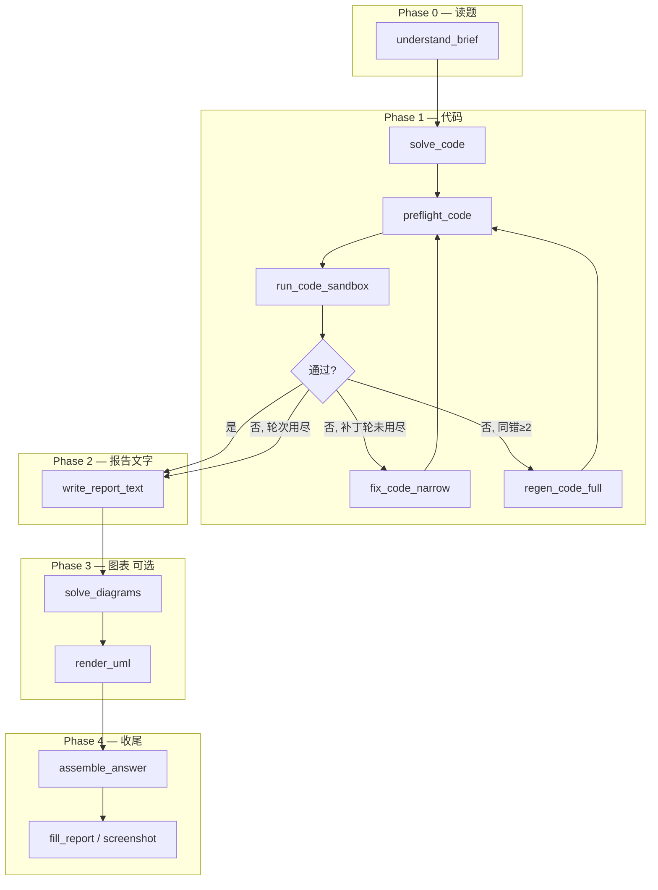
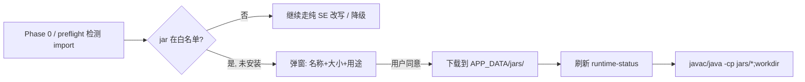

# V4 分阶段解题架构 — 设计文档

**版本**: 2026-06-06  
**状态**: 🚧 实施中（V4-0 ✅ · V4-1 核心 ✅ AO-P0 2026-06-06 · V4-2/3 待做）  
**动机**: 用户反馈「简单实验在聊天里一次就对，解题助手却要修好几遍」。根因是一次 LLM 调用同时承担读题、写报告、写代码、（可选）画图，代码质量被稀释；失败后的 `fix_code` 是增量补丁，越修越坏。  
**产品边界**: 自 [V5_PRODUCT_PIVOT.md](V5_PRODUCT_PIVOT.md) 起，本流水线中的「试跑」= **内化验证沙箱**，非用户侧运行服务；主输出为 `LabDeliverable`，非 `fill_report`。  
**关联**: [V5_PRODUCT_PIVOT.md](V5_PRODUCT_PIVOT.md) · [AI_INSIGHTS.md](../reference/AI_INSIGHTS.md) · [AGENT_ERROR_HANDLING.md](../architecture/AGENT_ERROR_HANDLING.md) · [V2_TOOLBOX_MODE.md](../v2/V2_TOOLBOX_MODE.md) · [AGENT_ARCHITECTURE_V3.md](../architecture/AGENT_ARCHITECTURE_V3.md) · [AGENT_OPTIMIZATION_PLAN.md](../architecture/AGENT_OPTIMIZATION_PLAN.md) · [NEXT_VERSION_BACKLOG.md](NEXT_VERSION_BACKLOG.md)

---

## 1. 背景

### 1.1 用户侧现象


| 场景               | 体验                                       |
| ---------------- | ---------------------------------------- |
| 聊天窗口             | 「帮我写 FIFO 页面置换 Java 代码」→ 一次可用            |
| 解题助手（工具箱 / 标准模式） | `#2 AI 解题` 成功 → `#3 运行` 失败 → 修复 2～5 轮仍不对 |


### 1.2 技术根因（As-Is）

```
┌─────────────────────────────────────────────────────────┐
│  solve_lab（单次 call_ai）                               │
│  同时输出：steps_analysis + result + summary            │
│           + code/code_files + diagrams(可选)            │
└───────────────────────────┬─────────────────────────────┘
                            ▼
                    run_code 真机执行
                            │
              ┌─────────────┴─────────────┐
              ▼                           ▼
           成功                        失败
                                         │
                                         ▼
                              fix_code（补丁，最多 3 轮）
                                         │
                              同错 ≥2 → _regenerate_code
                              （仍是一次要整份 JSON）
```

**五个结构性问题**：

1. **任务耦合**：代码是 JSON 最后一个字段，模型先写几千字报告再写代码，注意力不足。
2. **验证滞后**：代码写完才跑；聊天里用户会边跑边改，助手把验证放在事后。
3. **补救型多轮**：`deep_pipeline` 的 preflight/fix（**V4 路径已删除**，AO-P0 2026-06-06）、`executor` 的 `_fix_and_retry` 仍是**坏了再修**，主路径应靠分阶段 `solve_pipeline`。
4. **工具箱最薄**：`/api/tool/solve` 单轮 `solve_lab`，无 preflight 环、无自动试跑。
5. **报告与运行结果脱节**：`expected_output` 由模型编造，而非 `run_code` 的真实 stdout。

### 1.3 已有资产（可复用）


| 模块                       | 可复用于 V4                      |
| ------------------------ | ---------------------------- |
| `agent/prompt_budget.py` | 读题截断                         |
| `agent/skill_store.py`   | 按语言/关键词注入约束                  |
| `modules/preflight.py`   | 执行前模式检测                      |
| `modules/run_code.py`    | 执行 + `classify_run_error`    |
| `modules/fix_code.py`    | **仅限** `solve_code` 阶段内的窄域修复 |
| `agent/deep_pipeline.py` | 分阶段 emit 模式可借鉴               |
| `agent/orchestrator.py`  | 统一 tail 执行（V3-2）             |


---

## 2. 目标（To-Be）

### 2.1 核心原则

> **先让代码在本机跑通，再写报告；每一轮 LLM 只干一件事。**

### 2.2 目标清单


| ID     | 目标                                                         | 验收                                  |
| ------ | ---------------------------------------------------------- | ----------------------------------- |
| **G1** | 代码首次运行通过率（简单算法类实验）从 ~40% 提升到 **≥80%**                      | 金样本 10 份 ✅ `fixtures/solve_v4/`；首跑基线 **9/9=100%**（见 AO 计划 §9.1） |
| **G2** | `expected_output` / `result_description` 默认来自**真实 stdout** | 填表内容与 `#3` 一致                       |
| **G3** | 工具箱、标准、深度、ReAct **共用**同一 `SolvePipeline`                   | 无四套解题逻辑                             |
| **G4** | 用户可感知阶段进度（SSE / 工具箱卡片子步骤）                                  | 每阶段有 status + 耗时                    |
| **G5** | API 费用可控：简单题默认 ≤5 次 LLM；可配置「极速/标准/稳妥」档位                    | settings + run 摘要 `llm_calls`       |
| **G6** | 旧 `/api/solve`、旧 `solve_lab` **兼容一个版本**后废弃                 | feature flag `solve_pipeline=v1|v4` |


### 2.3 非目标（V4 不做）

- 不引入外部 Agent 框架 / Cursor SDK  
- 不改变用户自备 API Key、多厂商路线  
- 不做「无限自动重试直到成功」（保留降级与人工介入）  
- 不重写 `fill_report` / `parse_report` 核心逻辑  
- ~~ReAct 第一版降级为「Pipeline + 收尾工具」~~ ✅ AO-7 已落地；完整多轮 ReAct 推理仍放 V4.2

---

## 3. 目标架构

### 3.1 流水线总览




**与聊天的对齐**：


| 聊天轮次        | V4 阶段                                         |
| ----------- | --------------------------------------------- |
| 「这题要什么？」    | Phase 0 `understand_brief`                    |
| 「给我代码」      | Phase 1 `solve_code`                          |
| 「报错了」       | Phase 1 `fix_code_narrow` / `regen_code_full` |
| 「根据输出写实验结果」 | Phase 2 `write_report_text`（注入真实 stdout）      |
| 「画个类图」      | Phase 3 `solve_diagrams`                      |


### 3.2 统一数据模型 `SolveSession`

所有模式共享一个会话对象，存入 `ctx["solve_session"]`：

```python
@dataclass
class SolveSession:
    session_id: str
    pipeline_version: str = "v4"

    # Phase 0
    brief: dict  # { task_summary, language, needs_code, needs_uml, constraints[], risks[] }

    # Phase 1 — 代码（权威源）
    code_files: list[dict]
    main_file: str
    language: str
    run_result: dict | None  # { stdout, stderr, exit_code, is_error, degraded }
    code_attempts: int
    code_status: str  # pending | verified | degraded | skipped

    # Phase 2 — 报告文字
    steps_analysis: str
    result_description: str
    expected_output: str  # 默认 = run_result.stdout
    summary: str
    notes: str

    # Phase 3
    diagrams: list[dict]

    # 汇编（兼容旧 solve_lab.data 形状）
    def to_solve_lab_data(self) -> dict: ...
```

**关键规则**：

- `code_files` / `language` 的**唯一权威源**是 Phase 1；Phase 2/3 **不得**擅自改代码。  
- `expected_output` 默认复制 `run_result.stdout`；仅当 `code_status=skipped`（无代码实验）时允许 LLM 编造。  
- 对外 `module_results["solve_lab"]` 在 **Phase 4 `assemble_answer`** 一次性写入，保持 fill/screenshot 下游不变。

### 3.3 各阶段说明

#### Phase 0 — `understand_brief`（1 次 LLM，轻量 JSON）

**输入**：`fit_budget` 后的报告全文 + `format_spec` + `skill_store` 注入  
**输出**：

```json
{
  "task_summary": "实现 FIFO/LRU 页面置换并打印命中过程",
  "language": "java",
  "needs_code": true,
  "needs_uml": false,
  "execution_profile": "cli_script",
  "constraints": [
    "单文件或默认包",
    "无外部 jar",
    "硬编码页面序列",
    "禁止 Servlet/emoji"
  ],
  "risks": ["报告含 Web 关键词但实为算法模拟"]
}
```

**不做**：不写代码、不写报告正文。  
**价值**：把「聊天里第一句对齐需求」固化；后续阶段 prompt 只引用 `brief`，不再塞全文。

---

#### Phase 1 — 代码环（1～4 次 LLM + N 次本地执行）

##### 1a. `solve_code`（1 次 LLM）

**专用 prompt** `CODE_ONLY_USER`：只输出

```json
{
  "code_files": [{ "name": "Main.java", "code": "..." }],
  "main_file": "Main.java",
  "language": "java"
}
```

约束来自 `brief.constraints` + `ENVIRONMENT_PROBE` 各语言段 + `skill_store`。

##### 1b. `preflight_code`（0 次 LLM，本地）

复用 `preflight._check_execution_pattern` + `_check_code_syntax`。  
失败则**不执行**，直接进入 `fix_code_narrow`，错误信息更干净。

##### 1c. `run_code_sandbox`（0 次 LLM，本地）

复用 `execute_code` / `execute_multi_file`，超时与现网一致。  
成功 → `code_status=verified`，保存 `stdout`。

##### 1d. `fix_code_narrow`（最多 2 次 LLM）

- **只接收** `code_files` + `error_output` + `brief`；**不要求**改报告字段。  
- 比现 `fix_code` prompt 短 60%+。  
- 禁止输出 `steps_analysis` 等字段（解析器丢弃）。

##### 1e. `regen_code_full`（最多 1 次 LLM）

触发条件：同 `error_category` 连续 2 次（沿用 `REGEN_THRESHOLD`）。  
调用 `solve_code`，但在 user message 追加「上轮失败摘要」，**不是**整份 `solve_lab` 重来。

##### 1f. 降级

轮次用尽仍失败 → `code_status=degraded`，`run_result` 用最后一次 stderr；  
Phase 2 仍执行，但 `result_description` 必须注明「代码未能运行，以下为预期行为说明」。

**Phase 1 轮次上限（默认）**：


| 档位  | solve_code | fix_narrow | regen_full | 最多 LLM |
| --- | ---------- | ---------- | ---------- | ------ |
| 极速  | 1          | 1          | 0          | 2      |
| 标准  | 1          | 2          | 1          | 4      |
| 稳妥  | 1          | 3          | 1          | 5      |


---

#### Phase 2 — `write_report_text`（1 次 LLM）

**输入**：

- `brief.task_summary`  
- **已验证的** `code_files`（或 degraded 标记）  
- **真实** `run_result.stdout`（必填字段）  
- `format_spec` 篇幅约束

**输出**：仅文字字段

```json
{
  "steps_analysis": "...",
  "result_description": "...",
  "summary": "...",
  "notes": "..."
}
```

**规则**：

- `expected_output` **不由本阶段 LLM 输出**；汇编时由程序填入 `run_result.stdout`。  
- `result_description` prompt 明确要求「根据下方【实际运行输出】描述结果，不要编造未出现的数值」。

---

#### Phase 3 — `solve_diagrams`（0～1 次 LLM，可选）

仅当 `brief.needs_uml` 或用户开启 UML 时执行。  
**输入**：`brief` + `code_files` 摘要（类名/方法名）+ 报告相关段落  
**输出**：`diagrams[]`  
随后 `render_uml`（本地，非 LLM）。

与 Phase 1 代码**解耦**：避免首轮生成被 PlantUML 占用 token。

---

#### Phase 4 — `assemble_answer`（0 次 LLM，本地）

`SolveSession.to_solve_lab_data()` → 写入 `ctx.module_results.solve_lab`。  
形状与现网完全一致，**fill_report / screenshot / verify 无感迁移**。

---

## 4. 与现有模式的关系

### 4.1 模式映射


| 模式           | V4 行为                                                                                    |
| ------------ | ---------------------------------------------------------------------------------------- |
| **工具箱 #2**   | 默认走 `SolvePipeline`；UI 展示子阶段（读题 / 写代码 / 试跑 / 写报告）                                        |
| **标准 Agent** | `solve_lab` 模块内部改为 `run_solve_pipeline()`；plan 仍显示一步「AI 解题」，SSE 展开子 phase                |
| **深度 Agent** | ✅ 删除 `deep_pipeline` 内重复的 preflight/fix 环（AO-1）；保留 **reflect → revise** 仅修订文字（不碰已验证 `code_files`） |
| **ReAct**    | ✅ AO-7（2026-06-06）：`react_loop` bootstrap `solve_lab`（V4）→ LLM 补收尾 → `react_finalize`；UI 收进实验模式（AO-6）；V4.2 再考虑 phase 拆 tool |


### 4.2 模块注册表变更


| 现 module id | V4                                                                                                       |
| ----------- | -------------------------------------------------------------------------------------------------------- |
| `solve_lab` | 编排入口 → 内部 `SolvePipeline.run()`                                                                          |
| `fix_code`  | 保留，供 ReAct/工具箱手动；Agent 主路径用 Phase 1 内置环                                                                  |
| `run_code`  | Agent 主路径在 Phase 1 已跑；plan 中 `run_code` 步改为 **verify_run**（复跑 + 截图前置检查），或默认勾选但跳过若 `code_status=verified` |


**Planner 默认计划（V4）**：

```
1. solve_lab      # 内含 Phase 0-2（+可选 3）
2. screenshot_ide # 用已验证代码
3. render_uml     # 若 diagrams 非空
4. fill_report
```

`run_code` 从用户可见计划中**隐藏**或标为「已内嵌」，避免用户困惑「为什么跑两次」。

### 4.3 工具箱变更


| 工具         | V4                                             |
| ---------- | ---------------------------------------------- |
| `#2 AI 解题` | 调用 `/api/tool/solve` → 内部 Pipeline；卡片内嵌子状态条    |
| `#3 运行代码`  | 默认展示 Phase 1 缓存结果；「重新执行」按钮保留                   |
| `修复代码`     | 手动 override；成功后仍 `propagateFixedCodeToToolbox` |
| 一键执行链      | `#1→#2→#6`；`#2` 已含试跑，可跳过 `#3` 或仅用于重跑           |


---

## 5. API 设计

### 5.1 新内部入口

```python
# modules/solve_pipeline.py

def run_solve_pipeline(
    settings: dict,
    question: dict,
    *,
    include_uml: bool = False,
    format_spec: dict | None = None,
    tier: str = "standard",  # fast | standard | thorough
    on_phase: Callable[[PhaseEvent], None] | None = None,
) -> dict:
    """Returns same shape as legacy solve_lab + pipeline_meta."""
```

### 5.2 HTTP 路由


| 路由                                      | 变更                                           |
| --------------------------------------- | -------------------------------------------- |
| `POST /api/tool/solve`                  | 改调 `run_solve_pipeline`；响应增加 `pipeline_meta` |
| `POST /api/solve`                       | 同上（快速解题）                                     |
| Agent `solve_lab` executor              | 改调 `run_solve_pipeline`                      |
| **新增** `POST /api/tool/solve-code-only` | 仅 Phase 1，供高级用户                              |
| **新增** `POST /api/tool/write-report`    | 给定 code + stdout，仅 Phase 2                   |


### 5.3 响应扩展

```json
{
  "ok": true,
  "data": {
    "code": "...",
    "parsed": { "...": "与现网相同" },
    "pipeline_meta": {
      "version": "v4",
      "tier": "standard",
      "phases": [
        { "id": "understand_brief", "status": "ok", "llm_calls": 1, "duration_ms": 2100 },
        { "id": "solve_code", "status": "ok", "llm_calls": 1, "duration_ms": 4500 },
        { "id": "run_code_sandbox", "status": "ok", "llm_calls": 0, "duration_ms": 800 },
        { "id": "write_report_text", "status": "ok", "llm_calls": 1, "duration_ms": 3200 }
      ],
      "code_status": "verified",
      "total_llm_calls": 3
    }
  }
}
```

### 5.4 SSE 事件（Agent）

新增事件类型 `pipeline_phase`：

```json
{
  "type": "pipeline_phase",
  "phase": "solve_code",
  "status": "running",
  "detail": "正在生成代码（第 1 轮）"
}
```

现有 `progress` 模块级事件保留；`solve_lab` 的 `running` 期间穿插 `pipeline_phase`。

---

## 6. Prompt 清单（新增/废弃）

### 6.1 新增


| name                | 用途            | max_tokens |
| ------------------- | ------------- | ---------- |
| `understand_brief`  | Phase 0       | 1500       |
| `code_only`         | Phase 1a / 1e | 4000       |
| `fix_code_narrow`   | Phase 1d      | 4000       |
| `write_report_text` | Phase 2       | 4000       |
| `solve_diagrams`    | Phase 3       | 6000       |


### 6.2 废弃（保留 alias 一个版本）


| 现 prompt                         | 处置                                     |
| -------------------------------- | -------------------------------------- |
| `lab_report` (`LAB_REPORT_USER`) | `solve_pipeline=v1` 时仍用；v4 默认不用        |
| `fix_code` (`FIX_CODE_USER`)     | 手动修复 / ReAct 仍用；主路径用 `fix_code_narrow` |


### 6.3 `code_only` 核心约束（草案）

与现 `LAB_REPORT_USER` 环境块相同，但：

- 不要求任何报告文字字段  
- 强制 `execution_profile=cli_script` 时：单文件优先、默认包、无 Servlet、无 emoji  
- 多文件仅当 `brief` 明确多类/多模块

---

## 7. 文件与目录规划

```
src/python/
  modules/
    solve_pipeline.py      # 主编排器（NEW）
    solve_phases.py        # Phase 0-4 纯函数（NEW）
    solve_lab.py           # 薄封装：flag 分发 v1/v4
  agent/
    prompts.py             # +5 个 PromptTemplate
    executor.py              # _run_solve_lab → pipeline
    deep_pipeline.py         # V4 跳过 preflight/fix；reflect 仅改文字（AO-1）
  tests/
    test_solve_pipeline.py       # mock LLM + sandbox 单测
    test_solve_pipeline_golden.py # 10 题金样本（AO-2）
    test_deep_pipeline_v4.py     # deep V4 去重（AO-1）
    fixtures/solve_v4/             # manifest.json + 10 docx；gen_fixtures.py 生成

src/renderer/
  app.js                   # 工具箱 #2 子阶段 UI；SSE pipeline_phase
  styles.css               # .pipeline-phase-bar
```

---

## 8. 实施分期

### Phase V4-0 — 骨架（3～5 天）

- `SolveSession` 数据类 + `to_solve_lab_data()`  
- `run_solve_pipeline` 串联 Phase 0→1→2→4（跳过 UML）  
- `feature flag`: `settings.solvePipelineVersion` / env `SOLVE_PIPELINE=v4`  
- `/api/tool/solve` 走 v4；v1 fallback  
- 单测：mock LLM，真跑 Java FIFO fixture

**交付**：工具箱 `#2` 可开关 v4；其余模式仍 v1。

### Phase V4-1 — Agent 统一（3～5 天）

- `executor._run_solve_lab` → pipeline ✅  
- SSE `pipeline_phase` + Step3 子进度条 ✅（RL5）  
- `deep_pipeline` 删重复环；reflect 只修订文字 ✅（AO-1，2026-06-06）  
- Planner 默认计划隐藏独立 `run_code` ⏳（部分 RL6；AO-4 增强）  
- 金样本回归 10 份 ✅（AO-2，`test_solve_pipeline_golden.py`）

**交付**：标准 / 深度模式默认 v4 ✅。剩余 Planner/档位见 [AGENT_OPTIMIZATION_PLAN.md](../architecture/AGENT_OPTIMIZATION_PLAN.md) AO-P1。

### Phase V4-2 — 图表与 ReAct（3 天）

- Phase 3 `solve_diagrams`  
- ReAct 首跑改 pipeline + finalize  
- `auto_remediate` 与 verify 对接（可选）

### Phase V4-3 — 打磨与废弃 v1（2 天）

- 设置页：极速 / 标准 / 稳妥 档位  
- `pipeline_meta` 写入 history  
- 文档更新；v1 flag 默认 off；下个小版本删除 `LAB_REPORT_USER` 主路径

---

## 9. 测试与验收

### 9.1 金样本集（首批 10 题）


| #   | 类型                 | 语言     | 期望 code_status    |
| --- | ------------------ | ------ | ----------------- |
| 1   | 页面置换 FIFO/LRU      | Java   | verified          |
| 2   | 简单工厂 / 单例          | Java   | verified          |
| 3   | 多线程 join           | Java   | verified          |
| 4   | 排序算法               | C      | verified          |
| 5   | 文件读写               | Python | verified          |
| 6   | 纯理论（无代码）           | —      | skipped           |
| 7   | 含 Web 关键词但实为模拟     | Java   | verified          |
| 8   | 多文件包结构             | Java   | verified          |
| 9   | 数据结构链表             | C++    | verified          |
| 10  | 用户历史失败 case（emoji） | Java   | verified（无 emoji） |


### 9.2 指标


| 指标             | v1 基线（估）    | V4 首跑（2026-06-06） | V4 目标           |
| -------------- | ----------- | ----------------- | --------------- |
| 首次 run 通过率     | ~40%        | **100%**（9/9 verified 题） | ≥80%            |
| 平均 LLM 次数（简单题） | 1 + 2.5 fix | **2**（solve_code + write_report） | 3～4（含报告）        |
| 平均端到端耗时        | 15s         | 25～40s（可接受换成功率） |
| 用户手动修复率        | 高           | ≤20%            |


### 9.3 不回退条件

- v4 金样本通过率 **低于** v1 → 不切换默认  
- 单次 solve API 费用 **>2×** v1 且通过率提升 **<15%** → 调整档位默认值

---

## 10. 风险与对策


| 风险                   | 对策                                                                  |
| -------------------- | ------------------------------------------------------------------- |
| LLM 次数增加 → 费用上升      | 极速档位；Phase 0 用小模型（设置项）                                              |
| 耗时变长                 | 工具箱展示子阶段进度；Phase 1 试跑通常 <2s                                         |
| Phase 2 仍编造结果        | 强约束 + 后验：若 `result_description` 含 stdout 未出现的数字 → verify 失败 → 仅修订文字 |
| 破坏现有 fill/screenshot | `to_solve_lab_data()` 契约测试锁定字段                                      |
| 打包环境 Java 路径         | Phase 1 试跑与现 `run_code` 相同后端                                        |


---

## 11. 迁移与回滚

1. **Feature flag** `solvePipelineVersion: "v1" | "v4"`（默认 `v4`，安装升级后首次启动提示）
2. **localStorage** 工具箱状态兼容：无 `pipeline_meta` 的旧缓存照常显示
3. **回滚**：flag 设回 `v1`，无需 DB 迁移
4. **废弃时间表**：v4 默认 1 个 minor 版本后删除 v1 主路径

---

## 12. 已拍板决策（2026-06-06）

| # | 问题 | **决议** |
|---|------|----------|
| Q1 | Phase 0 是否可省？ | **是**。报告 &lt;500 字且无表格 → 跳过 LLM 读题，用规则生成 `brief`（语言取自设置 + 关键词） |
| Q2 | 代码试跑是否强制？ | **默认强制**。无对应运行时 → `code_status=skipped` + 前端警告，仍允许写报告（纯理论题） |
| Q3 | 「只要代码不要报告」？ | **是**。工具箱 `#2` 与设置页提供「仅代码」→ 只跑 Phase 0（可省）+ Phase 1 |
| Q4 | 稳妥档位失败是否自动降级填表？ | **是**。与现 `_degrade_run_code` 一致：`degraded=true`，`expected_output` 回退 LLM 预测 |
| Q5 | 多文档 assignment+fill 合并读题 | Phase 0 输入统一用 `planner_input_text`（与 Planner / ReAct 现网一致） |

---

## 13. Java 外部 JAR — 现状、动机与可选方案

> **讨论结论（2026-06-06）**：禁止/回避外部 jar **主因不是安装包体积**，而是执行层未支持 classpath、依赖组合复杂、以及产品策略优先「纯 Java SE 可跑」。用户同意后按需下载**白名单 jar** 可行，建议作为 **V4 之后独立子项**（J1），与 V4 流水线可并行，但 **不阻塞 V4-0 开工**。  
> **落地（V5-3，2026-06-06）**：`modules/java_jars.py` + `run_code` `-cp` + `SolvePipeline` 缺 jar 暂停；见 [V5 §6/§10](V5_PRODUCT_PIVOT.md)。

### 13.1 为什么现在「不能有 jar」？

| 原因 | 说明 |
|------|------|
| **执行层未实现** | `run_code.py` 中 `javac` / `java -cp` **仅指向工作目录**，未拼接外部 jar（见 `_run_java_multi`） |
| **产品策略** | Prompt + preflight 引导 **纯 Java SE**（`HttpServer`、内存模拟），避免 Servlet/MyBatis 等需容器或一堆依赖的写法 |
| **依赖不是单个 jar** | MyBatis 实验常需 `mybatis.jar` + `jdbc驱动` + 日志库；LLM 容易漏依赖，修起来比「改写成内存模拟」更难 |
| **安全与维护** | 任意 Maven 坐标解析 = 供应链风险；需白名单 + 固定版本 |
| **体积（次要）** | 安装包已含 **plantuml.jar ~21MB**；JRE 按需下载 **~50MB**。再增加 2～3 个 curated jar（各 1～3MB）对体积压力远小于 JRE，**不是主 blocker** |

### 13.2 若做「用户同意后帮忙下载」，需要什么？



| 模块 | 工作项 |
|------|--------|
| **存储** | `%APPDATA%/lab-solver/jars/` + `jars.json` 清单（id, 版本, sha256, 大小） |
| **下载 API** | `GET /api/java-jars` 已安装列表；`POST /api/java-jars/download` 白名单 id；复用 JRE 下载的进度/错误处理 |
| **执行** | `run_code._run_java_multi`：`javac -cp "{jars};{wd}"`；`java -cp "{jars};{wd}"` |
| **探测** | `config.get_java_env()` 扩展 `installed_jars: [{id, path, size}]`；注入 `code_only` / `fix_code` prompt |
| **预检** | `preflight`：解析 `import org.xxx` → 映射白名单 jar → 缺失则 `check_id=missing_jar`（可修复动作：提示下载） |
| **前端** | 设置页「Java 扩展库」列表；下载确认模态（名称、大小、课程用途）；与 JRE 引导同一风格；**已落地**：`complianceModal` 缺 jar 确认 → `/api/java-jars/download` → `/api/tool/retry-validation` |
| **LLM** | `brief.optional_jars`；Phase 1 仅允许使用 **已安装** jar，禁止假设未下载的依赖 |

### 13.3 建议首批白名单（课程常见、单 jar 或固定 bundle）

| id | 用途 | 约大小 | 备注 |
|----|------|--------|------|
| `h2` | 内存数据库 JDBC | ~2MB | 替代 SQLite JDBC，纯 Java |
| `sqlite-jdbc` | SQLite | ~7MB | 部分实验点名 SQLite |
| `servlet-api` | 仅编译 Servlet 作业 | ~0.3MB | **无 Tomcat**，只能编译演示，运行仍需改写或标注降级 |
| `mybatis-bundle` | 自定义 zip | ~5MB | 需 **打包** mybatis + slf4j-simple，非单坐标 |

**刻意不做（首版）**：Maven 解析器、任意 groupId:artifactId 输入、Tomcat 内嵌服务器。

### 13.4 工作量估算

| 档位 | 范围 | 人天 | 说明 |
|------|------|------|------|
| **J0 — 文档 + prompt** | 仅告诉 LLM「无 jar」并强化模拟写法 | 0 | 现状；V4 Phase 1 继续默认 |
| **J1 — 最小可用** | 白名单 1～2 个 jar + 下载 + `-cp` + 设置页列表 | **3～4** | 推荐首做；覆盖 H2/SQLite 类 DB 实验 |
| **J2 — 与 Pipeline 联动** | preflight 缺 jar → 暂停 Phase 1 → 用户确认下载 → 重试 | **+2～3** | 依赖 V4 Phase 1 试跑环 |
| **J3 — 多 jar bundle + import 映射表** | MyBatis 等组合包 + 维护映射 | **+5～7** | 需持续维护课程库 |
| **J4 — 通用 Maven 解析** | 不推荐近期做 | **+15+** | 超出桌面工具定位 |

**与 V4 关系**：

- **V4-0～V4-1 不依赖 J1**，先靠分阶段 + 纯 SE 把通过率拉到 80%。
- **J1 可与 V4-1 并行**；J2 在 V4 Phase 1 `run_code_sandbox` 稳定后接入最顺。
- 有 jar 时 `brief.execution_profile` 可为 `java_with_libs`，仍走同一 Pipeline。

### 13.5 风险

| 风险 | 对策 |
|------|------|
| 用户拒绝下载 | 回退 `regen_code_full`，prompt 硬约束「改用内存模拟，禁止该 import」 |
| jar 与 bundled JRE 版本不兼容 | 白名单固定版本 + CI 用 bundled JRE 21 测编译 |
| LLM 乱 import 未白名单库 | preflight `missing_jar` → 不修补丁，直接重生或降级 |
| 中国大陆下载慢 | 镜像 URL（GitHub / 国内 Maven 镜像）+ 显示大小让用户知情 |

---

## 14. 总结

V4 不是「多调几次 fix_code」，而是**把聊天里自然的分步协作写成流水线**：

1. **先对齐**（brief）
2. **只写代码**（code_only）
3. **本机验**（sandbox run）
4. **再写报告**（基于真输出）
5. **最后画图**（可选）

代码成功率应从结构上提升，而不是靠更长的事后修补 prompt。

---

*文档版本：2026-06-06 · §12 已拍板；§13 JAR 方案已讨论；可进入 V4-0*