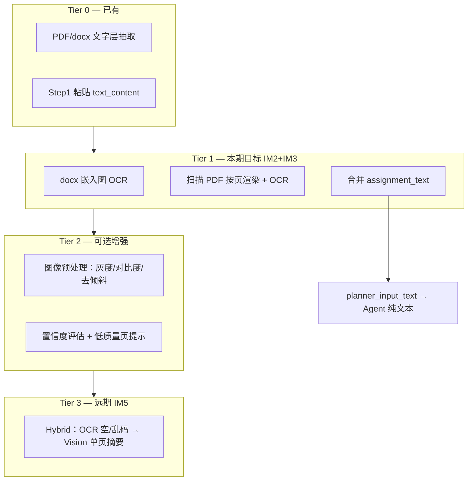

# IM 轻量识图方案 — OCR 优先、不依赖多模态

**版本**: 2026-06-06  
**状态**: ✅ 已落地（IM1–IM5 · UI-A/B ✅；**UI-C** 一图多题 warn 仅 backlog）  
**定位**: 在 [V2_IMAGE_INPUT.md](V2_IMAGE_INPUT.md) 总规格下，明确 **「弱视图」路径**：把图片变成文字，接入现有纯文本 Agent；Vision 仅作可选增强。  
**关联**: [V2_IMAGE_INPUT.md](V2_IMAGE_INPUT.md) §11 · [NEXT_VERSION_BACKLOG.md](../product/NEXT_VERSION_BACKLOG.md) C3 · [V5_PRODUCT_PIVOT.md](../product/V5_PRODUCT_PIVOT.md) · `document/extract_images.py`（IM1 ✅）· `document/image_read.py`（IM2-a ✅）

---

## 1. 问题与结论

### 1.1 用户侧痛点（已解决 / 残余）

| 场景 | 落地前 | 当前（IM 已落地） |
|------|--------|-------------------|
| 扫描版 PDF（无文字层） | 仅 warn `pdf_scanned` | IM3：按页渲染 → OCR 合并进 `assignment_text`；无 Tesseract 时 warn + `enable_ocr_reparse` |
| docx 正文极短、题目在嵌入图里 | 有图无字 | IM2：OCR 合并；设置 `enableImageOcr` 或正文极短自动触发 |
| 作业页截图 | 只能粘贴文字 | IM4：Step1 题目图组上传 + 勾选/排序 |
| OCR 不足 / 电路图题 | — | IM5 可选 hybrid/vision（需多模态 API）；默认 `ocr_only` 仍服务非多模态用户 |
| 一图内多道题 | — | UI-C backlog：`multi_question_in_image` warn，用户 O30 内编辑 |

### 1.2 约束（产品现实）

1. **用户自选 API**，大量模型（如 DeepSeek-Chat）**不支持多模态** — 不能把「识图」绑在 Vision API 上。  
2. **实验报告以文字为主**：要求、步骤、原理多在段落或表格文字里；嵌入图多为数据曲线、电路参考、截图示意。  
3. **Agent 已是纯文本链路**：`planner_input_text` → Planner / `solve_pipeline` / ReAct，无需改模型接口即可接入 OCR 结果。

### 1.3 设计结论（一句话）

> **识图 = 本地 OCR（+ 可选预处理）→ 合并进 `assignment_text` / `planner_input_text` → 现有 Agent 无感使用；多模态 Vision 默认关闭，仅 OCR 不足且用户 API 支持时 opt-in。**

---

## 2. 图片在实验报告中的分类

实施前先区分「要不要读图」，避免过度 OCR。

| 类型 | 典型内容 | 是否必须 OCR | 说明 |
|------|----------|--------------|------|
| **A. 题目文字图** | 扫描页、作业截图、表格截图 | ✅ 必须 | 无文字层时的主战场 |
| **B. 正文已覆盖** | Word 段落已写清要求，图为插图 | ❌ 通常不必 | IM1 枚举即可，可不进 assignment |
| **C. 参考/结构图** | 电路图、流程图、接线图 | ⚠️ 弱需求 | OCR 只能读图注；拓扑理解非 v1 目标 |
| **D. 装饰/签名** | Logo、校徽、签字 | ❌ 过滤 | IM1 `role_guess` 已支持 |

**默认策略**：仅对 `role_guess ∈ {assignment, unknown}` 且（正文过短 **或** 用户勾选 **或** 扫描 PDF 页）执行 OCR；`signature` / `decoration` 默认跳过。

---

## 3. 分层能力（由弱到强）



| 层级 | 能力 | 依赖多模态 API | 阶段 |
|------|------|----------------|------|
| Tier 0 | 文字层 + 用户粘贴 | ❌ | 已有 |
| Tier 1 | Tesseract OCR + 文本合并 | ❌ | **IM2、IM3** |
| Tier 2 | 预处理 + 置信度 | ❌ | IM2 可带最小集 |
| Tier 3 | Vision fallback | ✅ opt-in | IM5（不做前提） |

---

## 4. 数据流（端到端）

```
上传 docx / pdf /（远期）题目图组
        │
        ▼
┌───────────────────┐
│ IM1 extract_images │  image_assets[]（bytes_b64, role_guess, nearby_text）
│ extract_pdf 文字层 │
└─────────┬─────────┘
          │
          ▼
┌───────────────────┐
│ image_read.py     │  批量 OCR → 每张 ocr_text + ocr_confidence
│ （新建 IM2）       │  扫描 PDF：按页 render → 等同 image_assets
└─────────┬─────────┘
          │
          ▼
┌───────────────────┐
│ merge_assignment  │  assignment_text（正文 + OCR 段，带分隔符）
│ _from_images()    │  assignment_from_images: true
└─────────┬─────────┘
          │
          ▼
┌───────────────────┐
│ parse_documents   │  planner_input_text = assignment + fill_target 等
│ O30 识题预览 UI   │  用户确认 / 编辑后再 plan
└─────────┬─────────┘
          │
          ▼
   Planner / solve_pipeline / ReAct（仅文本，prompt_budget 裁剪）
```

### 4.1 合并规则

与 [V2_IMAGE_INPUT.md](V2_IMAGE_INPUT.md) §4.2 一致，OCR 路径专用补充：

| 规则 | 说明 |
|------|------|
| **顺序** | 文档流 `order` > PDF 页码 > 用户拖拽（IM4） |
| **去重** | 相同 `sha256` 只 OCR 一次，结果复用 |
| **分隔符** | `\n\n--- 图 {order}（OCR）---\n\n` + 可选 `nearby_text` 前缀 |
| **与正文关系** | `assignment_text = body_text + "\n\n" + ocr_merged`（正文非空时 OCR 段追加，不覆盖） |
| **Token 预算** | 合并后走 `prompt_budget.fit_budget`；超长时按页截断并 warn |

### 4.2 扩展字段（`image_assets[]`）

在 IM1 结构上增加 OCR 元数据：

```json
{
  "id": "img_001",
  "ocr_text": "实验目的：…",
  "ocr_confidence": 0.82,
  "ocr_engine": "tesseract",
  "ocr_lang": "chi_sim+eng",
  "ocr_status": "ok",
  "ocr_error": ""
}
```

`ocr_status` 枚举：`pending` | `ok` | `empty` | `low_confidence` | `failed` | `skipped`

文档级：

```json
{
  "image_reading_mode": "ocr_only",
  "assignment_from_images": true,
  "assignment_text": "（合并后全文）",
  "image_sections": [
    { "image_id": "img_001", "text": "…", "source": "ocr" }
  ]
}
```

---

## 5. OCR 引擎与依赖

### 5.1 首选：Tesseract（IM2）

| 项 | 选择 |
|----|------|
| Python 绑定 | `pytesseract` |
| 语言包 | `chi_sim` + `eng`（实验报告中英混排） |
| 模式 | `--psm 6`（假设统一文本块）为主；整页扫描可试 `--psm 3` |
| 安装 | **可选依赖**，不阻塞应用启动 |

**探测标志**（建议加入 `config.py`，与 `PDF_OK` / `DOCX_OK` 一致）：

```python
OCR_OK = False  # shutil.which("tesseract") and import pytesseract
```

未安装时：

- 保留 IM1 枚举 + 现有 warn
- 提示：「安装 Tesseract 可识别图片中的文字」或「请粘贴题目 / 换 Word」
- **不** silent 失败

### 5.2 预处理（Tier 2 最小集）

对扫描件在 OCR 前可选执行（PIL / OpenCV 二选一，优先 PIL 减依赖）：

1. 转灰度  
2. 自动对比度（`ImageOps.autocontrast`）  
3. 宽度缩放到 2000px 以内（提速 + 稳定）

不做：透视矫正、复杂表格结构恢复（v1 不承诺）。

### 5.3 远期备选：PaddleOCR

中文印刷体识别率可能优于 Tesseract，但依赖更重、打包体积更大（见 backlog O27）。**IM2 先用 Tesseract 闭环**；若金样本不达标再评估 Paddle 作为 opt-in 引擎。

### 5.4 Vision（IM5，opt-in）

仅当同时满足：

- 用户设置 `imageReadingMode=hybrid` 或 `vision`（**保守默认仍为 `ocr_only`**）
- `llm_client` / catalog 判定当前 provider/model 支持 AI 识图（见 [VISION_CAPABILITY.md](../features/VISION_CAPABILITY.md)）
- 该页 `ocr_status ∈ {empty, low_confidence, failed}`（`vision` 模式可跳过 OCR）

才对该页调用一次 Vision 摘要，写入 `vision_summary` 并并入 `assignment_text`。不支持或失败时**静默回退 OCR**，不阻断解题。

---

## 6. 触发条件：何时自动 OCR

避免对「正文已够」的 docx 白白 OCR 所有图。

| 条件 | 行为 |
|------|------|
| `settings.enableImageOcr === true` | 对用户勾选纳入的 `assignment`/`unknown` 图执行 OCR |
| PDF `pdf_scanned` hint | 按页渲染后 **自动** OCR（等同 enable） |
| `body_len < 80` 且有 `assignment` 图 | 自动 OCR assignment 图 |
| `body_len < MIN_BODY_CHARS` 且有图 | warn + 建议开启 OCR（设置关时） |
| `role_guess=signature/decoration` | 跳过，除非用户 UI 强制勾选 |

**默认**：`enableImageOcr: false`（扫描 PDF 场景下 parse 结果带 hint，UI 引导一键开启）。

---

## 7. 能力边界（对用户诚实）

### 7.1 OCR 路径能做好

- 打印体中文 / 英文实验要求、步骤列表  
- 多页扫描 PDF 顺序合并  
- 清晰截图作业页  
- 简单表格截图中的文字（有错行风险，靠 O30 预览纠正）

### 7.2 不承诺 / 需兜底

| 情况 | 处理 |
|------|------|
| 手写实验记录 | warn + 建议粘贴 |
| 复杂公式 → LaTeX | 不保证；可保留 OCR 原文 |
| 电路图拓扑理解 | 不读图结构；依赖正文「按图…」描述 |
| 极低分辨率斜拍 | `low_confidence` + 预览标红 |
| OCR 引擎未安装 | 现有 warn + 粘贴 / 换 Word |

**兜底顺序**：用户粘贴 `text_content` > 换有文字层的 Word >（远期）Vision opt-in。

---

## 8. 与 Agent 的集成点

**原则：OCR 在 parse 阶段完成，Agent 不感知像素。**

| 模块 | 改动 |
|------|------|
| `document/image_read.py` | **新建**：`ocr_image_asset()`、`ocr_batch()`、`merge_assignment_from_images()` |
| `modules/parse_report.py` | 解析后按 §6 触发 OCR；写 `assignment_text`、`image_sections` |
| `document/extract_pdf.py` | IM3：`render_pdf_pages()` + 注入 `image_assets`（`source=pdf_page_render`） |
| `agent/parse_documents.py` | 多文档 bundle 合并 OCR 段进 `planner_input_text` |
| `agent/planner.py` | **无逻辑变更**（已消费 `planner_input_text`） |
| `agent/prompt_budget.py` | 合并文本过长时裁剪（已有） |
| `llm_client.py` | IM5 前 **不改** |

`ctx` 在 run 时可携带：

```python
ctx["assignment_from_images"] = True
ctx["image_reading_mode"] = "ocr_only"
```

供 `run_summary` / history 统计，不参与分支逻辑。

---

## 9. API 与设置

### 9.1 设置项（`settings_schema.py`）

| Key | 类型 | 默认 | 说明 |
|-----|------|------|------|
| `enableImageOcr` | bool | `false` | 识别 docx 嵌入图 / 用户图组 |
| `imageOcrLang` | string | `chi_sim+eng` | Tesseract lang |
| `imageReadingMode` | enum | `ocr_only` | `ocr_only` \| `hybrid` \| `vision`（后两者 IM5） |
| `imageOcrMaxPages` | int | `20` | 单份文档 OCR 页上限，防滥用 |
| `imageVisionMaxPages` | int | `5` | 混合/仅 Vision 模式下单次 parse 最多 Vision 张数（IM5） |

### 9.2 Parse API（IM4 请求扩展）

`POST /api/parse-report` 请求体可附带 `assignment_images[]`（Step1 题目图组）：

```json
{
  "documents": [],
  "assignment_images": [
    {
      "id": "ui-1",
      "file_name": "page1.png",
      "file_data": "<base64>",
      "order": 0,
      "include_in_ocr": true
    }
  ],
  "enableImageOcr": true
}
```

可与 `documents[]` 同时使用；OCR 合并段追加到 `assignment_text`。仅图片、无文档时走 `parse_assignment_images_only`。

### 9.3 Parse API 响应扩展

`POST /api/parse-report` / 多文档 parse 已有 `image_assets`；增加：

```json
{
  "assignment_text": "...",
  "assignment_from_images": true,
  "image_reading_mode": "ocr_only",
  "image_read_summary": {
    "ocr_attempted": 3,
    "ocr_ok": 2,
    "ocr_empty": 1,
    "merged_chars": 1840
  }
}
```

### 9.4 UI（最小集 + backlog O30）

| 项 | 阶段 | 说明 |
|----|------|------|
| 设置页「识别图片中的文字（本地 OCR）」 | IM2 | 开关 + 未安装 Tesseract 时说明 |
| 解析 warn 链到开关 | IM2 | `short_body_with_images` → 一键开启并重解析 |
| **识题预览**（O30） | IM2-b / UI-B | 合并 `assignment_text` + `image_sections`（ocr/vision 标识），可编辑；勾选确认后 plan |
| 缩略图条 / 拖拽排序 | IM4 / UI-A | 勾选参与识题、顺序与 `assignment_images` 一致；识图模式/上限提示 |
| 一图多题 | UI-C backlog | `multi_question_in_image` warn；不自动拆段 |

---

## 10. 实施分期（本期范围）

### Phase IM2-a — 核心 OCR（2～3 天）

- [x] `document/image_read.py`：`ocr_batch`、`merge_assignment_from_images`  
- [x] `config.OCR_OK` 探测  
- [x] `parse_report.py`：触发条件 §6；写 `ocr_text` 回 `image_assets`  
- [x] `planner_input_text` 含 OCR 合并段  
- [x] 单测：mock Tesseract 或 fixture 图 + 断言合并文本  
- [x] 无 OCR 依赖时回归：与现 IM1 行为一致  

### Phase IM2-b — 设置与预览（1～2 天）

- [x] `settings_schema` + 设置页开关  
- [x] parse warn → 引导开启 OCR  
- [x] O30 识题预览（只读亦可先上）  

### Phase IM3 — 扫描 PDF（2 天）

- [x] `extract_pdf`：`page_count` 且文字 `< 80` → 按页 `get_pixmap`  
- [x] 页图进入 `image_assets`（`source=pdf_page_render`），走 IM2 同一 OCR 流水线  
- [x] `pdf_scanned` hint 与设置页 OCR 联动（自动 OCR；失败时 `enable_ocr_reparse`）  
- [x] 验收 O3/I3：`tests/fixtures/image_input/scanned_5page.pdf`  

### Phase IM4 — 题目图片组（1～2 天）

- [x] `document/user_upload_images.py`：`build_user_upload_assets` / `process_user_upload_images`  
- [x] Step1 多选 `image/*`、缩略图条、勾选参与识题、拖拽排序  
- [x] `POST /api/parse-report` 接受 `assignment_images`；合并进 `assignment_text` / `planner_input_text`  
- [x] 验收 I4：`assignment_page1..4.png` + `test_image_input.py::TestIm4UserUploadParse`  

### Phase IM5 — Vision hybrid（2 天）

- [x] `llm_client.chat_vision()` + `supports_vision()`（OpenAI 兼容 + Claude）  
- [x] `image_read.vision_batch()`：hybrid 回退（OCR empty/low/failed）· vision-only 模式  
- [x] 多图顺序 / sha256 去重 / 合并 `assignment_text`（Vision 段 `--- 图 {order} ---`）  
- [x] `imageVisionMaxPages` 上限 + `vision_limit_exceeded` warn（I6）  
- [x] 设置页启用 hybrid/vision · parse 请求附带 API Key（仅 hybrid/vision）  
- [x] 验收 I5/I6：`vision_blank_page.png` · `vision_page1..6.png` · `test_image_input.py::TestIm5*`  

### Phase UI-A/B — Step1/Step2 polish（与 IM5 并行）

- [x] Step1：题目图组模式提示（`enableImageOcr` / `imageReadingMode` / `imageVisionMaxPages` / 模型 Vision 能力）
- [x] Step1：未勾选图灰显；拖拽顺序与 parse `assignment_images` 一致  
- [x] Step2 O30：`image_sections` 分节预览（`source`: ocr | vision）、合并题干可编辑  
- [x] 生成计划前勾选「已核对题干完整」；`/api/agent/plan` 接受 `assignment_text` 覆盖  
- [x] `vision_limit_exceeded` / `vision_unavailable` / `multi_question_in_image` 在 O30 展示  

### 明确不做（本期）

- 自动拆分「一图多题」（仅 warn + 人工编辑；启发式子段 backlog）  
- 打包内置 Tesseract（先文档说明 + 可选安装；O27 单独评估）  

---

## 11. 测试与验收

### 11.1 Fixtures

目录：`tests/fixtures/image_input/`

| 文件 | 用途 |
|------|------|
| `ocr_simple_zh.png` | 合成打印体中文段落 |
| `ocr_simple_en.png` | 英文 |
| `scanned_5page.pdf` | 无文字层多页（IM3） |
| `assignment_page1..4.png` | Step1 题目图组（IM4 / I4） |
| `vision_blank_page.png` | OCR 空页 → hybrid Vision 回退（IM5 / I5） |
| `vision_page1..6.png` | Vision 张数上限验收（IM5 / I6） |
| `docx_text_plus_figure.docx` | 正文充足 + 图 → 不应误 OCR 全文 |

### 11.2 验收用例（继承 I1–I6 子集）

| ID | 场景 | 通过标准 |
|----|------|----------|
| O1 | docx 正文极短 + 1 张题目图，OCR 开 | `assignment_text` 含 OCR 字；Planner 可 plan |
| O2 | 正文充足 + 插图 | 默认不 OCR 或 OCR 不进 assignment（按 §6） |
| O3 | 扫描 5 页 PDF | 5 段 OCR 顺序合并 |
| O4 | 未安装 Tesseract | graceful warn，parse 不崩 |
| O5 | 非多模态 model 设置 | solve 全程无 image API 调用 |
| O6 | OCR 后 O30 预览 | 用户可见合并题干再执行 plan |

### 11.3 回归

```bash
python -m pytest tests/test_image_input.py tests/test_phase2b5_pdf.py -q
python tests/run_golden_regression.py
```

标准无图 docx 金样本 **llm_calls / plan 步骤不变**。

---

## 12. 风险与对策

| 风险 | 对策 |
|------|------|
| Tesseract 中文效果参差 | 预处理 + O30 人工改字；远期 Paddle opt-in |
| 安装包体积（O27） | 首期不捆绑；文档 + 设置页检测 |
| OCR 噪声进 Planner | 置信度阈值；`low_confidence` 预览标黄 |
| 与 DA 表格内图重复 OCR | DA1 抽表时复用 `image_assets` 上已有 `ocr_text` |
| 用户误以为能「看懂电路图」 | UI 文案：「识别图中的**文字**，非理解图形结构」 |

---

## 13. 给 Agent 的维护指令（IM 主路径已落地）

```
识图主路径已完成。后续仅做：
- UI-C：一图多题自动拆分（当前仅 multi_question_in_image warn）
- O27：打包内置 Tesseract 评估
- DA1 表格单元格内图复用 image_assets.ocr_text
- 回归：python -m pytest tests/test_image_input.py tests/test_phase2b5_pdf.py -q

新功能勿破坏：ocr_only 默认 · assignment_text → planner_input_text · O30 确认后 plan
详表：[V2_IMAGE_INPUT.md](V2_IMAGE_INPUT.md) §11
```

---

## 14. 状态跟踪

| ID | 项 | 状态 | 备注 |
|----|-----|------|------|
| DOC | 本文档 | ✅ | 2026-06-06 初稿；识图全量落地后定稿 |
| IM2-a | OCR 核心 + parse 集成 | ✅ | `image_read.py` · `parse_report` · `parse_documents` |
| IM2-b | 设置 + O30 预览 | ✅ | `settings_schema` v3 · 设置页「文档识图」· Step2 识题预览 · OCR 引导 banner |
| IM3 | 扫描 PDF | ✅ | `extract_pdf.render_pdf_pages` · `pdf_scanned` 自动 OCR · fixture `scanned_5page.pdf` |
| IM4 | Step1 题目图组 | ✅ | `user_upload_images.py` · `assignment_images` API · Step1 缩略图条 · I4 |
| IM5 | Vision hybrid | ✅ | `llm_client.chat_vision` · hybrid/vision 模式 · 张数上限 · I5/I6 |
| UI-A | Step1 题目图组 polish | ✅ | 模式/上限提示 · 勾选灰显 · 与 assignment_images 一致 |
| UI-B | Step2 O30 增强 | ✅ | image_sections + 来源标识 · 可编辑 · 确认后 plan |
| UI-C | 一图多题 | 📝 | `multi_question_in_image` warn；自动拆分 backlog |

---

*文档版本：2026-06-06 · OCR-first 轻量识图，服务非多模态用户与实验报告主场景*
