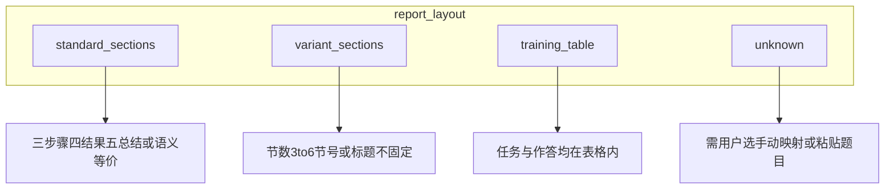

# v2 立项 — 文档模版适配（Doc Template Adaptation）

**状态**：✅ DA1–DA4 已落地（2026-06-04）；2026-06-05 补丁见 `../logs/V1_BUGFIX_LOG.md` BF17/BF19  
**优先级**：v2 **高**（用户真实模版与 V1 预设严重偏离）  
**关联**：[NEXT_VERSION_BACKLOG.md](../product/NEXT_VERSION_BACKLOG.md) · [IMPLEMENTATION_PHASES.md](../architecture/IMPLEMENTATION_PHASES.md)

---

## 1. 背景：V1 只服务一种「标准实验报告」

V1 隐含模版形态：

| 维度 | V1 假设 |
|------|---------|
| 正文载体 | **段落**（`doc.paragraphs`） |
| 章节结构 | 固定 **三、实验步骤 → 四、实验结果 → 五、实验总结** |
| 逻辑节 | 3 个：`steps` / `result` / `summary`（UI 另有 `cover` 等） |
| 填表 | 按段落标题匹配 `^三[、．.]` / `^四` / `^五` |

**现实学校模版至少有两类 V1 无法可靠处理：**

### 类型 A — 表格型实训报告

**样例**：`第十周实训报告_学号_姓名.docx`（实训周、JSP 文件上传）

| 现象 | 原因 |
|------|------|
| 解析只有 ~144 字封面说明 | `extract_docx` **不读表格正文**，任务在「实训步骤及内容」合并单元格 |
| AI 看不到「新建 JSP10…」 | 题目在 `doc.tables[1]`，不在段落 |
| 填表无效 | 无「三/四/五」段落，内容为 **表格单元格** |
| 执行链不匹配 | 任务为 JSP/Servlet/Web，非控制台 Java/Python |

系统已 warn：`short_body_with_cover`、`possible_missing_figures` — 用户仍「束手无策」。

**补充（2026-06-05 / 2026-06-08）**：若题目在超星等平台，Step 1 默认 **内联粘贴题目文字** 即可开始（`assignment_only`，无需任何文件；`POST /api/parse-report` 返回 `fill_target: null`，见 BF44）。若另有空白模板 docx，可切「上传文件」添加 `fill_target`；不必把题目先存成 `.txt`。

**DA3 扩展（2026-06-05）— 超星式表格实验报告**：

| 表头字段 | 写入内容 | 截图 / UML |
|----------|----------|------------|
| **实验名** | `metadata.experiment_title` 或题目标题 | — |
| **实验目的** | 从 `metadata.assignment_text` / `planner_input_text` 解析「实验目的与原理」段落（`extract_objective_from_assignment`）；无题目时回退 `steps_analysis` 首段 | — |
| 实验内容 | 步骤 + 代码 + 结果 + 总结合并 | 插入该单元格末尾（`_insert_images_in_cell`，非表格外） |

识别标记：`_TRAINING_TABLE_MARKERS` 含 `实验内容` / `实验目的` / `实验名`（`实验名` **精确匹配**，避免误报封面「实验名称」）。Fixture：`tests/fixtures/lab_report_table.docx`。

**实验目的解析（2026-06-05，BF23）**：题目常见结构为 `（1）实验目的与原理` … `（2）实验内容与步骤`。`fill_report._resolve_objective_text()` 在 assignment 中截取该区间写入表格「实验目的」格；段落型报告中 `semantic=objective` 的节同样优先用 assignment 原文，不再调用 LLM 随机生成。`assignment_text` 由 `parse_documents` → `executor._run_fill_report` → `buildFillMetadata()` 透传。

### 类型 B — 节号/节数不统一的段落型报告

**样例**：四节报告，总结写在 **「四、实验总结」**（无第五节、或无独立「实验结果」）

| 文档标题 | V1 填表行为（错误） |
|----------|---------------------|
| `四、实验总结` | 命中 `result` 的 `^四[、．.]` → **总结内容填进「结果节」** |
| （无 `五、`） | `summary` **永远匹配不到** → 总结漏填 |
| `二、实验内容` + `四、总结` | 步骤/结果/总结 **整体错位** |

**根因**：用 **序号（三/四/五）** 作主键，而非 **标题语义（步骤/结果/总结）**。

---

## 2. V1 硬编码位置（改造入口）

| 模块 | 文件 | 问题 |
|------|------|------|
| 解析 | `modules/parse_report.py` `extract_docx` | 仅段落 + 封面表 metadata |
| 填表 | `modules/fill_report.py` `SECTION_HEADER_PATTERNS` | 死绑 三/四/五 |
| 填表 | `fill_report._is_lab_section_header` | fallback 仅整行「实验步骤」等，不含「四、实验总结」 |
| 拆分 | `agent/parse_documents.py` | split 认 `三`/`3` 为步骤起点 |
| 前端 | `app.js` `SECTION_ROW_DEFS` | UI 写死「三、四、五」文案 |
| 前端 | `app.js` `estimateSectionCharCounts` | 同样 三/四/五 正则 |
| PDF 壳 | `document/pdf_export.py` `_DEFAULT_SECTIONS` | 默认三节标题 |
| Prompt | `agent/prompts.py` LAB 输出说明 | 文案写「三/四/五」 |
| 解析 | `modules/lab_parse.py` | 从 answer 抽结果/总结时也偏 四/五 |

---

## 3. v2 目标（用户可感知）

1. **上传后识别模版类型**，不再 silent 失败  
2. **题目全文可读**（含表格内实训任务）  
3. **章节按语义映射**，不依赖固定节号  
4. **填表写入正确位置**（段落或表格单元格）  
5. **用户可确认/修正映射**（尤其节号非标时）

### 3.1 语义关键词（DA2 实现 · 2026-06-05 扩充）

`modules/fill_report.py` `_SEMANTIC_KEYWORDS`：

| 逻辑节 | 匹配关键词 |
|--------|------------|
| steps | 步骤、内容、操作、过程、**任务** |
| result | 结果、分析、数据、输出 |
| summary | 总结、思考、心得、讨论、体会、**小结** |

**伪节过滤**：`1.掌握…` / `2.xxx` 等阿拉伯数字列表项，若无上述语义则**不**计入 `sections_detected`。

### 3.2 填表双路径与 metadata（2026-06-05）

| 路径 | 触发条件 | 说明 |
|------|----------|------|
| `training_table` | `metadata.report_layout === 'training_table'` 或 `fill_lab` 内 `_detect_table_layout` 自动识别 | `_fill_training_table()` 写表格单元格 |
| 段落 | 其他 | `_resolve_fill_sections()`：优先 parse 缓存 + DA4 `semantic_overrides`，再 `detect_sections` |

**必须带 metadata 的入口**：

- Agent：`/api/agent/run`（`document_store` + 前端 `getSectionContextPayload()`）
- 手动：`/api/fill-report`（`buildFillMetadata()` → `buildFillReportPayload()`）

Agent 已填好的报告路径在 `module_results.fill_report.data.output_path`；ReAct 成功后可直接 Step 4 下载，不必重复点「生成完整报告」。**ReAct 模式**若主循环未调用填表，**`react_finalize_pipeline`** 会在循环结束后自动补跑 UML / 截图 / `fill_report`（见 BF22 · `../architecture/LAB_SOLVER_AGENT_PLAN.md` ReAct 节）。

---

## 4. 模版类型 taxonomy（建议）



| `report_layout` | 说明 | 填表策略 |
|-----------------|------|----------|
| `standard_sections` | 与 V1 兼容的三/四/五或语义标题清晰 | 现有逻辑 + section_map |
| `variant_sections` | 二/四节、阿拉伯数字、无「实验结果」等 | **section_map 语义匹配** |
| `training_table` | 实训周表格模版 | **按表头定位单元格** |
| `unknown` | 抽不到结构 | 仅生成内容 + 手动粘贴；强提示 |

---

## 5. 核心数据结构（建议）

### 5.1 `section_map`（段落型）

解析后产出，随 `parse-report` / `document bundle` 返回：

```json
{
  "report_layout": "variant_sections",
  "sections_detected": [
    { "index": 0, "heading": "一、实验目的", "semantic": null },
    { "index": 1, "heading": "二、实验原理", "semantic": null },
    { "index": 2, "heading": "三、实验内容及步骤", "semantic": "steps" },
    { "index": 3, "heading": "四、实验总结", "semantic": "summary" }
  ],
  "section_map": {
    "steps": { "type": "paragraph", "heading": "三、实验内容及步骤", "para_index": 42 },
    "result": null,
    "summary": { "type": "paragraph", "heading": "四、实验总结", "para_index": 58 }
  },
  "fill_hints": {
    "screenshots_target": "summary",
    "note": "无独立实验结果节，截图与结果说明写入总结节（用户可改）"
  }
}
```

**规则**：

- `semantic` 由 **关键词 + 可选轻量 LLM** 推断（步骤/结果/总结/目的/原理…）
- **禁止**仅用 `三→steps、四→result、五→summary`
- 缺节时 `null`；Planner/solve 仍输出三字段，填表时 skip 或 **merge**（可配置）

### 5.2 `table_map`（表格型实训）

```json
{
  "report_layout": "training_table",
  "table_map": {
    "task_cell": { "table": 1, "row": 4, "col": 1, "label": "实训步骤及内容" },
    "metadata_tables": [0, 1],
    "project_title_cell": { "table": 1, "row": 0, "col": 2 }
  },
  "assignment_text": "实训任务：新建JSP10…",
  "fill_targets": [
    { "semantic": "steps", "table": 1, "row": 4, "col": 1 }
  ]
}
```

---

## 6. 分阶段交付（建议 DA 系列）

| 阶段 | ID | 内容 | 不改 |
|------|-----|------|------|
| **DA1** | 表格正文抽取 | `extract_docx` 遍历表格、去重合并单元格；识别「实训步骤及内容」「实训任务」→ `assignment_text` | 填表 |
| **DA2** | 标题扫描 + section_map | 扫 `^[一二…十\d]+[、．.]` + 关键词；产出 `sections_detected` / `section_map`；warn 升级可行动 | 表格填表 |
| **DA3** | 填表适配 | `fill_report` 按 `section_map` / `table_map` 写入；截图/UML 跟 `fill_hints` 或 **实验内容** 单元格 | Web 实训执行 |
| **DA4** | UI 确认 | Step1/2：模版类型徽章、检测到的标题列表、**手动改 semantic**、表格拆分预览 | JSP 自动跑 |

**推荐顺序**：DA1 → DA2 → DA3 → DA4（DA1/DA2 可并行，DA3 依赖 map）

### DA4 实现摘要（2026-06-04）

**后端**：
- `parse_report.py` 新增 `detect_docx_sections(path)` — 打开 docx、调用 `fill_report.detect_sections()`、`_build_fill_hints()`、`_detect_table_layout()`，返回 `sections_detected`、`section_map`、`fill_hints`、`report_layout`、`table_map`
- `server.py` `/api/parse-report` 单文档路径：解析后调用 `detect_docx_sections()` 并返回完整节检测数据
- `server.py` `/api/parse-report` 多文档路径：在 fill_target docx 上调用 `detect_docx_sections()`
- 向后兼容：PDF/旧格式跳过节检测，已有 JSON 键不受影响

**前端**：
- `app.js` 新增状态变量：`agentSectionsDetected`、`agentSectionMap`、`agentFillHints`、`agentReportLayout`、`agentTableMap`、`agentUserSemanticOverrides`
- `applyParseResponse()` 存储并渲染节检测数据
- `getDynamicSectionRowDefs()` — 用检测到的节标题更新 `SECTION_ROW_DEFS` 标签；用户手动覆盖也反映在标签中
- `renderLayoutBadge()` — 在 `detectInfoCard` 中显示模版类型徽章（标准三节/变体节号/实训表格）
- `renderSectionsDetectCard()` — 显示检测到的标题列表，含语义角色标签和手动覆盖下拉框
- `onSemanticOverride()` — 用户重新分配节角色，触发工作台重新渲染并标记计划过期
- `renderTableMapPreview()` — 表格型实训报告：显示检测到的表格单元格坐标
- 分节工作台和填表确认模态框使用动态节标签
- `resetAgentPlanState()` 清除 DA4 状态

**样式** (`styles.css`)：为 `.layout-badge`、`.sections-detect-card`、`.section-detect-row`、`.detect-semantic-tag`、`.semantic-override-select`、`.table-map-preview` 等新增样式，与现有设计系统一致。

---

## 7. 验收用例（fixture 建议）

| ID | 文件/描述 | 通过标准 |
|----|-----------|----------|
| T1 | `第十周实训报告_学号_姓名.docx` | `assignment_text` 含「JSP10」「FileUpload」；`report_layout=training_table` |
| T2 | 合成 docx：一至四节，**四、实验总结** 无第五节 | `section_map.summary`→四、；**不**把四映射到 result |
| T3 | 标准三/四/五 | 与 V1 行为一致（回归） |
| T4 | 三节：步骤 + 结果 + 总结（二/三/四） | 三步 map 正确，填表三处均有内容 |
| T5 | 仅步骤 + 总结（无结果节） | result 为空；截图策略默认 summary 或用户可选 |
| T6 | `lab_report_table.docx`（实验名/目的/内容，无三/四/五） | 三格分别写入；UML/截图进 **实验内容** 格 |

建议在 `tests/fixtures/` 增加 `training_table.docx`、`variant_four_sections.docx`（可由 `generate_fixtures.py` 扩展）。

---

## 8. 与现有 Agent 的关系

- **逻辑节仍为** `steps` / `result` / `summary`（solve、verify、revise 不改形状）
- **变化在 parse → fill 之间的映射层**
- `sections_config` / 分节工作台：展示 **检测到的真实标题**，而非写死「三、四、五」
- `training_table`：**Planner 可读** `assignment_text` 即可先解题；填表 DA3 再跟

---

## 9. 明确不在 DA 首期范围

| 项 | 说明 |
|----|------|
| JSP/Tomcat 自动运行与浏览器截图 | 属 Web 实训执行链，单独立项 |
| 扫描 PDF OCR | 见 [NEXT_VERSION_BACKLOG.md](../product/NEXT_VERSION_BACKLOG.md) C3 / [V2_IMAGE_INPUT.md](V2_IMAGE_INPUT.md) IM3 |
| **图片/多图识题** | 见 [V2_IMAGE_INPUT.md](V2_IMAGE_INPUT.md) IM1–IM5 |
| 任意 Word 版式 100% 自动 | unknown 布局仍允许手动粘贴 |

---

## 10. 给 Agent 的复制指令

```
在 lab-solver 只做 v2 文档模版适配的一个阶段（见 docs/v2/V2_DOC_TEMPLATE_ADAPTATION.md）：
- 本次做：DA[1/2/3/4] — [具体描述]
- 必读 §2 硬编码位置，最小 diff
- 增加 tests/fixtures + test_doc_adaptation.py（不调 LLM）
- 标准三/四/五 docx 回归必须通过
- 完成后更新本文档 §11 状态表
```

---

## 11. 状态跟踪

| ID | 项 | 状态 | 备注 |
|----|-----|------|------|
| DA | 文档模版适配（总项） | 📋 已立项 | 2026-06-03 |
| DA1 | 表格正文抽取 | ✅ 完成 | 实训周类 · 2026-06-04 |
| DA2 | section_map 语义映射 | ✅ 完成 | `fill_report.py` `detect_sections()` 按关键词匹配 · 2026-06-04 |
| DA3 | fill_report / table fill | ✅ 完成 | `fill_lab()` 按 section_map/table_map 写入、fill_hints 截图目标、缺节合并 · 2026-06-04 |
| DA4 | UI 映射确认 | ✅ 完成 | `server.py` 返回 sections_detected/section_map/fill_hints/report_layout/table_map；Step2 模版类型徽章、章节检测卡片、手动语义映射覆盖、实训表格预览 · 2026-06-04 |
| FIX | fixtures T1–T5 | ⏳ 待做 | |

---

*文档版本：2026-06-03 · 由用户反馈「实训表格报告」「四、实验总结对不上」立项*
